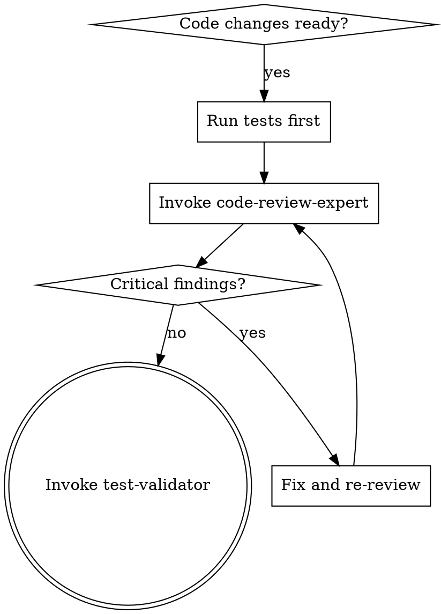

# Code Review Skill

Delegates to the **code-review-expert** agent.

## Model Selection

Default: **haiku**. Escalate via `model` parameter on the Agent tool:

| Task Shape | Model | When |
|-----------|-------|------|
| Small diff, routine review | haiku (default) | <200 LOC, no security concerns |
| Security-sensitive, >500 LOC, or architectural | sonnet | Auth code, crypto, API boundaries |

## When This Skill Activates

- After writing or modifying significant code (10+ lines)
- When completing a feature or bug fix
- After refactoring existing code
- Before creating a pull request
- When code quality, security, or best practices review is needed



## Pre-Dispatch: Seed Link Context (optional)

If the review references an RDR or bead, seed link-context so any patterns the agent stores to T3 auto-link. See `/nx:catalog` for details. Skip if the review is purely ad-hoc.

## Agent Invocation

Use the Agent tool to invoke **code-review-expert**:

```markdown
## Relay: code-review-expert

**Task**: [what needs to be done]
**Bead**: [ID] or 'none'

### Input Artifacts
- Files: [relevant files]

### Deliverable
Structured code review with severity-rated findings

### Quality Criteria
- [ ] All changed files analyzed
- [ ] Security vulnerabilities flagged
- [ ] Specific remediation guidance provided
```

For full relay structure and optional fields, see [RELAY_TEMPLATE.md](../../agents/_shared/RELAY_TEMPLATE.md).

## Review Methodology

The code-review-expert agent uses hypothesis-driven review:
1. Form hypothesis about code quality patterns
2. Gather evidence from code structure, naming, patterns
3. Validate against best practices and security requirements
4. Document findings with file:line references

**REQUIRED BACKGROUND:** Use `/nx:receiving-review` when acting on review output.

## Agent-Specific PRODUCE

- **Session Scratch (T1)**: scratch tool: action="put", content="<notes>", tags="review" — working review notes during session; flagged items auto-promote to T2 at session end
- **nx memory**: memory_put tool: content="...", project="{project}", title="review-findings.md" — persistent review findings across sessions
- **nx store** (optional): store_put tool: content="...", collection="knowledge", title="pattern-code-{topic}", tags="pattern,code-review" — recurring violation patterns worth long-term storage
- **Beads**: creates bug beads (`/beads:create "..." -t bug`) for critical findings that require follow-up work

## Success Criteria

- [ ] All changed files analyzed
- [ ] Security vulnerabilities flagged
- [ ] Best practices validated
- [ ] Specific remediation guidance provided
- [ ] At least one positive feedback item included
- [ ] T2 memory updated with session findings (if multi-session work)

**Session Scratch (T1)**: Agent uses scratch tool for ephemeral working notes during the session. Flagged items auto-promote to T2 at session end.

## On Completion (Mandatory)

On successful review completion, write a T1 scratch marker so the PreToolUse verification hook can confirm review happened this session:

```bash
nx scratch put "review-completed bead={bead-id} at={ISO-timestamp}" --tags "review,{bead-id}"
```

Replace `{bead-id}` with the bead ID from the relay (e.g., `nexus-4yit`). Replace `{ISO-timestamp}` with the current UTC time in ISO 8601 format (e.g., `2026-04-01T16:00:00Z`).

**No bead context**: If invoked without a bead ID (ad-hoc review), write the marker with `bead=none`:
```bash
nx scratch put "review-completed bead=none at={ISO-timestamp}" --tags "review"
```

The `--tags` flag format is a comma-separated string: `--tags "review,{bead-id}"` (not `--tags review --tags {bead-id}`).
