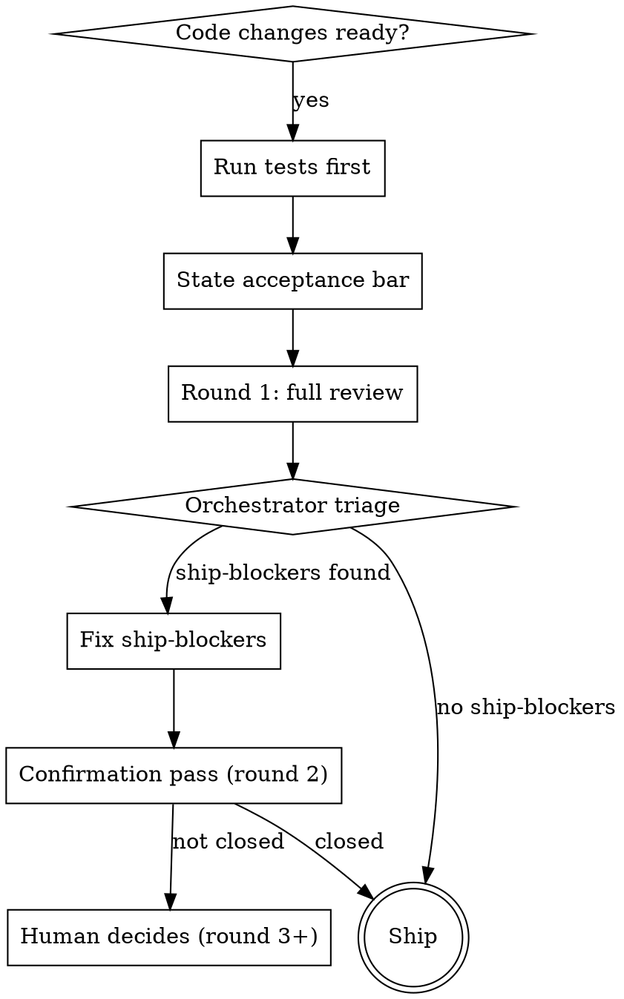

# Code Review Skill

Delegates to the **code-review-expert** agent.

## Model Selection

Default: **sonnet** (the agent's frontmatter pins it; omitting `model` gets sonnet). Escalate via the `model` parameter on the Agent tool:

| Task Shape | Model | When |
|-----------|-------|------|
| Routine or security-sensitive review | sonnet (default) | Most diffs, auth/crypto, API boundaries |
| Cycle-level or architectural | opus | System-wide design diffs, multi-RDR surface |

Model choice is secondary to prompt rigour (below): a named-suspect sonnet review outperforms an unbriefed opus one.

## Acceptance Bar (state before any reviewer runs)

One line in the relay's Context Notes, before dispatch: "Ship when &lt;X&gt;." X names
the condition that ends the gate — never "no criticals," which is unfalsifiable
against an adversarial reviewer. Example: "Ship when the local-upgrade path cannot
wedge and the migration walk is proven atomic; anything else becomes a bead."

## Rounds (bounded — see also `orchestration/SKILL.md` § Review Rounds)

Round 1: full review, report everything (see § Prompt Rigour below) — recall is
the reviewer's job, triage is the orchestrator's.

Orchestrator triage: each finding is a ship-blocker against the acceptance bar,
or a bead. Never both, never left undecided, never re-litigated by a later round.

Round 2 (only if a ship-blocker was fixed): ONE confirmation pass — see
§ Confirmation Pass. Never a second full review.

Round 3+: requires the human to ask for it, by name. Never self-initiated by the
orchestrator or the reviewer.

Test-only, comment-only, and prose-only fixes never re-enter review — EXCEPT
a test-only change that weakens, removes, or vacuates an assertion. That is a
change to the gate itself (the falsifiability rubric's exact surface) and
re-enters review like any behavioral fix.

## Prompt Rigour (first pass)

Referenced by `/conexus:phase-review-gate` as "§ Prompt rigour". Friendly relays return friendly reviews — the relay MUST name what to suspect:

- **Explicit suspect categories**, per diff class: ordering/race for concurrency diffs, lock scope for transaction diffs, vacuity for test diffs, handshake/boundary shapes for API diffs, silent-fallback for error-path diffs.
- **The locked spec** (RDR `## Decision`, design memo, bead MUSTs) so the reviewer checks implementation-vs-spec, not style.
- **What was NOT changed on purpose** (explicit non-goals), so the reviewer flags scope creep instead of recommending it.
- **Verification already run**, so the reviewer verifies claims instead of re-running suites.

## Confirmation Pass (round 2 only — not a second review)

A confirmation brief is not a review brief. It names the findings under
confirmation and asks whether each is closed. It does NOT name new suspect
categories, and does NOT ask the reviewer to pressure-test, enumerate paths, or
find what was missed — those instructions manufacture findings on any artifact,
which is exactly what produced the unbounded loop this skill now bounds.

Template:

```markdown
## Relay: code-review-expert — CONFIRMATION PASS (round 2 of at most 2)

Confirming these findings, and nothing else:
  1. <finding, verbatim from round 1> — fixed at <file:line>
  2. ...

For each: emit CONFIRMED-CLOSED or NOT-CLOSED with the evidence line.
Do not open new attack axes. Observations outside this list go in a final
"For beads" section, one line each — they are never grounds for another round.
ONE exception: a defect INTRODUCED by the fix under confirmation, that is
ship-blocking. Report it as a Critical, name the fix line that introduced it,
and hand it to the orchestrator. The orchestrator may authorize exactly ONE
further confirmation pass to verify that defect's fix — recorded in the round
marker as `ext=fix-introduced`; this extension is not round 3 and needs no
human ask. Anything beyond that single extension, or any new full review, IS
round 3+ and requires the human (see `/conexus:orchestration` § Review Rounds).
```

## When This Skill Activates

- After writing or modifying significant code (10+ lines)
- When completing a feature or bug fix
- After refactoring existing code
- Before creating a pull request
- When code quality, security, or best practices review is needed


```dot
digraph review_flow {
    "Code changes ready?" [shape=diamond];
    "Run tests first" [shape=box];
    "State acceptance bar" [shape=box];
    "Round 1: full review" [shape=box];
    "Orchestrator triage" [shape=diamond];
    "Fix ship-blockers" [shape=box];
    "Confirmation pass (round 2)" [shape=box];
    "Human decides (round 3+)" [shape=box];
    "Ship" [shape=doublecircle];

    "Code changes ready?" -> "Run tests first" [label="yes"];
    "Run tests first" -> "State acceptance bar";
    "State acceptance bar" -> "Round 1: full review";
    "Round 1: full review" -> "Orchestrator triage";
    "Orchestrator triage" -> "Ship" [label="no ship-blockers"];
    "Orchestrator triage" -> "Fix ship-blockers" [label="ship-blockers found"];
    "Fix ship-blockers" -> "Confirmation pass (round 2)";
    "Confirmation pass (round 2)" -> "Ship" [label="closed"];
    "Confirmation pass (round 2)" -> "Human decides (round 3+)" [label="not closed"];
}
```

`test-validator` dispatch after `Ship` is conditional, not automatic — see
`agents/code-review-expert.md` § Recommended Next Step.

## Pre-Dispatch: Seed Link Context (optional)

If the review references an RDR or bead, seed link-context so any patterns the agent stores to T3 auto-link. See `/conexus:catalog` for details. Skip if the review is purely ad-hoc.

## Agent Invocation

Use the Agent tool to invoke **code-review-expert**:

```markdown
## Relay: code-review-expert

**Task**: [what needs to be done]
**Bead**: [ID] or 'none'

### Input Artifacts
- Files: [relevant files]

### Deliverable
Structured code review with severity-rated findings

### Quality Criteria
- [ ] All changed files analyzed
- [ ] Security vulnerabilities flagged
- [ ] Specific remediation guidance provided
- [ ] Every added/modified test rated CAN FAIL or CANNOT FAIL, with the
      concrete production edit that would turn it red
```

For full relay structure and optional fields, see [RELAY_TEMPLATE.md](../../agents/_shared/RELAY_TEMPLATE.md).

## Review Methodology

The code-review-expert agent uses hypothesis-driven review:
1. Form hypothesis about code quality patterns
2. Gather evidence from code structure, naming, patterns
3. Validate against best practices and security requirements
4. Document findings with file:line references

**REQUIRED BACKGROUND:** Use `/conexus:receiving-review` when acting on review output.

## Agent-Specific PRODUCE

- **Session Scratch (T1)**: scratch tool: action="put", content="<notes>", tags="review" — working review notes during session; flagged items auto-promote to T2 at session end
- **nx memory**: memory_put tool: content="...", project="{project}", title="review-findings.md" — persistent review findings across sessions
- **nx store** (optional): store_put tool: content="...", collection="knowledge", title="pattern-code-{topic}", tags="pattern,code-review" — recurring violation patterns worth long-term storage
- **Beads**: creates bug beads (`/beads:create "..." -t bug`) for critical findings that require follow-up work

## Success Criteria

- [ ] All changed files analyzed
- [ ] Security vulnerabilities flagged
- [ ] Best practices validated
- [ ] Specific remediation guidance provided
- [ ] At least one positive feedback item included
- [ ] T2 memory updated with session findings (if multi-session work)

**Session Scratch (T1)**: Agent uses scratch tool for ephemeral working notes during the session. Flagged items auto-promote to T2 at session end.

## On Completion (Mandatory)

**A REVIEWER NEVER WRITES THE `review-completed` MARKER.** This section used to
instruct exactly that, and it was wrong: the marker is what
`pre_close_verification_hook.sh` reads to let a bead close, so a reviewer that
writes one closes the gate it is only half of. On 2026-08-26 a dispatched
reviewer finished the first of a two-reviewer gate and left a handoff note
beginning `review-completed bead=nexus-utpuw.23 (RG-C reviewer 1/2: ...)` — it
was honest, it said "1/2", and the gate could not read that. The close would
have passed with the substantive-critic never dispatched (nexus-e3mak).

`conexus/agents/code-review-expert.md`, `conexus/agents/substantive-critic.md`
and `conexus/agents/_shared/CONTEXT_PROTOCOL.md` all carry this prohibition; this
skill was the last place still teaching the opposite.

What a reviewer does instead:

- report findings in the response text, and
- persist them to T2 under a descriptive title that does **not** contain the
  token `review-completed` (the hook matches by substring over T1 tags/content
  and T2 title/content, so the token in a title is a marker whatever it meant).

**The session that owns the gate writes the marker, once, after EVERY reviewer
has run**, and it must name the full required set — the hook refuses a marker
that does not (nexus-e3mak):

```bash
nx scratch put "review-completed: {bead-id} reviewers=code-review-expert,substantive-critic" --tags "review-completed,{bead-id}"
```

The `--tags` flag format is a comma-separated string: `--tags "review-completed,{bead-id}"` (not `--tags review-completed --tags {bead-id}`).
