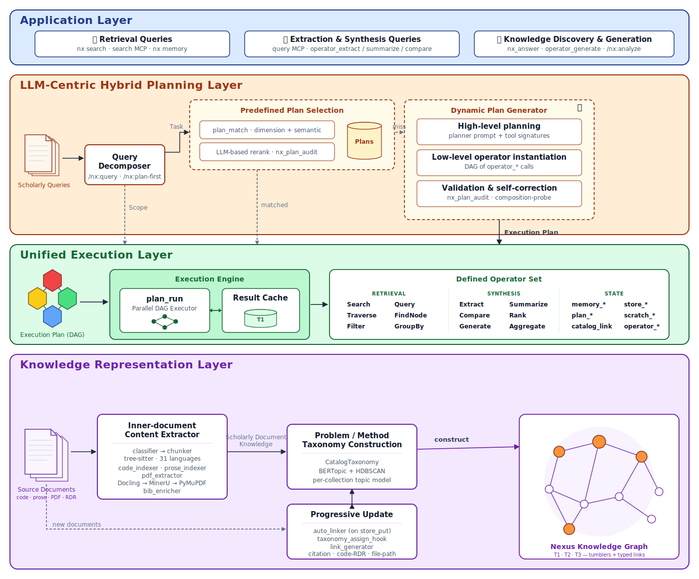

# Architecture

> When in doubt, check `src/nexus/` -- the code is the ground truth.

## Reference Architecture

Four layers: queries come in at the top, get decomposed into plans, executed as a DAG of operators, backed by a catalog-aware knowledge graph. Modeled on the AgenticScholar four-layer reference architecture.



<details>
<summary>Detailed description of the diagram</summary>

The diagram shows four horizontal colored bands stacked vertically, each labeled in its upper-left corner and representing one layer of the Nexus architecture.

The top band (blue, "Application Layer") contains three side-by-side white boxes representing query categories that enter the system: Retrieval Queries (`nx search`, `search` MCP, `nx memory`); Extraction and Synthesis Queries (`query` MCP, `operator_extract`, `summarize`, `compare`); and Knowledge Discovery and Generation (`nx_answer`, `operator_generate`, `/nx:analyze`).

The second band (peach, "LLM-Centric Hybrid Planning Layer") is the tallest. On its left edge, a small stack-of-documents icon labeled "Scholarly Queries" feeds horizontally into a Query Decomposer box (`/nx:query`, `/nx:plan-first`). A "Task" arrow branches upward and rightward into two parallel dashed-border subgroups: "Predefined Plan Selection" (containing `plan_match` with dimension and semantic rerank, an LLM-based rerank step, and a small PlanLibrary cylinder) and "Dynamic Plan Generator" (three stacked stages: High-level planning, Low-level operator instantiation, and Validation and self-correction). A horizontal dashed "miss" arrow connects Selection to Generator as a fallback.

Three arrows cross downward from the Planning band into the third band: a dashed "Scope" arrow directly below the Query Decomposer, a dashed "matched" arrow below the Predefined Plan Selection, and a solid "Execution Plan" arrow below the Dynamic Plan Generator on the right.

The third band (green, "Unified Execution Layer") contains, left to right: a cluster of four colored hexagons connected by lines representing the Execution Plan DAG; an Execution Engine subgroup containing a `plan_run` panel (with a miniature DAG glyph) and a Result Cache cylinder labeled T1, connected by a bidirectional arrow; and a Defined Operator Set box divided into three labeled columns — RETRIEVAL (Search, Query, Traverse, FindNode, Filter, GroupBy), SYNTHESIS (Extract, Summarize, Compare, Rank, Generate, Aggregate), and STATE (`memory_*`, `store_*`, `plan_*`, `scratch_*`, `catalog_link`, `operator_*`).

The fourth band (purple, "Knowledge Representation Layer") flows left to right: a stack-of-documents icon labeled "Source Documents" feeds an Inner-document Content Extractor (classifier, chunker via tree-sitter across 31 languages, `code_indexer`, `prose_indexer`, `pdf_extractor` routing Docling → MinerU → PyMuPDF, `bib_enricher`). An arrow labeled "Scholarly Document Knowledge" continues into Problem/Method Taxonomy Construction (`CatalogTaxonomy`, BERTopic plus HDBSCAN). Below Taxonomy, a Progressive Update box (`auto_linker`, `taxonomy_assign_hook`, `link_generator`) connects bidirectionally upward and receives a dashed "new documents" arrow from Source Documents. A "construct" arrow leads right from Taxonomy to the Nexus Knowledge Graph — rendered as a node-link cluster of orange and white circles — representing the three-tier store (T1 ChromaDB, T2 SQLite+FTS5, T3 ChromaDB Cloud) with tumbler addresses and typed links (`cites`, `implements`, `supersedes`, `relates`).
</details>

Source: [`architecture-diagram.svg`](architecture-diagram.svg) — edit the SVG directly, then re-render the PNG with `rsvg-convert -z 1.5 docs/architecture-diagram.svg -o docs/architecture-diagram.png`.

## How It Fits Together

Nexus has three layers: a CLI (for humans) and an MCP server (for agents) that
talk to three storage tiers, an indexing pipeline that fills them, and a search
engine that queries across them.

```
Human                   Agent (Claude Code)
  │                         │
  ▼                         ▼
CLI (cli.py)            MCP Server (mcp_server.py)
  │                         │
  └──────────┬──────────────┘
             │
    ├── Index: classify → chunk → embed → store
    │     code: classify(SKIP|CODE|PROSE|PDF) → tree-sitter AST → context prefix → voyage-code-3 → code__<repo>
    │     prose: SemanticMarkdownChunker (md) or line-split → voyage-context-3 → docs__<repo>
    │     rdr:   SemanticMarkdownChunker → voyage-context-3 → rdr__<repo>
    │     pdf:   auto-detect routing (Docling → MinerU → PyMuPDF) → table/formula detection → bib enrichment → voyage-context-3 → docs__<corpus>
    │     skip:  .xml/.json/.yml/.html/.css/.lock/etc → silently ignored
    │
    ├── Search: query → retrieve → rerank → topic-boost → group → format
    │     semantic, hybrid (+ frecency + ripgrep)
    │     topic boost: same-topic -0.1, linked-topic -0.05 distance adjustment
    │     topic grouping: T2 assignments (>50% coverage) → fallback Ward clustering
    │
    ├── Taxonomy: T3 embeddings → HDBSCAN → T2 topics → centroid ANN → incremental assign
    │     discover: nx index repo (auto) or nx taxonomy discover (manual)
    │     assign: taxonomy_assign_hook fires on every store_put
    │     boost+group: search_engine.py reads db.taxonomy per search call
    │
    ├── Catalog: JSONL truth → SQLite cache → typed link graph
    │     documents: tumbler addressing (1.owner.doc), FTS5 search
    │     links: cites, implements-heuristic, supersedes, relates, formalizes
    │     auto-generate: citation links (bib metadata), code-RDR (heuristic)
    │     MCP: nexus-catalog server -- search, show, list, register, update,
    │          link, links, link_query, resolve, stats (short names, RDR-062)
    │     CLI: nx catalog setup/search/show/links/link/unlink/stats
    │     Demoted to CLI-only: catalog_unlink, catalog_link_audit, catalog_link_bulk
    │
    └── Storage tiers
          T1: ChromaDB HTTP server (session scratch, shared across agent processes)
          T2: SQLite + FTS5 (persistent memory, project context)
          T3: ChromaDB PersistentClient + ONNX (local, zero-config)
              OR ChromaDB Cloud + Voyage AI (cloud, higher quality)
                code__*       voyage-code-3 index + query
                docs__*       voyage-context-3 (CCE) index + query
                rdr__*        voyage-context-3 (CCE) index + query
                knowledge__*  voyage-context-3 (CCE) index + query
```

Data flows upward (T1 → T2 → T3).

## Catalog & Link Graph

The catalog is a document registry that sits alongside T3. While T3 stores document
*content* as vector embeddings, the catalog stores document *metadata* (title, author,
collection, tumbler address) and *relationships* (citations, implementations, supersedes).

**What populates it**: Indexing (`nx index repo`, `nx index pdf`, `nx index rdr`) auto-registers
entries via catalog hooks. MCP `store_put` also registers entries. `nx enrich` adds bibliographic
metadata and enables citation link generation.

**What agents use it for**: Finding which T3 collection a paper is in (`catalog_search` →
`physical_collection`), traversing citations (`catalog_links` with `link_type="cites"`),
and scoping semantic search to relevant collections instead of searching everything.

**Link types in use**:
- `cites` -- citation relationships (auto-created by `nx enrich` from Semantic Scholar references)
- `implements-heuristic` -- code→RDR links (auto-created by indexer from title substring matching)
- `supersedes` -- created by RDR close and knowledge-tidier when documents are replaced
- `relates` -- created by agents (debugger, deep-analyst, codebase-analyzer) linking related findings
- `implements`, `quotes`, `comments` -- available for manual use

**Span formats** for sub-document link references:
- `42-57` -- line range (positional, may become stale on re-index)
- `3:100-250` -- chunk:char range (positional)
- `chash:<sha256hex>` -- content-addressed chunk identity (preferred, survives re-indexing)
- `chash:<sha256hex>:<start>-<end>` -- character range within a content-addressed chunk

Content-hash spans reference chunks by `chunk_text_hash` metadata (SHA-256 of stored chunk text). All 5 indexers (code, prose, doc PDF, doc markdown, streaming PDF pipeline) emit `chunk_text_hash` alongside the existing file-level `content_hash`. For existing collections, `nx catalog setup` or `nx collection backfill-hash` adds the field without re-embedding. `link_audit()` verifies chash spans resolve in T3.

**Tumbler ordering**: Comparison operators (`<`, `<=`, `>`, `>=`) use -1 sentinel padding for cross-depth ordering -- parent tumblers sort before their children. `Tumbler.spans_overlap()` detects positional span overlap using these operators.

**Two graph views**: `catalog_links` returns only links between live documents (deleted nodes excluded).
`catalog_link_query` returns all links including orphans -- useful for admin/audit.

**CCE single-chunk note**: For CCE collections (`docs__*`, `rdr__*`, `knowledge__*`), documents with only one chunk are embedded via `contextualized_embed(inputs=[[chunk]])`.

## Taxonomy

Taxonomy (RDR-070) builds a topic hierarchy over T3 collections using existing embeddings, without re-embedding. HDBSCAN clusters the vectors already stored in ChromaDB, labels them with c-TF-IDF, and persists topic assignments to T2 SQLite. Every subsequent `store_put` call assigns the new document to the nearest centroid via ANN lookup. Search then uses these assignments to boost same-topic results and group output.

In local mode, `code__*` collections are excluded by default because MiniLM clusters code poorly. Cloud mode uses `voyage-code-3` and is unaffected. `nx index repo` triggers discovery automatically after indexing.

### Data Flow

```
nx index repo / nx taxonomy discover
  │
  ▼
discover_for_collection()          # taxonomy_cmd.py
  │  fetch ids + texts + embeddings from T3 (page_size=250)
  │  fall back to MiniLM re-embed only when T3 embeddings absent
  ▼
CatalogTaxonomy.discover_topics()  # db/t2/catalog_taxonomy.py
  │  sklearn HDBSCAN on N×D float32
  │  c-TF-IDF labels (CountVectorizer + TfidfTransformer)
  │  persist: topics, topic_assignments → T2 SQLite
  │  upsert cluster centroids → ChromaDB taxonomy__centroids (cosine/HNSW)
  ▼
taxonomy_assign_hook()             # mcp_infra.py  (fires on every store_put)
  │  fetch new doc's T3 embedding
  │  CatalogTaxonomy.assign_single(): ANN query against taxonomy__centroids
  │  nearest centroid → topic_id → INSERT OR IGNORE topic_assignments
  ▼
search_cross_corpus()              # search_engine.py
  │  get_assignments_for_docs(result_ids) → topic_assignments dict
  │  apply_topic_boost(): distance -= 0.1 (same topic), -= 0.05 (linked topic)
  │  topic grouping when assignment coverage >50%
  │  otherwise fall back to Ward hierarchical clustering
```

### Storage

**T2 SQLite tables** (owned by `CatalogTaxonomy`):

| Table | Purpose |
|-------|---------|
| `topics` | One row per discovered topic: label, collection, centroid_hash, doc_count, review_status, terms |
| `topic_assignments` | doc_id → topic_id mapping, assigned_by (hdbscan or centroid) |
| `taxonomy_meta` | Per-collection discover stats (last_discover_at, last_discover_doc_count) |
| `topic_links` | Aggregated inter-topic link counts derived from catalog link graph |

**T3 ChromaDB collection** (`taxonomy__centroids`): created with `embedding_function=None` and `hnsw:space=cosine`. One entry per topic holds the centroid vector, collection, topic_id, and label. Used exclusively by `assign_single()` for ANN lookup. Never goes through `t3.get_or_create_collection()` (that path would inject the wrong embedding function and L2 space).

### Centroid Lifecycle

| Operation | What happens |
|-----------|-------------|
| `discover` | Creates centroids for all topics in a collection |
| `rebuild` (`--force`) | Runs HDBSCAN on updated embeddings, matches new centroids to old via cosine similarity (`_merge_labels`), transfers operator labels and `accepted` status |
| `split` | Replaces the parent centroid with two child centroids |
| `delete` / `merge` | Removes orphaned centroid entries |

Manual labels survive rebuild via `_merge_labels`.

### Connection to the Catalog Link Graph

`nx taxonomy links --collection <col>` reads the catalog link graph and aggregates which topics are connected via document-level links. Results are stored in `topic_links` and read by the search engine via `get_topic_link_map()` to apply the linked-topic distance boost (-0.05).

### CLI (`nx taxonomy`)

| Command | Purpose |
|---------|---------|
| `status` | Health overview: collections, coverage, review state |
| `discover` | Run HDBSCAN on a collection (auto or manual) |
| `rebuild` | Re-discover with merge strategy (preserves labels) |
| `list` | List topics with doc counts and review status |
| `show` | Detail for a single topic: terms, docs, links |
| `review` | Interactive accept/reject workflow |
| `label` | Claude haiku auto-labeling for a collection |
| `assign` | Manually assign a doc to a topic |
| `rename` | Rename a topic label |
| `merge` | Merge two topics into one |
| `split` | Split a topic on a keyword pivot |
| `links` | Compute and persist inter-topic links from catalog |
| `project` | Cross-collection projection with `--use-icf` hub suppression (RDR-077) |

### Projection quality (RDR-077)

`topic_assignments` also carries `similarity` (raw cosine), `assigned_at`,
and `source_collection` for projection rows. Operator guide:
[docs/taxonomy-projection-tuning.md](taxonomy-projection-tuning.md) —
threshold calibration, ICF rationale, upsert semantics, troubleshooting.

### Config (`taxonomy` section in `.nexus.yml`)

| Key | Default | Effect |
|-----|---------|--------|
| `auto_label` | `true` | Run Claude haiku labeling after `discover` |
| `local_exclude_collections` | `["code__*"]` | Skip these collections in local mode |

## Post-Store Hooks

Two parallel hook contracts in `src/nexus/mcp_infra.py` cover the two real workload shapes for per-document enrichment that fires after a write. Single-document hooks land single rows from MCP; batch hooks land N rows from CLI ingest. Both use the same per-hook failure-isolation pattern (capture, persist to T2 `hook_failures`, never propagate).

| Shape | Register | Fire | Where it fires from | Current consumers |
|-------|----------|------|---------------------|-------------------|
| Single-document (RDR-070) | `register_post_store_hook(fn)` | `fire_post_store_hooks(doc_id, collection, content)` | `mcp/core.py:887` (MCP `store_put` tool) | `taxonomy_assign_hook` |
| Batch (RDR-095) | `register_post_store_batch_hook(fn)` | `fire_post_store_batch_hooks(doc_ids, collection, contents, embeddings, metadatas)` | `indexer.py`, `code_indexer.py`, `prose_indexer.py`, `pipeline_stages.py`, `doc_indexer.py` (3 sites) | `chash_dual_write_batch_hook` (RDR-086), `taxonomy_assign_batch_hook` (RDR-070) |

The batch contract exists because some enrichments collapse N dependency calls into one batched call (e.g., `taxonomy.assign_batch` issues one ChromaDB Cloud `query()` for N nearest-centroid lookups; the per-doc path issues N sequential queries). For corpus-scale ingest the difference is roughly 1000x. The single-document chain stays in place; both shapes are first-class because both workloads are real.

**Registration order is load-bearing.** In `mcp/core.py`, `chash_dual_write_batch_hook` is registered before `taxonomy_assign_batch_hook`. This mirrors the legacy CLI call-site ordering (chash dual-write always preceded taxonomy assignment at every site) and preserves the invariant that chash rows exist before topic assignment runs.

**Failure capture.** Per-hook exceptions are caught in the fire function, logged via structlog, and persisted to T2 `hook_failures`. Single-document failures store the scalar `doc_id` in the legacy column. Batch failures store a representative scalar (first id) in `doc_id`, the JSON-encoded list in `batch_doc_ids`, and `is_batch=1`. The `nx taxonomy status` reader surfaces both shapes: scalar rows count as one document; batch rows count as `len(batch_doc_ids)`. The Action line shows `affecting M document(s)` whenever a batch row is present, alongside the row count.

**Drift guard.** `tests/test_hook_drift_guard.py` uses `ast.walk` to detect any ImportFrom, Attribute, or bare-Name reference to `taxonomy_assign_batch_hook` or `chash_dual_write_batch_hook` outside the explicit allowlist (`src/nexus/mcp_infra.py` for definitions, `src/nexus/mcp/core.py` for registration). String literals, comments, and docstrings are ignored. Adding a new per-document batch enrichment registers via `register_post_store_batch_hook`; a regression where a new module imports a hook directly fails CI.

**Out of scope by design** (RDR-095 Decision Rationale, intentional non-twins of the batch-hook pattern):

- Three catalog-registration mechanisms (`_catalog_store_hook` in `commands/store.py`, `_catalog_pdf_hook` in `pipeline_stages.py`, `indexer.py:250` ad-hoc registration) each capture different per-domain metadata: knowledge curator + doc_id for ad-hoc store; corpus curator + file_path + author + year + chunk_count for PDFs; repo owner + rel_path + source_mtime + file_hash for repo files. Consolidating would either lose information or branch internally on origin. Three legitimate per-domain registrations, not three copies of the same hook.
- `_catalog_auto_link` reads T1 scratch entries tagged `link-context` that agents seed before calling MCP `store_put`. CLI bulk ingest has no equivalent pre-declaration semantics; it uses entirely separate post-hoc linkers in `catalog/link_generator.py` (`generate_citation_links`, `generate_code_rdr_links`, `generate_rdr_filepath_links`). MCP-only auto-linking is intentional path-shape coupling.

The partial-commit failure mode (a batch hook commits an early sub-step then raises before completing) is documented in RDR-095 Failure Modes. The framework captures the doc_id list and exception per hook invocation; per-sub-step capture is hook-internal, not framework-level. A future RDR can introduce a `record_partial_progress` helper if a consumer needs it.

## T2 Domain Stores

`src/nexus/db/t2/` is a Python package split into four domain-specific
stores. Each store owns its own tables in a shared SQLite file and runs
against its own `sqlite3.Connection` in WAL mode. Reads in one domain
are never blocked by writes in another (the Phase 1 global Python
mutex is gone); concurrent writes across domains still serialize at
SQLite's single-writer WAL lock, but `busy_timeout=5000` absorbs the
brief contention without raising `OperationalError`.

| Store      | Class             | Attribute         | Responsibility                                                             |
|------------|-------------------|-------------------|----------------------------------------------------------------------------|
| Memory     | `MemoryStore`     | `db.memory`       | Persistent notes, project context, FTS5 search, access tracking, TTL       |
| Plans      | `PlanLibrary`     | `db.plans`        | Plan templates, plan search, plan TTL                                      |
| Taxonomy   | `CatalogTaxonomy` | `db.taxonomy`     | HDBSCAN topic discovery, centroid ANN assignment, merge strategy, review workflow (RDR-070) |
| Telemetry  | `Telemetry`       | `db.telemetry`    | Relevance log (query/chunk/action triples), retention-based expiry         |
| Chash index| `ChashIndex`      | `db.chash_index`  | Global chash → (collection, doc_id) lookup; populated via dual-write at all seven T3 upsert sites (RDR-086 Phase 1) |

`T2Database` is a composing facade: it constructs the five stores in
order (memory → plans → taxonomy → telemetry → chash_index), re-exposes
their public methods as thin delegates for backward compatibility, and
runs cross-domain operations like `expire()` over all of them. The
facade holds no database connection of its own -- every SQL statement
runs through a specific domain store.

**Preferred call style for new code**:

```python
db = T2Database(path)
db.memory.search("fts query", project="myproj")   # domain method
db.plans.save_plan(query, plan_json)               # domain method
db.telemetry.log_relevance(query, ...)             # domain method
```

Existing call sites that use `db.search(...)`, `db.save_plan(...)`,
etc. continue to work via facade delegation -- no migration required.

### Concurrency Model (RDR-063 Phase 2)

Phase 2 replaced a single shared connection with per-store connections:

| Phase      | Connection                | Lock                          | Cross-domain writes     |
|------------|---------------------------|-------------------------------|-------------------------|
| Phase 1    | one `SharedConnection`    | one `threading.Lock`          | serialized in Python    |
| Phase 2    | one per store             | one `threading.Lock` per store | coordinated in SQLite   |

Phase 2 consequences:

- **Cross-domain reads no longer block on unrelated writes**: a
  `memory_search` on one thread and a `plan_save` on another run in
  parallel because the Phase 1 shared Python mutex is gone. Concurrent
  *writes* across domains still serialize at SQLite's single-writer
  WAL lock, but `busy_timeout=5000` absorbs the brief queue so callers
  do not see `OperationalError: database is locked`.
- **Telemetry no longer interferes with search**: MCP relevance-log
  writes run on the telemetry connection, so `memory_search` is not
  blocked by access-tracking hooks.
- **Cluster rebuilds don't freeze memory**: `CatalogTaxonomy.discover_topics`
  runs on the taxonomy connection. The long numpy clustering phase holds
  no T2 locks, so interactive memory operations continue during the
  bulk of the rebuild. (The initial embedding-fetch snapshot still briefly
  acquires the taxonomy connection's lock, as any read does.)
- **Parallel writes to the same store are serialized** by that store's
  own `threading.Lock` plus the SQLite file-level write lock -- callers
  never see `OperationalError: database is locked`.

**Migration Registry** (RDR-076): All T2 schema migrations are centralised in
`src/nexus/db/migrations.py`. The `MIGRATIONS` list contains version-tagged
`Migration(introduced, name, fn)` entries. `apply_pending(conn, current_version)`
runs migrations between the last-seen version (stored in `_nexus_version` table)
and the current CLI version. Each migration function is idempotent via
`PRAGMA table_info()` or `sqlite_master` guards.

`T2Database.__init__()` opens a transient connection, calls `apply_pending()`,
closes it, then constructs the four domain stores. The `_upgrade_done` set
(guarded by `_upgrade_lock`) provides a process-level fast path — subsequent
constructions skip all DB access. Domain stores retain their own
`_migrated_paths` guards for standalone construction outside `T2Database`.

**T3 Upgrade Steps**: `T3UpgradeStep(introduced, name, fn)` entries in the
`T3_UPGRADES` list handle ChromaDB operations (backfills, re-indexing) that
require a `T3Database` client. These run via `nx upgrade` (not `--auto` mode).

**Auto-upgrade**: `nx upgrade --auto` runs as the first SessionStart hook,
applying T2 migrations silently. T3 steps are skipped in auto mode.

**In-memory SQLite**: Tests that want an ephemeral database should use
a temp file path, not `":memory:"` -- `:memory:` databases are
per-connection, so the four stores would each see a distinct empty
database and `test_t2_concurrency.py` would no longer exercise the
cross-domain WAL path.

See `src/nexus/db/t2/__init__.py` for the facade source and
`tests/test_t2_concurrency.py` for the concurrency test suite.

## Module Map

| Area | Files | What they do |
|------|-------|-------------|
| **Entry** | `cli.py`, `commands/` | Click CLI, one file per command group |
| **Catalog** | `catalog/catalog.py`, `catalog/catalog_db.py`, `catalog/tumbler.py`, `catalog/link_generator.py`, `catalog/auto_linker.py`, `catalog/consolidation.py` | Git-backed document registry + typed link graph (JSONL + SQLite). Tumbler addressing, `descendants()`/`ancestors()`/`lca()` hierarchy helpers, `resolve_chunk()` ghost element resolution, idempotent link upsert, composable query, bulk ops, audit. Auto-linker creates links from T1 link-context on every `store_put`. `consolidation.py` merges per-paper collections into corpus-level collections |
| **Storage** | `db/t1.py`, `db/t2/`, `db/t3.py`, `db/chroma_quotas.py`, `db/local_ef.py` | Tier implementations. T2 is a package split into four domain stores (see § T2 Domain Stores). Plans table has `ttl` column for auto-expiry. `chroma_quotas.py` is the single source of truth for ChromaDB Cloud quota constants and validators. `local_ef.py` provides the local ONNX embedding function |
| **Indexing** | `indexer.py`, `code_indexer.py`, `prose_indexer.py`, `index_context.py`, `indexer_utils.py`, `classifier.py`, `chunker.py`, `md_chunker.py`, `doc_indexer.py`, `pdf_extractor.py`, `pdf_chunker.py`, `bib_enricher.py`, `languages.py`, `pipeline_buffer.py`, `pipeline_stages.py`, `checkpoint.py` | Repo indexing pipeline (decomposed per RDR-032). `bib_enricher.py` queries Semantic Scholar for bibliographic metadata; `pdf_extractor.py` auto-detects math-heavy PDFs via FormulaItem counting and routes to MinerU (optional `conexus[mineru]` extra) for superior LaTeX extraction, falling back through enriched Docling to PyMuPDF normalized. MinerU processes large PDFs in 5-page subprocess batches for memory isolation (prevents OOM on formula-dense documents). Chunk metadata includes `has_formulas` boolean. `pipeline_buffer.py` provides a WAL-mode SQLite buffer for the three-stage streaming pipeline (RDR-048); `pipeline_stages.py` implements the concurrent extractor/chunker/uploader stages and orchestrator; `checkpoint.py` handles batch-path crash recovery for smaller documents (RDR-047) |
| **Export** | `exporter.py` | Collection export/import for T3 backup and migration (.nxexp format) |
| **Plans** | `plans/matcher.py`, `plans/runner.py`, `plans/bundle.py`, `plans/session_cache.py`, `plans/loader.py`, `plans/match.py`, `plans/scope.py`, `plans/schema.py`, `plans/seed_loader.py`, `plans/promote.py`, `plans/purposes.py` | Plan-centric retrieval stack. `matcher.py`: T1 cosine + T2 FTS5 fallback with RDR-091 scope filter/re-rank. `runner.py`: `plan_run` executes step DAGs — contiguous operator runs collapse into a single `claude -p` call via the bundle path (v4.10.0). `bundle.py`: operator-bundle module — segmentation, composite-prompt composition with source attribution + deferred-ref rendering, single-dispatch execution, 200k-char size guard with per-step fallback. `session_cache.py`: `plans__session` T1 cosine cache (MiniLM). `loader.py` + `seed_loader.py`: YAML plan loading + seeding of builtin templates. `match.py`: `Match` dataclass contract. `scope.py`: scope normalization + scope-fit weight. `schema.py`: step schema validation. `promote.py`: plan promotion heuristics. `purposes.py`: typed-link purpose registry for `traverse` operator |
| **Console** | `console/` (`app.py`, `watchers.py`, `config.py`, `routes/`), `commands/console.py` | Embedded web UI for monitoring agentic Nexus activity (`nx console`). FastAPI/uvicorn server with live-updating routes for activity, campaigns, health, and partials. `commands/console.py` handles start/stop lifecycle and PID file management |
| **Search** | `search_engine.py`, `search_clusterer.py`, `scoring.py`, `frecency.py`, `ripgrep_cache.py`, `filters.py` | Query, rank, rerank. `scoring.py` applies topic boost (`apply_topic_boost`: same-topic -0.1, linked-topic -0.05). `search_engine.py` does topic grouping (T2 assignments when >50% coverage) with fallback to Ward hierarchical clustering. `filters.py` also contains `sanitize_query()` (RDR-071) which strips LLM prompt contamination from search queries before embedding |
| **Context** | `context.py`, `commands/context_cmd.py` | L1 project context cache (RDR-072). `generate_context_l1()` builds a ~200 token topic map from taxonomy, cached as flat file at `~/.config/nexus/context/<repo>-<hash>.txt`. Injected by SessionStart hook for agent cold-start acceleration. Auto-refreshed after `taxonomy discover` and `index repo` |
| **Taxonomy** | `db/t2/catalog_taxonomy.py`, `commands/taxonomy_cmd.py`, `taxonomy.py` (shim) | HDBSCAN topic discovery from T3 embeddings (RDR-070). T2 tables: `topics`, `topic_assignments`, `taxonomy_meta`, `topic_links`. ChromaDB `taxonomy__centroids` (cosine/HNSW) for centroid ANN. `discover_for_collection()` is the shared entry point for CLI and `nx index repo`. `taxonomy_assign_hook` in `mcp_infra.py` fires on every `store_put` for incremental assignment. `taxonomy.py` is a backward-compatibility shim that forwards old call sites to `db.taxonomy` |
| **Hooks** | `commands/hooks.py`, `commands/hook.py` | `hooks.py`: Git hook install/uninstall/status, sentinel-bounded stanza management. `hook.py`: Claude Code SessionStart/SessionEnd lifecycle runners |
| **Verification** | `config.py` (verification section), `nx/hooks/scripts/stop_verification_hook.sh`, `nx/hooks/scripts/pre_close_verification_hook.sh`, `nx/hooks/scripts/read_verification_config.py` | Opt-in mechanical enforcement: Stop hook (session-end checks), PreToolUse hook (bd-close gate), standalone config reader. See [Verification config](configuration.md#verification) |
| **MCP Servers** | `mcp/core.py`, `mcp/catalog.py`, `mcp_infra.py`, `mcp_server.py` (shim) | Dual-server FastMCP architecture (RDR-062). **Core server (`nexus`, 15 tools)**: `search`, `query`, `store_put`, `store_get`, `store_list`, `memory_put`, `memory_get`, `memory_delete`, `memory_search`, `memory_consolidate`, `scratch`, `scratch_manage`, `collection_list`, `plan_save`, `plan_search`. **Catalog server (`nexus-catalog`, 10 tools)**: `search`, `show`, `list`, `register`, `update`, `link`, `links`, `link_query`, `resolve`, `stats` (short names -- the `catalog_` prefix is dropped since the server namespace already provides context). **Demoted to CLI-only (6 tools)**: `store_delete`, `collection_info`, `collection_verify`, `catalog_unlink`, `catalog_link_audit`, `catalog_link_bulk`. Backward-compat shim at `mcp_server.py` re-exports all 30 functions. `query()` has catalog-aware routing (author, content_type, subtree, follow_links, depth). Singletons and test injection in `mcp_infra.py` |
| **Enrichment** | `bib_enricher.py`, `commands/enrich.py` | Semantic Scholar bibliographic metadata lookup + `nx enrich` CLI backfill command |
| **Health** | `health.py`, `logging_setup.py` | `health.py`: health check data model and runner used by `nx doctor` and `nx console`. `logging_setup.py`: structured logging configuration for CLI, console, MCP, and hook entry points (stderr + rotating file handler) |
| **Support** | `config.py`, `registry.py`, `corpus.py`, `session.py`, `hooks.py`, `ttl.py`, `formatters.py`, `types.py`, `errors.py`, `retry.py`, `commands/_helpers.py`, `commands/_provision.py` | Configuration, naming, formatting, session lifecycle, transient-error retry. `_helpers.py`: shared CLI helpers (e.g. `default_db_path()`). `_provision.py`: ChromaDB Cloud database provisioning (tenant resolution, database creation) |

## Design Decisions

1. **Protocols over ABCs** -- `typing.Protocol` for structural subtyping, no inheritance coupling.
2. **No ORM** -- Direct `sqlite3` for T2. Schema is simple; WAL + FTS5 are stdlib.
3. **Constructor injection** -- Dependencies via constructor, no global singletons.
4. **Ported, not imported** -- SeaGOAT and Arcaneum patterns rewritten in Nexus module structure.
5. **PPID-chain session propagation** -- The `SessionStart` hook starts a per-session ChromaDB HTTP server (using the `chroma` entry-point co-installed with the package) and writes its address to `~/.config/nexus/sessions/{ppid}.session`, keyed by the Claude Code process PID. Child agents walk the OS PPID chain to find the nearest ancestor session file and connect to the same server, sharing T1 scratch across the entire agent tree. Concurrent independent windows stay isolated via disjoint process trees. Falls back to `EphemeralClient` when the server cannot start or the PPID chain yields no record.
6. **MCP tools over agent-spawns for utility operations** (RDR-080) -- Operations that formerly required spawning a named agent are now MCP tools that execute in-process. Agent files are retained as stubs that redirect to the MCP tool.

   **Boundary rule**: If an operation can be expressed as a deterministic function of its inputs and completes in under one API call, it is an MCP tool. If it requires multi-turn reasoning, tool selection, or context accumulation across turns, it is an agent.

   | Capability | Before RDR-080 | After RDR-080 |
   |------------|---------------|---------------|
   | Knowledge consolidation | `knowledge-tidier` agent | `mcp__plugin_nx_nexus__nx_tidy` |
   | Plan audit | `plan-auditor` agent | `mcp__plugin_nx_nexus__nx_plan_audit` |
   | Bead enrichment | `plan-enricher` agent | `mcp__plugin_nx_nexus__nx_enrich_beads` |
   | Multi-step retrieval | `query-planner` + `analytical-operator` agents | `mcp__plugin_nx_nexus__nx_answer` |
   | PDF indexing | `pdf-chromadb-processor` agent | `nx index pdf` CLI / direct ingest |

   When authoring agent/skill instructions, always use the full MCP tool name (`mcp__plugin_nx_nexus__<tool>`) — short names fail at runtime.

   See [MCP Tools vs Agents](mcp-vs-agents.md) for the full boundary rule, the stub-agent pattern, and guidance on where to place new capabilities. See [Plan-Centric Retrieval](plan-centric-retrieval.md) for how `nx_answer` + the plan library replaced the earlier retrieval-agent chain.

## Heritage

| Tool | What Nexus borrows |
|------|-------------------|
| **mgrep** | UX patterns, citation format, Claude Code integration |
| **SeaGOAT** | Git frecency scoring, hybrid search, persistent server |
| **Arcaneum** | PDF extraction + chunking pipelines, RDR process |

Storage (ChromaDB + Voyage AI) and embedding layers are Nexus's own.

For project origins and inspirations, see [historical.md](historical.md).
