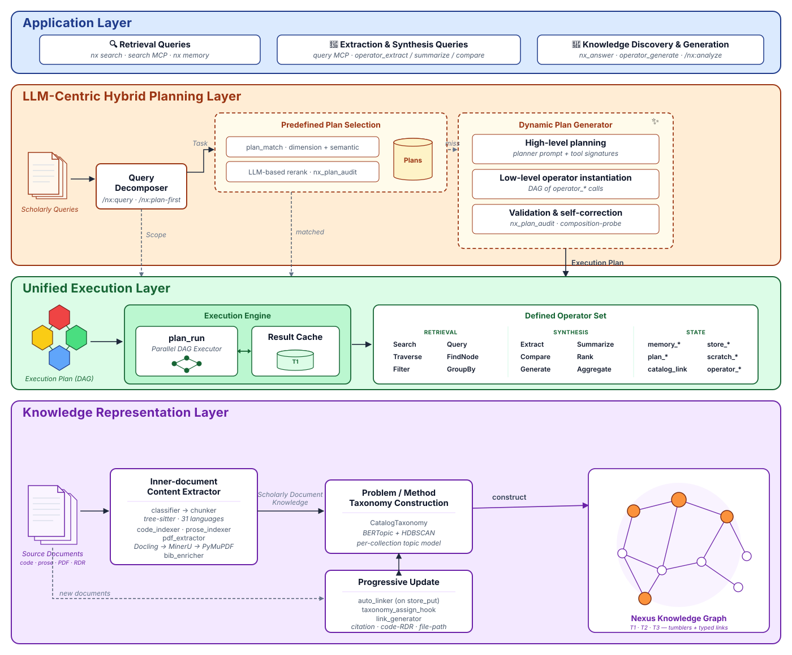

# Architecture

> When in doubt, check `src/nexus/` -- the code is the ground truth.

## Reference Architecture

Four layers: queries come in at the top, get decomposed into plans, executed as a DAG of operators, backed by a catalog-aware knowledge graph. Modeled on the AgenticScholar four-layer reference architecture.



<details>
<summary>Detailed description of the diagram</summary>

The diagram shows four horizontal colored bands stacked vertically, each labeled in its upper-left corner and representing one layer of the Nexus architecture.

The top band (blue, "Application Layer") contains three side-by-side white boxes representing query categories that enter the system: Retrieval Queries (`nx search`, `search` MCP, `nx memory`); Extraction and Synthesis Queries (`query` MCP, `operator_extract`, `summarize`, `compare`); and Knowledge Discovery and Generation (`nx_answer`, `operator_generate`, `/conexus:analyze`).

The second band (peach, "LLM-Centric Hybrid Planning Layer") is the tallest. On its left edge, a small stack-of-documents icon labeled "Scholarly Queries" feeds horizontally into a Query Decomposer box (`/conexus:query`, `/conexus:plan-first`). A "Task" arrow branches upward and rightward into two parallel dashed-border subgroups: "Predefined Plan Selection" (containing `plan_match` with dimension and semantic rerank, an LLM-based rerank step, and a small PlanLibrary cylinder) and "Dynamic Plan Generator" (three stacked stages: High-level planning, Low-level operator instantiation, and Validation and self-correction). A horizontal dashed "miss" arrow connects Selection to Generator as a fallback.

Three arrows cross downward from the Planning band into the third band: a dashed "Scope" arrow directly below the Query Decomposer, a dashed "matched" arrow below the Predefined Plan Selection, and a solid "Execution Plan" arrow below the Dynamic Plan Generator on the right.

The third band (green, "Unified Execution Layer") contains, left to right: a cluster of four colored hexagons connected by lines representing the Execution Plan DAG; an Execution Engine subgroup containing a `plan_run` panel (with a miniature DAG glyph) and a Result Cache cylinder labeled T1, connected by a bidirectional arrow; and a Defined Operator Set box divided into three labeled columns — RETRIEVAL (Search, Query, Traverse, FindNode, Filter, GroupBy), SYNTHESIS (Extract, Summarize, Compare, Rank, Generate, Aggregate), and STATE (`memory_*`, `store_*`, `plan_*`, `scratch_*`, `catalog_link`, `operator_*`).

The fourth band (purple, "Knowledge Representation Layer") flows left to right: a stack-of-documents icon labeled "Source Documents" feeds an Inner-document Content Extractor (classifier, chunker via tree-sitter across 31 languages, `code_indexer`, `prose_indexer`, `pdf_extractor` routing Docling → MinerU → PyMuPDF, `bib_enricher`). An arrow labeled "Scholarly Document Knowledge" continues into Problem/Method Taxonomy Construction (`CatalogTaxonomy`, BERTopic plus HDBSCAN). Below Taxonomy, a Progressive Update box (`auto_linker`, `taxonomy_assign_hook`, `link_generator`) connects bidirectionally upward and receives a dashed "new documents" arrow from Source Documents. A "construct" arrow leads right from Taxonomy to the Nexus Knowledge Graph — rendered as a node-link cluster of orange and white circles — representing the three-tier store (T1 session scratch, T2 Postgres via the native nexus-service, T3 Postgres 17 + pgvector behind the same nexus-service) with tumbler addresses and typed links (`cites`, `implements`, `supersedes`, `relates`).
</details>

Source: [`architecture-diagram.svg`](architecture-diagram.svg) — edit the SVG directly, then re-render the PNG with `rsvg-convert -z 1.5 docs/architecture-diagram.svg -o docs/architecture-diagram.png`.

## How It Fits Together

Nexus has three layers: a CLI (for humans) and an MCP server (for agents) that
talk to three storage tiers, an indexing pipeline that fills them, and a search
engine that queries across them.

```
Human                   Agent (Claude Code)
  │                         │
  ▼                         ▼
CLI (cli.py)            MCP Server (mcp_server.py)
  │                         │
  └──────────┬──────────────┘
             │
    ├── Index: classify → chunk → embed → store
    │     code: classify(SKIP|CODE|PROSE|PDF) → tree-sitter AST → context prefix → voyage-code-3 → code__<repo>
    │     prose: SemanticMarkdownChunker (md) or line-split → voyage-context-3 → docs__<repo>
    │     rdr:   SemanticMarkdownChunker → voyage-context-3 → rdr__<repo>
    │     pdf:   auto-detect routing (Docling → MinerU → PyMuPDF) → table/formula detection → bib enrichment → voyage-context-3 → docs__<corpus>
    │     skip:  .xml/.json/.yml/.html/.css/.lock/etc → silently ignored
    │
    │     Model names above (`voyage-code-3`, `voyage-context-3`) label the
    │     target model, not a client-side API call — the embed request is
    │     always issued through the nexus-service (`HttpVectorClient` →
    │     `/v1/vectors`): cloud installs route to Voyage AI server-side,
    │     local installs use the bundled bge-768 ONNX model. Direct
    │     client-side Voyage calls (`_voyage_with_retry`) are retired code
    │     with no live caller.
    │
    ├── Search: query → retrieve → rerank → topic-boost → group → format
    │     semantic, hybrid (+ frecency + ripgrep)
    │     topic boost: same-topic -0.1, linked-topic -0.05 distance adjustment
    │     topic grouping: T2 assignments (>50% coverage) → fallback Ward clustering
    │
    ├── Taxonomy: T3 embeddings → HDBSCAN → T2 topics → centroid ANN → incremental assign
    │     discover: nx index repo (auto) or nx taxonomy discover (manual)
    │     assign: taxonomy_assign_hook fires on every store_put
    │     boost+group: search_engine.py reads db.taxonomy per search call
    │
    ├── Catalog: engine Postgres truth (Liquibase schema, RLS) → HttpCatalogClient → typed link graph
    │     documents: tumbler addressing (1.owner.doc)
    │     links: cites, implements-heuristic, supersedes, relates, formalizes
    │     auto-generate: citation links (bib metadata), code-RDR (heuristic)
    │     surfaces: MCP nexus-catalog server (10 tools) + nx catalog CLI
    │

    └── Storage tiers ([RDR-120](rdr/rdr-120-storage-substrate-split.md) substrate split; service-mediated)
          T1: nexus-service HTTP (HttpScratchStore; session scratch, shared across agent processes; PG-only, no in-process opt-out — nexus-4lkmz)
          T2: nexus-service over Postgres (the write arbiter)
                Eight domain stores + the catalog, all HTTP clients behind T2Database
                Transport: HTTP to the nexus-service
                (the SQLite + FTS5 `nx daemon t2` daemon is RETIRED — it
                 arbitrated a single SQLite writer; Postgres does that now)
                memory · plans · taxonomy · telemetry · document_aspects ·
                aspect_queue · document_highlights · catalog
                (chash_index RETIRED — table dropped by RDR-187, v0.1.51)
          T3: Postgres 17 + pgvector behind the native nexus-service ── nx daemon service start
              Same service in BOTH modes; embedding is server-side
              (bge-768 in local mode, Voyage in managed-cloud mode).
              The client is HttpVectorClient over /v1/vectors; the legacy
              ChromaDB serving path is retired ([RDR-155](rdr/rdr-155-pgvector-t3-consolidation.md)).
                code__*       voyage-code-3 (managed) / bge-768 (local)
                docs__*       voyage-context-3 CCE (managed) / bge-768 (local)
                rdr__*        voyage-context-3 CCE (managed) / bge-768 (local)
                knowledge__*  voyage-context-3 CCE (managed) / bge-768 (local)
```

**Service-mediated T3 storage ([RDR-155](rdr/rdr-155-pgvector-t3-consolidation.md)).** T3 serving routes through the
native nexus-service (Postgres 17 + pgvector + server-side embedding) in
BOTH local and managed-cloud modes. `make_t3()` returns an
`HttpVectorClient` by default; the client reads `NX_SERVICE_URL` +
`NX_SERVICE_TOKEN` with supervisor-lease discovery
(`storage_service_addr.<uid>`). Start it via `nx daemon service start`. The
older ChromaDB serving path (`nx daemon t3`) is GONE — deleted at
[RDR-155](rdr/rdr-155-pgvector-t3-consolidation.md) P4b (`nx daemon` has no
t3 subcommand; frozen Chroma directories left on disk are relics — nothing
reads them and there is no path back to that era; delete them when convenient). T2 domain stores serve through the same service
backend ([RDR-152](rdr/rdr-152-postgres-java-storage-service.md)); the SQLite + FTS5 substrate ([RDR-120](rdr/rdr-120-storage-substrate-split.md)) is
deleted (RDR-158 P4) and its `NX_STORAGE_BACKEND=sqlite` opt-out hard-errors (P3).

**One-service convergence.** Both tiers now serve through the native
`nexus-service`: T3 vectors on Postgres + pgvector, and the T2 domain stores
**hard-default to the service backend** as of [RDR-152](rdr/rdr-152-postgres-java-storage-service.md) (`nexus-gmiaf`).
`NX_STORAGE_BACKEND[_<store>]=sqlite` is retired (RDR-158 P3 — a hard error
with the stranded-install redirect); the SQLite stores and their single-writer
daemon are deleted. One service backs both tiers.

For container deployments (Claude Co-Work and similar): containers reach the
host's nexus-service for BOTH tiers via ``NX_SERVICE_URL`` +
``NX_SERVICE_TOKEN``. The separate T2 transport (``NX_T2_ADDR`` /
``NX_T2_SOCK``, pointed at the T2 daemon's loopback TCP or UDS socket) is gone
with that daemon — one URL now covers what took three variables. Pattern:

```
# macOS Docker Desktop:
docker run --rm \
    -e NX_SERVICE_URL=http://host.docker.internal:<service_port> \
    -e NX_SERVICE_TOKEN=<token> \
    <image-with-conexus>

# Linux (default bridge):
docker run --rm \
    --add-host=host.docker.internal:host-gateway \
    -e NX_SERVICE_URL=http://host.docker.internal:<service_port> \
    -e NX_SERVICE_TOKEN=<token> \
    <image>
```

UDS-mount works on native Linux Docker (validated by nexus-3d1ph
MVV) but NOT through Docker Desktop's macOS/Windows VM file-
sharing layer (returns ``ENOTSUP``); use the TCP path when the
host is macOS or Windows.

For the full container-integration story (operator-facing setup,
Claude Cowork SDK transport, diagnostic recipes, failure-mode
table) see [`docs/container-integration.md`](container-integration.md).

Data flows upward (T1 → T2 → T3).

**Unified daemon-lifecycle substrate ([RDR-149](rdr/rdr-149-unified-service-registry-substrate.md)).** The three tiers
differ in storage engine and scope (T1 uid-scoped HttpScratchStore, T2
uid-scoped Postgres, T3 uid-scoped pgvector, all behind the nexus-service) but share
**one** lifecycle substrate: the leased / fenced / atomic service registry in
[`src/nexus/daemon/service_registry.py`](../src/nexus/daemon/service_registry.py)
(`ServiceRegistry` + `ServiceSupervisor`). Owner discovery, single-writer
election, ungraceful-death reap, restart fencing, self-heal re-assert, and
version-skew cycling all live in that one primitive, parameterized by tier
and scope. The surviving tiers on this primitive are the storage service
(`daemon/storage_service_daemon.py`) and the aspect-worker
(`daemon/aspect_worker_daemon.py`). Three per-tier daemons that used to sit
here are gone: `daemon/t3_daemon.py` (ChromaDB, RDR-155 P4b),
`daemon/t2_daemon.py` (SQLite single-writer, nexus-i711w), and
`daemon/t1_lease.py` (the RDR-149 P4 `ServiceRegistry(tier="t1")` MCP-lifespan
publisher, re-keyed transient `server_pid` → session-id, retired
nexus-8zfwv 2026-08-07). T1 does not ride this primitive at all any more —
its live session lease is a standalone flat file
(`nexus.db.t1.publish_t1_session_lease`, `t1_session_lease.<session_id>`),
outside `ServiceRegistry`, with no election flock and no re-key protocol.
Liveness for the tiers that DO ride the primitive is **lease freshness
(TTL), not pid** — a dead owner's lease ages out, giving pid-reuse immunity.
MinerU (`daemon/mineru_lifecycle.py`, nexus-1qdb9) consumes the substrate's
public `election()` spawn guard rather than a full lease: the PDF pipeline's
`ensure_mineru_running()` elects exactly one spawner per config dir across
concurrent indexing runs (policy-gated by `pdf.mineru_autostart` /
`NX_MINERU_AUTOSTART`, remote-URL-safe, shared warm-up budget). The external
mineru-api binary cannot heartbeat its own lease, so full membership
(publish/heartbeat, conformance TIERS) is tracked as nexus-4yohu.

This collapsed a recurring bug class (the same discovery/single-writer/
self-heal/version-skew defect kept reappearing in whichever tier had not yet
received a per-tier fix). **The standing gate:** any future lifecycle fix
lands in the shared primitive plus the cross-tier conformance suite
([`tests/daemon/test_rdr149_lifecycle_conformance.py`](../tests/daemon/test_rdr149_lifecycle_conformance.py)),
never in a single tier's copy. See
[`src/nexus/daemon/AGENTS.md`](../src/nexus/daemon/AGENTS.md) for the full
rule and the lifecycle-change checklist.

## Catalog & Link Graph

The catalog is a document registry that sits alongside T3, and the split is
deliberate: T3 stores document *content* as vector embeddings, addressed by
content hash, while the catalog stores document *metadata* (title, author,
collection, tumbler address) and *relationships* (citations, implementations,
supersedes) as a graph of nodes agents can traverse without touching vectors.
This is the git/IPFS-style blob (T3 chunk) + tree (catalog manifest) split:
T3 chunks are content-addressed blobs with no notion of document structure or
order; the catalog's `document_chunks` manifest is the sole source of truth
for which chashes compose a document and in what order.

Indexing (`nx index repo`, `nx index pdf`, `nx index rdr`) and MCP `store_put`
auto-register entries via catalog hooks (see [Post-Store Hooks](#post-store-hooks)
below for the hook contract that wires catalog registration, chash dual-write,
and taxonomy assignment together on every write). Agents use the catalog to find
which T3 collection a document lives in (`catalog_search` → `physical_collection`),
traverse typed links (`catalog_links`, e.g. `link_type="cites"`), and scope
semantic search to relevant collections instead of searching everything.

**See [docs/catalog.md](catalog.md) for the catalog data model** — tumbler
addressing, span formats (`chash:<hex>` content-addressed spans vs.
positional line/char spans), link types, and the admin/maintenance CLI
surface. The `document_chunks` manifest itself — one row per
`(doc_id, position, chash)`, atomic-REPLACE per document — is described
inline below and in [Index-run fence](#index-run-fence-runfence) below; it
is not separately documented in catalog.md.

### Delete anti-join

`PgVectorRepository#delete` (the engine method every T3 chunk delete funnels
through) is anti-join-scoped against the catalog manifest (RDR-191 F10c, bead
nexus-o8dil.5): a chash is deleted only when NO LIVE `catalog_document_chunks`
row in that `(tenant, collection)` still references it (the same anti-join
idiom `nexus.gc_quarantine_orphans` uses). "Live" excludes tombstoned owners
(a manifest row whose owning document is soft-deleted does not count as
still-referenced), mirroring the file's own `liveChunksCondition` idiom.

By RDR-108 design, identical chunk text in a collection collapses to one row
shared by every document that contains it, so an unscoped delete of
document A's chunks could silently destroy a chunk document B's manifest
still referenced, with no error, surfacing later as `fetchDocumentChunks`'s
`IllegalStateException` on B's now-dangling row. The anti-join is what closes
that hole, and it is unconditional, not opt-out.

**The trade this makes: over-retention is unbounded in time, not "until the
next GC pass."** `nx t3 gc` treats ANY manifest reference as "keep," dangling
or not, so a chunk the anti-join retains because of an already-dangling
manifest row stays until the manifest is reconciled (work that does not run
automatically). The retained chunk is not silently lost (the prior bug); it is
visibly, but indefinitely, stuck until `nx catalog reconcile` or a re-index
repairs the manifest.

**Ordering is load-bearing for every caller.** Because the anti-join counts a
document's own not-yet-tombstoned manifest row as "live," a caller that wants
to delete a chunk it owns must retract that manifest row FIRST: see
`reap_catalog_manifest_for_chashes` in the Catalog module-map row above.
Retracting after the chunk delete (the pre-nexus-o8dil.5 order) means the
manifest row is still live at delete time, so the delete is silently refused
and the after-the-fact retraction tombstones a document whose chunk never
actually left T3. `nx store delete` and `nx store expire`'s `--ttl` reap both
follow the corrected reap-then-delete order; see
[cli-reference.md § nx store](cli-reference.md#nx-store) for the resulting
user-facing exit-code and reported-count contract.

**Tumbler grammar (nexus-v3w9n, catalog-034, 2026-08-28; amended twice same
day — segment COUNT not numeric content, then boundary not schema).** An
owner prefix (`catalog_owners.tumbler_prefix`) is exactly 2 dot-separated,
non-empty, non-blank, dot-free segments (e.g. `1.7`, `bt.1`); a document
tumbler (`catalog_documents.tumbler`) is 3 or more. Segment CONTENT need
not be numeric on the ENGINE side — numeric-ness is the Python client's
`Tumbler.parse` concern (int-segmented), enforced there, unchanged, and
narrower: `nx catalog show` / `catalog_show`'s depth-2-is-owner branch
only fires for a numeric tumbler, so a mnemonic owner prefix (`bt.1`) is
invisible to it. This is disclosure, not a live gap: mnemonic owner
prefixes exist only in the engine's own Java test fixtures — the
2026-08-28 production census found 72 owners, every one shaped `1.N`. See
[`src/nexus/catalog/AGENTS.md`](../src/nexus/catalog/AGENTS.md)'s grammar
bullet for the full disclosure. Never widen the engine grammar.

Enforced at the engine's HTTP API boundary (`CatalogHandler`'s
`TumblerGrammar` validator, HTTP 400 `{"rule": "tumbler-grammar", "field",
"value"}`), NOT by a schema `CHECK` — Amendment 2 (owner decision) deferred
the two `CHECK` constraints (`catalog_owners_prefix_grammar_ck` /
`catalog_documents_tumbler_grammar_ck`) to **nexus-ia69x** after the full
engine-suite measurement showed the test corpus itself is shaped
1-segment-owner / 2-segment-document throughout — raw-SQL fixtures and
shared scaffolding included, well beyond what a syntactic census could
find (1959 tests, 331 broken across 46+ classes). Every external producer
enters through `CatalogHandler`'s HTTP routes (legacy `/register`,
`/owners/upsert`, `/import/owner`, `/import/document`, `/doc/register`,
`/doc/register_many` — see `TumblerGrammar`'s own javadoc for the full
route-by-route VALIDATED/LOOKUP-ONLY table; `/import/document` was a
ship-blocker gap closed in fix round 1); internal minting (`ownerPrefix +
"." + seq`) already conforms by construction, so the boundary is where an
illegal shape can actually be introduced today. The two batch routes
(`/import/owner`, `/import/document`, `/doc/register_many`) validate every
row before the single repository call — one bad row anywhere refuses the
whole batch with zero partial writes. Fix round 1 also closed a
whitespace-only-segment gap (`"1. "` validated as conforming under a bare
`isEmpty()` check) — `TumblerGrammar` now rejects blank segments too, and
the deferred `CHECK` predicates named in catalog-034's header carry the
same `\s`-excluding fix so nexus-ia69x inherits the closed gap.
`catalog-034-tumbler-grammar.xml` still carries the data changeset that
tombstones the two live 2026-05-22 phantom registrations (`1.1`/`1.2`,
registered under a nonexistent 1-segment owner) — that step is
independent of the deferred `CHECK`s and ships regardless. `nx catalog
show` / `catalog_show` resolve a depth-2 tumbler as an owner card rather
than a document lookup (see [cli-reference.md § nx catalog show](cli-reference.md#nx-catalog-show));
the JSON form carries an explicit `"kind": "owner"` discriminator (fix
round 1) so a consumer never has to infer owner-vs-document from key
shape.

**Tumbler allocation and next_seq.** A tumbler's trailing segment is a
sequential number allocated per owner via `SELECT ... FOR UPDATE` on
`catalog_owners.next_seq` (`CatalogHandler.java`); the column tracks the
*last-claimed* value, not the *next* one. WAN round-trip cost on
high-volume single-doc allocation motivated the `register_many` batch path
(`http_catalog_client.py`). `nx doctor` ships a drift check
(`health.py` `_check_next_seq_drift`) that compares each owner's stored
`next_seq` against the highest child tumbler actually observed; the
converge route `POST /v1/catalog/owners/sweep_next_seq_drift`
(`CatalogHandler.java`) floors every drifted owner's `next_seq` back to a
safe value across all owners in one call.

### Dangling manifest row: the definition of record

**RDR-191 Phase 6 update (bead nexus-o8dil.33), 2026-08-15.** The
manifest-chunk FK this section originally described as "planned" is
SHIPPED and VALIDATEd (`catalog-029-manifest-chunk-fk.xml`, deployed
engine-service-v0.1.76) — shape **(a)** below (the real defect class) is
now REJECTED by the database at write time, not merely detected. The
detection apparatus this section names —
`nexus.manifest_verify(doc_id)`/`manifest_verify_all()`,
`nexus.manifest_orphans(dim)`, and `health._check_dangling_manifests()` —
is RETIRED as a consequence (`catalog-030-retire-manifest-verify.xml`
drops `manifest_verify_all()`/`manifest_orphans(dim)`/`manifest_backfill()`
outright). `nexus.manifest_verify(text)` itself is the ONE exception: it
stays, because `CatalogRepository.completeIndexRun` depends on it
internally for a *different* completeness question (referenced == the
caller's claimed chunk_count) the FK does not answer. The three-shape
taxonomy below remains the correct conceptual model of the row — it is
retained for that reason — but the specific instruments named throughout
this section are historical except where noted.

"Dangling manifest row" has three distinct shapes, only one of which is a
defect. A `catalog_document_chunks` row `c` is examined against its owning
document `d` (`d.tenant_id = c.tenant_id AND d.tumbler = c.doc_id`) and
against whether `(c.tenant_id, c.collection, c.chash)` resolves in
`nexus.chunks`, filtered to the `embedding_<dim>` column its collection
routes to (RDR-191 Phase 4: the three per-dim `chunks_384/768/1024` tables
were unified into one `nexus.chunks` table with three nullable typed
`embedding_384`/`embedding_768`/`embedding_1024` columns under an
exactly-one-populated CHECK, plus three unconditional full HNSW indexes,
one per column):

- **(a) Owner LIVE, no matching chunk row.** REAL dangling — the class every
  producer fix and every gate targets. This is the definition
  `nexus.manifest_verify(doc_id)` / `manifest_verify_all()`
  (`catalog-020-index-run-fence.xml:167-176` / `:240-248`, both join
  `d.deleted_at IS NULL`) and `nexus.manifest_orphans(dim)`
  (`catalog-004-manifest-functions.xml:100/:116/:132`, same join) already
  use, and the one `health._check_dangling_manifests()`
  (`src/nexus/health.py:3837`) inherits by calling `manifest_verify_all()`
  verbatim.
- **(b) Owner TOMBSTONED.** Not dangling — the soft-tombstone contract
  working as designed (`delete_document` deliberately leaves
  `catalog_document_chunks` in place, `src/nexus/catalog/store_hook.py:738-741`).
  These rows await `nx catalog purge-trash --no-dry-run --confirm`'s CASCADE
  reap and are excluded from (a)'s instruments by construction, not by
  omission.
- **(c) Owner ABSENT.** Impossible: `catalog_document_chunks (tenant_id,
  doc_id) -> catalog_documents (tenant_id, tumbler) ON DELETE CASCADE`
  (`fk-001-catalog-cross-store.xml:69`) is a live Postgres FK already —
  distinct from the manifest-row-to-chunk-row edge (`(tenant_id, collection,
  chash)` against `nexus.chunks`), which remains application-enforced only
  until a future FK lands (planned `MATCH SIMPLE`, per RDR-191).

A raw anti-join with no `d.deleted_at IS NULL` join (as run ad hoc, or as
`catalog-025-collection-not-null.xml`'s one-time cleanup migration
deliberately does) counts **(a) ∪ (b)** together. That is correct for a
backward-looking sweep — it has no reason to leave tombstone residue sitting
in a table it is already touching — but it is a different, larger population
than (a) alone, and the two must never be compared as if they measured the
same thing. `purge-trash`'s stranded-chunk preview is a different axis
again: direction chunk→parent (existing `nexus.chunks` rows with no LIVE
manifest referrer), disjoint from all three shapes above by construction —
a clean reading on one instrument says nothing about any other
(`health.py:3880-3890`). Full reconciliation of specific measured
discrepancies (e.g. 37 vs. 2,951 vs. 6,501 across different RDR-191 GATE-2
census runs) plus the per-instrument definition table: T2
`nexus/rdr-191-dangling-definition-of-record`.

### Chunk identity: the canonical chash ([RDR-180](rdr/rdr-180-content-address-chash-binary-32byte.md))

A **chash IS the 32-byte SHA-256 digest of the chunk text** — the full digest,
never truncated. It has exactly two representations, with a hard rule about
which appears where:

- **Storage form: 32 raw bytes.** Postgres `BYTEA` with
  `CHECK (octet_length(chash) = 32)`. Content-addressable storage keys on the
  *value*, not its rendering; binary makes the width unambiguous (bytes are not
  characters) and halves the key width vs hex text.
- **Interchange form: 64 lowercase hex chars.** JSON wire values, the
  `chash:[0-9a-f]{64}` citation grammar, CLI display, log lines. Hex belongs on
  the wire, never in the key column.

**One encode/decode seam, everywhere.** All conversions between the two forms
go through a single boundary pair per side — nothing else encodes or decodes:

| Side | Storage → interchange | Interchange → storage |
|---|---|---|
| Python client (`chunk_identity.py`) | `to_citation_hex()` | `to_storage_bytes()` |
| Java engine (`db/Chash.java`) | `Chash.toHex()` | `Chash.fromHex()` / `Chash.fromSha256Bytes()` |

Width validation lives inside that seam (the type constructor / the helper),
so a wrong-width value fails loudly at the boundary with the offending length —
never deep inside a transaction.

**Why this is written down** (the bug class this eliminates): historically the
stored chunk id was `sha256(chunk_text).hexdigest()[:32]` — 32 *hex chars* =
128 bits = **half** the digest — while the citation grammar advertised the full
64-hex digest, bridged by silent truncation. "32" meant hex-chars in one place
and bytes in another. The canonical definition above makes the two subsystems
agree at the full 256 bits, by construction.

**Migration status:** the flip SHIPPED (RDR-180 closed 2026-07-20; epic
`nexus-jxizy`): the producer emits the full digest, the engine stores bytea,
and the `chash-rekey` ladder rung rekeyed existing stores (254,846
production rows, zero loss). For every rehashable row the legacy 32-hex was
the strict prefix of the new 64-hex (same text, same digest); the
`chash_alias` table was the collision-free resolver for legacy references in
that window. **Retired (nexus-lgdel.l1, 2026-08-16):** the beneficiary
population reached zero, so `chash_alias` and the whole legacy-reference
resolution route are DROPPED — a legacy 32-hex reference is no longer
resolvable at all; re-index the source to mint a canonical 64-hex chash.

### Combined-query shapes ([RDR-156](rdr/rdr-156-vector-store-capability-leverage.md) Decision 5)

Four MCP tools unify an app-side stitch (vector search, then a second round trip against the catalog or aspects store) into ONE planner-optimizable SQL statement, each backed by a per-embedding-dim `LANGUAGE sql STABLE SECURITY INVOKER` Postgres function (`nexus.search_<shape>_384/768/1024`) that takes the query vector as a plan-time argument so the HNSW index survives the join:

| Tool | Function | Joins in | Retires |
|---|---|---|---|
| `search_metadata_scoped` | `search_metadata_scoped_<dim>` | `catalog_document_chunks` + `catalog_documents` | `query`'s catalog-routing dance (`content_type`/`author`/`year`/`corpus`/`subtree`/chunk `where`) |
| `search_topic_scoped` | `search_topic_scoped_<dim>` | `topic_assignments` + `topics` | app-side topic-label filter-then-rank |
| `search_graph_hop` | `search_graph_hop_<dim>` | a `WITH RECURSIVE` BFS over `catalog_links`, then the two tables above | `query`'s `follow_links` app-side graph BFS + per-collection search + re-join |
| `search_aspect_scoped` | `search_aspect_scoped_<dim>` | the two tables above + `document_aspects` (on `doc_id = tumbler`) | `search` + `operator_filter(source="aspects")`, for the case where the aspect predicate is selective — that two-step path filters AFTER the vector top-N truncation and can silently miss a distant match the predicate would otherwise keep |

`search_aspect_scoped`'s join runs on `document_aspects.doc_id`, not `source_uri` — a precondition the other three shapes don't share. A document whose aspects row has no `doc_id` never joins and is silently excluded from this shape — by design, not a bug; those rows remain reachable through the older `operator_filter(source="aspects")` path, which is keyed on `source_uri` and unaffected. Its field allowlist (`problem_formulation`, `proposed_method`, `experimental_datasets`, `experimental_baselines`, `experimental_results`) deliberately excludes `extras` and `salient_sentences`: both were converted `TEXT` -> `jsonb` by `aspects-003-type-hygiene.xml` ([RDR-194](rdr/rdr-194-fk-census-structural-schema-warts.md)), so a five-field allowlist, not the seven `aspects-001-baseline.xml` originally defined as `TEXT`, is correct here — matching the pre-existing `AspectRepository.ALLOWED_ASPECT_COLUMNS` precedent.

**`doc_id` coverage is real, not edge-case drift.** `doc_id` is populated by the one-time `aspects-004-doc-id-backfill.xml` changeset, which attributes a row only when `document_aspects.source_uri` is byte-for-byte equal to the catalog document's own `source_uri`. That holds for file-keyed corpora (`code__`/`docs__`/`rdr__`, both sides key off the same `file://` path). For `knowledge__` collections — the dominant aspects corpus — it structurally does NOT hold: the catalog registers those documents' `source_uri` from the document **title** (`src/nexus/catalog/store_hook.py:286`), while the aspect extractor's `source_uri` is built from **`source_path`** (`src/nexus/aspect_readers.py:172`), often itself a content-hash string. Title and `source_path` are two different identity fields for the same document family, not the same field spelled two ways, so an exact match essentially never occurs there — the large majority of `knowledge__` `document_aspects` rows stay `doc_id` NULL after the backfill and are invisible to `search_aspect_scoped` until re-extracted under `nexus-x1de2`'s go-forward stamping (which keys off the extraction queue's own `doc_id`, not `source_uri`, so it does not retroactively fix these rows either). Gap-fill for the `knowledge__` family is tracked as `nexus-bocft`.

A frecency-boosted fifth shape named in the RDR was retired before implementation (2026-08-28 disposition) — frecency boosting is a ranking adjustment, not a combined *query* in this family's sense.

### Metadata field semantics (chunk vs document level)

Two hash fields look similar but mean very different things. Confusing them produces false-positive panic findings (e.g. "94% redundancy across the corpus" turns out to be 94% of chunks share a doc-level hash, which is correct: every chunk of one paper has the same `content_hash`). The table below locks the contract; consult before drawing conclusions from a metadata distribution.

| Metadata field | Level | Keyed on | Set by | Used for |
|---|---|---|---|---|
| `content_hash` | document | `sha256(file_bytes)` | every indexer at register time (`indexer.py:1198`) | document-level dedup; staleness comparison — paired with the index-run fence's three-way state, see [Index-run fence (RUNFENCE)](#index-run-fence-runfence) below; backup-snapshot identity |
| `chunk_text_hash` | chunk | `sha256(chunk_text)` (full 64 chars) | every indexer per chunk; healed on an upgraded store by the ladder (`nx upgrade`) | content-addressed link spans (`chash:<hex>`); `nx t3 reidentify` natural-ID source (first 32 chars); cross-collection chunk dedup |
| `chunk_text_hash` (as chunk id) | chunk | the full SHA (RDR-180) | every indexer via `chunk_identity.chunk_id` | the chunk natural ID and the `document_chunks.chash` join key; the pre-RDR-180 `[:32]` truncation is retired, and so (nexus-lgdel.l1) is the `chash_alias` legacy-reference resolver that used to bridge it — a legacy 32-hex reference is unresolvable now, re-index the source |
| `source_uri` | document | `file://...` or `x-devonthink-item://<uuid>` etc. | indexer / MCP write paths | persistent URI identity; aspect-extraction routing; audit-membership home detection |
| `source_path` | document | absolute or repo-relative file path | indexer | display + grep targets; legacy path predating `source_uri` |
| `chunk_start_char` / `chunk_end_char` | chunk | char offsets in the source file | indexer per chunk | `chunk:char` span resolution; UI highlight |
| `section_title` / `section_type` | chunk | tree-sitter / Markdown section header | code/prose chunkers | search-time filtering (`section_type!=references`) |
| `embedding_model` | document | model id string | every write through the T3 client (`HttpVectorClient`; `T3Database`/`db/t3.py` is the retired serving path kept only as a test facade — see Storage row above) | `voyage-code-3` vs `voyage-context-3` routing; embedding-model drift/staleness detection (`nx doctor`, `indexer_utils.py` re-embed check) |
| `extraction_method` | chunk | PDF-extractor identity string | PDF chunks only, via `pipeline_stages._enrich_metadata_from_extraction` post-pass (streaming) / `doc_indexer._pdf_chunks` (legacy batch path) | retroactively scoping extractor regressions — `docling` \| `mineru` \| `pymupdf_normalized`, or the honest mixed aggregate `mineru+docling-degraded` when an `--on-formula-oom docling` per-page degrade fired (nexus-1oguj, new-writes-only — see epistemic-hole note below) |

`doc_id`, `chunk_index`, and `chunk_count` were ALSO chunk-level metadata pre-[RDR-108](rdr/rdr-108-graph-identity-normalization.md). [RDR-108](rdr/rdr-108-graph-identity-normalization.md) Phase 3 retired them; the catalog `document_chunks` manifest is the single source of truth for chunk position within a document. Read paths that need chunk order consult `Catalog.get_manifest(doc_id)` (see `_attach_doc_ids_from_catalog` in `search_engine.py` for the standard fallback).

Legacy fields (`corpus`, `store_type`, `expires_at`) were dropped in [RDR-101](rdr/rdr-101-catalog-t3-metadata-design.md) Phase 5c. They are not present in current writes; older collections still carry them as cargo until `nx t3 reidentify` runs the canonical-schema funnel and normalizes them away. **`extraction_method` is NOT one of these** — nexus-1oguj (2026-08) promoted it from dropped-cargo to canonical; the field existed at extraction time long before that fix but was discarded before storage, which is exactly the gap nexus-1oguj closed.

**Epistemic hole (nexus-0qc4b): `extraction_method` is new-writes-only, with no backfill.** Chunks indexed before nexus-1oguj carry no `extraction_method` key at all — not an empty string, absent entirely. A query that treats "key absent" as "not mineru" (or as any other negative extractor claim) silently conflates *unknown provenance* with a *known answer*. Re-extraction would be required to recover the value honestly for old chunks, so there is no cheap backfill; scoping "all mineru-extracted documents" is correct only as of the fix's ship date, and only for chunks written after it. Treat absence as unknown, never as evidence.

For operator runbooks built on this vocabulary see [`docs/operations/t3-health.md`](operations/t3-health.md) (when `nx catalog doctor` reports X) and [`docs/operations/audit-membership-interpretation.md`](operations/audit-membership-interpretation.md) (the 3 contamination axes).

### Index-run fence (RUNFENCE)

(nexus-5xn3k). Chunk-level `content_hash` matching (the metadata-table row above) has one
blind spot: a run that dies partway through leaves T3 and the catalog
manifest *consistently* truncated — every artifact the staleness check
could compare agrees with every other, because all of them were written by
the same broken run. No amount of comparing two truncated artifacts to
each other reveals the truncation. The index-run fence adds a
document-level record of *intent* (a run started) and *verified
completion* (a run finished and was checked whole), orthogonal to whether
the content itself changed.

**Fence fields** on `catalog_documents`, all nullable/empty-default —
absent on rows written by a pre-fence engine or before a document's first
fenced index:

| Field | Meaning |
|---|---|
| `index_state` | `NULL` (unknown/legacy) \| `'indexing'` \| `'complete'` \| `'failed'` |
| `index_content_hash` | the `content_hash` the last **completed** run verified |
| `index_run_id` | opaque id for the run that last touched the fence |
| `index_started_at` | timestamp the current `'indexing'` state began |

**Not a lock.** `index_state='indexing'` is advisory only (nexus-lcmbp
non-goal) — it never means "someone else is running, skip." A retry or a
second concurrent run simply re-stamps the same shape. What it guarantees
is the opposite of a lock: a document can never read as done while a run
against it is in flight or has failed. Since nexus-bhlfy (2026-08-17) every
indexing producer — the repo-walk ChunkBatcher path and the three legacy
fallbacks, not just `doc_indexer` — pairs its `_fence_begin` with a
`_fence_fail` arm, and the repo path's staleness check treats
`index_state IN ('indexing','failed')` as stale regardless of content-hash
match (nexus-cp46b), so a stranded fence always drains on the next normal
run.

**Lifecycle**, driven client-side (`src/nexus/doc_indexer.py`:
`_fence_begin` / `_fence_complete` / `_fence_fail`) against three engine
routes (`CatalogHandler.java`):

| Route | Client call | Effect |
|---|---|---|
| `POST /v1/catalog/index-run/begin` | `_fence_begin` | Stamps `index_state='indexing'` BEFORE the first chunk upsert. Idempotent; advisory-only — a 404 (pre-fence engine) is swallowed with a WARNING and indexing proceeds unaffected |
| `POST /v1/catalog/index-run/complete` | `_fence_complete` | **Fail-closed.** The engine re-runs the manifest-verify predicate (`missing == 0 AND referenced == chunk_count`) inside the SAME transaction as the stamp — an advisory lock (`CatalogRepository`) serializes this against concurrent manifest writes for the same doc. Only on success does `index_state` flip to `'complete'` with `index_content_hash` set. On refusal the engine returns HTTP 409 and the client raises `IndexRunVerifyRefused`; `index_state` is left untouched (still whatever it was), never silently marked done |
| `POST /v1/catalog/index-run/fail` | `_fence_fail` | Stamps `index_state='failed'` from the caller's own exception handler; never raises itself, so a fence-write problem can't mask the original indexing error |

All three routes refuse against a tombstoned document.

**The three-way staleness gate** (`doc_indexer._index_run_fresh`) layers on
top of the pre-existing chunk-level `content_hash` + `embedding_model`
match (a `limit=1` probe against one surviving chunk) — it never replaces
that check, it closes the blind spot on top of it:

1. `index_state == 'complete'` AND `index_content_hash == content_hash` →
   definitely fresh, no further probe.
2. `index_state in ('indexing', 'failed')` → definitely stale, no probe —
   a partial or errored run must never read as done regardless of what T3
   happens to hold right now.
3. Anything else (`NULL` — legacy row, pre-fence engine, unresolvable
   `doc_id`, or a fence-read failure) → the fence has nothing to say; fall
   through to the pre-RUNFENCE behavior, one `manifest_verify` call against
   the engine (`_manifest_is_fully_present`).

**Completion riding the manifest write (nexus-5xn3k.4).** The hot indexing
path rarely calls `/index-run/complete` directly — completion instead
rides the existing flush-grain manifest write, at zero extra round trips:

- `hook_registry.HookRegistry.fire_batch` accepts an optional
  `manifest_complete: dict[doc_id, content_hash]` — the producer's
  file-atomic assertion that a document is WHOLLY contained in this batch.
  It is threaded only to hooks that declare a `manifest_complete`
  parameter (a registration-time signature classification, mirroring the
  existing `catalog_doc_id` dispatch — see [Post-Store Hooks](#post-store-hooks)
  below).
- `manifest_write_batch_hook` (the sole declaring consumer) forwards the
  map to `HttpCatalogClient.write_manifest_many(docs, complete=...)`. On an
  engine that supports it (v0.1.62+), each doc's `complete` entry runs the
  identical fail-closed verify inside the per-doc write transaction — no
  second POST. A refusal does not fail the write (the manifest rows are
  correct; the contract is over-work-never-under-work): the refused doc
  lands in the response's `complete_refused` list instead, alongside a
  `complete_refused_count` scalar carried separately so a truncated list
  is detectable — **callers must parse both**, since a refused doc is not
  fully indexed.
- **Production takes the per-doc path, not the batch ride** (nexus-dcv2k):
  the deployed writer, `_ServiceCatalogWriter`, does not expose
  `write_manifest_many` (the op is absent from both its write-op
  allowlists), so `mcp_infra._manifest_write_loop`'s capability check for
  the batched ride is always False in production. The completion stamp
  instead lands via `mcp_infra._stamp_index_run_complete`, which calls
  `complete_index_run` per document with the same fail-closed contract and
  records the same refusal shape — both paths feed one collector,
  `mcp_infra.get_complete_refusals()`, so the summary consumer sees a
  refusal regardless of which branch stamped it.
- A document the producer claims complete that turns out NOT to start at
  chunk position 0 (a continuation slice, not the whole file) is a
  contract violation the client refuses to stamp — logged loudly
  (`manifest_complete_claim_on_continuation_slice`), never silently
  accepted.

**Reads — RETIRED, RDR-191 Phase 6 (nexus-o8dil.33), 2026-08-15.**
`HttpCatalogClient.manifest_verify(doc_id)` (one document — formerly also
`nx catalog manifest-verify`) and `manifest_verify_all()` (every live
document, grouped by collection — the former `nx doctor` sweep primitive)
are both retired: the manifest-chunk FK makes the dangling state they
diagnosed unreachable. `doc_indexer._manifest_is_fully_present` is now an
unconditional `return True` (the FK makes its underlying question
provably always-false) — see that function's own docstring for the full
argument, including why `CatalogRepository.completeIndexRun`'s still-live
write-path use of the SAME underlying `nexus.manifest_verify(text)` SQL
function answers a *different* question the FK does not.

**Doctor axis.** `nx doctor` separately flags documents stranded in
`index_state='indexing'` past a threshold (`health.py
_check_stale_indexing_runs`) — a distinct failure class from a
manifest-verify miss: missing chunks vs. a fence that never cleared (e.g.
a rolling engine deploy that straddles one multi-batch run's begin/complete
pair, stranding the document in `'indexing'` until a future full re-index
happens to route both calls through upgraded pods).

**CLI — RETIRED, RDR-191 Phase 6 (nexus-o8dil.33).** `nx catalog
manifest-verify TUMBLER_OR_TITLE` used to report one document's
`referenced`/`present`/`missing` chunk counts plus its fence state without
a full corpus scan; see
[cli-reference.md § nx catalog manifest-verify — retired](cli-reference.md#nx-catalog-manifest-verify--retired)
for the current remedy (`nx catalog show TUMBLER_OR_TITLE`'s `index_state`).

### Catalog manifest and migration

Tumbler comparison semantics and the two graph-traversal views
(`catalog_links` vs `catalog_link_query`) are documented in
[docs/catalog.md](catalog.md#how-its-stored) and
[docs/catalog.md § Admin and maintenance](catalog.md#admin-and-maintenance).
The `document_chunks` manifest schema is covered above (§ Metadata field
semantics, § Index-run fence), not separately in catalog.md. The
`ChashIndex` routing table is **retired** (RDR-187): the PG table
`nexus.chash_index` was dropped as of engine v0.1.51. `chash_alias`, the
legacy-reference resolver that briefly survived it, is itself **retired**
(nexus-lgdel.l1, 2026-08-16 — see
[Chunk identity](#chunk-identity-the-canonical-chash-rdr-180) above) —
catalog.md's own ChashIndex/migration-runbook material predates both drops.
`nx t3 reidentify` (still a live command, `commands/t3.py`) walks a
collection's chunks to backfill/normalize legacy chunk ids; it is retained
for the chunk-identity history
([RDR-053](rdr/rdr-053-xanadu-fidelity.md)/[RDR-108](rdr/rdr-108-graph-identity-normalization.md))
rather than as a routine operator step. Post-[RDR-155](rdr/rdr-155-pgvector-t3-consolidation.md),
T3 serves through pgvector + `nexus-service`, and the upgrade path is
`nx upgrade` — the single trigger that walks the
[RDR-185](rdr/rdr-185-single-ladder-convergent-upgrade.md) ladder, whose
substrate rung carries Chroma onto pgvector (see
[migration-runbook.md](migration-runbook.md) for the operator's manual order of
operations).

**CCE single-chunk note**: For CCE collections (`docs__*`, `rdr__*`, `knowledge__*`), documents with only one chunk are embedded via `contextualized_embed(inputs=[[chunk]])`.

## Taxonomy

Taxonomy ([RDR-070](rdr/rdr-070-incremental-taxonomy-clustered-search.md)) builds a topic hierarchy over T3 collections using existing embeddings, without re-embedding. HDBSCAN clusters the vectors already stored in T3 (pgvector via `nexus-service`), labels them with c-TF-IDF, and persists topic assignments to T2. Every subsequent `store_put` call assigns the new document to the nearest centroid via ANN lookup. Search then uses these assignments to boost same-topic results and group output.

In local mode, `code__*` collections are excluded by default because the general-purpose local embedder (bge-768) clusters code poorly. Cloud mode uses `voyage-code-3` and is unaffected. (As of 6.0, discovery/rebuild/assignment run on the nexus-service backend per nexus-7ydks; `nx taxonomy split`/`project` are still being ported.)

### Data Flow

```
nx index repo / nx taxonomy discover
  │
  ▼
discover_for_collection()          # taxonomy_cmd.py
  │  fetch ids + texts + embeddings from T3 (page_size=250)
  │  fall back to the local ONNX embedder (bge-768) re-embed only when T3 embeddings absent
  ▼
CatalogTaxonomy.discover_topics()  # db/t2/catalog_taxonomy.py
  │  sklearn HDBSCAN on N×D float32
  │  c-TF-IDF labels (CountVectorizer + TfidfTransformer)
  │  persist: topics, topic_assignments → T2 (engine Postgres via HttpTaxonomyStore)
  │  upsert cluster centroids → pgvector via nexus-service (HttpCentroidStore)
  ▼
taxonomy_assign_hook()             # mcp_infra.py  (fires on every store_put)
  │  fetch new doc's T3 embedding
  │  CatalogTaxonomy.assign_single(): ANN query against taxonomy__centroids
  │  nearest centroid → topic_id → INSERT OR IGNORE topic_assignments
  ▼
search_cross_corpus()              # search_engine.py
  │  get_assignments_for_docs(result_ids) → topic_assignments dict
  │  apply_topic_boost(): distance -= 0.1 (same topic), -= 0.05 (linked topic)
  │  topic grouping when assignment coverage >50%
  │  otherwise fall back to Ward hierarchical clustering
```

### Storage

**T2 tables** (engine Postgres via `HttpTaxonomyStore`, owned by `CatalogTaxonomy`):

| Table | Purpose |
|-------|---------|
| `topics` | One row per discovered topic: label, collection, centroid_hash, doc_count, review_status, terms |
| `topic_assignments` | doc_id → topic_id mapping, assigned_by (hdbscan or centroid) |
| `taxonomy_meta` | Per-collection discover stats (last_discover_at, last_discover_doc_count) |
| `topic_links` | Aggregated inter-topic link counts derived from catalog link graph |

**Centroid storage** (`nexus.taxonomy_centroids`, one unified table with three nullable typed `embedding_384`/`embedding_768`/`embedding_1024` columns under an exactly-one-populated CHECK — [RDR-191](rdr/rdr-191-unify-chunk-tables-enable-manifest-fk.md) Phase 4 unified the three prior per-dim `taxonomy_centroids_{384,768,1024}` tables the same way it unified T3 chunks): served through pgvector via `nexus-service` (`HttpCentroidStore`) since [RDR-155](rdr/rdr-155-pgvector-t3-consolidation.md) P4a.2. One row per topic holds the centroid vector, collection, topic_id, and label; `assign_single()` does the ANN lookup. Chroma is not a live substrate in any mode (RDR-155 P4b, shipped 2026-07-25) — the discover/rebuild centroid-write helpers go through `HttpCentroidStore` like every other centroid path.

### Centroid Lifecycle

| Operation | What happens |
|-----------|-------------|
| `discover` | Creates centroids for all topics in a collection |
| `rebuild` (`--force`) | Runs HDBSCAN on updated embeddings, matches new centroids to old via cosine similarity (`_merge_labels`), transfers operator labels and `accepted` status |
| `split` | Replaces the parent centroid with two child centroids |
| `delete` / `merge` | Removes orphaned centroid entries |

Manual labels survive rebuild via `_merge_labels`.

### Connection to the Catalog Link Graph

`nx taxonomy links --collection <col>` reads the catalog link graph and aggregates which topics are connected via document-level links. Results are stored in `topic_links` and read by the search engine via `get_topic_link_map()` to apply the linked-topic distance boost (-0.05).

### CLI (`nx taxonomy`)

| Command | Purpose |
|---------|---------|
| `status` | Health overview: collections, coverage, review state |
| `discover` | Run HDBSCAN on a collection (auto or manual) |
| `rebuild` | Re-discover with merge strategy (preserves labels) |
| `list` | List topics with doc counts and review status |
| `show` | Detail for a single topic: terms, docs, links |
| `review` | Interactive accept/reject workflow |
| `label` | Claude haiku auto-labeling for a collection |
| `assign` | Manually assign a doc to a topic |
| `rename` | Rename a topic label |
| `merge` | Merge two topics into one |
| `split` | Split a topic on a keyword pivot |
| `links` | Compute and persist inter-topic links from catalog |
| `project` | Cross-collection projection with `--use-icf` hub suppression ([RDR-077](rdr/rdr-077-projection-quality-similarity-icf.md)) |

### Projection quality ([RDR-077](rdr/rdr-077-projection-quality-similarity-icf.md))

`topic_assignments` also carries `similarity` (raw cosine), `assigned_at`,
and `source_collection` for projection rows. Operator guide:
[docs/exploration/taxonomy-projection-tuning.md](exploration/taxonomy-projection-tuning.md) —
threshold calibration, ICF rationale, upsert semantics, troubleshooting.

### Config (`taxonomy` section in `.nexus.yml`)

| Key | Default | Effect |
|-----|---------|--------|
| `auto_label` | `true` | Run Claude haiku labeling after `discover` |
| `local_exclude_collections` | `["code__*"]` | Skip these collections in local mode |

## Post-Store Hooks

Three parallel hook contracts, implemented by the `HookRegistry` class in `src/nexus/hook_registry.py`, cover the three real workload shapes for per-document enrichment that fires after a write. All three chains fire from every storage event, MCP `store_put` and CLI bulk ingest alike; consumers register in exactly one shape based on the grain of work and whether the work benefits from batched dependency calls. Registration happens in one place, `hook_registry.install_default_hooks`, called once per entry point (constructor-injected, not module-load self-registration). All use the same per-hook failure-isolation pattern (capture, persist to T2 `hook_failures` with a `chain` column distinguishing the source, never propagate).

| Shape | Register | Fire | Where it fires from | Current consumers |
|-------|----------|------|---------------------|-------------------|
| Single-document ([RDR-070](rdr/rdr-070-incremental-taxonomy-clustered-search.md)) | `HookRegistry.register_single(fn)` | `fire_single(doc_id, collection, content)` | MCP `store_put` (once per call) and every CLI ingest path (once per doc in the batch) | empty by default; reserved for future per-doc consumers that key on `doc_id` |
| Batch ([RDR-095](rdr/rdr-095-post-store-hook-batch-contract.md)) | `HookRegistry.register_batch(fn)` | `fire_batch(doc_ids, collection, contents, embeddings, metadatas)` | every CLI ingest path with the full batch; MCP `store_put` with a 1-element batch | `taxonomy_assign_batch_hook` ([RDR-070](rdr/rdr-070-incremental-taxonomy-clustered-search.md)), `manifest_write_batch_hook` (GH #1371 retry/repair, RUNFENCE completion-stamp coupling — see [Index-run fence](#index-run-fence-runfence) above). Both are flush-grain (`batch_grain = "flush"`). The chash dual-write hook that used to sit here is **retired** (RDR-187): the chunks tables are the chash-keyed store now, so there is no derived copy to dual-write; the name is guarded from ever reappearing (see Drift guard below) |
| Document-grain ([RDR-089](rdr/rdr-089-structured-aspect-extraction-at-ingest.md)) | `HookRegistry.register_document(fn)` | `fire_document(source_path, collection, content)` | MCP `store_put` (once per call) and every CLI ingest path (once per source document) | `aspect_extraction_enqueue_hook` ([RDR-089](rdr/rdr-089-structured-aspect-extraction-at-ingest.md): enqueues to `aspect_extraction_queue`, async worker drains) |

The batch contract exists because some enrichments collapse N dependency calls into one batched call (e.g. `taxonomy.assign_batch` issues one batched pgvector ANN query via `nexus-service` for N nearest-centroid lookups; the per-doc path issues N sequential queries). For corpus-scale ingest the difference is roughly 1000x. The single-document chain serves work that does not benefit from batching but keys on `doc_id`. The document-grain chain serves work that needs the source document boundary as a stable identity ([RDR-089](rdr/rdr-089-structured-aspect-extraction-at-ingest.md) aspect extraction, where each paper is one extraction regardless of chunk count) — its key is `source_path`, not `doc_id`, and the chain fires once per source document at every CLI ingest entry point as well as at MCP `store_put`.

`taxonomy_assign_batch_hook` accepts `embeddings=None` from the MCP path and fetches them from T3 inline (with a local bge-768 ONNX fallback when the T3 row is unavailable). One hook body covers both the bulk path and the single-document path; there is no separate single-doc taxonomy hook to keep in sync.

`aspect_extraction_enqueue_hook` is the document-grain consumer. The hook persists `(collection, source_path, content)` to `aspect_extraction_queue` (microsecond-scale T2 INSERT) and lazy-spawns a daemon worker that drains the queue and invokes the synchronous `extract_aspects` extractor. The async dispatch is necessary because Critical Assumption #2 in [RDR-089](rdr/rdr-089-structured-aspect-extraction-at-ingest.md) (per-document extraction <3 s) was invalidated by the P1.3 spike (median 26.5 s, p95 38.1 s) — synchronous-inline would block the ingest path for ~25 s per document.

The ChunkBatcher-driven `nx index repo` path (nexus-nj4ch) is the one exception to "fires once per source document at the document-grain call site": there, the per-file `fire_document()` call for this hook is replaced by one flush-grain `aspect_queue.enqueue_many()` Postgres round trip per upload batch (falling back to the per-row `enqueue()` on batch failure, since one row's constraint violation aborts the whole server-side transaction). The other `fire_document` call sites (`doc_indexer.py`, `pipeline_stages.py`, and MCP `store_put` in `mcp/core.py`) are untouched and still fire the hook per document.

**Content-sourcing contract.** The document-grain dispatcher signature is `(source_path, collection, content)`. MCP `store_put` passes `content=<full document text>` literally — the text is in scope at the boundary. CLI ingest sites accumulate chunks rather than full documents and pass `content=""` as the contract signal that the hook may need to read `source_path` itself. `aspect_extraction_enqueue_hook` persists `content` to the queue row when non-empty (covering the MCP path where `source_path` is a doc_id rather than a real filesystem path) so the worker has the text without re-reading from disk; CLI rows where `content` was not in scope rely on the worker's source-path-read fallback.

**Enqueue identity & loud-failure contract ([RDR-172](rdr/rdr-172-service-mode-aspect-enqueue-silent-failure.md)).** The `doc_id` the hook forwards to the enqueue is the **catalog document id (tumbler)**, not the chunk hash. `store_put` forwards `catalog_doc_id` — the tumbler `catalog_store_hook` returns when it registers the note-backed document (`mcp/core.py`). Forwarding the chunk hash was the silent-failure bug `nexus-ov0sw`: in service mode the chunk hash is not a registered `catalog_documents` tumbler, so the queue's `doc_id` foreign key rejected it and the best-effort hook swallowed the 500. Three rules now hold. (1) **Blank `doc_id` → NULL**: the no-catalog case forwards `''`, which the service `nullIfBlank`s to SQL `NULL` (a legitimate "no reference" sentinel) and lands a `pending` row with HTTP 200. (2) **Non-blank *unregistered* `doc_id` → typed 4xx, never silent**: a non-blank id that is not a registered tumbler is a client bug (RF-8: no race); the service maps the SQLSTATE class-23 integrity violation to a typed **409** (`{"error","sqlstate"}`, body sanitised) ahead of the generic 500 (`AspectHandler.sqlState23`) — never a silent NULL coercion, never an opaque 500. (3) **Tripwire**: the enqueue stays best-effort (never blocks ingest), but the hook's internal swallow would otherwise hide a failure from `hook_registry`; it therefore persists its own `hook_failures` row (`hook_name='aspect_extraction_enqueue_hook'`, `chain='document'`) and logs `aspect_extraction_enqueue_failed`, and the `--fullstack` ingest E2E asserts **zero** such rows so the silent-total-failure class cannot regress unobserved.

**Registration order.** Pre-RDR-187, `chash_dual_write_batch_hook` was registered before `taxonomy_assign_batch_hook` — load-bearing, because chash rows had to exist before topic assignment ran. That hook is retired; `install_default_hooks` now registers `taxonomy_assign_batch_hook` before `manifest_write_batch_hook`, but the two are independent (taxonomy reads T3 embeddings, the manifest hook reads chunk metadata from the batch's own `indexed_metas`) — no ordering constraint remains in the batch chain, nor in the single-document or document-grain chains.

**Failure capture.** Per-hook exceptions are caught in the fire function, logged via structlog, and persisted to T2 `hook_failures`. The `chain` column (T2 4.14.2 migration, [RDR-089](rdr/rdr-089-structured-aspect-extraction-at-ingest.md)) carries an enum value of `'single'`, `'batch'`, or `'document'` distinguishing the chain that fired. Single-document failures store the scalar `doc_id` in the legacy column. Batch failures store a representative scalar (first id) in `doc_id`, the JSON-encoded list in `batch_doc_ids`, and dual-write `is_batch=1` for back-compat with pre-4.14.2 readers. Document-grain failures store the `source_path` in the legacy `doc_id` column (the column carries 'subject of failure' regardless of chain shape). The `nx taxonomy status` reader surfaces all three shapes and reports `affecting M document(s)` whenever a batch row is present (M > scalar count).

**Manifest-write retry and repair (GH #1371).** `manifest_write_batch_hook` is a batch-chain consumer (flush-grain), best-effort by the same never-propagate contract as every other hook — not a separate file-grain mechanism outside the chains above. It writes the `document_chunks` linkage + the `chunk_count` cache, and since nexus-5xn3k.4 it also carries the RUNFENCE completion stamp when the batch's producer asserts file-atomic completeness (`manifest_complete` kwarg — see [Index-run fence](#index-run-fence-runfence) above). A connection-class failure to the catalog engine-service (transient `httpx` transport/timeout errors, including chained causes) retries with a short bounded backoff (`nexus.retry._manifest_write_with_retry`: up to 3 retries, 0.5s/1s/2s, ~3.5s worst case) before falling back to the swallow-and-log path; a real 4xx or application error still fails on the first attempt. Failures that exhaust the retry are recorded in a process-local collector (`mcp_infra.get_manifest_write_failures`) instead of only reaching a structlog WARNING, so `nx index`'s end-of-run summary can surface `WARNING: catalog manifest write failed for N document(s)` with a pointer to `nx catalog reconcile`, which rebuilds the missing manifest rows from T3 chunk metadata (`content_hash` match, char/line-span ordering). A separate collector, `mcp_infra.get_complete_refusals()`, tracks the RUNFENCE-specific case — manifest rows written correctly but the fail-closed completion stamp refused — fed from both the batched-ride path and the per-doc `_stamp_index_run_complete` fallback production actually takes. Before the GH #1371 fix a persistent connection blip during indexing left `chunk_count > 0` documents with zero manifest rows, silently invisible to catalog-aware retrieval.

**Combined write supersedes the two-call shape on the ChunkBatcher flush path (nexus-wxjr6/kl2z6, engine v0.1.69+).** The paragraph above describes the general flush-grain shape — chunks upserted, then `manifest_write_batch_hook` fires a *separate* `write_manifest_many` POST — and that shape is still exactly what every other batch producer uses (`doc_indexer.py`, `prose_indexer`/`code_indexer` oversize fallbacks, the exporter, `pipeline_stages.py`, MCP `store_put`). The ChunkBatcher-driven `nx index repo` flush path (code/prose/pdf ingest through that route) is the one exception: `_batch_flush` now calls a single combined `POST /v1/catalog/manifest/write_many` carrying chunks + docs + `complete` + `sweep=true` in one request, landing each doc's chunks and manifest atomically in one per-doc engine transaction — and `manifest_write_batch_hook` is explicitly excluded from that flush's `fire_batch` dispatch (`HookRegistry.fire_batch`'s `skip_hooks=` param) so the manifest is never double-written. **Scope of the atomic shape:** it covers only WHOLE-document flushes on this path — `_build_combined_write_payload` defends the invariant that every doc in a ChunkBatcher flush includes position 0 (raising `_CombinedWritePositionZeroViolation` rather than silently routing around it if that invariant is ever violated), because ChunkBatcher's own producer guarantees file-atomic flushes by construction. Continuation-sliced documents — a batch whose first chunk is NOT position 0, e.g. a document streamed across multiple flushes by a producer other than ChunkBatcher — never enter this path at all; they take the old two-call append path via `_manifest_write_loop` (the same function backing `manifest_write_batch_hook` for every still-two-call caller) and retain the pre-existing non-atomic window until nexus-7t86z (open) closes it. Chunks belonging to a file with no catalog identity (routine in a mixed flush) still ride the old `upsert_chunks_with_embeddings` call as an orphaned-but-searchable fallback, matching pre-combined-write behavior for that case. Sweep accounting (`swept`/`sweep_skipped`/`sweep_detail`) comes from the engine's own response now, not a local before/after chash diff. Design memo: T2 `nexus/design-kl2z6-combined-write`.

**Drift guard.** `tests/test_hook_drift_guard.py` uses `ast.walk` to detect any ImportFrom, Attribute, or bare-Name reference to a guarded hook outside the explicit allowlist. Two guards: `GUARDED_NAMES = {taxonomy_assign_batch_hook}` (allowlist `mcp_infra.py` + `hook_registry.py`); `DOCUMENT_HOOK_GUARDED_NAMES = {aspect_extraction_enqueue_hook}` (allowlist `aspect_worker.py` + `hook_registry.py`). A third, separate check (`RETIRED_HOOK_NAMES = {chash_dual_write_batch_hook}`) asserts the RDR-187-retired chash dual-write hook never reappears anywhere in `src/` at all — no allowlist, because the chunks tables are the chash-keyed store and there is no derived copy left to dual-write. String literals, comments, and docstrings are ignored by all three checks. Adding a new per-document or batch enrichment registers through the appropriate `HookRegistry.register_batch` / `register_document` entry point (wired at `install_default_hooks`); a regression where a new module imports a hook directly fails CI. A separate runtime test `test_index_pdf_fires_document_hook_exactly_once` (in `tests/test_doc_indexer.py`) drives a sample PDF through `index_pdf` with a counting probe hook registered, asserting the document-chain fires exactly once per source document — pinning the runtime invariant the AST count guard alone cannot.

**Out of scope by design** ([RDR-095](rdr/rdr-095-post-store-hook-batch-contract.md) Decision Rationale, intentional non-twins of the batch-hook pattern):

- Three catalog-registration mechanisms (`_catalog_store_hook` in `commands/store.py`, `_catalog_pdf_hook` in `pipeline_stages.py`, `indexer.py:250` ad-hoc registration) each capture different per-domain metadata: knowledge curator + doc_id for ad-hoc store; corpus curator + file_path + author + year + chunk_count for PDFs; repo owner + rel_path + source_mtime + file_hash for repo files. Consolidating would either lose information or branch internally on origin. Three legitimate per-domain registrations, not three copies of the same hook.
- `_catalog_auto_link` reads T1 scratch entries tagged `link-context` that agents seed before calling MCP `store_put`. CLI bulk ingest has no equivalent pre-declaration semantics; it uses entirely separate post-hoc linkers in `catalog/link_generator.py` (`generate_citation_links`, `generate_code_rdr_links`, `generate_rdr_filepath_links`). MCP-only auto-linking is intentional path-shape coupling.

The partial-commit failure mode (a batch hook commits an early sub-step then raises before completing) is documented in [RDR-095](rdr/rdr-095-post-store-hook-batch-contract.md) Failure Modes. The framework captures the doc_id list and exception per hook invocation; per-sub-step capture is hook-internal, not framework-level. A future RDR can introduce a `record_partial_progress` helper if a consumer needs it.

## T2 Domain Stores

`src/nexus/db/t2/` is a Python package split into eight domain-specific
stores. Each store is an HTTP client (`Http*Store`) against the
engine's Postgres — the SQLite twins that used to own tables in a
shared `memory.db` were deleted in RDR-158 P4 (nexus-i711w), and the
engine's Postgres is the single write arbiter. Cross-store contention
tuning (`busy_timeout`, WAL single-writer serialization, the daemon
dispatch retry of [RDR-129](rdr/rdr-129-t2-daemon-serving-path-cross-store-contention.md) B1/B2) died with that substrate.

| Store             | Class                       | Attribute              | Responsibility                                                             |
|-------------------|-----------------------------|------------------------|----------------------------------------------------------------------------|
| Memory            | `HttpMemoryStore`           | `db.memory`            | Persistent notes, project context, full-text search, access tracking, TTL  |
| Plans             | `HttpPlanLibrary`           | `db.plans`             | Plan templates, plan search, plan TTL                                      |
| Taxonomy          | `HttpTaxonomyStore`         | `db.taxonomy`          | HDBSCAN topic discovery, centroid ANN assignment, merge strategy, review workflow ([RDR-070](rdr/rdr-070-incremental-taxonomy-clustered-search.md)) |
| Telemetry         | `HttpTelemetryStore`        | `db.telemetry`         | Relevance log (query/chunk/action triples), retention-based expiry         |
| Chash index       | `HttpChashIndex`            | `db.chash_index`       | **RETIRED (RDR-187)**: the PG table `nexus.chash_index` is DROPPED as of engine v0.1.51 — it was the router remnant of the split-store architecture. `chash_alias`, the legacy-reference resolver that briefly succeeded it, is itself **retired** (nexus-lgdel.l1, 2026-08-16) — a legacy 32-hex reference is no longer resolvable at all. The client store class remains only as a shim until the final `/v1/chash/*` 410 flip (nexus-piwya.11) — its own `delete_collection` method was deleted at nexus-lgdel.l2, the last remaining no-op that route ever served. Historical: global chash → (collection, doc_id) lookup, dual-written at every T3 upsert site ([RDR-086](rdr/rdr-086-chash-span-resolution.md) Phase 1) |
| Document aspects  | `HttpDocumentAspectsStore`  | `db.document_aspects`  | Per-document structured aspects (problem, method, datasets, baselines, results, extras) keyed by `(collection, source_path)`; populated by the async aspect-extraction worker ([RDR-089](rdr/rdr-089-structured-aspect-extraction-at-ingest.md) P1.1) |
| Aspect queue      | `HttpAspectQueue`           | `db.aspect_queue`      | Durable queue feeding the aspect-extraction worker; FIFO `claim_next` with cross-process compare-and-swap atomicity; `reclaim_stale` recovers rows from crashed workers ([RDR-089](rdr/rdr-089-structured-aspect-extraction-at-ingest.md) follow-up) |
| Document highlights | `HttpDocumentHighlightsStore` | `db.document_highlights` | Per-document DEVONthink highlight / mention markdown notes, keyed by catalog tumbler (`doc_id`); populated by `nx dt index --highlights` ([RDR-139](rdr/rdr-139-devonthink-mcp-semantic-linking-sync.md) Layer E). Deliberately separate from `document_aspects`: free-text highlights must not contend with the aspect worker's whole-row overwrite or its confidence gate |

`T2Database` is a composing facade: it constructs the eight stores in
order (memory → plans → taxonomy → telemetry → chash_index →
document_aspects → aspect_queue → document_highlights), re-exposes the memory-domain public
methods as thin delegates for backward compatibility, and runs
cross-domain operations like `expire()` over all of them. The
chash_index, taxonomy, document_aspects, and aspect_queue domains are
accessed directly via their attributes -- no facade delegates exist
for them. The facade holds no connection of its own; every
operation runs through a specific domain store's HTTP client.

**Preferred call style for new code**:

```python
db = T2Database(path)
db.memory.search("fts query", project="myproj")   # domain method
db.plans.save_plan(query, plan_json)               # domain method
db.telemetry.log_relevance(query, ...)             # domain method
```

Existing call sites that use `db.search(...)`, `db.save_plan(...)`,
etc. continue to work via facade delegation -- no migration required.

### Authentication: static token vs self-minted data tokens (conexus RDR-005 2a)

Every HTTP storage client (T1 `HttpScratchStore`, the eight T2 `Http*Store`
classes via `RefreshableHttpStoreMixin`, T3 `HttpVectorClient`, and the
catalog client) presents an `Authorization: Bearer <token>` header on every
call. By default that token is the static `service_token` credential
(`nx config set service_token`) or a supervisor-published lease token —
unchanged since RDR-152. When a `mint_token` credential is configured
(`nx config set mint_token`, a `scope=mint`/`scope=mint-locked` bearer),
`nexus.db.data_token.DataTokenManager` self-mints a short-TTL `scope=data`
token per `(base_url, tenant)` (`POST /v1/data-tokens/mint`, cached and
refreshed below a 20%-of-TTL threshold or on a 401) and every client
presents THAT instead — a client-held resolution seam, not a per-call-site
change. This is the client half of RDR-005's staged cutover: conexus's edge
today still JIT-injects a shared per-tenant credential and strips whatever
`Authorization` the client sends (RDR-005 2a's variant-3 posture); once the
edge flips to pure pass-through, a `mint_token`-configured client presents
its OWN credential's data token end-to-end instead of riding the edge's
injected one. Unconfigured installs (the default, local mode included) see
zero behavior change. A mint failure with `mint_token` configured never
falls back silently to the static token — it fails loud
(`DataTokenMintError`), since a half-provisioned install must surface.

**`mint_token` and `mint_tenant` travel as a pair** (nexus-ssqk9). Every
`Http*Store` defaults its own `tenant` constructor kwarg to
`DEFAULT_TENANT = "default"` — but a real `scope=mint-locked` credential is
bound server-side to whatever tenant the operator issued it under (e.g.
`"nexus"`), and `DataTokenHandler` 403s the mint the instant the request
body's `tenant` field differs from that bound tenant. `mint_tenant`
(`nx config set mint_tenant <tenant>` / `NX_MINT_TENANT`) lets an operator
name the credential's real bound tenant once; `DataTokenManager._mint` then
sends `mint_tenant` (when configured) as the mint body's `tenant` field
INSTEAD OF the caller-passed tenant — every store's own tenant-scoped cache
key and `X-Nexus-Tenant` header convention are unaffected, only the wire-level
mint body changes. A 403 from a mint-locked credential names both the
configured/requested tenant and the remedy (`nx config set mint_tenant
<tenant>`) in the raised `DataTokenMintError`, rather than only relaying the
server's own error text. `mint_tenant` is not itself a secret (a tenant
slug, not a bearer) — it displays unmasked from `nx config get`/`nx config
list`, unlike every other `CREDENTIALS`-registry entry.

The mint round trip additionally carries a small bounded retry (max 3
attempts, 1s/2s backoff, honoring a server `Retry-After` when present) on
the transient gateway/rate-limit statuses `{429, 502, 503, 504}` —
`MintRateLimiter` genuinely 429s under load — deliberately never touching
the shared `nexus.rate_brake` brake (that brake coordinates bulk-write
workers; a mint is a single infrequent auth round trip). `nx doctor`'s
mint_token check routes through `DataTokenManager`'s process-wide singleton
(never a throwaway instance), and its success line reports which of three
things happened (minted a fresh token, reused an in-process cached one, or
reused one borrowed from the cross-process lease file — see below) plus
the granted TTL.

**Cross-process lease-file cache (nexus-9c7t9).** The in-process cache
above solves residue/rate-limit pressure only WITHIN one long-lived
process (the MCP server); every short-lived `nx` CLI subprocess used to
start with an empty cache and mint fresh, so five or more back-to-back `nx`
invocations in one minute exhausted the engine's `MintRateLimiter` default
burst (5 per credential+tenant per minute) and failed loud. Fixed by
mirroring the lease-file precedent in `nexus.db.t1`
(`publish_t1_session_lease` / `read_t1_session_lease`): every successful
mint also (best-effort) persists the short-TTL DATA TOKEN — never the mint
credential — to `~/.config/nexus/data_token_lease.<key>`, where `<key>` is
a filesystem-safe digest of `(base_url host:port, tenant)`. Mode `0600`,
atomic temp-file + `os.replace` publish. On a genuine in-process cache MISS
(never on a refresh-due-but-still-cached entry), `DataTokenManager.
bearer_for` reads the lease file BEFORE minting, accepting it only when its
format version, tenant, and base-url digest all match AND its remaining
TTL exceeds the same 20% refresh threshold the in-process cache enforces;
any other state (absent, corrupt, foreign, stale) is a clean miss and the
manager mints as before. A lease-write failure is logged as a warning and
NEVER fails the mint — the lease is an optimization, the mint is the
source of truth. `invalidate()` (the 401 self-heal path) removes the lease
file alongside the in-process entry, best-effort. `nx uninstall` removes
every `data_token_lease.*` file unconditionally (not gated on
`--remove-data`), alongside the managed credentials.

Concurrency is deliberately NOT `flock`/`O_EXCL`-guarded: two cold
processes racing to fill an empty/stale cache slot may both mint and both
publish — last writer wins on the file, and the loser's own in-process
token is still perfectly valid, just not the one on disk any more. This is
accepted, not a bug: the race window is bounded to once per TTL-refresh
boundary per `(base_url, tenant)`, and `MintRateLimiter`'s burst=5 absorbs
a handful of concurrent cold starts — a double mint produces two
independently valid tokens, never corruption, so there is no correctness
reason (only an efficiency one) to add cross-process locking here.

Practical effect: a real `nx` CLI subprocess always has an empty
in-process cache, so it either mints fresh (the very first invocation
after boot, or after the lease has gone stale) or borrows the lease file a
prior invocation published — `nx doctor`'s success line distinguishes
"reused the cached (lease file)" from "reused the cached (in-process)"
(observable only inside one long-lived process, e.g. the MCP server) and
"minted a fresh". Consequences of the residual scope, measured at
nexus-rftfs and narrowed by nexus-9c7t9: the engine still sees roughly one
short-TTL `scope=data` row per (endpoint, tenant) per TTL window rather
than per invocation (the nexus-lgiqw residue class shrinks accordingly),
and `MintRateLimiter`'s burst ceiling now only binds a genuine COLD-START
STORM (many `nx` processes launched concurrently before any lease exists)
rather than ordinary sequential CLI usage.

### Concurrency Model ([RDR-063](rdr/rdr-063-t2-domain-split.md) Phase 2) — HISTORICAL

> **This subsection describes the retired SQLite substrate.** The per-store
> `sqlite3.Connection`s, WAL locks, and `busy_timeout` tuning below were
> deleted with the SQLite stores (RDR-158 P4, nexus-i711w); concurrency is
> now arbitered by the engine's Postgres. Kept as design heritage for the
> domain-split shape the HTTP twins inherited.

Phase 2 replaced a single shared connection with per-store connections:

| Phase      | Connection                | Lock                          | Cross-domain writes     |
|------------|---------------------------|-------------------------------|-------------------------|
| Phase 1    | one `SharedConnection`    | one `threading.Lock`          | serialized in Python    |
| Phase 2    | one per store             | one `threading.Lock` per store | coordinated in SQLite   |

Phase 2 consequences:

- **Cross-domain reads no longer block on unrelated writes**: a
  `memory_search` on one thread and a `plan_save` on another run in
  parallel because the Phase 1 shared Python mutex is gone. Concurrent
  *writes* across domains still serialize at SQLite's single-writer
  WAL lock. The serving `busy_timeout` is 30000 ([RDR-129](rdr/rdr-129-t2-daemon-serving-path-cross-store-contention.md) B1; the
  earlier 5000 was falsified under sustained multi-writer load) and the
  daemon dispatch retries on a transient `database is locked` ([RDR-129](rdr/rdr-129-t2-daemon-serving-path-cross-store-contention.md)
  B2), so a contention window past the timeout becomes a wait, not a
  dropped best-effort write.
- **Telemetry no longer interferes with search**: MCP relevance-log
  writes run on the telemetry connection, so `memory_search` is not
  blocked by access-tracking hooks.
- **Cluster rebuilds don't freeze memory**: `CatalogTaxonomy.discover_topics`
  runs on the taxonomy connection. The long numpy clustering phase holds
  no T2 locks, so interactive memory operations continue during the
  bulk of the rebuild. (The initial embedding-fetch snapshot still briefly
  acquires the taxonomy connection's lock, as any read does.)
- **Parallel writes to the same store are serialized** by that store's
  own `threading.Lock` plus the SQLite file-level write lock -- callers
  never see `OperationalError: database is locked`.

### Cross-process single writer ([RDR-120](rdr/rdr-120-storage-substrate-split.md) / [RDR-128](rdr/rdr-128-t2-single-writer-enforcement.md)) — HISTORICAL

> **This whole section describes a retired mechanism.** The T2 daemon, its
> client, and the `nx daemon t2` verb group were deleted by nexus-i711w
> (RDR-158 P4). The problem it solved — many processes contending on one
> SQLite WAL writer lock — does not exist against Postgres, which is the write
> arbiter now. The section is kept because the RDR-129/140/146 sequence is the
> design heritage behind the current single-writer *lease* primitive
> (`daemon/service_registry.py`), which generalised out of it; read it as how
> we got here, not as how T2 works today.

The per-store `busy_timeout` above absorbs *within-process* cross-domain
contention. *Across* processes, `memory.db` had a single owner: the **T2
daemon** ([RDR-120](rdr/rdr-120-storage-substrate-split.md)). Other processes reached T2 through it over a local RPC
(`nexus.daemon.t2_client.T2Client`) rather than opening the WAL writer
lock directly.

[RDR-128](rdr/rdr-128-t2-single-writer-enforcement.md) enforces that invariant after it had drifted (20+ direct openers
contended on the one WAL writer lock and produced a string of `database
is locked` daemon incidents):

- **Routing.** `mcp_infra.t2_index_write(write_fn)` runs a write through
  the daemon when reachable (decided by an up-front `database.hello()`
  probe), else a direct `T2Database` fallback. The hot/automated writers
  route through it: the indexer (chash + taxonomy persist + aspect
  enqueue), the `aspect_worker` poll (`reclaim_stale` + `claim_batch`),
  the SessionEnd flush, and the routable CLI writers. The daemon RPC wire
  protocol decodes dataclasses to plain dicts, so methods taking/returning
  a dataclass the caller introspects (`document_aspects.upsert`,
  `aspect_queue.claim_batch`) either stay direct or reconstruct on the
  client side.
- **Enforcement.** `nexus.storage_boundary_lint` (wired into `nx doctor
  --check-storage-boundary`) hard-fails any raw `sqlite3.connect` or
  direct `T2Database(...)` construction outside its explicit named
  allowlists. The per-line `epsilon-allow` escape token was RETIRED at
  RDR-186 P4 (census-to-zero): surviving sites — NO `sqlite3.connect`
  at all (`SQLITE_CONNECT_ALLOWLIST` is empty since 2026-08-29: the two
  frozen-source diagnostics went with their downgrade rationale, because
  there is no path back to the Chroma/SQLite era) and
  the documented-irreducible direct constructions
  (`T2DATABASE_CONSTRUCTION_ALLOWLIST`) — are enumerated per file with
  exact counts in `storage_boundary_lint.py`; a new site is a hard
  failure, never a comment to write.
- **Bootstrap serialization.** `nx upgrade` and the daemon's own startup
  migration take an exclusive `fcntl.flock` on
  `~/.config/nexus/t2_migration.lock` before any schema write, and the
  startup migration is lock-tolerant (`busy_timeout=30000` + bounded
  retry) so a transient foreign lock waits rather than crashes.
- **Exactly-one-daemon enforcement ([RDR-129](rdr/rdr-129-t2-daemon-serving-path-cross-store-contention.md)).** [RDR-128](rdr/rdr-128-t2-single-writer-enforcement.md) routed writers
  through the daemon; [RDR-129](rdr/rdr-129-t2-daemon-serving-path-cross-store-contention.md) hardens the guarantee that there is only
  *one* daemon per `memory.db`. On startup the daemon sweeps every live
  t2 daemon holding the data file open (open-fd probe: `/proc/<pid>/fd`
  on Linux, `lsof` on macOS) and reaps each non-self one, not just the
  addr-file pid (A1). `stop()` no longer releases the spawn lock early;
  the OS drops it on process exit, and `ensure-running` waits on the
  predecessor's PID liveness (not the discovery file) before respawning,
  so a version cycle converges to exactly one daemon, never zero (A2).
  `nx doctor` reports a daemon-multiplicity census as a hard error (A3)
  and surfaces a dropped-best-effort-write meter as a soft warning (B4);
  the drop log path is `~/.config/nexus/dropped_writes.jsonl`
  (`NX_DROPPED_WRITES_LOG_PATH` override).
- **Supervisor & ownership model ([RDR-140](rdr/rdr-140-t2-daemon-supervisor-ownership-model.md)).** Where [RDR-129](rdr/rdr-129-t2-daemon-serving-path-cross-store-contention.md) made the
  reap unconditional, [RDR-140](rdr/rdr-140-t2-daemon-supervisor-ownership-model.md) makes the *election* single-flight and the
  *reap* ownership-aware, ending the spawn-race / lock-thrash churn under
  many concurrent stacks. `ensure-running` takes a blocking
  coordination flock around the discover→spawn decision and re-discovers
  after acquiring it, so K racing stacks converge to exactly one cold
  spawn with the rest attaching (no thundering herd). A spawn-lock loser
  quiet-attaches (exit 0, never opens `T2Database`) instead of crashing.
  The startup reap spares a healthy, current-version peer named in the
  addr token (wait-then-force: let a mid-shutdown peer drain, force only
  if it overstays — never coexist) while still reaping stale-version and
  unreachable/orphaned writers, so the single-writer backstop is
  preserved. A bounded crash-loop guard (sentinel `t2_crashloop.json`)
  stops `ensure-running` respawns after N failures in a window and
  surfaces a `restarts_in_window` count in `nx daemon t2 status`. The
  non-daemon direct-writer fallbacks (the `t2_index_write`
  schema-mismatch arm) remain the [RDR-128](rdr/rdr-128-t2-single-writer-enforcement.md) A1 boundary, unchanged.
- **Catalog behind the daemon ([RDR-146](rdr/rdr-146-catalog-store-behind-daemon.md)) — HISTORICAL.** `.catalog.db` (the 8th T2
  domain store, on its own file) was the last shared-state store still on
  the direct-`sqlite3` model; GH #1046 was its starvation symptom (an
  interactive `nx dt index` starved ~30 min by a hook-spawned `nx index
  repo` on the shared catalog writer). RDR-146 put the one rich local
  `Catalog` behind the T2 daemon with a write-only op whitelist. The
  daemon died in nexus-i711w sub-stage B and the local catalog itself in
  the terminal i711w deletion; what SURVIVES of RDR-146 is its typed
  factory surface — consumers reach the (now service-backed)
  catalog through `make_catalog_reader` / `make_catalog_writer`
  (`HttpCatalogClient` under both), still enforced by
  the same boundary lint (`CATALOG_CONSTRUCTION_BASELINE = 0`). The
  daemon-era fairness protocol described next is retained as history: an
  interactive write
  tags its RPC frame (`NX_WRITE_PRIORITY` / `isatty` / per-command intent),
  opening a short in-memory window the background indexer polls
  (`catalog.is_interactive_write_pending`) and yields to over a bounded
  budget. `nx index --on-locked=skip` defers a yielded catalog write to the
  next idempotent pass; the per-repo advisory lock keeps its orthogonal
  two-same-repo job.

**Migration Registry — DELETED** ([RDR-076](rdr/rdr-076-idempotent-upgrade-mechanism.md) → RDR-158 P4 Stage 4, nexus-i711w):
the client-side T2 migration chain (`src/nexus/db/migrations.py`: the
`MIGRATIONS` / `T3_UPGRADES` registries, `apply_pending`,
`T2Database.bootstrap_schema`, the migration flock) is deleted. Schema is
engine-owned via Liquibase in every mode; any local `.db` file left over
from the pre-PG era is a relic that nothing reads, migrates, re-stamps, or
probes ([RDR-176](rdr/rdr-176-survivable-managed-migration-readiness.md) Gap 2's
downgrade rationale was retired 2026-08-29 — there is no path back). `T2Database.__init__()` constructs the
domain stores (all HTTP clients) and runs no schema work; its
`run_migrations` parameter is retained-and-ignored for signature stability.
Installs still carrying pre-PG local data use the pinned last
migration-capable 6.x release (the two-hop redirect).

**Auto-upgrade**: `nx upgrade --auto` runs as the first SessionStart hook,
converging pending ladder rungs and preconditions silently (there are no
local T2 migrations — RDR-158 P4 Stage 4).

See `src/nexus/db/t2/__init__.py` for the facade source and
`tests/test_t2_concurrency.py` for the concurrency test suite.

## Module Map

| Area | Files | What they do |
|------|-------|-------------|
| **Entry** | `cli.py`, `commands/` | Click CLI, one file per command group |
| **Command preambles** | `commands/rdr.py` (`preamble` subgroup), `commands/command_context.py`, `conexus/commands/*.md` | [RDR-130](rdr/rdr-130-command-preambles-via-nx-cli.md): slash-command context preambles. Each of the 25 conexus slash commands injects its preamble via a single-line `` !`nx <subcommand> -- "$ARGUMENTS"` `` call — the 9 RDR-lifecycle commands use `nx rdr preamble <name>`, the 16 agent-relay commands use `nx command-context <name>`. Preamble logic lives in the tested `nx` CLI (normal Python, unit-covered) and prints markdown; Claude Code injects that stdout as plain text and does NOT re-parse it, so emitted tables/fences are safe. No command inlines bash, no command depends on `$CLAUDE_PLUGIN_ROOT` (empty in command-bash context); a static guard (`test_migrated_command_uses_single_line_nx`) enforces the single-line form across all 25. Replaced the inlined-bash approach whose fenced-block truncation caused the 5.1.2 regression class |
| **Catalog** | `catalog/http_catalog_client.py`, `catalog/catalog_protocol.py`, `catalog/factory.py`, `catalog/types.py`, `catalog/tumbler.py`, `catalog/link_generator.py`, `catalog/auto_linker.py`, `catalog/store_hook.py`, `catalog/collection_name.py` | Service-owned document registry + typed link graph (the engine's Postgres tables, reached through `HttpCatalogClient` via the `make_catalog_reader`/`make_catalog_writer` factories — the local JSONL+SQLite catalog was deleted in the nexus-i711w terminal deletion, RDR-158 P4). Tumbler addressing, `descendants()`/`ancestors()`/`lca()` hierarchy helpers, `resolve_chunk()` ghost element resolution, idempotent link upsert, composable query, bulk ops, audit. Auto-linker creates links from T1 link-context on every `store_put`. `store_hook.py` is the shared `store_put`-origin primitive: `catalog_store_hook`/`catalog_store_hook_tracked` register the catalog row at write time, and `resolve_knowledge_doc_for_chash` (nexus-5axey) is the chash-keyed dedup/delete/reap lookup — `content_type == "knowledge"` with no `file_path`, unambiguous match only, ambiguous candidates deliberately left for `nx catalog gc` rather than guessed. `reap_catalog_manifest_for_chashes` (nexus-o8dil.5, RDR-191 F10c) is the shared tombstone-before-delete primitive both `commands/store.py` (`nx store delete`) and `db/http_vector_client.py` (`expire()`) call: ordering is load-bearing, it MUST run BEFORE the T3 chunk delete, never after, because the engine's delete is anti-join-scoped and refuses to remove a chunk any live manifest row still references, including the very document's own not-yet-tombstoned row (see [Delete anti-join](#delete-anti-join) below). `collection_name.py` validates conformant collection-name shape (`<content_type>__<owner_id>__<embedding_model>__v<n>`, RDR-103) at construction time |
| **Storage** | `db/t1.py`, `db/t2/`, `db/t3.py`, `db/http_vector_client.py`, `db/managed_endpoint.py`, `db/service_endpoint.py`, `db/pg_provision.py`, `db/limits.py`, `db/local_ef.py`, `db/inmemory_vector_store.py`, `db/minilm_direct.py` | Tier implementations. T2 is a package split into domain stores (see § T2 Domain Stores). `make_t3()` (`db/__init__.py`) returns `HttpVectorClient` (T3 over the nexus-service `/v1/vectors`) by default; `db/t3.py` is the retired serving path, now chroma-free and kept only as the test facade + ETL wrapper (RDR-155 P4b P3). `managed_endpoint.py` / `service_endpoint.py` resolve the service URL/token (T3 reads `NX_SERVICE_URL`; the T2-stores/catalog resolver uses `NX_SERVICE_HOST`/`PORT`); `pg_provision.py` provisions the local PG17 cluster + writes `pg_credentials`. `limits.py` is the single source of truth for size/batch/concurrency ceilings (`chroma_quotas.py` was DELETED at RDR-155 P4b P3; its `QuotaValidator` died with no replacement). `inmemory_vector_store.py` is the dependency-free in-process substrate the tests and the T1 isolated path use; `minilm_direct.py` is the nexus-owned embedding function that replaced chromadb's (`voyage_ef.py` was DELETED at nexus-sghyo — the client does no Voyage embedding; the engine embeds server-side). `local_ef.py` provides the local ONNX embedding function |
| **Service stack** | `daemon/storage_service_daemon.py`, `daemon/aspect_worker_daemon.py`, `daemon/binary_install.py`, `commands/uninstall.py`, `db/storage_mode.py` | Native nexus-service lifecycle ([RDR-155](rdr/rdr-155-pgvector-t3-consolidation.md)/161): `storage_service_daemon.py` supervises the PG17+pgvector+service binary; `binary_install.py` fetches/installs the engine-service binary (`PINNED_SERVICE_TAG` — DERIVED from `REQUIRED_ENGINE_VERSION` in `engine_version.py`, never an independent literal — the single engine identity per release; `None` pre-6.0). `aspect_worker_daemon.py` (`nx daemon aspect-worker start`, [RDR-173](rdr/rdr-173-service-mode-aspect-worker-hosting.md)) is a leased, per-tenant host for the aspect-extraction loop + `reclaim_stale`, one more tier on the [RDR-149](rdr/rdr-149-unified-service-registry-substrate.md) service-registry substrate — spawned automatically (spawn-if-absent, single-flight) by the `store_put` enqueue hook so extraction no longer depends on the storing process's lifetime. `commands/guided_upgrade_cmd.py` (`nx guided-upgrade`) and `commands/migrate_cmd.py` (`nx migrate-to-service`) were the [RDR-159](rdr/rdr-159-guided-upgrade-migration.md) provision-then-ETL pair (cross-model mode [RDR-162](rdr/rdr-162-truthful-post-rdr160-upgrade-path.md)); [RDR-185](rdr/rdr-185-single-ladder-convergent-upgrade.md) folded their ETL/verify/report engine into the ladder's substrate rung that `nx upgrade` walks (see **Upgrade ladder** below), and RDR-155 P4b then **deleted both files outright** along with the rest of the Chroma read path — they are not present in this release. A pre-PG install is redirected to the pinned last migration-capable release (`nx guided-upgrade` there) rather than calling anything in this tree; the true demoted-not-deleted survivors are `nx migration`, `nx collection backfill-hash`, and `nx hooks update-all` (see [cli-reference.md § Internal upgrade primitives](cli-reference.md#internal-upgrade-primitives)). `uninstall.py` (`nx uninstall`, [RDR-165](rdr/rdr-165-agent-lifecycle-and-operations.md)) is the first-class teardown for both local-service and managed-only installs. `storage_mode.py` routes each T2/T1 store to the service backend, the only backend since RDR-158 — `NX_STORAGE_BACKEND=sqlite` hard-errors with the stranded-install redirect rather than selecting anything ([RDR-152](rdr/rdr-152-postgres-java-storage-service.md)) |
| **Upgrade ladder** | `upgrade_ladder/protocol.py`, `upgrade_ladder/registry.py`, `upgrade_ladder/completion.py`, `upgrade_ladder/runner.py`, `upgrade_ladder/preconditions.py`, `upgrade_ladder/census.py`, `upgrade_ladder/rungs/`, `commands/upgrade.py` | [RDR-185](rdr/rdr-185-single-ladder-convergent-upgrade.md): every DATA transition is a rung on ONE ordered ladder, auto-applied when newer code meets older data — extending the proven T2 `apply_pending` model to all axes. `registry.py` holds the walk order with RQ2's hard edges validated as data (chunk-identity and embedder-era are CO-RESIDENT inside the substrate rung — in-flight wire transforms, never sequenced rungs). `runner.py` walks it under the [RDR-142](rdr/rdr-142-migration-completeness-vs-version-row.md) verify-before-record guard; `completion.py` is the ladder-local completion store from which the position is DERIVED (max contiguous verified prefix — never stored, no setter). `preconditions.py` converges the non-data axes (package, engine, process, provisioning) STATELESSLY before the walk: re-derived from on-disk state every invocation (provenance sidecar, lease, package metadata), never recorded — crash-loop-safe by construction. `census.py` surfaces era debt (pre-[RDR-108](rdr/rdr-108-graph-identity-normalization.md) chunk ids) from the release that ships the detector, not on migration day. `commands/upgrade.py` (`nx upgrade`) is the single trigger; `nx doctor` reports pending rungs read-only |
| **Indexing** | `indexer.py`, `code_indexer.py`, `prose_indexer.py`, `index_context.py`, `indexer_utils.py`, `classifier.py`, `chunker.py`, `md_chunker.py`, `doc_indexer.py`, `pdf_extractor.py`, `pdf_chunker.py`, `bib_enricher.py`, `languages.py`, `pipeline_stages.py`, `checkpoint.py` | Repo indexing pipeline (decomposed per [RDR-032](rdr/rdr-032-indexer-decomposition.md)). `bib_enricher.py` queries Semantic Scholar for bibliographic metadata; `pdf_extractor.py` auto-detects math-heavy PDFs via FormulaItem counting and routes to MinerU (default-installed since nexus-2fyb) for LaTeX extraction; non-math PDFs use Docling. MinerU absence at runtime raises a `RuntimeError` rather than silently falling back to formula-stripped Docling — the prior silent fallback wiped formulas from every PDF indexed for weeks. MinerU processes large PDFs in 5-page subprocess batches for memory isolation (prevents OOM on formula-dense documents). Chunk metadata includes `has_formulas` boolean. the three-stage streaming pipeline ([RDR-048](rdr/rdr-048-streaming-pdf-pipeline.md)) buffers through the engine's `nexus.pdf_pipeline`/`pdf_pages`/`pdf_chunks` tables via `db/http_pipeline_client.py` (RDR-186 retired the local `pipeline.db` SQLite buffer); `pipeline_stages.py` implements the concurrent extractor/chunker/uploader stages and orchestrator; `checkpoint.py` handles batch-path crash recovery for smaller documents ([RDR-047](rdr/rdr-047-large-pdf-extraction-resilience.md)) |
| **Export** | `exporter.py` | Collection export/import for T3 backup and migration (.nxexp format) |
| **DEVONthink** | `devonthink.py`, `commands/dt.py` | macOS-only `nx dt` integration verbs ([RDR-099](rdr/rdr-099-devonthink-integration.md)). `devonthink.py` exposes 5 selector helpers (`_dt_selection`, `_dt_uuid_record`, `_dt_tag_records`, `_dt_group_records`, `_dt_smart_group_records`) over a centralised `_run_osascript` spawn; the smart-group helper does an sdef-canonical three-property read (`search predicates` PLURAL + `search group` + `exclude subgroups`) and re-executes the search to honour user-authored scope. `commands/dt.py` is the Click surface: `nx dt index` dispatches per-record by extension (.pdf/.md) into the existing `nexus.doc_indexer` entry points, and `nx dt open` round-trips tumblers/UUIDs back to DT via `open(1)`. Substrate `meta.devonthink_uri` reverse-lookup shipped in 4.17.0 (nexus-srck) |
| **Plans** | `plans/matcher.py`, `plans/runner.py`, `plans/bundle.py`, `plans/session_cache.py`, `plans/loader.py`, `plans/match.py`, `plans/scope.py`, `plans/schema.py`, `plans/seed_loader.py`, `plans/promote.py`, `plans/purposes.py` | Plan-centric retrieval stack. `matcher.py`: T1 cosine + T2 FTS5 fallback with [RDR-091](rdr/rdr-091-scope-aware-plan-matching.md) scope filter/re-rank. `runner.py`: `plan_run` executes step DAGs — contiguous operator runs collapse into a single `claude -p` call via the bundle path (v4.10.0). `bundle.py`: operator-bundle module — segmentation, composite-prompt composition with source attribution + deferred-ref rendering, single-dispatch execution, 200k-char size guard with per-step fallback. `session_cache.py`: `plans__session` T1 cosine cache (MiniLM). `loader.py` + `seed_loader.py`: YAML plan loading + seeding of builtin templates. `match.py`: `Match` dataclass contract. `scope.py`: scope normalization + scope-fit weight. `schema.py`: step schema validation. `promote.py`: plan promotion heuristics. `purposes.py`: typed-link purpose registry for `traverse` operator |
| **Console** | `console/` (`app.py`, `watchers.py`, `config.py`, `routes/`), `commands/console.py` | Embedded web UI for monitoring agentic Nexus activity (`nx console`). FastAPI/uvicorn server with live-updating routes for activity, campaigns, health, and partials. `commands/console.py` handles start/stop lifecycle and PID file management |
| **Search** | `search_engine.py`, `search_clusterer.py`, `scoring.py`, `frecency.py`, `ripgrep_cache.py`, `filters.py` | Query, rank, rerank. `scoring.py` applies topic boost (`apply_topic_boost`: same-topic -0.1, linked-topic -0.05). `search_engine.py` does topic grouping (T2 assignments when >50% coverage) with fallback to Ward hierarchical clustering. `filters.py` also contains `sanitize_query()` ([RDR-071](rdr/rdr-071-query-sanitizer-permanence-mode.md)) which strips LLM prompt contamination from search queries before embedding |
| **Context** | `context.py`, `commands/context_cmd.py` | L1 project context cache ([RDR-072](rdr/rdr-072-progressive-context-loading.md)). `generate_context_l1()` builds a ~200 token topic map from taxonomy, cached as flat file at `~/.config/nexus/context/<repo>-<hash>.txt`. Injected by SessionStart hook for agent cold-start acceleration. Auto-refreshed after `taxonomy discover` and `index repo` |
| **Taxonomy** | `db/t2/catalog_taxonomy.py`, `commands/taxonomy_cmd.py`, `taxonomy.py` (shim) | HDBSCAN topic discovery from T3 embeddings ([RDR-070](rdr/rdr-070-incremental-taxonomy-clustered-search.md)). T2 tables: `topics`, `topic_assignments`, `taxonomy_meta`, `topic_links`. Centroids on pgvector (`nexus.taxonomy_centroids`, unified single table since RDR-191 Phase 4) via nexus-service (`HttpCentroidStore`) for centroid ANN, since [RDR-155](rdr/rdr-155-pgvector-t3-consolidation.md) P4a.2. `discover_for_collection()` is the shared entry point for CLI and `nx index repo`. `taxonomy_assign_hook` in `mcp_infra.py` fires on every `store_put` for incremental assignment. `taxonomy.py` is a backward-compatibility shim that forwards old call sites to `db.taxonomy` |
| **Hooks** | `commands/hooks.py`, `commands/hook.py` | `hooks.py`: Git hook install/uninstall/status, sentinel-bounded stanza management. `hook.py`: Claude Code SessionStart/SessionEnd lifecycle runners |
| **Verification** | `config.py` (verification section), `conexus/hooks/scripts/stop_verification_hook.sh`, `conexus/hooks/scripts/pre_close_verification_hook.sh`, `conexus/hooks/scripts/read_verification_config.py` | Opt-in mechanical enforcement: Stop hook (session-end checks), PreToolUse hook (bd-close gate), standalone config reader. See [Verification config](configuration.md#verification) |
| **MCP Servers** | `mcp/core.py`, `mcp/catalog.py`, `mcp_infra.py`, `mcp_server.py` (shim) | Multi-server FastMCP architecture ([RDR-062](rdr/rdr-062-mcp-interface-tiering.md), [RDR-139](rdr/rdr-139-devonthink-mcp-semantic-linking-sync.md)). `nexus` core server (38 tools: storage, retrieval, operators, orchestration) + `nexus-catalog` (10 tools: catalog and link graph). (The RDR-139 Layer A' `nx-mcp-devonthink` proxy was retired 2026-07-07, nexus-goypg — clients connect to DEVONthink's own MCP server directly; its `dt_incorporate` composite lives on as `nx dt incorporate`.) Short-name convention: catalog tools drop the redundant `catalog_` prefix since the server namespace already provides context. Six destructive / maintenance operations are intentionally kept CLI-only. Backward-compat shim at `mcp_server.py` re-exports every function. `query()` has catalog-aware routing (author, content_type, subtree, follow_links, depth); singletons and test injection live in `mcp_infra.py`. **For the full tool catalog see [MCP Servers](mcp-servers.md).** |
| **Enrichment** | `bib_enricher.py`, `aspect_extractor.py`, `aspect_worker.py`, `commands/enrich.py` | Two enrichment surfaces. (1) Bibliographic via Semantic Scholar (`bib_enricher.py` lookup + `nx enrich bib` CLI). (2) Structured aspects via Claude CLI (`aspect_extractor.py` synchronous extractor + `aspect_worker.py` async-queue daemon worker registered as the document-grain post-store hook + `nx enrich aspects` CLI). Aspect extraction is `knowledge__*` only in Phase 1 ([RDR-089](rdr/rdr-089-structured-aspect-extraction-at-ingest.md)); the worker drains `aspect_extraction_queue` and writes to `document_aspects` |
| **Health** | `health.py`, `logging_setup.py` | `health.py`: health check data model and runner used by `nx doctor` and `nx console`. `logging_setup.py`: structured logging configuration for CLI, console, MCP, and hook entry points (stderr + rotating file handler) |
| **Support** | `config.py`, `registry.py`, `corpus.py`, `session.py`, `hooks.py`, `ttl.py`, `formatters.py`, `types.py`, `errors.py`, `retry.py`, `commands/_helpers.py` | Configuration, naming, formatting, session lifecycle, transient-error retry. `_helpers.py`: shared CLI helpers (e.g. `default_db_path()`). (`_provision.py` — ChromaDB Cloud database provisioning — was DELETED at RDR-155 P4b P2; it had zero src callers.) |

### Builtin plan templates

The plan-centric retrieval stack ships twelve builtin templates under `conexus/plans/builtin/`. The seed loader (`nexus.plans.seed_loader.load_seed_directory`) upserts them into `PlanLibrary` on first run; idempotent thereafter. Each template pins a `verb` dimension (and usually `scope: global`); the matcher uses verb to filter candidates before cosine ranking.

Grouped by verb:

- **verb=query**
  - `abstract-themes`: CheapRAG community-summary pipeline (`search` → `groupby` → `aggregate` → `summarize`) for theme extraction, topic landscape, and summary-of-findings questions. [RDR-098](rdr/rdr-098-abstract-question-plan-template.md).
- **verb=analyze**
  - `analyze-default`: Cross-corpus synthesis across prose and code. Gathers from both sides, walks reference chains, hydrates candidates, ranks against the caller's intent.
- **verb=research**
  - `research-default`: Concept → prose → implementing code. Walks from RDRs/docs/knowledge into the modules that implement them, then surfaces concrete code context.
  - `citation-traversal`: Trace the citation chain around a seed document. Walks `cites` edges inward and outward, hydrates matches, summarises.
  - `find-by-author`: Author-index lookup. Routes through the catalog's author index, hydrates matching documents, summarises contributions.
  - `type-scoped-search`: Single-content-type semantic search. Resolves the content-type bucket and runs the query against only those collections.
- **verb=lookup**
  - `hybrid-factual-lookup`: Factual claim, named entity, or specific data point. Fuses vector recall with FTS lexical match for narrow-target retrieval.
- **verb=document**
  - `document-default`: Documentation authoring or audit. Gathers prose and code touching the area, walks documentation-for edges, hydrates both corpora.
- **verb=review**
  - `review-default`: Change-set critique. Resolves changed files to catalog entries, walks decision-evolution history (RDRs superseded or cited), hydrates the RDR context.
- **verb=debug**
  - `debug-default`: Dev work from a concrete failure. Catalog per-file lookup as the primary link walk; multi-hop graph traversal is delegated to Serena.

The plan-author / plan-inspect / plan-promote templates and their skills were RETIRED at nexus-77cct. They dispatched a `plan_match` MCP tool that has never existed (the server registers `plan_save`, `plan_search` and `plan_delete` only), so nothing ever invoked them successfully — and they were not inert, since their descriptions absorbed any question containing the word "plan" and outranked the plan a caller actually wanted. What they described is `nx plan list` / `nx plan show` / `nx plan hygiene`, which work. `traverse-then-generate` was retired in the same change: it required caller-supplied catalog tumblers, which no question carries.

Every shipped template must be *offerable* — reachable by some question. A template requiring a typed binding that is neither defaulted nor derivable from a question (`nexus.plans.binding_infer`) fails CI in `tests/test_builtin_plans.py`.

## Design Decisions

1. **Protocols over ABCs** -- `typing.Protocol` for structural subtyping, no inheritance coupling.
2. **No ORM client-side** -- Python T2/T3/catalog clients speak HTTP to the engine, never SQL; the engine owns schema via Liquibase-managed Postgres (with a jOOQ-generated codegen layer server-side, `service/pom.xml`). The historical direct-`sqlite3` T2 (WAL + FTS5, stdlib) was the migration source, retired at RDR-158 P4.
3. **Constructor injection** -- Dependencies via constructor, no global singletons.
4. **Ported, not imported** -- SeaGOAT and Arcaneum patterns rewritten in Nexus module structure.
5. **Session-id-scoped T1, service-backed** -- Historically ([RDR-149](rdr/rdr-149-unified-service-registry-substrate.md) P4) the MCP server's chroma lifespan started a per-session ChromaDB HTTP server and published a leased registry record at `~/.config/nexus/t1_addr.<session_id>`; that discovery mechanism retired with the chroma substrate ([RDR-155](rdr/rdr-155-pgvector-t3-consolidation.md) P4b). Today `get_t1_database` routes T1 to `HttpScratchStore` over the one `nexus-service`, scoped by the same Claude session-id (resolved from `~/.config/nexus/current_session`) — child agents and Bash-tool siblings resolve the same session-id and share T1 scratch across the agent tree; concurrent independent windows stay isolated via distinct session-ids. The in-process `NX_T1_ISOLATED=1` opt-out that survived that retirement is itself retired (nexus-4lkmz, Hal determination 2026-07-28: "T1 exists in PG only") — setting it now hard-fails with `T1IsolatedLegRetiredError` instead of opting into a private in-process `InMemoryVectorClient`; a process outside service-mode routing raises `T1ServerNotFoundError` rather than inventing a private store.
6. **MCP tools over agent-spawns for utility operations** ([RDR-080](rdr/rdr-080-retrieval-layer-consolidation.md)) -- Operations that formerly required spawning a named agent are now MCP tools that execute in-process. Agent files are retained as stubs that redirect to the MCP tool.

   **Boundary rule**: If an operation can be expressed as a deterministic function of its inputs and completes in under one API call, it is an MCP tool. If it requires multi-turn reasoning, tool selection, or context accumulation across turns, it is an agent.

   | Capability | Before [RDR-080](rdr/rdr-080-retrieval-layer-consolidation.md) | After [RDR-080](rdr/rdr-080-retrieval-layer-consolidation.md) |
   |------------|---------------|---------------|
   | Knowledge consolidation | `knowledge-tidier` agent | `mcp__plugin_conexus_nexus__nx_tidy` |
   | Plan audit | `plan-auditor` agent | `mcp__plugin_conexus_nexus__nx_plan_audit` |
   | Bead enrichment | `plan-enricher` agent | `mcp__plugin_conexus_nexus__nx_enrich_beads` |
   | Multi-step retrieval | `query-planner` + `analytical-operator` agents | `mcp__plugin_conexus_nexus__nx_answer` |
   | PDF indexing | `pdf-chromadb-processor` agent | `nx index pdf` CLI / direct ingest |

   When authoring agent/skill instructions, always use the full MCP tool name (`mcp__plugin_conexus_nexus__<tool>`) — short names fail at runtime.

   See [MCP Tools vs Agents](exploration/mcp-vs-agents.md) for the full boundary rule, the stub-agent pattern, and guidance on where to place new capabilities. See [Plan-Centric Retrieval](plan-centric-retrieval.md) for how `nx_answer` + the plan library replaced the earlier retrieval-agent chain.

### T1's three scopes and the CLI/MCP split-brain (nexus-aj564)

The T1 session-scoping decision above describes a single session-id-scoped
T1. In practice three distinct scopes exist simultaneously, and probes on
2026-08-03 (T2 `nexus/subagent-reliability-findings-2026-08-03`, id 21371;
homework id 21370) measured them diverging live:

1. **MCP-tool T1** (the `mcp__plugin_conexus_nexus__scratch` tools) is scoped
   to the session id **frozen into the MCP server process's env at spawn**.
   Because the MCP server is a long-lived process, this scope survives
   `/clear` and `/resume` within the same Claude app process — every later
   harness session in that process keeps writing to the *original* spawn
   session's scope. It is lost only when the MCP server itself restarts.
   Agent-tool subagents inherit this scope regardless of nesting depth: a
   probed sub-subagent (dispatched by a subagent, not by the top-level
   orchestrator) wrote to and was visible in the same frozen scope as its
   grandparent. Only depth 1 was directly probed; deeper nesting is inferred
   rather than measured, but the mechanism (OS-level env inheritance at
   process spawn, not session-aware routing) does not change with depth, so
   the same result is expected at any depth.
2. **`nx` CLI T1** (`nx scratch`) is scoped to the *current transcript
   session* when a live `t1_session_lease.<sid>` exists under
   `~/.config/nexus/`. What happens with no live lease now depends on
   *how* the session id was resolved (nexus-f7xyq, closed, shipped in commit
   c0568bcd, `src/nexus/db/t1.py:1613-1670`):
   - An **explicit** session id — `NX_SESSION_ID` or
     `CLAUDE_CODE_SESSION_ID` set — with no usable lease now **fails loud**,
     raising `T1ServerNotFoundError`, rather than silently reading another
     session's data. (`NX_T1_ALLOW_SHARED_FALLBACK=1` is a deliberate,
     logged escape hatch used by `conexus/hooks/scripts/pre_close_verification_hook.sh`
     to reach the shared CLI-dedicated scope on purpose.)
   - A **bare** invocation — neither env var set, including when a session
     id happens to resolve via the machine-wide `current_session` file —
     is not making an explicit-session claim, so it still falls through to
     a shared, CLI-dedicated identity by design; this is intentional
     continuity for interactive `nx scratch` use, not the bug nexus-f7xyq
     fixed. A forensic probe that supplies an explicit session id now
     errors instead of silently returning another session's data; only a
     bare-invocation probe still reads the shared identity.
3. **`~/.config/nexus/current_session`** is a machine-wide, last-writer-wins
   fallback *file* (read by `resolve_active_session_id()`'s tier-4 fallback,
   not a callable of that name itself). A concurrent, unrelated Claude
   session can own it at any given instant — it is not a per-conversation
   value.

**Split-brain, measured:** in the same instant, in the same conversation,
`nx scratch list` (CLI path) returned 2 entries while the MCP scratch list
(MCP path) returned 39. The 2 CLI entries were exactly the `review-completed`
markers — that convention had silently adapted to the split (written via the
CLI, read via the CLI by the pre-push hook) long before the mechanism behind
the split was understood.

**Correction of a previously recorded lesson:** "prior-session T1 is never
searchable" is **true only for the CLI path**. The MCP scope survives
`/clear` for at most one handoff-watch poll tick (nexus-d76vc, ≤5s — see
the "Update 2026-08-07" note below; this superseded the original,
now-inaccurate "for the life of the MCP server process" wording), so
prior-conversation T1 remains readable via the MCP scratch tools only in
that brief window immediately after `/clear`, not indefinitely for the
rest of the app process's life.

The incident that originally produced the false lesson was **not** a scope
mix-up — both the failed search and the eventual write landed in the *same*
MCP scope (the failed search even found sibling `sj4a3`-tagged entries
there). It was a **timing race**: the orchestrator searched T1 while the
background agent was still running, found nothing yet, and hand-wrote a
recovery note declaring the write-back lost. The agent's write landed
moments later, in the same scope the search had already checked (T2
`nexus/subagent-reliability-findings-2026-08-03` id 21371, Q1/Q3; T2 id
21373 independently reproduces the same race class). The operative rule is
therefore **"confirm the agent has actually terminated before declaring a
write-back lost"** — an idempotent-notification-handling discipline — not
"check which scope you're reading."

**Practical guidance:**

- `review-completed` markers go through the **`nx` CLI** — that is what
  `pre_close_verification_hook.sh` (the bead-close review gate) reads.
  Writing them via the MCP scratch tool alone does not satisfy the hook.
  (The push-time review-coverage gate that used to read the same markers,
  `git_add_all_redirects_to_explicit_paths.py`, was deleted 2026-08-22.)
- Design-of-record and write-back entries stored only via the **MCP scratch
  tool** die with the MCP process. Anything that must survive an MCP restart
  or be readable across sessions/processes belongs in T2 (`nx memory put`),
  not T1.
- Before declaring an agent's T1 write-back lost: confirm the agent has
  actually terminated (not just that a search came back empty) — a search
  that races a still-running agent is expected to find nothing, and that is
  not evidence of loss.

**Update 2026-08-07 (nexus-d76vc): the MCP scope now follows `/clear`/`/resume`.**
Item 1 above ("frozen into the MCP server process's env at spawn... survives
`/clear` and `/resume`") described the mechanism as a *permanent* limitation.
It no longer is: freeze-at-spawn was the honest response to a missing
signal — the MCP server samples the session id once because the MCP
protocol carries no per-request session-id channel, so a long-lived server
has no way to *learn* that the transcript changed. nexus-d76vc supplies that
missing signal instead of accepting the freeze:

- **Marker writer** (`nexus.hooks._write_t1_handoff_markers`, invoked from
  `session_start()`). The conexus SessionStart hook fires on matcher
  `startup|resume|clear|compact` and already runs `nx hook session-start`
  (`conexus/hooks/hooks.json`). On `source=clear` or `source=resume` — the
  two Claude Code SessionStart `source` values where the transcript's
  session id changes out from under an already-running MCP server —
  the hook writes `~/.config/nexus/t1_handoff.<mcp_pid>` naming the NEW
  session id, for every live `nx-mcp`/`nx-mcp-catalog` sibling of the
  hook's own claude ancestor (`nexus.session.find_mcp_sibling_pids`).
  `startup` spawns brand-new MCP servers (nothing frozen yet) and
  `compact` keeps the same session id (no divergence); neither writes a
  marker.
- **Watcher** (`nexus.mcp.core._t1_handoff_watch_loop` /
  `_t1_handoff_tick`), a dedicated poll independent of the existing
  token-refresh loop (whose interval is hours, far too coarse for a user
  action expected to take effect promptly). Each tick checks for its own
  marker; when one is present it re-derives its OWN claude ancestor
  (never trusting the marker's claimed `claude_pid` alone — the marker's
  authentication is ancestry-based on BOTH sides, per the rn3wo.1
  never-share-identity property), validates the claimed session id and
  the marker's freshness, then RE-LEASES: mint-or-borrow a token for the
  new session (`nexus.db.t1._lock_guarded_mint_or_borrow`, the same
  flock-guarded helper the original mint path uses, so a racing sibling
  MCP converges to one mint), swap `NX_T1_SESSION`/`NX_T1_SESSION_ID`,
  drop the cached T1 singleton (`nexus.mcp_infra.reset_t1_for_release`)
  so the next tool call reconstructs against the new scope, and stop
  refreshing the old lease. A rejected marker (ancestry mismatch, stale,
  malformed) is logged loudly and **deleted** — never left in place to be
  silently retried forever.
- **Ownership semantics (locked design decision).** The pre-`/clear`
  session's T1 rows are **not** migrated onto the new session id — they
  strand under the old id and age out via the ordinary T1 TTL sweep.
  Migrating would silently merge two conversations the user explicitly
  separated with `/clear`.
- **Consequence:** MCP-tool T1 and `nx` CLI T1 converge to the SAME scope
  for a given conversation at all times (modulo the watcher's short poll
  interval, `_T1_HANDOFF_WATCH_INTERVAL_S`, currently 5s) — item 1 above
  is now the STEADY STATE between events, not a standing divergence.
  Subagents need no separate handling (MUST-HOLD 4): an Agent-tool
  dispatch shares its parent's MCP server *process*, so the re-lease's
  process-wide state swap (env vars + the mcp_infra singleton) is visible
  to every tool call in that process — parent conversation or dispatched
  subagent alike — without any subagent-specific code.
- **What did NOT change:** the CLI-vs-MCP resolution mechanics in items 2
  and 3 above, the nexus-f7xyq fail-loud contract for an explicit session
  id with no usable lease, and the "operator `claude -p` subprocess"
  scopes documented in `T1 sub-agent contract (RDR-105)` (`AGENTS.md`).
  This fix closes the ONE specific divergence window item 1 described; it
  does not touch how a session id is resolved in the first place.

**Update 2026-08-22 (nexus-ggvi0): the handoff layer stays — respawn-on-`/clear` is FALSE.**
A proposal to collapse T1 session identity onto `CLAUDE_CODE_SESSION_ID`
alone — deleting the entire nexus-d76vc marker/watcher apparatus above
(~700 lines) on the premise that Claude Code terminates and respawns MCP
servers on every `/clear`/`/resume` — was falsified before any spike
spend, from the live install's own logs on Claude Code 2.1.238:
`~/.config/nexus/logs/mcp.log` shows `t1_handoff_released` events in
which the SAME `mcp_pid` releases two DIFFERENT `old_session_id`s hours
apart. The MCP server process survives session changes; its env-at-spawn
goes stale; the handoff layer is what keeps its T1 scope current. The
Claude Code 2.1.163 release-note line about `--resume` therefore means
newly-spawned servers get the current id at spawn — not that live
processes refresh. Anyone re-proposing the deletion must first re-prove
respawn behavior on the then-current Claude Code (the disproof method:
grep `mcp.log` for `t1_handoff_released` and compare `mcp_pid` across
`old_session_id`s). Deletability inventory with the ordered 7-guarantee
list a future re-proposal must test: T2
`nexus/s1-t1-identity-inventory-2026-08-22` [23344]. Two facts from that
inventory stand regardless: the lease layer (§2 there) solves token
sharing, not id resolution, and survives any respawn outcome; and the
tier-4 `current_session` flat file is already scoped to genuinely
no-harness callers by construction — it is reached only when neither
`NX_SESSION_ID` nor `CLAUDE_CODE_SESSION_ID` is set.

## Heritage

| Tool | What Nexus borrows |
|------|-------------------|
| **mgrep** | UX patterns, citation format, Claude Code integration |
| **SeaGOAT** | Git frecency scoring, hybrid search, persistent server |
| **Arcaneum** | PDF extraction + chunking pipelines, RDR process |

The storage stack (Postgres 17 + pgvector behind the native nexus-service, with server-side bge-768 / Voyage embedding) and the indexing layers are Nexus's own.

