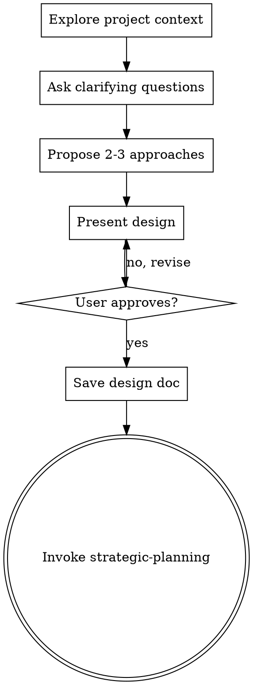
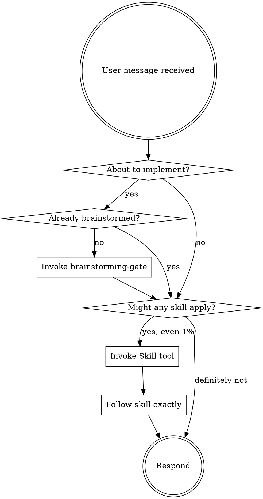
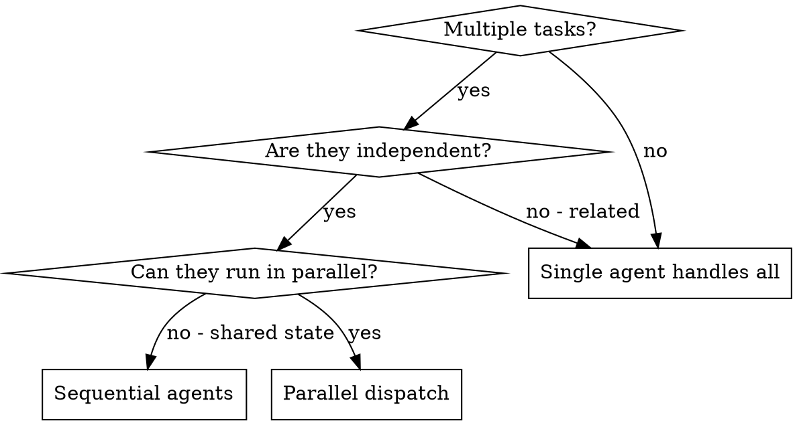
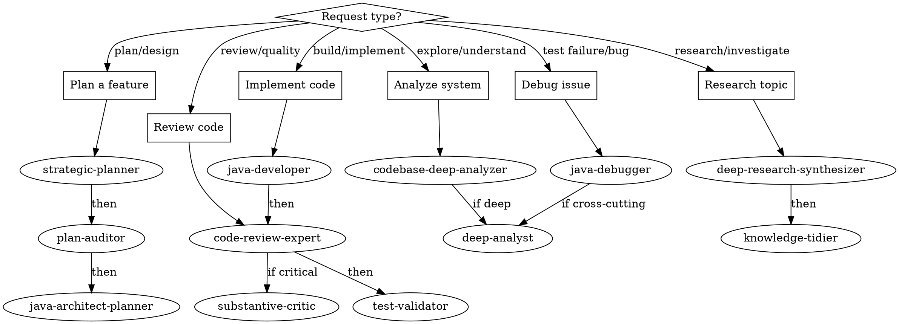
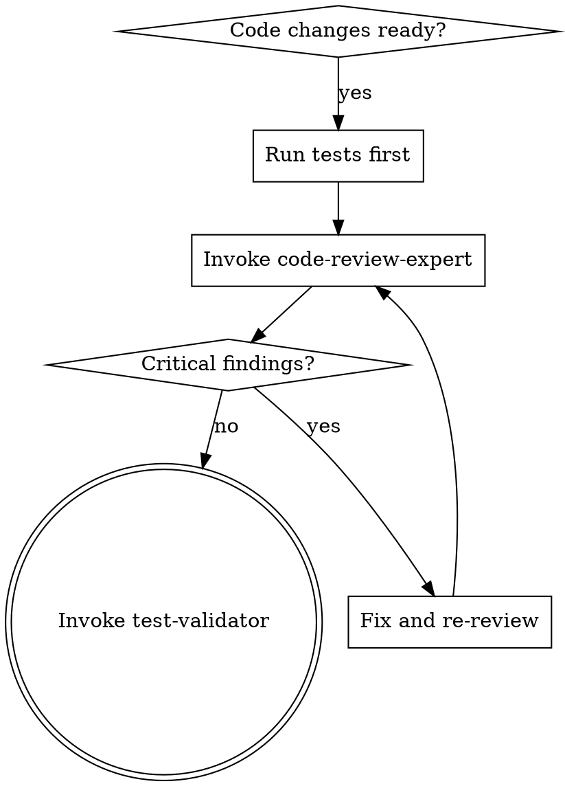

# nx Plugin v0.4.0 Implementation Plan

**Goal:** Address all findings from the deep-critic comparative review against the superpowers plugin, bringing the nx plugin to publication quality.

**Architecture:** Six phases of structural improvements to the nx Claude Code plugin: frontmatter cleanup, CSO-compliant skill descriptions, relay template deduplication, five new discipline/process skills, cross-referencing, and registry updates.

**Tech Stack:** Markdown skill files, YAML frontmatter, Python tests (pytest), JSON hooks

**Design Source:** Deep-critic comparative review (2026-02-24) — findings C1-C3, S1-S7, O1-O6

---

## Findings Cross-Reference

| ID | Severity | Summary | Task(s) |
|----|----------|---------|---------|
| C1 | Critical | Nexus skill description is content summary, not trigger condition | Task 5 |
| C2 | Critical | All 15 agent-delegating skill descriptions embed workflow | Task 6, 7 |
| C3 | Critical | Command relay templates have unfilled placeholders | Task 10 |
| S1 | Significant | No brainstorming/design gate skill | Task 12 |
| S2 | Significant | No verification-before-completion skill | Task 13 |
| S3 | Significant | No receiving-code-review skill | Task 14 |
| S4 | Significant | No skill-invocation discipline skill | Task 15 |
| S5 | Significant | YAML comments in description block scalars | Task 1 (merged from Task 2) |
| S6 | Significant | Non-standard frontmatter fields | Task 1 (S5 merged from Task 2) |
| S7 | Significant | PostToolUse hook fires on every tool use | Task 3 |
| O1 | Opportunity | Use disable-model-invocation in commands | Task 11 |
| O2 | Opportunity | Graphviz dot flowcharts for decision flows | Task 17 |
| O3 | Opportunity | Add dispatching-parallel-agents skill | Task 16 |
| O4 | Opportunity | Add REQUIRED SUB-SKILL markers | Task 18 |
| O5 | Opportunity | Add writing-nx-skills meta-skill | Task 19 |
| O6 | Opportunity | Companion files + relay template deduplication | Task 9, 20 |
| -- | Versioning | Bump to 0.4.0, changelog, tag convention | Task 4 (placeholder), Task 23 (final) |

## Dependency Graph

```
Phase 1 (Foundation)        Phase 2 (Descriptions)
T1 (T2 merged) ─┐           T5 ─┐
T3 ─────────────┤─→  ──→    T6 ─┤─→ (Phase 2 done) ──┐
T4 ─────────────┘           T7 ─┤                     │
                             T8 ─┘                     │
                                                       │
                    ┌──────────────────────────────────┘
                    │
                    ├──→  Phase 3 (Dedup)          ──┐
                    │     T9 ─┐                      │
                    │     T10 ─┤                     │
                    │     T11 ─┘                     │
                    │                                ├──→ Phase 5 (Cross-Refs)
                    ├──→  Phase 4 (New Skills)    ──┘     T17 ─┐
                          T12 ─┐                          T18 ─┤
                          T13 ─┤                          T19 ─┘
                          T14 ─┤                                │
                          T15 ─┤                                ▼
                          T16 ─┘                          Phase 6 (Final)
                                                          T20 ─┐
                                                          T21 ─┤
                                                          T22 ─┤
                                                          T23 ─┤
                                                          T24 ─┘
```

Tasks within a phase are independent and can execute in parallel. Phases 3 and 4 can run in parallel (both depend only on Phase 2, not on each other). Phase 5 depends on both Phases 3 and 4 completing. Phase 6 depends on Phase 5 completing.

---

## Phase 1: Foundation Infrastructure

### Task 1: Clean all skill frontmatter — remove non-standard fields and YAML comments (S5, S6)

Claude Code only reads two YAML frontmatter fields from SKILL.md: `name` and `description` (max 1024 chars total). All other fields are ignored by the framework.

**Files to modify (every skill with non-standard fields):**
- `nx/skills/code-review/SKILL.md` — remove `allowed-tools`, `memory`
- `nx/skills/strategic-planning/SKILL.md` — remove `allowed-tools`, `memory`
- `nx/skills/java-development/SKILL.md` — remove `allowed-tools`, `memory`
- `nx/skills/java-debugging/SKILL.md` — remove `allowed-tools`, `memory`
- `nx/skills/java-architecture/SKILL.md` — remove `allowed-tools`, `memory`
- `nx/skills/deep-analysis/SKILL.md` — remove `allowed-tools`, `memory`, `context`
- `nx/skills/research-synthesis/SKILL.md` — remove `allowed-tools`, `memory`, `context`
- `nx/skills/codebase-analysis/SKILL.md` — remove `allowed-tools`, `memory`, `context`
- `nx/skills/orchestration/SKILL.md` — remove `allowed-tools`
- `nx/skills/plan-validation/SKILL.md` — remove `allowed-tools`
- `nx/skills/test-validation/SKILL.md` — remove `allowed-tools`
- `nx/skills/pdf-processing/SKILL.md` — remove `allowed-tools`
- `nx/skills/knowledge-tidying/SKILL.md` — remove `allowed-tools`
- `nx/skills/project-setup/SKILL.md` — remove `allowed-tools`
- `nx/skills/substantive-critique/SKILL.md` — remove `allowed-tools`, `memory`
- `nx/skills/cli-controller/SKILL.md` — remove `standalone`, `allowed-tools`
- `nx/skills/rdr-create/SKILL.md` — remove `allowed-tools`
- `nx/skills/rdr-research/SKILL.md` — remove `allowed-tools`
- `nx/skills/rdr-gate/SKILL.md` — remove `allowed-tools`
- `nx/skills/rdr-close/SKILL.md` — remove `allowed-tools`
- `nx/skills/rdr-list/SKILL.md` — remove `allowed-tools`
- `nx/skills/rdr-show/SKILL.md` — remove `allowed-tools`

**Pattern:** For each file, the frontmatter should contain ONLY `name` and `description`:

Before:
```yaml
---
name: code-review
description: >
  Review code for quality...
# See ../../registry.yaml for full agent metadata
allowed-tools: Task, Read, Glob, Grep, Bash
memory: user
---
```

After:
```yaml
---
name: code-review
description: Use when ...
---
```

**Where to preserve removed metadata:** The `allowed-tools`, `memory`, `context`, and `standalone` data is already captured in `nx/registry.yaml` under the `agents` and `standalone_skills` sections. No data is lost. If any metadata is NOT in registry.yaml, add it there before removing from the skill.

**Step 1:** For each of the 22 skill files listed above, open the file and remove all frontmatter fields except `name` and `description`.

**Step 2:** Also remove YAML comments from description block scalars (previously Task 2, merged here). Several skills have `# See ../../registry.yaml for full agent metadata` or similar comments in the frontmatter block. Remove these lines from all 16 affected files (same files as listed above minus the 6 RDR skills which don't have comments). If Task 1 field removal already eliminated the comment lines (they often appear between removed fields), this step is a no-op.

**Step 3:** Verify no skill has more than 2 frontmatter fields:
```bash
for f in nx/skills/*/SKILL.md; do
  count=$(sed -n '/^---$/,/^---$/p' "$f" | grep -c '^\w')
  if [ "$count" -gt 2 ]; then echo "FAIL: $f has $count fields"; fi
done
```

**Step 4:** Verify no YAML comments remain:
```bash
grep -rn "# See" nx/skills/*/SKILL.md
# Expected: no output (zero matches)
```

**Step 5:** Run existing tests to verify nothing broke:
```bash
pytest tests/test_plugin_structure.py -v -k "TestSkillStructure"
```

**Commit:**
```
Clean all skill frontmatter: remove non-standard fields and YAML comments

Claude Code only reads name and description from SKILL.md frontmatter.
Remove allowed-tools, memory, context, and standalone fields. Also remove
YAML comments (e.g., "# See ../../registry.yaml") from description block
scalars. Metadata preserved in registry.yaml.

Addresses: S5 (YAML comments in description scalars), S6 (non-standard frontmatter fields)
```

---

### Task 2: ~~Remove YAML comments from description block scalars~~ (MERGED into Task 1)

**Merged into Task 1.** Both tasks modify the same files (all skill frontmatter). YAML comment removal is now Step 2 of Task 1 to avoid touching the same files twice.

---

### Task 3: Add matcher to PostToolUse hook (S7)

The `bead_context_hook.py` fires on EVERY tool use (PostToolUse) despite only caring about `bd create` commands. This adds Python interpreter startup overhead to every single tool invocation.

**File:** `nx/hooks/hooks.json`

**Current:**
```json
"PostToolUse": [
    {
      "type": "command",
      "command": "python3 $CLAUDE_PLUGIN_ROOT/hooks/scripts/bead_context_hook.py"
    }
  ]
```

**New:**
```json
"PostToolUse": [
    {
      "type": "command",
      "command": "python3 $CLAUDE_PLUGIN_ROOT/hooks/scripts/bead_context_hook.py",
      "matcher": "bd create"
    }
  ]
```

The `matcher` field tells Claude Code to only fire this hook when the tool input matches the pattern "bd create". This eliminates Python startup overhead for all other tool uses.

**Fallback:** If Claude Code does not support `matcher` on PostToolUse events (it may only support it on SessionStart), convert the hook to a bash one-liner that checks stdin before spawning Python:

```json
"PostToolUse": [
    {
      "type": "command",
      "command": "bash -c 'read input; echo \"$input\" | grep -q \"bd create\" && echo \"$input\" | python3 $CLAUDE_PLUGIN_ROOT/hooks/scripts/bead_context_hook.py || true'"
    }
  ]
```

**Verification:**
1. Run `bd create "test" -t task` and verify the hint message appears
2. Run any other Bash command and verify no Python process is spawned
3. Run the test suite: `pytest tests/test_plugin_structure.py -v`

**Commit:**
```
Add matcher to PostToolUse hook to reduce overhead

bead_context_hook.py only cares about 'bd create' commands but was
firing on every tool use. Add matcher to skip Python startup for
non-matching tool invocations.

Addresses: S7 (PostToolUse hook performance)
```

---

### Task 4: Version bump placeholder (Versioning — CHANGELOG deferred to Task 23)

**File:** `nx/.claude-plugin/plugin.json`

Change:
```json
"version": "0.3.2"
```
To:
```json
"version": "0.4.0-dev"
```

The `-dev` suffix signals that this is an in-progress release. The final version bump to `0.4.0` and CHANGELOG creation happen in Task 23 (Phase 6) after all features are implemented. This prevents documenting nonexistent features if implementation stalls mid-plan.

**Commit:**
```
Bump plugin version to 0.4.0-dev for in-progress release

Final version bump and CHANGELOG deferred to Phase 6 (Task 23)
after all features are implemented.
```

---

## Phase 2: Skill Description Rewrite

Phase 2 depends on Phase 1 completing (frontmatter is clean before rewriting descriptions).

### Task 5: Rewrite nexus skill description (C1)

The nexus skill description is a content summary ("Nexus gives you a single CLI..."). Per the CSO methodology from superpowers:writing-skills, descriptions must be pure triggering conditions.

**File:** `nx/skills/nexus/SKILL.md`

**Current description:**
```yaml
description: Use Nexus (nx) for semantic search, memory, knowledge storage, and project management across sessions.
```

**New description:**
```yaml
description: Use when running nx commands for search, memory, knowledge storage, or project management — or when unsure which nx subcommand to use
```

**Why this is better:** Starts with "Use when", describes the triggering condition (need to use nx), includes a specific symptom (unsure which subcommand). Does NOT summarize what nx does.

**Verification:**
```bash
head -5 nx/skills/nexus/SKILL.md
# Confirm description starts with "Use when"
```

**Commit:**
```
Rewrite nexus skill description to CSO trigger-condition pattern

Description now follows "Use when [condition]" pattern per
superpowers:writing-skills CSO methodology. Describes when to
load the skill, not what the skill contains.

Addresses: C1 (nexus skill description is content summary)
```

---

### Task 6: Rewrite all 15 agent-delegating skill descriptions (C2)

All agent-delegating skill descriptions embed workflow process ("Triggers: ..., user says ...") instead of pure triggering conditions. Rewrite each to follow "Use when [condition], before [action]" pattern.

**Files and new descriptions:**

1. **`nx/skills/code-review/SKILL.md`**
   ```yaml
   description: Use when code changes are ready for quality, security, or best practices review, before committing or creating a pull request
   ```

2. **`nx/skills/strategic-planning/SKILL.md`**
   ```yaml
   description: Use when facing multi-step development work that needs decomposition into phases, before writing any implementation code
   ```

3. **`nx/skills/java-development/SKILL.md`**
   ```yaml
   description: Use when a plan has been approved and Java implementation work is ready to begin, before writing production code
   ```

4. **`nx/skills/java-debugging/SKILL.md`**
   ```yaml
   description: Use when Java tests fail, exceptions occur, or behavior is non-deterministic, especially after 2+ failed manual fix attempts
   ```

5. **`nx/skills/java-architecture/SKILL.md`**
   ```yaml
   description: Use when complex Java features need architectural design before implementation, or when system design decisions span multiple modules
   ```

6. **`nx/skills/deep-analysis/SKILL.md`**
   ```yaml
   description: Use when surface-level analysis is insufficient and problems require hypothesis-driven investigation across multiple system components
   ```

7. **`nx/skills/research-synthesis/SKILL.md`**
   ```yaml
   description: Use when researching unfamiliar topics, comparing technology approaches, or building comprehensive understanding from multiple sources
   ```

8. **`nx/skills/codebase-analysis/SKILL.md`**
   ```yaml
   description: Use when exploring an unfamiliar codebase, onboarding to a project, or needing to understand module structure before making changes
   ```

9. **`nx/skills/orchestration/SKILL.md`**
   ```yaml
   description: Use when unsure which agent to use for a task, or when coordinating work across multiple agents in a pipeline
   ```

10. **`nx/skills/plan-validation/SKILL.md`**
    ```yaml
    description: Use when a plan has been created and needs validation before implementation begins, or when reviewing an existing plan for gaps
    ```

11. **`nx/skills/test-validation/SKILL.md`**
    ```yaml
    description: Use when implementation is complete and test coverage needs verification, before merge or pull request
    ```

12. **`nx/skills/pdf-processing/SKILL.md`**
    ```yaml
    description: Use when PDF documents need to be indexed into nx store for semantic search
    ```

13. **`nx/skills/knowledge-tidying/SKILL.md`**
    ```yaml
    description: Use when validated findings, decisions, or patterns need to be persisted to nx T3 knowledge store for cross-session reuse
    ```

14. **`nx/skills/project-setup/SKILL.md`**
    ```yaml
    description: Use when starting a project expected to span 3+ weeks that needs phase tracking and project management infrastructure
    ```

15. **`nx/skills/substantive-critique/SKILL.md`**
    ```yaml
    description: Use when architectural decisions, implementations, or documentation need deep constructive critique against specs or evidence
    ```

**Also update RDR skill descriptions to CSO pattern:**

16. **`nx/skills/rdr-create/SKILL.md`**
    ```yaml
    description: Use when starting a new research-design-review document, before beginning structured investigation
    ```

17. **`nx/skills/rdr-research/SKILL.md`**
    ```yaml
    description: Use when adding, tracking, or verifying structured research findings for an active RDR
    ```

18. **`nx/skills/rdr-gate/SKILL.md`**
    ```yaml
    description: Use when an RDR appears complete and needs finalization validation — structural, assumption, and AI critique checks
    ```

19. **`nx/skills/rdr-close/SKILL.md`**
    ```yaml
    description: Use when an RDR has passed its gate and needs to be closed with post-mortem, bead decomposition, and T3 archival
    ```

20. **`nx/skills/rdr-list/SKILL.md`**
    ```yaml
    description: Use when needing to see all RDRs in the project with their status, type, and priority
    ```

21. **`nx/skills/rdr-show/SKILL.md`**
    ```yaml
    description: Use when needing detailed information about a specific RDR including content, research findings, and linked beads
    ```

**Pattern for each edit:** Open file, replace the `description:` value (removing the `>` folded scalar indicator if present), ensure the new description starts with "Use when".

**Verification:**
```bash
for f in nx/skills/*/SKILL.md; do
  desc=$(sed -n '/^description:/,/^---/{/^description:/p}' "$f")
  if ! echo "$desc" | grep -qi "use when"; then
    echo "FAIL: $f description does not start with 'Use when'"
  fi
done
```

**Commit:**
```
Rewrite all skill descriptions to CSO trigger-condition pattern

Every skill description now follows "Use when [condition]" pattern
per superpowers:writing-skills CSO methodology. Descriptions state
when to load the skill, never summarize what it does.

Addresses: C2 (agent-delegating skills embed workflow in descriptions)
```

---

### Task 7: Rewrite standalone skill descriptions

**File:** `nx/skills/cli-controller/SKILL.md`

**Current:**
```yaml
description: >
  Expert guidance for controlling interactive CLI applications using tmux.
  Triggers: debugging Python/Java interactively, spawning Claude Code instances,
  long-running interactive processes, web application testing with browser automation.
```

**New:**
```yaml
description: Use when controlling interactive CLI applications, debugging with pdb/gdb/jshell, spawning Claude Code instances, or working with REPLs and long-running processes
```

**Commit:**
```
Rewrite cli-controller skill description to CSO pattern

Addresses: C2 (standalone skill description used workflow format)
```

---

### Task 8: Add description validation tests

**File:** `tests/test_plugin_structure.py`

Add new test class after `TestSkillStructure`:

```python
class TestSkillDescriptionCSO:
    """Skill descriptions must follow CSO 'Use when' pattern."""

    @pytest.mark.parametrize("skill_path", [
        pytest.param(p, id=p.parent.name) for p in skill_skill_mds()
    ])
    def test_description_starts_with_use_when(self, skill_path: Path) -> None:
        """All skill descriptions must start with 'Use when' per CSO methodology."""
        text = skill_path.read_text()
        match = re.match(r"^---\n(.*?)\n---", text, re.DOTALL)
        assert match, f"{skill_path.parent.name}/SKILL.md: no YAML frontmatter"
        fm = yaml.safe_load(match.group(1))
        desc = fm.get("description", "")
        assert desc.lower().startswith("use when"), (
            f"{skill_path.parent.name}/SKILL.md: description must start with "
            f"'Use when' (CSO pattern). Got: {desc[:80]!r}"
        )

    @pytest.mark.parametrize("skill_path", [
        pytest.param(p, id=p.parent.name) for p in skill_skill_mds()
    ])
    def test_description_no_workflow_keywords(self, skill_path: Path) -> None:
        """Descriptions must not summarize workflow — just triggering conditions."""
        text = skill_path.read_text()
        match = re.match(r"^---\n(.*?)\n---", text, re.DOTALL)
        if not match:
            pytest.skip("No frontmatter")
        fm = yaml.safe_load(match.group(1))
        desc = fm.get("description", "")
        # These keywords indicate workflow summary, not trigger conditions
        bad_keywords = ["Triggers:", "user says", "workflow", "process:"]
        for kw in bad_keywords:
            assert kw not in desc, (
                f"{skill_path.parent.name}/SKILL.md: description contains "
                f"workflow keyword {kw!r}. Descriptions should state WHEN to "
                f"use the skill, not summarize what it does."
            )

    @pytest.mark.parametrize("skill_path", [
        pytest.param(p, id=p.parent.name) for p in skill_skill_mds()
    ])
    def test_frontmatter_only_standard_fields(self, skill_path: Path) -> None:
        """Skill frontmatter must contain only name and description."""
        text = skill_path.read_text()
        match = re.match(r"^---\n(.*?)\n---", text, re.DOTALL)
        assert match, f"{skill_path.parent.name}/SKILL.md: no YAML frontmatter"
        fm = yaml.safe_load(match.group(1))
        allowed = {"name", "description"}
        extra = set(fm.keys()) - allowed
        assert not extra, (
            f"{skill_path.parent.name}/SKILL.md: non-standard frontmatter fields "
            f"{extra}. Claude Code only reads 'name' and 'description'."
        )

    @pytest.mark.parametrize("skill_path", [
        pytest.param(p, id=p.parent.name) for p in skill_skill_mds()
    ])
    def test_no_yaml_comments_in_frontmatter(self, skill_path: Path) -> None:
        """No YAML comments inside frontmatter block."""
        text = skill_path.read_text()
        match = re.match(r"^---\n(.*?)\n---", text, re.DOTALL)
        if not match:
            pytest.skip("No frontmatter")
        frontmatter_raw = match.group(1)
        comment_lines = [
            line for line in frontmatter_raw.splitlines()
            if line.strip().startswith("#")
        ]
        assert not comment_lines, (
            f"{skill_path.parent.name}/SKILL.md: YAML comments in frontmatter: "
            f"{comment_lines}"
        )
```

Also add a hook structure test:

```python
class TestHookStructure:
    """Hook configuration must follow best practices."""

    def test_post_tool_use_has_matcher(self) -> None:
        """PostToolUse hooks should have a matcher to avoid firing on every tool use."""
        import json
        hooks_path = PLUGIN_DIR / "hooks" / "hooks.json"
        assert hooks_path.exists(), "hooks.json not found"
        hooks = json.loads(hooks_path.read_text())
        for entry in hooks.get("PostToolUse", []):
            # Either has explicit matcher or the command itself filters
            has_matcher = "matcher" in entry
            has_filter = "grep" in entry.get("command", "") or "bd create" in entry.get("command", "")
            assert has_matcher or has_filter, (
                f"PostToolUse hook fires on every tool use without matcher: "
                f"{entry.get('command', '')[:80]}"
            )
```

Also add a registry integrity test for the `standalone_skills` section:

```python
class TestRegistryIntegrity:
    """Registry must be consistent with actual skill directories."""

    # ... existing test_agent_directory_exists ...

    def test_standalone_skill_directory_exists(self) -> None:
        """Every standalone_skills entry must have a matching skill directory."""
        import yaml
        registry_path = PLUGIN_DIR / "registry.yaml"
        assert registry_path.exists(), "registry.yaml not found"
        registry = yaml.safe_load(registry_path.read_text())
        standalone = registry.get("standalone_skills", {})
        for skill_name in standalone:
            skill_dir = PLUGIN_DIR / "skills" / skill_name
            assert skill_dir.is_dir(), (
                f"standalone_skills entry '{skill_name}' has no matching "
                f"directory at {skill_dir}"
            )
            skill_md = skill_dir / "SKILL.md"
            assert skill_md.exists(), (
                f"standalone_skills entry '{skill_name}' has directory but "
                f"no SKILL.md at {skill_md}"
            )
```

Also add a test that the shared RELAY_TEMPLATE.md exists (all hybrid cross-references depend on it):

```python
class TestSharedResources:
    """Shared resources referenced by skills must exist."""

    def test_relay_template_exists(self) -> None:
        """RELAY_TEMPLATE.md must exist — all hybrid relay cross-references point to it."""
        relay_template = PLUGIN_DIR / "agents" / "_shared" / "RELAY_TEMPLATE.md"
        assert relay_template.exists(), (
            f"RELAY_TEMPLATE.md not found at {relay_template}. "
            f"All agent-delegating skills cross-reference this file."
        )
        content = relay_template.read_text()
        assert len(content) > 100, (
            "RELAY_TEMPLATE.md exists but appears empty or trivially short"
        )
```

**Step 1:** Add the test classes to `tests/test_plugin_structure.py` after the existing `TestSkillStructure` class.

**Step 2:** Run the new tests (they should PASS if Phases 1-2 are complete):
```bash
pytest tests/test_plugin_structure.py -v -k "TestSkillDescriptionCSO or TestHookStructure or TestRegistryIntegrity or TestSharedResources"
```

**Step 3:** Run the full test suite to ensure no regressions:
```bash
pytest tests/test_plugin_structure.py -v
```

**Commit:**
```
Add CSO description validation, hook structure, registry, and shared resource tests

New test classes enforce:
- Skill descriptions start with "Use when" (CSO pattern)
- No workflow keywords in descriptions
- Only standard frontmatter fields (name, description)
- No YAML comments in frontmatter
- PostToolUse hooks have matchers
- standalone_skills registry entries have matching directories
- RELAY_TEMPLATE.md exists (cross-referenced by all hybrid relay templates)

Addresses: C1, C2, S5, S6, S7 (regression guards)
```

---

## Phase 3: Relay Template Deduplication and Command Simplification

Phase 3 depends on Phase 2 completing. Phase 3 can run in parallel with Phase 4 (no mutual dependency).

### Task 9: Replace inline relay templates in skills with hybrid cross-reference (O6)

All 15 agent-delegating skills inline the full relay template (~35 lines each). The template is already maintained in `nx/agents/_shared/RELAY_TEMPLATE.md`. Replace inline copies with a HYBRID approach: keep the agent name and a skeleton deliverable in each skill, cross-reference RELAY_TEMPLATE.md only for optional fields.

**Files to modify:** All agent-delegating skills (same 15 as Task 6), EXCLUDING the 3 RDR skills that delegate (rdr-research, rdr-gate, rdr-close). Note: rdr-create, rdr-list, rdr-show do NOT delegate to agents so they are not affected.

**Exception: rdr-research, rdr-gate, and rdr-close** — These 3 delegating RDR skills have CUSTOMIZED relay templates with RDR-specific fields (finalization criteria, Layer 3 critique structure, T3 collection paths, RDR-specific deliverables). Keep their custom relay templates intact.

**Hybrid Pattern — Replace the full inline relay template in each non-RDR skill with:**

```markdown
## Agent Invocation

Use the Task tool to invoke **{agent-name}**:

\```markdown
## Relay: {agent-name}

**Task**: [what needs to be done]
**Bead**: [ID] or 'none'

### Input Artifacts
- Files: [relevant files]

### Deliverable
{skill-specific deliverable description}

### Quality Criteria
- [ ] {skill-specific criterion 1}
- [ ] {skill-specific criterion 2}
\```

For full relay structure and optional fields, see [RELAY_TEMPLATE.md](../../agents/_shared/RELAY_TEMPLATE.md).
```

**Why hybrid, not pure cross-reference:** A bare cross-reference ("See RELAY_TEMPLATE.md") loses the agent name and deliverable context — the two things that vary per skill and that agents need immediately. The hybrid keeps what's unique (agent name, deliverable, quality criteria) and defers only the optional/structural fields (nx store, nx memory, nx pm context) to the shared template.

**Verification:**
```bash
# Count remaining full inline relay templates (should be 3 — rdr-research, rdr-gate, rdr-close)
grep -rl "## Relay Template (Use This Format)" nx/skills/*/SKILL.md | wc -l
# Expected: 3 (rdr-research, rdr-gate, rdr-close)

# Verify hybrid cross-reference is present in non-RDR skills
grep -rl "RELAY_TEMPLATE.md" nx/skills/*/SKILL.md | wc -l
# Expected: >= 15

# Verify agent names are preserved in hybrid templates
grep -rl "## Agent Invocation" nx/skills/*/SKILL.md | while read f; do
  grep -q "invoke \*\*" "$f" || echo "MISSING agent name: $f"
done
```

**Step 1:** Run existing relay template tests to establish baseline:
```bash
pytest tests/test_plugin_structure.py -v -k "test_relay_template_has_required_rows"
```

**Step 2:** Apply the hybrid replacement across all 15 non-RDR agent-delegating skills. For each skill, fill in the `{agent-name}`, `{skill-specific deliverable description}`, and `{skill-specific criterion}` placeholders with appropriate values from the skill's current relay template.

**Step 3:** Update the test `test_skill_has_relay_template` in `TestSkillStructure` to accept either the inline template OR the hybrid cross-reference:

In `tests/test_plugin_structure.py`, change the `REQUIRED_SKILL_SECTIONS` check for "## Relay Template" to also accept "## Agent Invocation" with a RELAY_TEMPLATE.md reference:

```python
REQUIRED_SKILL_SECTIONS = [
    # Relay section: either inline template or cross-reference
    ("## Relay Template", "## Agent Invocation"),  # either is acceptable
    "## Success Criteria",
]
```

And update the test:
```python
def test_skill_has_relay_template(self, skill_path: Path) -> None:
    text = skill_path.read_text()
    for section in self.REQUIRED_SKILL_SECTIONS:
        if isinstance(section, tuple):
            # Accept any of the alternatives
            assert any(alt in text for alt in section), (
                f"{skill_path.parent.name}/SKILL.md: missing one of {section}"
            )
        else:
            assert section in text, (
                f"{skill_path.parent.name}/SKILL.md: missing '{section}'"
            )
```

Also update `test_relay_template_has_required_rows` to skip skills that use the hybrid cross-reference:
```python
def test_relay_template_has_required_rows(self, skill_path: Path) -> None:
    text = skill_path.read_text()
    if "## Relay Template" not in text:
        # Skill uses hybrid cross-reference to RELAY_TEMPLATE.md instead
        if "RELAY_TEMPLATE.md" in text:
            return  # Valid: uses hybrid cross-reference
        pytest.skip("No relay template in this skill")
    # ... rest of existing test
```

**Step 4:** Run all tests:
```bash
pytest tests/test_plugin_structure.py -v
```

**Commit:**
```
Replace inline relay templates with hybrid cross-reference

15 agent-delegating skills duplicated the relay template verbatim
(~525 lines total). Replace with hybrid: keep agent name + skeleton
deliverable per skill, cross-reference RELAY_TEMPLATE.md for optional
fields. 3 RDR delegating skills (rdr-research, rdr-gate, rdr-close)
retain custom templates.

Addresses: O6 (relay template deduplication)
```

---

### Task 10: Pre-fill static relay parts in agent-delegating commands (C3)

Agent-delegating commands have a "## Relay Instructions" section with half-built relay templates containing unfilled placeholders like `[Search for prior reviews on these files]`. These push construction work to Claude at invocation time. Instead of removing the relay, pre-fill the STATIC parts (agent name, deliverable description, quality criteria) and keep only DYNAMIC parts (bead ID, file list) as fill-in prompts. The bash context injection in commands is the value-add; the relay should USE that context.

**Files to modify (all agent-delegating commands):**
- `nx/commands/review-code.md`
- `nx/commands/create-plan.md`
- `nx/commands/java-implement.md`
- `nx/commands/java-architecture.md`
- `nx/commands/java-debug.md`
- `nx/commands/deep-analysis.md`
- `nx/commands/research.md`
- `nx/commands/analyze-code.md`
- `nx/commands/test-validate.md`
- `nx/commands/plan-audit.md`
- `nx/commands/knowledge-tidy.md`
- `nx/commands/orchestrate.md`
- `nx/commands/substantive-critique.md`
- `nx/commands/pdf-process.md`
- `nx/commands/project-setup.md`

**Pattern — Replace the "## Relay Instructions" section with pre-filled relay:**

For example, `nx/commands/review-code.md` currently ends with:

```markdown
## Relay Instructions

Use the **Task tool** to delegate to code-review-expert:

\```markdown
## Relay: code-review-expert
...
[Search for prior reviews on these files]
\```
```

Replace with pre-filled static parts, dynamic placeholders for context:

```markdown
## Action

Invoke the **code-review** skill with the following relay. Fill in the dynamic fields using the context gathered above:

\```markdown
## Relay: code-review-expert

**Task**: Review the code changes for quality, security, and best practices
**Bead**: [fill from active bead or 'none']

### Input Artifacts
- Files: [fill from bash context above — changed files list]

### Deliverable
Structured code review with severity-rated findings, grouped by category (correctness, security, maintainability, performance).

### Quality Criteria
- [ ] All changed files reviewed
- [ ] Findings categorized by severity (critical, important, suggestion)
- [ ] Actionable fix recommendations for each finding
\```

For full relay structure and optional fields, see [RELAY_TEMPLATE.md](../agents/_shared/RELAY_TEMPLATE.md).
```

**Apply this pattern to each command:** pre-fill the agent name, deliverable description, and quality criteria (these are static per command). Leave bead ID and file list as `[fill from ...]` prompts since these are dynamic.

**Mapping of commands to skills:**

| Command | Skill to invoke |
|---------|----------------|
| review-code.md | code-review |
| create-plan.md | strategic-planning |
| java-implement.md | java-development |
| java-architecture.md | java-architecture |
| java-debug.md | java-debugging |
| deep-analysis.md | deep-analysis |
| research.md | research-synthesis |
| analyze-code.md | codebase-analysis |
| test-validate.md | test-validation |
| plan-audit.md | plan-validation |
| knowledge-tidy.md | knowledge-tidying |
| orchestrate.md | orchestration |
| substantive-critique.md | substantive-critique |
| pdf-process.md | pdf-processing |
| project-setup.md | project-setup |

**Verification:**
```bash
# No more unfilled generic placeholders in commands
grep -rl "\[Search for" nx/commands/*.md | wc -l
# Expected: 0

# All commands have "## Action" section with pre-filled relay
grep -rl "## Action" nx/commands/*.md | wc -l
# Expected: >= 15

# Agent names are pre-filled (not blank)
grep -rl "## Relay:" nx/commands/*.md | wc -l
# Expected: >= 15

# Bash blocks still valid
pytest tests/test_plugin_structure.py -v -k "TestCommandStructure"
```

**Commit:**
```
Pre-fill static relay parts in agent-delegating commands

Replace half-built relay templates with pre-filled static parts
(agent name, deliverable, quality criteria). Dynamic fields (bead ID,
file list) remain as fill-in prompts that use bash context injection.

Addresses: C3 (unfilled placeholder relay templates in commands)
```

---

### Task 11: Add disable-model-invocation to pure-bash pm commands (O1)

Pure-bash commands that just run `nx pm` subcommands should not be auto-invoked by Claude via the Skill tool. Per superpowers release notes, `disable-model-invocation: true` prevents Claude from auto-invoking slash commands via the Skill tool — restricting them to manual user invocation only. This is NOT about preventing model output generation; the bash `!{}` blocks still execute normally.

**RISK NOTE:** All superpowers commands with `disable-model-invocation` contain NO bash blocks. Our pm commands DO contain bash `!{}` blocks. This combination is untested. See Risk Factor 7.

**Files to modify:**
- `nx/commands/pm-status.md`
- `nx/commands/pm-list.md`
- `nx/commands/pm-new.md`
- `nx/commands/pm-close.md`
- `nx/commands/pm-archive.md`
- `nx/commands/pm-restore.md`

**Pattern:** Add `disable-model-invocation: true` to the YAML frontmatter.

Before:
```yaml
---
description: Show project management status
---
```

After:
```yaml
---
description: Show project management status
disable-model-invocation: true
---
```

**Verification (CRITICAL — must test bash block execution):**

**Step 1:** After adding the field to all 6 commands, manually invoke EACH pm command to verify bash blocks still execute:
```bash
# In a Claude Code session, test each command:
/pm-status    # Should execute bash block and show pm status
/pm-list      # Should execute bash block and list items
/pm-new       # Should execute bash block
/pm-close     # Should execute bash block
/pm-archive   # Should execute bash block
/pm-restore   # Should execute bash block
```

**Step 2:** Verify that Claude does NOT auto-invoke these commands via the Skill tool when discussing project management topics (the whole point of the field).

**Step 3:** If ANY bash block fails to execute after adding `disable-model-invocation`, REMOVE the field from that command immediately. The field is untested with bash blocks and may break them.

**Commit:**
```
Add disable-model-invocation to pure-bash pm commands

Prevents Claude from auto-invoking pm commands via the Skill tool.
Commands remain available for manual user invocation. Bash blocks
verified to still execute after adding the field.

Addresses: O1 (disable-model-invocation frontmatter field)
```

---

## Phase 4: New Skills

Phase 4 depends on Phase 2 completing (description patterns established). Phase 4 can run in parallel with Phase 3 (no mutual dependency). Tasks within Phase 4 are independent.

### Task 12: Create brainstorming-gate skill (S1)

**File (new):** `nx/skills/brainstorming-gate/SKILL.md`

```markdown
---
name: brainstorming-gate
description: Use when about to implement any feature, build any component, or make any behavioral change — requires design exploration and user approval before implementation
---

# Brainstorming Gate

## Overview

Turn ideas into designs through collaborative dialogue before writing code.

**Core principle:** No implementation without an approved design. Every project, regardless of perceived simplicity.

<HARD-GATE>
Do NOT invoke any implementation skill, write any code, scaffold any project, or take any implementation action until you have presented a design and the user has approved it. This applies to EVERY project regardless of perceived simplicity.
</HARD-GATE>

## Anti-Pattern: "This Is Too Simple To Need A Design"

Every project goes through this process. A utility function, a config change, a single-file script — all of them. "Simple" projects are where unexamined assumptions cause the most wasted work. The design can be short (a few sentences for truly simple projects), but you MUST present it and get approval.

## Process Flow



**Terminal state: invoke strategic-planning.** Do NOT invoke java-development, java-architecture, or any other implementation skill. The ONLY next step is strategic-planning (to create the implementation plan).

## Checklist

1. **Explore project context** — check files, docs, recent commits, nx search for prior art
2. **Ask clarifying questions** — one at a time, understand purpose/constraints/success criteria
3. **Propose 2-3 approaches** — with trade-offs and your recommendation
4. **Present design** — scaled to complexity, get user approval after each section
5. **Write design doc** — save to `docs/plans/YYYY-MM-DD-<topic>-design.md`
6. **Transition** — invoke strategic-planning skill to create implementation plan

## Key Principles

- **One question at a time** — do not overwhelm with multiple questions
- **YAGNI ruthlessly** — remove unnecessary features from all designs
- **Explore alternatives** — always propose 2-3 approaches before settling
- **Incremental validation** — present design sections, get approval before moving on

## Red Flags — STOP and Restart

- About to write code without a design
- "This is too simple for a design"
- "I already know what to build"
- Skipping questions because the answer seems obvious
- Jumping to implementation after one question

**All of these mean: Stop. Follow the process.**

**REQUIRED SUB-SKILL:** Use nx:strategic-planning after design approval to create the implementation plan.
```

**Also add to registry.yaml** — add brainstorming-gate to the `standalone_skills` section:

```yaml
  brainstorming-gate:
    description: "Design gate — requires design exploration and user approval before implementation"
    triggers:
      - "about to implement a feature"
      - "building something new"
      - "adding functionality"
    tools: [Read, Glob, Grep, Bash]
```

**Also update test exclusion lists** in `tests/test_plugin_structure.py` — add `"brainstorming-gate"` to the standalone skill exclusion lists for relay template, T1 scratch, and agent produce section tests.

**Smoke-test checklist (behavioral validation):**
1. Start a session, say "Add a caching layer to the API" — brainstorming-gate MUST activate and block implementation
2. Try "Just implement it, skip the design" — gate MUST refuse and redirect to design process
3. Present a design and get approval — gate MUST allow transition to strategic-planning
4. Verify the gate does NOT activate for non-implementation tasks (e.g., "search for auth patterns")

**Verification:**
```bash
pytest tests/test_plugin_structure.py -v -k "brainstorming"
# New skill should pass frontmatter and description tests
```

**Commit:**
```
Add brainstorming-gate skill for design-before-implementation

HARD-GATE that requires design exploration and user approval before
any implementation work. Includes registry entry and test exclusions.

Addresses: S1 (no brainstorming/design gate skill)
```

---

### Task 13: Create verification-before-completion skill (S2)

**File (new):** `nx/skills/verification-before-completion/SKILL.md`

```markdown
---
name: verification-before-completion
description: Use when about to claim work is complete, fixed, or passing — before committing, creating PRs, or marking beads done — or when a delegated agent reports completion or success — requires running verification commands and confirming output independently before any success claims
---

# Verification Before Completion

## Overview

Claiming work is complete without verification is dishonesty, not efficiency.

**Core principle:** Evidence before claims, always.

**Violating the letter of this rule is violating the spirit of this rule.**

## The Iron Law

```
NO COMPLETION CLAIMS WITHOUT FRESH VERIFICATION EVIDENCE
```

If you have not run the verification command in this message, you cannot claim it passes.

## The Gate Function

```
BEFORE claiming any status or expressing satisfaction:

1. IDENTIFY: What command proves this claim?
2. RUN: Execute the FULL command (fresh, complete)
3. READ: Full output, check exit code, count failures
4. VERIFY: Does output confirm the claim?
   - If NO: State actual status with evidence
   - If YES: State claim WITH evidence
5. ONLY THEN: Make the claim

Skip any step = lying, not verifying
```

## Common Failures

| Claim | Requires | Not Sufficient |
|-------|----------|----------------|
| Tests pass | `pytest` output: 0 failures | Previous run, "should pass" |
| Build succeeds | Build command: exit 0 | Linter passing |
| Bug fixed | Symptom test: passes | Code changed, assumed fixed |
| Bead done | All criteria verified | "I think it's done" |
| Agent completed | VCS diff shows changes | Agent reports "success" |

## Red Flags — STOP

- Using "should", "probably", "seems to"
- Expressing satisfaction before verification ("Done!", "Fixed!")
- About to commit/push/PR without verification
- Trusting agent success reports without checking
- Relying on partial verification
- Thinking "just this once"

## Rationalization Prevention

| Excuse | Reality |
|--------|---------|
| "Should work now" | RUN the verification |
| "I'm confident" | Confidence is not evidence |
| "Just this once" | No exceptions |
| "Agent said success" | Verify independently |
| "Partial check is enough" | Partial proves nothing |

## Verification Commands Reference

| Context | Command |
|---------|---------|
| Python tests | `pytest tests/ -v` |
| Java tests | `./mvnw test` |
| Plugin structure | `pytest tests/test_plugin_structure.py -v` |
| Bead criteria | `bd show <id>` then check each criterion |
| Git status | `git status && git diff --stat` |

## The Bottom Line

Run the command. Read the output. THEN claim the result.

This is non-negotiable.
```

**Also add to registry.yaml** — add verification-before-completion to the `standalone_skills` section:

```yaml
  verification-before-completion:
    description: "Evidence before claims — requires verification commands before completion claims"
    triggers:
      - "about to claim work is done"
      - "before committing"
      - "before marking bead complete"
    tools: [Bash, Read]
```

**Also update test exclusion lists** in `tests/test_plugin_structure.py` — add `"verification-before-completion"` to the standalone skill exclusion lists.

**Smoke-test checklist (behavioral validation):**
1. After making code changes, say "Done! All tests pass" WITHOUT running tests — skill MUST block the claim and require running `pytest`
2. Run tests, see 2 failures, say "Tests pass" — skill MUST catch the lie and report actual failure count
3. Run tests with 0 failures, then claim success — skill MUST allow the claim (evidence provided)
4. Receive agent report "All checks pass" — skill MUST require independent verification before propagating

**Commit:**
```
Add verification-before-completion skill

Iron law: no completion claims without fresh verification evidence.
Prevents premature success claims, trust in agent reports, and
partial verification. Includes registry entry and test exclusions.

Addresses: S2 (no verification-before-completion skill)
```

---

### Task 14: Create receiving-code-review skill (S3)

**File (new):** `nx/skills/receiving-code-review/SKILL.md`

```markdown
---
name: receiving-code-review
description: Use when receiving code review feedback — before implementing suggestions — especially if feedback seems unclear or technically questionable
---

# Receiving Code Review

## Overview

Code review requires technical evaluation, not emotional performance.

**Core principle:** Verify before implementing. Ask before assuming. Technical correctness over social comfort.

## The Response Pattern

```
WHEN receiving code review feedback:

1. READ: Complete feedback without reacting
2. UNDERSTAND: Restate requirement in own words (or ask)
3. VERIFY: Check against codebase reality
4. EVALUATE: Technically sound for THIS codebase?
5. RESPOND: Technical acknowledgment or reasoned pushback
6. IMPLEMENT: One item at a time, test each
```

## Forbidden Responses

**NEVER:**
- "You're absolutely right!"
- "Great point!" / "Excellent feedback!"
- "Let me implement that now" (before verification)

**INSTEAD:**
- Restate the technical requirement
- Ask clarifying questions if anything is unclear
- Push back with technical reasoning if wrong
- Just start working (actions speak louder than words)

## Handling Unclear Feedback

```
IF any item is unclear:
  STOP — do not implement anything yet
  ASK for clarification on unclear items

WHY: Items may be related. Partial understanding = wrong implementation.
```

## When to Push Back

Push back when:
- Suggestion breaks existing functionality
- Reviewer lacks full context
- Violates YAGNI (unused feature)
- Technically incorrect for this stack
- Conflicts with prior architectural decisions

**How to push back:**
- Use technical reasoning, not defensiveness
- Reference working tests/code
- Ask specific questions

## Implementation Order

```
FOR multi-item feedback:
  1. Clarify anything unclear FIRST
  2. Implement in this order:
     - Blocking issues (breaks, security)
     - Simple fixes (typos, imports)
     - Complex fixes (refactoring, logic)
  3. Test each fix individually
  4. Verify no regressions
```

## Acknowledging Correct Feedback

```
Correct:  "Fixed. [Brief description]"
Correct:  "Good catch — [specific issue]. Fixed in [location]."
Correct:  [Just fix it and show in the code]

Wrong:    "You're absolutely right!"
Wrong:    "Thanks for catching that!"
Wrong:    ANY gratitude expression
```

## Common Mistakes

| Mistake | Fix |
|---------|-----|
| Performative agreement | State requirement or just act |
| Blind implementation | Verify against codebase first |
| Batch without testing | One at a time, test each |
| Avoiding pushback | Technical correctness over comfort |

**REQUIRED BACKGROUND:** Understand nx:verification-before-completion — every fix must be verified before claiming it's done.
```

**Also add to registry.yaml** — add receiving-code-review to the `standalone_skills` section:

```yaml
  receiving-code-review:
    description: "Technical rigor for code review feedback — verify before implementing"
    triggers:
      - "receiving review feedback"
      - "code review comments"
      - "review suggestions"
    tools: [Read, Grep, Bash]
```

**Also update test exclusion lists** in `tests/test_plugin_structure.py` — add `"receiving-code-review"` to the standalone skill exclusion lists.

**Commit:**
```
Add receiving-code-review skill for technical review response

Handle review feedback with technical rigor, not sycophantic
agreement. Verify before implementing, push back when wrong.
Includes registry entry and test exclusions.

Addresses: S3 (no receiving-code-review skill)
```

---

### Task 15: Create using-nx-skills skill (S4)

**File (new):** `nx/skills/using-nx-skills/SKILL.md`

```markdown
---
name: using-nx-skills
description: Use when starting any conversation or task — establishes that nx skills must be checked before every response, including clarifying questions
---

<EXTREMELY-IMPORTANT>
If you think there is even a 1% chance a skill might apply to what you are doing, you MUST invoke the skill.

IF A SKILL APPLIES TO YOUR TASK, YOU DO NOT HAVE A CHOICE. YOU MUST USE IT.

This is not negotiable. This is not optional. You cannot rationalize your way out of this.
</EXTREMELY-IMPORTANT>

# Using nx Skills

## The Rule

**Invoke relevant skills BEFORE any response or action.** Even a 1% chance a skill might apply means you should invoke the skill to check. If an invoked skill turns out to be wrong for the situation, you do not need to use it.

## Process Flow



## Red Flags

These thoughts mean STOP — you are rationalizing:

| Thought | Reality |
|---------|---------|
| "This is just a simple question" | Questions are tasks. Check for skills. |
| "I need more context first" | Skill check comes BEFORE gathering context. |
| "Let me explore the codebase first" | Skills tell you HOW to explore. Check first. |
| "This doesn't need a formal skill" | If a skill exists, use it. |
| "I remember this skill" | Skills evolve. Read current version. |
| "The skill is overkill" | Simple things become complex. Use it. |
| "I'll just do this one thing first" | Check BEFORE doing anything. |

## Skill Priority

When multiple skills could apply:

1. **Discipline skills first** (brainstorming-gate, verification-before-completion) — these determine HOW to approach
2. **Process skills second** (strategic-planning, code-review) — these guide workflow
3. **Implementation skills third** (java-development, java-debugging) — these execute work

## Skill Types

**Rigid** (verification-before-completion, brainstorming-gate): Follow exactly. Do not adapt away discipline.

**Flexible** (patterns, reference): Adapt principles to context.

The skill itself tells you which type it is.

## User Instructions

Instructions say WHAT, not HOW. "Add X" or "Fix Y" does not mean skip workflows. Always check skills first.
```

**Subtask 15b: Create SessionStart hook for using-nx-skills injection**

Without an injection mechanism, `using-nx-skills` only activates on description matching, defeating its purpose as a session-wide discipline skill. In superpowers, the equivalent skill (`using-superpowers`) is force-injected via a SessionStart hook.

**File:** `nx/hooks/hooks.json`

Add a SessionStart hook entry that reads and outputs `using-nx-skills` content as `additionalContext`:

```json
"SessionStart": [
    {
      "type": "command",
      "command": "cat $CLAUDE_PLUGIN_ROOT/skills/using-nx-skills/SKILL.md"
    }
]
```

If `SessionStart` already has entries, append to the existing array. The hook output is injected as additional context at session start, ensuring the skill discipline is always active.

**Reference:** This follows the superpowers session-start hook pattern where `using-superpowers` is force-loaded at every session start.

**Verification:**
```bash
# Verify hooks.json is valid JSON
python3 -c "import json; json.load(open('nx/hooks/hooks.json'))"

# Verify SessionStart entry exists
python3 -c "
import json
hooks = json.load(open('nx/hooks/hooks.json'))
assert 'SessionStart' in hooks, 'Missing SessionStart'
entries = hooks['SessionStart']
assert any('using-nx-skills' in e.get('command', '') for e in entries), 'Missing using-nx-skills injection'
print('OK: SessionStart hook for using-nx-skills found')
"
```

**Also add to registry.yaml** — add using-nx-skills to the `standalone_skills` section:

```yaml
  using-nx-skills:
    description: "Skill invocation discipline — check skills before every response"
    triggers:
      - "starting any conversation"
      - "before any action"
    tools: []
```

**Also update test exclusion lists** in `tests/test_plugin_structure.py` — add `"using-nx-skills"` to the standalone skill exclusion lists for relay template and T1 scratch tests.

**Commit:**
```
Add using-nx-skills skill with SessionStart hook injection

Establishes that skills must be checked before every response.
Even a 1% chance a skill applies means invoke it. SessionStart hook
force-injects the skill at every session start, following the
superpowers using-superpowers pattern.

Addresses: S4 (no skill-invocation discipline skill)
```

---

### Task 16: Create dispatching-parallel-agents skill (O3)

**File (new):** `nx/skills/dispatching-parallel-agents/SKILL.md`

```markdown
---
name: dispatching-parallel-agents
description: Use when facing 2+ independent tasks that can be worked on without shared state or sequential dependencies
---

# Dispatching Parallel Agents

## Overview

When you have multiple independent problems (different test files, different subsystems, different bugs), investigating them sequentially wastes time. Each investigation is independent and can happen in parallel.

**Core principle:** Dispatch one agent per independent problem domain. Let them work concurrently.

## When to Use



**Use when:**
- 2+ independent tasks with different root causes
- Multiple subsystems broken independently
- Each problem can be understood without context from others
- No shared state between investigations

**Do not use when:**
- Tasks are related (fix one might fix others)
- Need to understand full system state first
- Agents would edit the same files

## The Pattern

### 1. Identify Independent Domains

Group work by what is independent:
- Different test files with different failures
- Different modules with separate concerns
- Independent research questions

### 2. Compose Focused Agent Tasks

Each agent gets:
- **Specific scope:** One problem domain
- **Clear goal:** What success looks like
- **Constraints:** What NOT to change
- **Expected output:** Summary format

Use the relay format from [RELAY_TEMPLATE.md](../../agents/_shared/RELAY_TEMPLATE.md) for each agent.

### 3. Dispatch in Parallel

```python
# Use Task tool with multiple concurrent calls
Task("Fix auth module tests — scope: tests/auth/")
Task("Fix search module tests — scope: tests/search/")
Task("Fix indexing module tests — scope: tests/indexing/")
# All three run concurrently
```

### 4. Review and Integrate

When agents return:
1. Read each summary
2. Verify fixes do not conflict
3. Run full test suite
4. Integrate all changes

## Common Mistakes

| Mistake | Fix |
|---------|-----|
| Scope too broad ("fix all tests") | One domain per agent |
| No context in prompt | Include error messages, file paths |
| No constraints | Specify what NOT to change |
| Vague output expectations | Ask for summary of root cause and changes |
| Trusting agent reports blindly | Always verify — see nx:verification-before-completion |

## When NOT to Use

- **Related failures:** Fix one might fix others — investigate together first
- **Exploratory debugging:** You do not know what is broken yet
- **Shared state:** Agents would interfere (editing same files, using same resources)
```

**Also add to registry.yaml** — add dispatching-parallel-agents to the `standalone_skills` section:

```yaml
  dispatching-parallel-agents:
    description: "Parallel agent dispatch for independent problem domains"
    triggers:
      - "multiple independent failures"
      - "parallel investigation needed"
      - "independent subsystems broken"
    tools: [Task]
```

**Also update test exclusion lists** in `tests/test_plugin_structure.py` — add `"dispatching-parallel-agents"` to the standalone skill exclusion lists.

**Commit:**
```
Add dispatching-parallel-agents skill

Guide for parallel agent execution on independent problem domains.
Includes decision flowchart, agent prompt structure, common mistakes,
registry entry, and test exclusions.

Addresses: O3 (dispatching-parallel-agents skill)
```

---

## Phase 5: Cross-References and Meta

Phase 5 depends on BOTH Phase 3 and Phase 4 completing (cross-references span deduped relay templates and new skills).

### Task 17: Add graphviz flowcharts to decision-heavy skills (O2)

Add dot-language flowcharts to skills with non-obvious decision flows. Phase 4 skills (Tasks 12, 15, 16) already include flowcharts. This task adds flowcharts to existing skills that would benefit.

**File 1:** `nx/skills/orchestration/SKILL.md`

Add after "## When This Skill Activates":

**NOTE:** This flowchart MUST match the actual routing table in `nx/skills/orchestration/SKILL.md`. Read the routing table before finalizing. The flowchart below reflects the current routing:



**File 2:** `nx/skills/code-review/SKILL.md`

Add after "## When This Skill Activates":



**Verification:**
```bash
# Verify dot syntax is valid (if graphviz installed)
grep -A 20 '```dot' nx/skills/orchestration/SKILL.md | sed '/```/d' | dot -Tsvg -o /dev/null 2>&1
```

**Commit:**
```
Add graphviz flowcharts to orchestration and code-review skills

Visual decision flows help agents navigate non-obvious routing
and workflow decisions.

Addresses: O2 (graphviz dot flowcharts for decision flows)
```

---

### Task 18: Add REQUIRED SUB-SKILL cross-reference markers (O4)

Add explicit cross-skill dependency markers following the superpowers convention.

**Files to modify and markers to add:**

1. **`nx/skills/brainstorming-gate/SKILL.md`** (already has it from Task 12)
   - `**REQUIRED SUB-SKILL:** Use nx:strategic-planning after design approval`

2. **`nx/skills/strategic-planning/SKILL.md`** — add at end of "Planning Methodology" section:
   ```markdown
   **REQUIRED SUB-SKILL:** Use nx:plan-validation (plan-auditor) after creating any plan.
   ```

3. **`nx/skills/code-review/SKILL.md`** — add at end of "Review Methodology" section:
   ```markdown
   **REQUIRED BACKGROUND:** Understand nx:receiving-code-review for how to handle the review output.
   ```

4. **`nx/skills/java-development/SKILL.md`** — add at end of "TDD Methodology" section:
   ```markdown
   **REQUIRED SUB-SKILL:** Use nx:verification-before-completion before claiming any task is done.
   **REQUIRED SUB-SKILL:** Use nx:code-review after implementation for quality review.
   ```

5. **`nx/skills/receiving-code-review/SKILL.md`** (already has it from Task 14)
   - `**REQUIRED BACKGROUND:** Understand nx:verification-before-completion`

6. **`nx/skills/plan-validation/SKILL.md`** — add at end of methodology section:
   ```markdown
   **REQUIRED BACKGROUND:** Understand nx:strategic-planning for plan structure and conventions.
   ```

7. **`nx/skills/test-validation/SKILL.md`** — add after methodology section:
   ```markdown
   **REQUIRED SUB-SKILL:** Use nx:verification-before-completion — run all tests before claiming coverage is adequate.
   ```

**Verification:**
```bash
grep -rn "REQUIRED SUB-SKILL\|REQUIRED BACKGROUND" nx/skills/*/SKILL.md
# Expected: at least 7 matches across different skills
```

**Commit:**
```
Add REQUIRED SUB-SKILL cross-reference markers to skills

Explicit dependency markers ensure agents load prerequisite skills
before executing work. Follows superpowers convention.

Addresses: O4 (REQUIRED SUB-SKILL cross-reference markers)
```

---

### Task 19: Create writing-nx-skills meta-skill (O5)

**File (new):** `nx/skills/writing-nx-skills/SKILL.md`

```markdown
---
name: writing-nx-skills
description: Use when creating new nx plugin skills, editing existing skills, or verifying skill quality before committing
---

# Writing nx Skills

## Overview

Guide for authoring skills in the nx Claude Code plugin. Skills are reference guides for proven techniques, patterns, or tools that help future Claude instances find and apply effective approaches.

**REQUIRED BACKGROUND:** Understand superpowers:writing-skills for the foundational TDD-for-documentation methodology. This skill adds nx-specific conventions on top.

## nx Skill Conventions

### Frontmatter

Only two fields. Max 1024 characters total:

```yaml
---
name: skill-name-with-hyphens
description: Use when [specific triggering conditions]
---
```

- `name`: Letters, numbers, hyphens only
- `description`: MUST start with "Use when". Describe triggering conditions, NEVER summarize workflow.

### Skill Types in nx

**Agent-delegating skills** (majority): Invoke a specific agent via Task tool relay.
Required sections:
- `## When This Skill Activates`
- `## Agent Invocation` with cross-reference to RELAY_TEMPLATE.md
- `## Success Criteria`
- `## Agent-Specific PRODUCE` (T1/T2/T3 outputs)

**Standalone skills** (nexus, cli-controller): Provide guidance directly without agent delegation.
Required sections:
- `## When This Skill Activates`
- `## Success Criteria` (optional for pure reference)

**Discipline skills** (brainstorming-gate, verification-before-completion): Enforce process rules.
Required sections:
- `<HARD-GATE>` or `<EXTREMELY-IMPORTANT>` blocks
- Rationalization prevention table
- Red flags list

### Cross-References

Use explicit markers, not file paths:
- `**REQUIRED SUB-SKILL:** Use nx:skill-name for [purpose]`
- `**REQUIRED BACKGROUND:** Understand nx:skill-name before using this skill`

Never use `@` syntax (force-loads files, burns context).

### Relay Template

Agent-delegating skills reference the canonical template:
```markdown
## Agent Invocation

Use the Task tool with standardized relay format.
See [RELAY_TEMPLATE.md](../../agents/_shared/RELAY_TEMPLATE.md) for required fields and examples.
```

Do NOT inline the relay template. One source of truth: `agents/_shared/RELAY_TEMPLATE.md`.

### Storage Tier References

Skills that produce outputs must document which tiers they use:
- **T1 scratch**: `nx scratch put "..." --tags "..."` — session-scoped ephemeral notes
- **T2 memory**: `nx memory put "..." --project {repo} --title file.md` — cross-session state
- **T3 knowledge**: `nx store put ...` — permanent validated findings

### Registry Integration

After creating a skill, add it to `nx/registry.yaml`:
- Agent-delegating: under `agents:` with model, skill, slash_command, triggers
- Standalone: under `standalone_skills:` with tools and triggers
- RDR: under `rdr_skills:` with slash_command and triggers

## Quality Checklist

- [ ] Frontmatter has only `name` and `description`
- [ ] Description starts with "Use when"
- [ ] Description has no workflow summary
- [ ] Agent-delegating: has Agent Invocation cross-reference
- [ ] Agent-delegating: has Agent-Specific PRODUCE section
- [ ] Agent-delegating: mentions nx scratch (T1)
- [ ] Has Success Criteria section
- [ ] Added to registry.yaml
- [ ] Tests pass: `pytest tests/test_plugin_structure.py -v`

## Testing Skills

Run structural validation:
```bash
pytest tests/test_plugin_structure.py -v -k "skill_name"
```

For behavioral testing, follow the TDD-for-documentation approach from superpowers:writing-skills — create pressure scenarios, test baseline without skill, verify compliance with skill.
```

**Also add to registry.yaml** — add writing-nx-skills to the `standalone_skills` section:

```yaml
  writing-nx-skills:
    description: "Guide for authoring nx plugin skills"
    triggers:
      - "creating new skill"
      - "editing skill"
      - "plugin authorship"
    tools: [Read, Write, Edit, Bash]
```

**Also update test exclusion lists** in `tests/test_plugin_structure.py` — add `"writing-nx-skills"` to the standalone skill exclusion lists.

**Commit:**
```
Add writing-nx-skills meta-skill for plugin authorship

Guide for creating and editing nx plugin skills. Covers frontmatter
conventions, skill types, cross-references, and quality checklist.
Includes registry entry and test exclusions.

Addresses: O5 (writing-nx-skills meta-skill)
```

---

## Phase 6: Finalization

Phase 6 depends on all prior phases completing.

### Task 20: Split nexus skill into quick-ref + companion reference (O6)

The nexus skill is ~800 words — too large for a frequently-loaded skill. Split into a compact SKILL.md (quick-reference table) and a companion reference.md (full documentation).

**File 1 (rewrite):** `nx/skills/nexus/SKILL.md`

```markdown
---
name: nexus
description: Use when running nx commands for search, memory, knowledge storage, or project management — or when unsure which nx subcommand to use
---

# Nexus Quick Reference

## Storage Tiers

| Tier | Scope | CLI | Use For |
|------|-------|-----|---------|
| T1 | Session | `nx scratch` | Hypotheses, interim findings, checkpoints |
| T2 | Persistent | `nx memory` | Cross-session state, agent relay notes |
| T3 | Permanent | `nx search`, `nx store` | Validated findings, decisions, patterns |

## Common Commands

```bash
# Search
nx search "query"                    # semantic search across T3
nx search "query" --corpus code      # code only
nx search "query" --hybrid           # semantic + ripgrep + frecency
nx search "query" --answer           # retrieval + synthesis

# Memory (T2)
nx memory put "content" --project {repo} --title file.md
nx memory get --project {repo} --title file.md
nx memory search "query" --project {repo}

# Knowledge (T3)
echo "content" | nx store put - --collection knowledge --title "title" --tags "tag"
nx store list --collection knowledge

# Scratch (T1)
nx scratch put "working note"
nx scratch flag <id>                 # auto-promote to T2 at session end

# Project Management
nx pm status                         # current phase, blockers
nx pm resume                         # inject continuation context

# Indexing
nx index code <path>                 # index code repo
```

## Collection Naming

Always `__` as separator: `code__myrepo`, `docs__corpus`, `knowledge__topic`

## Title Conventions

Use hyphens: `research-{topic}`, `decision-{component}-{name}`, `pattern-{name}`

For full command reference with all flags and options, see [reference.md](./reference.md).
```

**File 2 (new):** `nx/skills/nexus/reference.md`

Move the current full content of SKILL.md (everything below the frontmatter) into reference.md. This is the complete reference with all command variations, flags, and workflow guidance.

**Steps:**
1. Copy current SKILL.md body (below `---` closer) to reference.md
2. Replace SKILL.md body with the compact quick-reference above
3. Add cross-reference link at bottom of SKILL.md

**Verification:**
```bash
wc -w nx/skills/nexus/SKILL.md
# Expected: < 250 words (down from ~800)

wc -w nx/skills/nexus/reference.md
# Expected: ~700 words (the full reference)

pytest tests/test_plugin_structure.py -v -k "nexus"
```

**Commit:**
```
Split nexus skill into quick-ref SKILL.md + companion reference.md

SKILL.md now loads as a compact quick-reference table (~200 words).
Full command documentation moved to reference.md companion file.

Addresses: O6 (companion files for compact skills), nexus skill size
```

---

### Task 21: Verify registry.yaml completeness

Registry entries are now added with each new skill (Tasks 12-16, 19) rather than deferred to Phase 6. This task verifies all entries are present and consistent.

**File:** `nx/registry.yaml`

**Verification checklist — confirm each new skill has a registry entry:**

```bash
# Verify all 6 new standalone skills are in registry.yaml
for skill in brainstorming-gate verification-before-completion receiving-code-review using-nx-skills dispatching-parallel-agents writing-nx-skills; do
  grep -q "$skill" nx/registry.yaml || echo "MISSING: $skill"
done
# Expected: no output (all present)

# Verify existing standalone skills are still present
for skill in cli-controller nexus; do
  grep -q "$skill" nx/registry.yaml || echo "MISSING: $skill"
done
# Expected: no output

# Run registry integrity tests
pytest tests/test_plugin_structure.py -v -k "TestRegistryIntegrity"
```

**If any skill is missing:** Add it now following the pattern established in the Phase 4 tasks.

**Commit:**
```
Verify registry.yaml completeness for v0.4.0

All 6 new standalone skills confirmed present in registry.yaml.
Registry entries were added with each new skill in Phases 4-5.
```

---

### Task 22: Final test verification

Test exclusion lists are now updated with each new skill (Tasks 12-16, 19) rather than deferred to Phase 6. This task performs final verification that all exclusions are correct and all tests pass.

**Step 1:** Verify test exclusion lists in `tests/test_plugin_structure.py` include ALL standalone skills:

```python
# Expected complete exclusion list (verify these are in all relevant test exclusions):
STANDALONE_SKILLS = {
    "cli-controller", "nexus",
    "brainstorming-gate", "verification-before-completion",
    "receiving-code-review", "using-nx-skills",
    "dispatching-parallel-agents", "writing-nx-skills",
}
```

If any skill is missing from exclusion lists, add it now.

**Step 2:** Run the FULL test suite:
```bash
pytest tests/ -v
```

Expected: All 1121+ tests pass (existing tests + new tests from Task 8).

**Step 3:** Run plugin structure tests specifically:
```bash
pytest tests/test_plugin_structure.py -v
```

Expected: All tests pass including new CSO validation tests.

**Step 4:** Verify word counts:
```bash
wc -w nx/skills/*/SKILL.md | sort -n
```

**Step 5:** Verify no stale patterns remain:
```bash
# No workflow keywords in descriptions
grep -rn "Triggers:" nx/skills/*/SKILL.md | grep -v "## When"
# Expected: 0 matches

# No inline relay templates (except rdr-gate)
grep -rl "## Relay Template (Use This Format)" nx/skills/*/SKILL.md
# Expected: 0 or 1 (rdr-gate only)

# No YAML comments in frontmatter
for f in nx/skills/*/SKILL.md; do
  sed -n '/^---$/,/^---$/p' "$f" | grep "^#" && echo "FAIL: $f"
done
# Expected: no output

# No non-standard frontmatter fields
for f in nx/skills/*/SKILL.md; do
  count=$(python3 -c "
import yaml, re
text = open('$f').read()
m = re.match(r'^---\n(.*?)\n---', text, re.DOTALL)
if m:
    fm = yaml.safe_load(m.group(1))
    extra = set(fm.keys()) - {'name', 'description'}
    if extra: print(f'$f: {extra}')
")
done
# Expected: no output
```

**Commit:**
```
Final test updates and verification for v0.4.0

Update test exclusion lists for new standalone skills. Verify all
structural tests pass including new CSO validation.
```

---

### Task 23: Finalize version bump and create CHANGELOG (Versioning)

This task was split from Task 4. The CHANGELOG is written AFTER all features are implemented, so it accurately documents what was delivered.

**File 1:** `nx/.claude-plugin/plugin.json`

Change:
```json
"version": "0.4.0-dev"
```
To:
```json
"version": "0.4.0"
```

**File 2 (new):** `nx/CHANGELOG.md`

```markdown
# Changelog

All notable changes to the nx plugin are documented here.
Format follows [Keep a Changelog](https://keepachangelog.com/en/1.1.0/).
Versioning follows [Semantic Versioning](https://semver.org/spec/v2.0.0.html).

## [0.4.0] - 2026-02-24

### Added
- brainstorming-gate skill: design gate before implementation (S1)
- verification-before-completion skill: evidence before claims (S2)
- receiving-code-review skill: technical rigor for review feedback (S3)
- using-nx-skills skill: skill invocation discipline (S4)
- dispatching-parallel-agents skill: parallel agent coordination (O3)
- writing-nx-skills meta-skill: plugin authorship guide (O5)
- Graphviz flowcharts in decision-heavy skills (O2)
- REQUIRED SUB-SKILL cross-reference markers (O4)
- Companion reference.md for nexus skill (O6)
- CHANGELOG.md
- SessionStart hook for using-nx-skills injection

### Changed
- All skill descriptions rewritten to CSO "Use when [condition]" pattern (C1, C2)
- Removed non-standard frontmatter fields from all skills (S6)
- Removed YAML comments from description block scalars (S5)
- Replaced inline relay templates with hybrid cross-reference to RELAY_TEMPLATE.md (O6)
- Simplified agent-delegating commands with pre-filled relay parts (C3)
- Added disable-model-invocation to pure-bash pm commands (O1)
- PostToolUse hook now has matcher for bd create commands only (S7)
- Nexus skill split into quick-ref SKILL.md + detailed reference.md

### Fixed
- PostToolUse hook performance (was firing Python on every tool use)

## [0.3.2] - 2026-02-23

### Added
- RDR workflow skills (rdr-create, rdr-list, rdr-show, rdr-research, rdr-gate, rdr-close)
- cli-controller skill with raw tmux commands
```

**Git tag convention:** After merging the v0.4.0 PR, tag:
```bash
git tag -a v0.4.0 -m "nx plugin v0.4.0 — CSO compliance, new discipline skills"
```

**Commit:**
```
Finalize v0.4.0 version and add CHANGELOG.md

All features implemented. Remove -dev suffix from version, create
CHANGELOG documenting all v0.4.0 changes.

Addresses: Versioning
```

---

### Task 24: Update nx/README.md

Update `nx/README.md` to reflect the 6 new skills (brainstorming-gate, verification-before-completion, receiving-code-review, using-nx-skills, dispatching-parallel-agents, writing-nx-skills), relay template deduplication, CHANGELOG, and new plugin structure.

**File:** `nx/README.md`

**Changes to make:**
1. Add the 6 new skills to the skill listing section
2. Document the relay template cross-reference pattern (skills reference RELAY_TEMPLATE.md)
3. Mention the CHANGELOG.md file
4. Update any skill counts if mentioned
5. Document the SessionStart hook for using-nx-skills injection

**Verification:**
```bash
# Verify all new skills are mentioned
for skill in brainstorming-gate verification-before-completion receiving-code-review using-nx-skills dispatching-parallel-agents writing-nx-skills; do
  grep -q "$skill" nx/README.md || echo "MISSING: $skill"
done
```

**Commit:**
```
Update nx/README.md for v0.4.0 changes

Document 6 new skills, relay template deduplication, CHANGELOG,
and new plugin structure.
```

---

## Summary of All Commits (in order)

| # | Phase | Commit Message | Finding(s) |
|---|-------|---------------|------------|
| 1 | 1 | Clean all skill frontmatter (fields + YAML comments) | S5, S6 |
| 2 | 1 | ~~(merged into Task 1)~~ | S5 |
| 3 | 1 | Add matcher to PostToolUse hook to reduce overhead | S7 |
| 4 | 1 | Bump plugin version to 0.4.0-dev (placeholder) | Versioning |
| 5 | 2 | Rewrite nexus skill description to CSO pattern | C1 |
| 6 | 2 | Rewrite all 15 skill descriptions to CSO pattern | C2 |
| 7 | 2 | Rewrite cli-controller skill description to CSO pattern | C2 |
| 8 | 2 | Add CSO description validation and hook structure tests | C1,C2,S5,S6,S7 |
| 9 | 3 | Replace inline relay templates with hybrid cross-reference | O6 |
| 10 | 3 | Pre-fill static relay parts in agent-delegating commands | C3 |
| 11 | 3 | Add disable-model-invocation to pure-bash pm commands | O1 |
| 12 | 4 | Add brainstorming-gate skill + registry + test exclusions | S1 |
| 13 | 4 | Add verification-before-completion skill + registry + test exclusions | S2 |
| 14 | 4 | Add receiving-code-review skill + registry + test exclusions | S3 |
| 15 | 4 | Add using-nx-skills skill + registry + SessionStart hook + test exclusions | S4 |
| 16 | 4 | Add dispatching-parallel-agents skill + registry + test exclusions | O3 |
| 17 | 5 | Add graphviz flowcharts to skills | O2 |
| 18 | 5 | Add REQUIRED SUB-SKILL markers | O4 |
| 19 | 5 | Add writing-nx-skills meta-skill + registry + test exclusions | O5 |
| 20 | 6 | Split nexus skill into quick-ref + companion | O6 |
| 21 | 6 | Verify registry.yaml completeness | -- |
| 22 | 6 | Final test verification | -- |
| 23 | 6 | Finalize v0.4.0 version and add CHANGELOG.md | Versioning |
| 24 | 6 | Update nx/README.md | -- |

## Risk Factors

1. **`disable-model-invocation` may not be a valid frontmatter field** in Claude Code plugins. If it only works in the superpowers plugin context, remove it from Task 11 and mark O1 as deferred.

2. **`matcher` on PostToolUse may not be supported.** The fallback (bash wrapper) in Task 3 handles this.

3. **Test count may change** as new skills are added. The exclusion lists are now added with each new skill (Phase 4 tasks), and Task 22 performs final verification.

4. ~~**Tasks 1 and 2 modify the same files.**~~ Resolved: Tasks 1 and 2 are merged into a single Task 1.

5. **RDR skills (rdr-research, rdr-gate, rdr-close) have custom relay templates** that must NOT be replaced by the cross-reference in Task 9. These 3 delegating RDR skills are explicitly exempted.

6. **`using-nx-skills` has no injection mechanism without SessionStart hook.** The skill only activates on description matching, which defeats its purpose as a session-wide discipline. **Mitigation:** Task 15 now includes a SessionStart hook entry in `nx/hooks/hooks.json` that reads and outputs `using-nx-skills` content as `additionalContext`, following the superpowers session-start hook pattern.

7. **`disable-model-invocation` + bash block interaction is untested.** Per superpowers release notes, `disable-model-invocation` prevents Claude from auto-invoking slash commands via the Skill tool. All superpowers commands with this field contain NO bash blocks. Our pm commands DO contain bash `!{}` blocks. This combination is untested. **Mitigation:** Task 11 includes an explicit testing step — after adding the field, manually invoke each pm command to verify bash blocks still execute. If they don't, remove the field.
