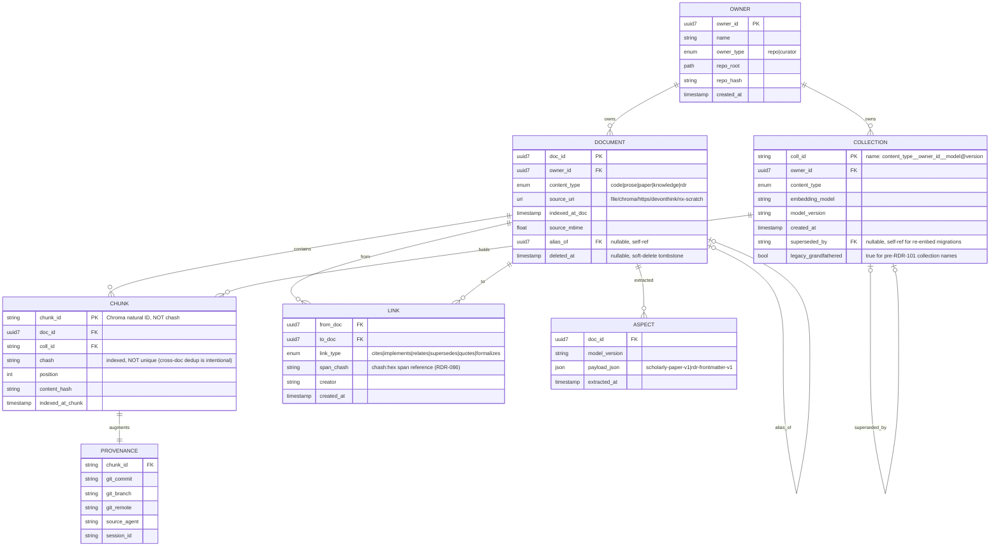
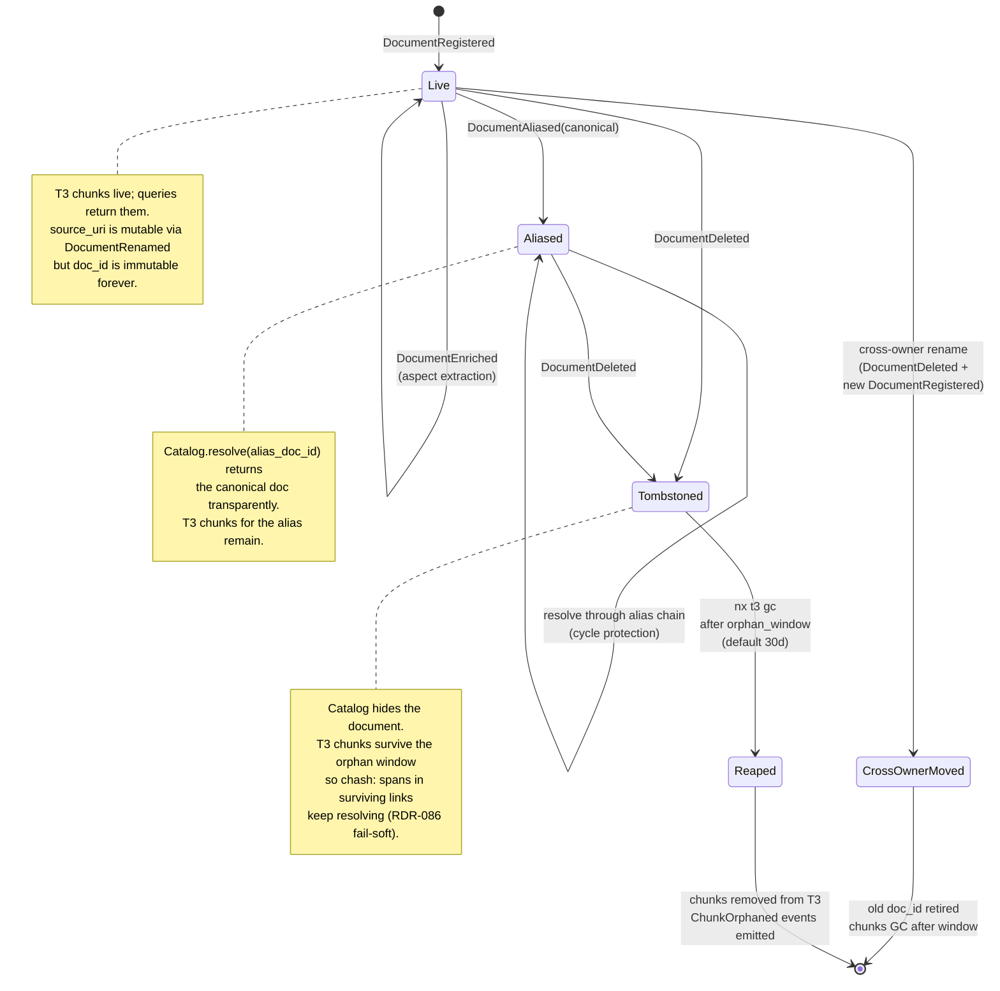
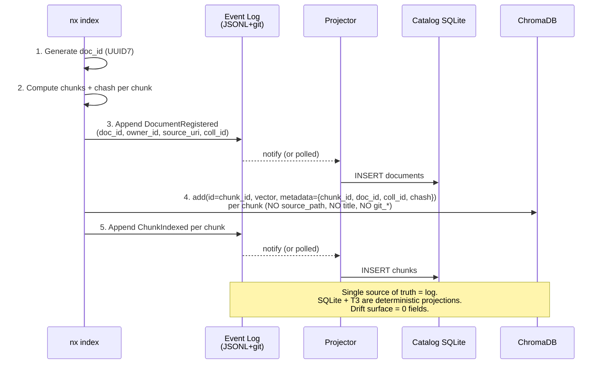
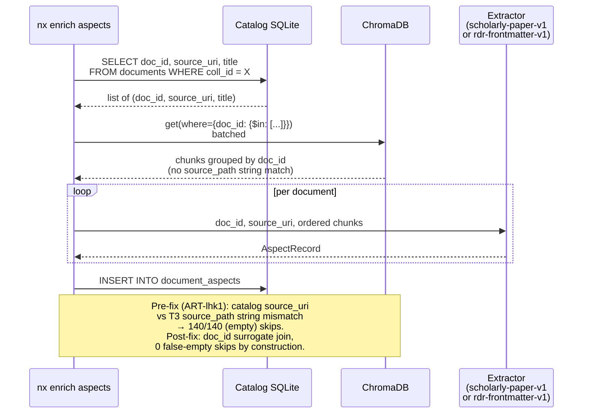
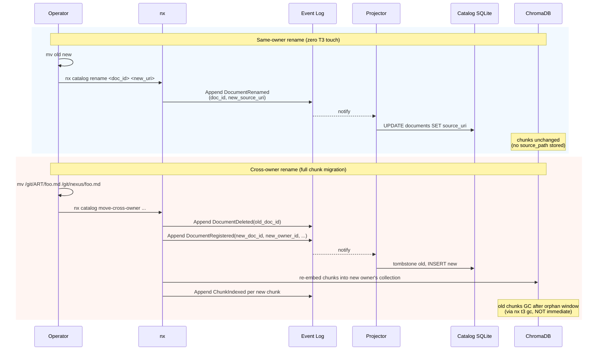
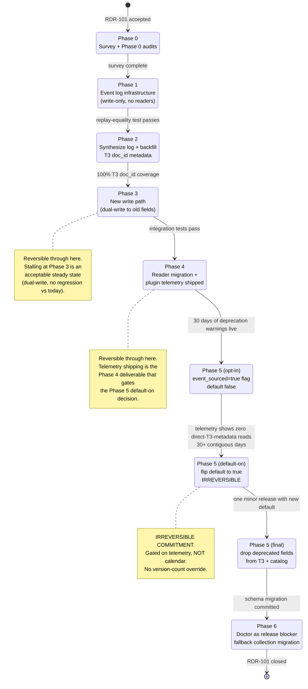

# RDR-101: Event-Sourced Catalog with Immutable Document Identity (Greenfield Catalog/T3 Architecture)

The catalog (T2: SQLite + JSONL, document-keyed) and T3 (ChromaDB Cloud, chunk-keyed) hold overlapping metadata about the same source files. When the two stores disagree on a join field, every retrieval path that joins them silently returns "empty." nexus-3e4s, ART-lhk1, nexus-v9az, and nexus-p03z were all manifestations of the same drift class. The first draft of this RDR proposed a field-ownership matrix (T3 owns `source_path`, catalog owns the rest) plus a phased migration. Substantive critique surfaced three critical gaps in that approach: `head_hash` is load-bearing for `register()` idempotency and cannot be dropped, JSONL replay reintroduces dropped columns, and the proposed `title` rename collides with already-shipped RDR-096 identity dispatch. Each is a symptom of the same root problem: when both stores hold overlapping data, any rule about "store X owns field F" creates a foreign-key without referential integrity, and any phased migration leaves the duplication surface live during the migration window.

This RDR replaces the field-ownership approach with a greenfield redesign that removes the duplication entirely. The canonical state is an append-only event log. SQLite (catalog) and T3 (vector index) are deterministic projections of the log. Documents have an immutable surrogate identity (`doc_id`) that is the only join key between the two views. The string fields that drift today (`source_path`, `source_uri`, `head_hash`, per-chunk `title`) are stored exactly once: in the log, projected to whichever view needs to read them.

This RDR is bounded to the catalog/T3 metadata architecture. It does not propose changes to: chunk-text storage, embedding model selection (beyond making model-version explicit in collection naming), the link graph schema, or any T1 store. It does propose retiring `source_path` from T3 chunk metadata and ending the persistence of file-scheme `source_uri` in the catalog `documents` row, both of which are RDR-096 contracts; this RDR partially supersedes RDR-096 on those two specific points.

## Problem Statement

### Gap 1: Drift between catalog and T3 produces silent "empty" results

Catalog and T3 both populate `source_path`/`source_uri`, `content_hash`/`head_hash`, `chunk_count`, `title`, and `indexed_at` independently at index time. The two writers compute the values from different inputs and update them through different paths thereafter. Nothing enforces equality. Every join across the boundary is a drift surface.

The 2026-04-29 incident confirmed this on the live host catalog:

- `code__ART-8c2e74c0`: 4,182 catalog rows reported `chunk_count = 0`; T3 held 63,077 chunks. The catalog hook never wrote chunk_count back. T3 had truth; catalog disagreed silently.
- `docs__ART-8c2e74c0`: 271 catalog rows had `source_uri` rooted on `/Users/.../nexus/`; the same chunks in T3 carried correct `source_path` rooted on `/Users/.../ART/`. Catalog was wrong; T3 was right. Aspect extraction reported `140/140 skipped (empty)` because the join produced no matches.
- After the cleanup, surviving catalog rows had `file_path` relative to the repo root; T3 chunks still keyed `source_path` as absolute. The chroma reader joined on string equality and returned `365/365 empty` (nexus-v9az, fixed in PR #389 with a `lookup_path` shim).

Each episode patched its own join site. None addressed the underlying invariant: the duplicated fields can drift, and the system has no structural guardrail.

### Gap 2: Field-ownership migrations cannot eliminate the drift surface

The first draft of this RDR (committed earlier in PR #404) proposed assigning each duplicated field to one store as the authority and demoting the other to a read-through cache. Substantive critique by `nx:substantive-critic` surfaced three critical gaps:

1. **Idempotency via `head_hash`** at `Catalog.register()` line 778-786: re-registration is gated by `WHERE head_hash = ? AND title = ?`. Dropping `head_hash` from the catalog disables the dedup guard. Either the field stays (violating "T3 owns it"), or the dedup is redesigned. Neither was specified.
2. **JSONL replay** at `CatalogDB.rebuild()` line 165-208: dropped columns reappear during catalog reconstruction because `_filter_fields(DocumentRecord, obj)` re-populates every declared field. The migration breaks disaster recovery.
3. **RDR-096 collision**: the proposed Phase 1 rename `title` → `chunk_title` breaks `CHROMA_IDENTITY_FIELD` dispatch for `knowledge__*` collections. RDR-096 is accepted and the rename creates an undocumented supersedes relationship.

All three are symptoms of duplication-without-referential-integrity. A phased migration that keeps duplication live during transition keeps the bug class live during transition.

### Gap 3: Asymmetric writers and updaters keep recreating the duplication

Three independent failure modes have produced overlap drift in the past 60 days:

1. **Different write paths populate independently.** The indexer writes T3 chunks first (correct `source_path` from `abs_path`); the catalog hook writes a catalog row (recomputes `source_uri` via `_normalize_source_uri` whose CWD-anchoring bug produced nexus-3e4s). The two writes are derived from the same input but through different code paths.
2. **Update operations are asymmetric.** `nx catalog update --source-uri` mutates the catalog only. There is no `nx t3 update --source-path`. Asymmetric mutation is fine if one side is a cache; it is broken if both are authoritative.
3. **Recovery operations cannot trust either side.** PR #388's `--from-t3` recovery exists because the catalog could not be reconstructed without reading T3. PR #389's `lookup_path` shim exists because T3 reads needed catalog-side path resolution. Each side reads from the other for recovery; neither is a stable source.

The only structural fix is to stop duplicating.

## Research Findings

### Identity-based join is the standard pattern

Two-store designs (vector store + metadata store) survive in production when the join key is an immutable surrogate ID, not a path string. The pattern:

- Surrogate ID assigned at creation, never reused, never derived from mutable state.
- Vector store records the ID per chunk; nothing else about the source.
- Metadata store owns lifecycle, identity, attributes; reads back to vector store via ID, never via string match.
- Renames are zero-cost (only the metadata store updates the URI).

Nexus already does this for chunk-level identity: `chunk_text_hash` (RDR-086) is content-addressed, T3 owns it, the catalog joins on `chash:<hex>` spans. The pattern works. RDR-101 generalizes it to document-level identity.

### What the cleanup proved

In every drift episode in the past 60 days, T3 was correct and the catalog was wrong. But the cause is not "T3 is structurally more reliable." The cause is that T3's `source_path` is computed once at index time from the actual filesystem path the indexer touched, while the catalog's `source_uri` is computed by a separate normalization function that has bugs. T3 is right by accident. The greenfield design removes the duplication so neither side can be wrong; the path lives in exactly one place (the event log) and is projected to one view (`documents.source_uri`).

### What an event log buys

- Deterministic projection: the SQLite catalog is reproducible from the log. Catalog rebuilding is `replay log → INSERT ... ON CONFLICT REPLACE`. Already implemented today as JSONL replay; the difference is that the log becomes typed events, not record snapshots.
- Doctor becomes deterministic: `replay log → expected state`, diff against actual SQLite + actual T3 chunk-set. Mismatches are bugs, not heuristic findings.
- Recovery is always available: as long as the log survives, the catalog and T3 can be rebuilt (T3 modulo embedding cost).
- Renames are events, not re-indexes: `DocumentRenamed(doc_id, new_uri)` updates the projection; T3 chunks are unchanged because they hold `doc_id`, not the path.
- Soft-delete + GC is structurally clean: `DocumentDeleted(doc_id)` event hides the document from the projection; chunks remain in T3 until a separate GC pass collects them by absence-of-doc-claim.

### Risks discovered during research

1. **Read amplification.** Today some operations join in SQLite without a T3 round-trip (anything that reads `entry.source_uri` for display, for example). Greenfield: T3 chunks know only `doc_id`, so any operation that needs source_uri must read the catalog projection, which is a SQLite local read. T3-side reads (e.g., aspect extraction grouping chunks by document) become `get(where={doc_id: X})` which is one indexed lookup per document, batchable.
2. **Operator opacity of T3 chunks.** Today an operator can `chromadb.get(collection, where={chunk_text_hash: X})` and see source_path. Greenfield: chunks carry doc_id only; operator must join through the catalog. Mitigation: a `nx t3 chunk-info <chash>` verb that does the join server-side.
3. **Migration of existing chunks.** ~7,500 docs and ~98K chunks on the live host catalog need doc_id assignment and T3-side metadata backfill. One-time cost; described in §Migration.
4. **Plugin marketplace assumes T3 metadata shape.** External tools that read raw T3 metadata (`source_path`, `git_*`, `title`) will not break (those fields stay during the deprecation window) but won't see new chunks the same way. Documented in §Risks.

### Resolved Open Questions

The five Open Questions enumerated below are answered here with structured findings. Full details persisted to T2 as `nexus_rdr/101-research-{1..5}`.

**RF-101-1 (Verified)**: `doc_id` uses **UUID7** (RFC 9562). Generated once at `DocumentRegistered`, opaque, embedded-timestamp sortable, no dependency on any field that can drift. Library: stdlib `uuid.uuid7()` on Python 3.14+; `uuid7-standard` package on 3.13 (NOT the older `uuid7` package, which uses pre-RFC encoding). KurrentDB, eventsourcing-python, PostgreSQL 18, and the major event-sourced-system community recommendations all converge on UUID7. Counter-argument considered: content-derived hash IDs would be reproducible during disaster recovery, but `canonical_source_uri` normalization has been proven non-deterministic in this codebase; basing `doc_id` on it would re-introduce the same fragility. Operational watch-out: clock rollback monotonicity, mitigated by compliant generator.

**RF-101-2 (Verified, updated post-remediation)**: Event log serialization is JSONL with **`{type, v, payload, ts}` envelope**. Existing JSONL records in `owners.jsonl`, `documents.jsonl`, and `links.jsonl` are projected as `v: 0` events of the matching type. The v: 0 projector path requires explicit sub-case handling (resolves substantive critique C3): tombstoned rows (`_deleted: True`) project as `DocumentRegistered + DocumentDeleted`; aliased rows (`alias_of != ""`) project as `DocumentRegistered + DocumentAliased`; empty-`source_uri` rows fall back to title-based matching for the `ChunkIndexed` doc_id assignment, with `_synthesized_orphan` tagging for unmatched chunks. Without these sub-cases the projector silently resurrects deleted documents and strips alias graphs. New writes emit `v: 1` with canonicalized payloads. Projector dispatches on `(type, v)` pairs; unknown pairs log a structured warning and skip. One-pass replay; no dual-format runtime.

**RF-101-3 (Verified, updated post-remediation)**: `DocumentDeleted` is a **tombstone event only**; T3 chunks remain in place. A separate `nx t3 gc --collection X --orphan-window 30d` verb deletes chunks whose `doc_id` no longer maps to a live document and whose `indexed_at` predates the window. Default window 30 days. **GC keys on `chunk_id`, not `chash`** (because chash is non-unique across documents per C1; a chash-keyed delete would remove identical-content chunks belonging to other live documents). `ChunkOrphaned` events are emitted **exclusively by the gc verb**, immediately before the corresponding Chroma `delete()` call; operators cannot delete T3 chunks directly (the S3 prohibition extends from catalog SQLite to T3). `chash:` spans in surviving links continue to resolve via T3 directly during the orphan window (RDR-053 stable-across-reindexing intent). Today's `T3Database.delete_by_source` (`db/t3.py:989-1002`) is the per-source primitive to extend with `delete_by_chunk_ids`.

**RF-101-4 (Verified)**: **Tumblers remain the sole user-facing identity.** `doc_id` is added as an internal SQLite projection column populated from the event log; it does not appear on the user surface (no MCP tool args, no link record fields, no RDR cross-references, no agent prompt strings, no T3 chunk metadata). `Catalog.resolve(tumbler)` stays the canonical entry point and gains `doc_id` on the returned `CatalogEntry`. `OwnerRecord.next_seq` (per-owner doc-number high-water mark, JSONL-only at `tumbler.py:143`) and the alias graph survive unchanged; aliases resolve before any `doc_id` lookup. Verified survey of 15-20 catalog API call sites + every MCP tool with a `*_tumbler` argument: replacing tumblers on the user surface would be a massive blast radius, while keeping them as user-facing is one-column-add internally.

**RF-101-5 (Probable, updated post-remediation)**: Deprecation window is **6 months minimum, measured in wall-clock time** not version count. Recent release cadence is 1.4 releases/day; counting in version numbers would compress the window to 1-2 weeks, too short for plugin authors to discover and migrate. **Plugin-marketplace telemetry shipping is now an explicit Phase 4 deliverable** (`direct_t3_metadata_read_total{field}` and `catalog_projection_read_total{field}` counters). The Phase 5 flip-default decision (4.24.x) is gated on **30+ contiguous days of zero direct-T3-metadata reads** in the target field set (`source_path`, `title`, `git_*`); there is no calendar-based override. Each phase ships independently; stalling at Phase 3 (dual-write) or Phase 4 (telemetry shipped, deprecation warnings live) is an acceptable steady state with no regression vs today. Phase 5 default-on is the only irreversible commitment.

## Proposed Solution

### Core invariants

1. **Immutable document identity.** Every document has a `doc_id` (UUID7, sortable, never reused, never derived from path). Assigned at first registration. Survives renames, file moves, content edits. Surrogate identity is the only valid join key between catalog and T3.
2. **Append-only event log is the truth.** Catalog SQLite, T3 chunk metadata, and any future T2 derived table are deterministic projections. The log is the only authoritative store; everything else is a reproducible cache.
3. **One canonical fact per attribute.** No field exists in two stores. The log holds the fact; the projection that needs it materializes it; readers query the projection that owns it.
4. **Schema-encoded collection invariants.** Collection name = `<content_type>__<owner_id>__<embedding_model>@<model_version>`. Triple-keyed. Mixed content types, mixed owners, or embedding-model swaps in place are rejected at create time.
5. **No fallback or default destinations.** Every write specifies its target collection. `docs__default`, `knowledge__knowledge`, and any other catch-all are removed.

### Entities



The same structure as a typed reference table:

```
Owner          { owner_id PK (UUID7), name, owner_type, repo_root, repo_hash, created_at }
Document       { doc_id PK (UUID7), owner_id FK, content_type, source_uri,
                 indexed_at_doc, source_mtime, alias_of FK, deleted_at }
Collection     { coll_id PK, owner_id FK, content_type, embedding_model,
                 model_version, name UNIQUE, created_at, superseded_by FK,
                 legacy_grandfathered BOOL DEFAULT FALSE }
Chunk          { chunk_id PK (Chroma's natural ID), doc_id FK, coll_id FK,
                 chash, position, content_hash, indexed_at_chunk }
                 # chash is INDEXED but NOT UNIQUE: two documents can hold
                 # the same content (quoted abstracts, repeated boilerplate,
                 # shared headers); each gets its own Chunk row pointing at
                 # its own doc_id. Span resolution uses the chash index;
                 # GC reference-counts chunks by doc_id FK.
Link           { from_doc FK, to_doc FK, link_type, span_chash, creator,
                 created_at }
Aspect         { doc_id FK, model_version, payload_json, extracted_at }
Provenance     { chunk_id FK, git_commit, git_branch, git_remote,
                 source_agent, session_id }   # RDR-087-era data, denormalized
                                              # from chunk metadata into a
                                              # separate projection. FKs the
                                              # surrogate chunk_id, not chash,
                                              # so two identical-content chunks
                                              # in different docs keep distinct
                                              # provenance.
```

The critical change: `Chunk` foreign-keys `Document.doc_id`, not `source_path`. T3 chunk metadata stores only `{chunk_id, doc_id, coll_id, position, chash, content_hash}`. No `source_path`, no `title`, no `git_*` (those move to the `Provenance` projection above, which is rebuilt from the log if needed).

**Why `chunk_id` is PK rather than `chash`** (resolves substantive critique C1): the same passage of text can legitimately appear in two distinct documents (a quoted abstract in two papers; a shared changelog header). They produce identical `chash` values. Today's T3 stores them as independent Chroma records with distinct natural IDs. The greenfield `Chunk` schema preserves that: `chunk_id` is the Chroma-assigned natural ID and the PK; `chash` is a non-unique index that supports `chash:<hex>` span resolution (RDR-086) by returning the set of `chunk_id` values whose content hashes match. GC reference-counts chunks by `doc_id` FK; deleting one document leaves the other document's chunk intact even when the chash matches.

#### Document lifecycle

The Document entity moves through a small state machine. Aliases and tombstones are first-class states, not flags-on-a-row, so the doctor can detect illegal transitions deterministically.



### Event log

Append-only JSONL. Git-managed (compacts via `git gc` over time, snapshots via periodic merge). Typed events:

```
OwnerRegistered     { owner_id, name, owner_type, repo_root, repo_hash, ts }
CollectionCreated   { coll_id, owner_id, content_type, embedding_model,
                      model_version, name, ts }
CollectionSuperseded{ old_coll_id, new_coll_id, reason, ts }
                    # also used for legacy collection rename via
                    # `nx catalog rename-collection` (Phase 6 grandfathering).
DocumentRegistered  { doc_id, owner_id, content_type, source_uri, coll_id, ts }
DocumentRenamed     { doc_id, new_source_uri, ts }
                    # SAME-OWNER renames only. Cross-owner moves
                    # (e.g. /git/ART/foo.md → /git/nexus/foo.md) MUST
                    # use DocumentDeleted + DocumentRegistered because
                    # the new location has a different owner_id and
                    # the chunks must physically move to a collection
                    # owned by the new project.
DocumentAliased     { alias_doc_id, canonical_doc_id, ts }
DocumentEnriched    { doc_id, model_version, payload, ts }
DocumentDeleted     { doc_id, reason, ts }
ChunkIndexed        { chunk_id, chash, doc_id, coll_id, position,
                      content_hash, ts }
ChunkOrphaned       { chunk_id, reason, ts }
                    # Emitted by `nx t3 gc` immediately before the
                    # corresponding Chroma `delete()` call. NOT
                    # operator-emittable directly; the GC verb is the
                    # only emitter so the event log stays the truth
                    # about which chunks exist in T3.
LinkCreated         { from_doc, to_doc, link_type, span_chash, creator, ts }
LinkDeleted         { link_id, ts }
```

The projector is a deterministic function: `events → SQLite state`. Idempotent. Re-runnable. Tested by replay-equality: any two replays of the same log produce identical SQLite.

### Collection naming and invariants

```
<content_type>__<owner_id>__<embedding_model>@<model_version>
```

Examples:
- `code__ART-8c2e74c0__voyage-3@2024-08`
- `docs__nexus-571b8edd__voyage-context-3@2024-09`
- `papers__art-curator__voyage-context-3@2024-09`

Enforced at `CollectionCreated` time:
- One owner per collection.
- One content_type per collection.
- One embedding model + version per collection.
- Owner type compatible with content_type (curator owners can hold `papers__`, `knowledge__`; repo owners can hold `code__`, `docs__`, `rdr__`).
- Re-embedding requires `CollectionSuperseded`: new collection created, all chunks re-embedded into new collection, old collection retained for read until `superseded_by` switch is committed.

### Read paths

The diagrams below visualize the four canonical flows. Operational details and edge cases follow each diagram.

#### Sequence: Index a file



#### Sequence: Aspect extraction (the original ART-lhk1 fix)



#### Sequence: File rename



#### Sequence: Doctor (deterministic drift detection)

```mermaid
sequenceDiagram
    participant Op as nx catalog doctor
    participant Log as Event Log
    participant SQL as Catalog SQLite
    participant T3 as ChromaDB

    Op->>Log: Replay all events into ephemeral state
    Log-->>Op: expected_documents, expected_chunks
    Op->>SQL: SELECT * FROM documents, chunks
    SQL-->>Op: actual_documents, actual_chunks
    Op->>Op: diff(expected, actual) → projector_drift_set
    loop per collection
        Op->>T3: get(include=[]) batched per coll_id
        T3-->>Op: actual chunk_ids in T3
        Op->>Op: diff(expected_chunk_ids, actual)<br/>→ t3_drift_set
    end
    Op->>Op: report (deterministic, no heuristics)
    Note over Op,T3: PASS = both drift sets empty.<br/>Pre-fix doctor used per-home<br/>dominance heuristic;<br/>greenfield doctor is a pure diff.
```

**Index a file** (the indexer):
1. Generate `doc_id` (UUID7).
2. Compute chunks; per chunk compute `chash`.
3. Append `DocumentRegistered(doc_id, owner_id, content_type, source_uri, coll_id)`.
4. Embed chunks; T3 write per chunk: `add(id=chunk_id, embedding=..., metadata={chunk_id, doc_id, coll_id, position, chash, content_hash})` where `chunk_id` is freshly generated at `ChunkIndexed` time (UUID7 or a deterministic `(doc_id, position)` digest; Phase 0 survey picks one). Critical: `id=chunk_id`, NOT `id=chash`. chash is non-unique across documents (C1) and would collide on identical content; chunk_id is the per-row Chroma natural ID.
5. Append one `ChunkIndexed(chash, doc_id, coll_id, position, content_hash)` per chunk.
6. Projector batches the events into SQLite.

No `source_path` in T3 metadata. No `title` per chunk (the document title lives in the catalog projection). No git_* per chunk (separate `Provenance` projection if/when needed).

**Retrieve by content** (search):
1. T3 vector search over collection X. Returns chunks with `{chash, doc_id, position}`.
2. Catalog batch lookup: `SELECT doc_id, source_uri, title FROM documents WHERE doc_id IN (...)`.
3. Compose result. No string join. No drift surface.

**Aspect extraction** (the original ART-lhk1 flow):
1. `SELECT doc_id, source_uri, title FROM documents WHERE coll_id = X` (one query, all docs in collection).
2. T3 batched fetch: `get(where={doc_id: {$in: [...]}})` returns chunks grouped by doc_id.
3. Reassemble per doc; pass to extractor. No path-string match.

**File rename (same owner)**:
1. `mv old new` on disk.
2. `DocumentRenamed(doc_id, new_source_uri)` event.
3. Projector updates `documents.source_uri`.
4. T3 chunks are unchanged (no `source_path` to update).

Today: re-index. Greenfield: one event.

**File rename (cross-owner)**: a file moves from one project's tree to another (the recent ART/nexus content cleanup is exactly this). Cross-owner moves cannot use `DocumentRenamed` because the document's `owner_id` would change and the chunks would still live in the old owner's collection, violating the one-owner-per-collection invariant. Cross-owner moves emit `DocumentDeleted(old_doc_id)` followed by `DocumentRegistered(new_doc_id, new_owner_id, ...)` and re-embed into a collection owned by the new project. Chunks in the old collection GC normally via the orphan window. The new doc gets a fresh UUID7; the old doc_id is preserved in the event log for audit. Rationale: the chunks need to physically move to a different Chroma collection anyway, so the migration cost is the same as a re-index from scratch.

**Re-index unchanged file** (idempotency):
1. Compute `chash` per chunk.
2. Catalog query: `SELECT doc_id FROM documents WHERE source_uri = ?`. If found, reuse the doc_id; else generate new UUID7.
3. T3 query: `get(where={chash: X, doc_id: <this_doc>})` returns existing chunk for THIS document if any. If found, skip the embedding cost; else `add(chunk_id=..., metadata={chash, doc_id, ...})`. The `doc_id` filter is essential because chash is non-unique across documents (substantive critique C1): a chash hit for a different doc_id is not a dedup match, it is a coincidence.

The dedup guard does not need `head_hash` on the catalog. It uses `source_uri` lookup for document identity (catalog-only) and `chash` lookup for chunk identity (T3-only). Each guard runs against the store that owns the field. No duplication.

**`nx catalog doctor`**:
- Replay log into ephemeral expected-state. Diff against actual SQLite. Any mismatch = projector bug or out-of-band SQLite mutation.
- For each document in catalog: T3 `get(where={doc_id: X}, include=[])` returns chunk count + chash list. Diff against `ChunkIndexed` events for that doc_id. Mismatches = T3 GC drift or missing-write.
- Deterministic. No "single home looks clean by majority" heuristic.

### Provenance projection (fields removed from T3 chunks)

T3 chunk metadata today carries `git_project_name`, `git_branch`, `git_commit_hash`, `git_remote_url`, `git_meta`, `source_agent`, `session_id`, `embedded_at`, `frecency_score`, `expires_at`, `tags`, `category`, `section_type`, `section_title`, `chunk_index`, `line_start`, `line_end`, `chunk_start_char`, `chunk_end_char`, `chunk_count`, `corpus`, `store_type`, `ttl_days`. The greenfield design retains:

- **On the chunk** (T3): `chash`, `doc_id`, `coll_id`, `position`, `content_hash`, `embedded_at`. Plus per-chunk position fields (`line_start`, `line_end`, `chunk_start_char`, `chunk_end_char`) since these are intrinsic to the chunk's identity within a document.
- **In the Provenance projection** (T2): `chash` FK, git fields, source_agent, session_id. Computed by the projector from `ChunkIndexed` events that carry the provenance payload. T2 SQLite, indexed by chash.
- **In the Document projection**: title, source_uri, content_type, indexed_at_doc, source_mtime. From `DocumentRegistered` and `DocumentRenamed` events.
- **Removed entirely**: `corpus`, `store_type`, `category`, `tags`, `frecency_score`, `expires_at`, `ttl_days`, `chunk_count` (computed via `COUNT` on the projection), per-chunk `title`. Replaced by their canonical homes (collection name encodes corpus/store_type; frecency lives in T2 frecency table; chunk_count is `COUNT` over chunks).

### Migration from current state

The greenfield design is not an alternate universe; it is a concrete migration path from the existing host catalog, executed once.

**Phase 1: synthesize the event log from existing state.**
- Walk the catalog `documents` table. For each row:
  - **Live row** (`_deleted == False` AND `alias_of == ""`): emit `DocumentRegistered(doc_id, ...)` with a fresh UUID7.
  - **Tombstoned row** (`_deleted == True`): emit `DocumentRegistered` (the document existed) followed by `DocumentDeleted(doc_id, reason="synthesized_from_tombstone")`. Without this explicit handling, the v: 0 projector path silently resurrects deleted documents because `_filter_fields(DocumentRecord, obj)` passes `_deleted: True` straight through to the dataclass and the projector has no tombstone awareness (resolves substantive critique C3).
  - **Aliased row** (`alias_of != ""`): emit `DocumentRegistered(doc_id, ...)` for the alias, then `DocumentAliased(alias_doc_id, canonical_doc_id)`. Without this, the alias graph is silently flattened during synthesis.
- Walk T3 chunks; emit one `ChunkIndexed` event per chunk, mapping `source_path` → newly-assigned `doc_id` via the catalog row's `source_uri`.
  - **Empty-`source_uri` rows** (legacy paper rows, manually-registered documents that the cleanup intentionally left URI-less): match on catalog `title` instead via the same fallback `aspect_readers.py:CHROMA_IDENTITY_FIELD` uses today for `knowledge__*`. If neither `source_uri` nor `title` matches, emit `ChunkIndexed` with `doc_id=NULL` and a `_synthesized_orphan: true` tag so the doctor reports them rather than silently GC'ing them after the orphan window. Operator runs `nx catalog repair-orphan-chunks` to assign manually before Phase 2 enables the GC.
- Synthesized events are tagged `_synthesized: true` so the doctor can distinguish them from native writes.
- Output: a complete event log that reproduces the current catalog and T3 state, including tombstones and aliases.

**Phase 2: backfill T3 chunks with `doc_id` metadata.**
- One-time `ChromaDB.update()` per chunk: add `doc_id` to metadata. Other fields stay (deprecation window).
- Idempotent; can be re-run.
- Live verification: every chunk's `doc_id` resolves in the catalog; every catalog row's chunks all carry the right `doc_id`. Orphan chunks (the `_synthesized_orphan` set from Phase 1) are reported but not assigned; operator either repairs them or accepts they will GC after the orphan window.

**Phase 3: ship the new write path.**
- Indexer writes events to the log (new path). Projector projects to SQLite. T3 writes use `doc_id` metadata only on new chunks.
- Old code paths (the `register()` / `update()` API on `Catalog`) become projector-internal only. External callers go through event-emitter helpers.
- Old T3 metadata fields (`source_path`, `title`, `git_*`) are still written during deprecation, marked `__deprecated__` in the metadata schema, removed in Phase 5.
- **Direct writes to the catalog SQLite outside the projector are prohibited from Phase 3 onward** (resolves substantive critique S3). The doctor's replay-equality signal is reliable only if the event log is the only write path. Incident-response repairs (the kind that used `cat._db.execute(...)` during nexus-3e4s cleanup) must go through new event-emitter helpers (`nx catalog repair <verb>`); existing repair scripts are rewritten or retired in this phase.

**Phase 4: switch readers to projection-based queries.**
- All call sites that read `entry.source_uri`, `entry.head_hash`, `entry.chunk_count` continue to work (the projection still has these fields). The Phase 3 new write path continues to populate them as a write-through cache during Phase 3-4 so readers see live values, not stale pre-Phase-3 snapshots; Phase 5 stops the write-through and the columns become projection-only.
- Call sites that read T3 metadata directly (`source_path`, per-chunk `title`) migrate to use `doc_id` joins. Timeline: one minor release.
- **`aspect_readers.py:CHROMA_IDENTITY_FIELD` is rewritten to `doc_id`-keyed dispatch** (resolves substantive critique C2). Pre-fix the dispatch maps `knowledge__* → ("source_path", "title")` and similar; Phase 5 removes both fields from T3 metadata and the dispatch would silently return empty for every document (the exact ART-lhk1 failure mode, structurally reproduced). Replacement: dispatch on `doc_id` for every collection prefix, and `_identity_fields_for()` returns `("doc_id",)` uniformly. Aspect extraction joins via `get(where={doc_id: {$in: [...]}})` grouped by doc_id, not by string match. Plumbing change: extract_aspects accepts a `doc_id_lookup` callable (catalog projection) and passes it to the chroma reader.
- Phase 4 is incomplete until `aspect_readers.py`, `_identity_fields_for()`, and `extract_aspects` all join via `doc_id`. Test gate: `nx enrich aspects <coll> --dry-run` reports zero `(empty)` skips on a collection where every document has at least one chunk.

**Phase 5: remove the deprecated fields.**
- T3 metadata schema: remove `source_path`, per-chunk `title`, `git_*`, `corpus`, `store_type`, etc. New chunks written without them.
- **`metadata_schema.py:ALLOWED_TOP_LEVEL` and `make_chunk_metadata()` factory updated to drop the deprecated keys.** Without this update, `validate()` continues to pass dicts carrying the removed fields and `make_chunk_metadata()` continues to emit them; the migration is incomplete. Phase 5 PR includes both the schema removal and the factory signature change.
- Backfill: T3 `update` to strip deprecated metadata from existing chunks (one-time, opt-in via `nx t3 strip-deprecated-metadata --collection X`).
- Catalog SQLite: drop `head_hash` (replaced by `(coll_id, chash)` lookup against the Chunk projection for register-time idempotency), `chunk_count` (computed via `SELECT COUNT(*) FROM chunks WHERE doc_id = ?`), file-scheme `source_uri` (still the projection of `DocumentRegistered`, but no longer mutable via `nx catalog update`). Non-file-scheme `source_uri` stays.

**Phase 6: enforce invariants.**
- `nx catalog doctor` becomes the canonical drift check. Cron-scheduled or pre-commit-gated, not operator-invoked.
- Collection naming validation rejects non-conforming names **at create time only**; existing legacy collections (`code__ART-8c2e74c0`, `docs__nexus-571b8edd`, `knowledge__knowledge`, `docs__default`, etc.) are grandfathered with `Collection.legacy_grandfathered = TRUE` (resolves substantive critique S1). Operators can opt into renaming via `nx catalog rename-collection <old> <new>`, which emits a `CollectionSuperseded` event and triggers a background Chroma re-create + re-embed job. Failing-loud at read time on legacy names is rejected as operationally hostile. The grandfathered set is enumerable (`nx catalog list --legacy`) and shrinkable over time but never mandatorily renamed.
- **Default fallback collections (`docs__default`, `knowledge__knowledge`) are migrated, not deleted.** Phase 6 ships `nx catalog migrate-fallback --dry-run` that walks each fallback collection's documents and proposes a target collection per document (best guess: owner of the source path's repo, content_type from the doc). Operator reviews the proposal and applies it; per-document `DocumentRenamed` (same owner) or `DocumentDeleted + DocumentRegistered` (cross-owner) events execute the migration. Fallback collections are deprecated only after they go to zero rows, never silently nuked.
- `cat.update()` for replaced fields raises `DeprecatedAPIError`.

The migration is reversible through Phase 4. Phases 5 and 6 are the irreversible commitments and are gated on Phase 4 + doctor having run cleanly across all collections for one minor release.

## Risks and Mitigations

| Risk | Mitigation |
|---|---|
| Read amplification on join paths | Projection is local SQLite; reads are sub-millisecond. T3 reads use indexed `where={doc_id: ...}` lookups, which are indexed. Batched in operations that touch many chunks. |
| ChromaDB Cloud quota cost on `doc_id` lookups | Same cost as today's `source_path` lookups (both are `where=` indexed scans). The 300/page limit applies equally. No regression. |
| External tools reading raw T3 metadata break | Phase 5 is the irreversible step; gated on a published deprecation notice. `source_path` and `title` remain populated through Phase 4 (one minor release). Phase 5 ships behind opt-in flag for one more release before removal. |
| Migration breaks if T3 unavailable mid-flight | Phase 1 is read-only; Phase 2 is idempotent; Phase 3 onward writes new state alongside old. T3 outages are recoverable; the log is the truth. |
| Plugin marketplace consumers assume current shape | Plugin manifest gains a `metadata_schema_version` field. Phase 5 bumps the major; old plugins continue to read the deprecated fields until they migrate. Plugin authors get one release cycle. |
| UUID7 doc_ids are opaque to humans | Tumbler addressing (1.X.Y) stays as the human-facing identity; tumbler maps to doc_id via the catalog. Tumblers are addressable; doc_ids are stored. |
| Event log grows unbounded | Periodic compaction merges events into snapshots. Compaction is itself an event (`SnapshotCreated(at_offset, state)`); subsequent replays start from the snapshot. Pattern already used in catalog JSONL today. |
| Existing scripts that mutate catalog directly | Phase 4 deprecation logs every direct mutation. Phase 5 removes the mutation methods. Migration window is one minor release. |
| Aspect extraction and link audit need to know about doc_id | Both already have access via the catalog. The change is internal; their public API is unaffected. |
| Recovery requires the event log | If both catalog SQLite and event log are lost, the system cannot self-recover. Mitigation: the log is git-managed, replicated wherever the catalog repo is replicated, and survives the same failure modes as the JSONL log today. |
| RDR-096 supersedes (file-scheme source_uri persistence and per-chunk title field) | Documented as `supersedes_partial: [RDR-096]` in frontmatter. RDR-096's URI-scheme allowlist and non-file-scheme persistence (chroma://, https://, x-devonthink-item://) are retained; only the file-scheme persistence and per-chunk title field are superseded. |

## Implementation Plan

The plan is six phases. Each phase is one or more PRs. Beads filed at acceptance, not at draft.



### Phase 0: Acceptance and survey

- [ ] Land RDR-101 with this design.
- [ ] Survey downstream callers of `entry.source_uri`, `entry.head_hash`, `entry.chunk_count`, `entry.title` across the codebase. Document which are read-only (safe through Phase 4) vs which mutate (need migration in Phase 3).
- [ ] Survey direct T3 metadata access in plugins, MCP tools, and operator scripts. Document which fields are read.
- [ ] **Field-by-field disposition audit.** Enumerate every key currently in `metadata_schema.py:ALLOWED_TOP_LEVEL` (~30 keys). For each, decide one of: stays on chunk (intrinsic chunk position), moves to `Document` projection (per-doc fact), moves to `Provenance` projection (git/session), moves to a new `Frecency` projection (heat/decay), removed entirely (cargo data). Specifically include: `frecency_score`, `tags`, `category`, `chunk_index`, `chunk_count`, `corpus`, `store_type`, `ttl_days`, `expires_at`, `section_type`, `section_title`, `embedded_at`, all `git_*` fields, and `bib_semantic_scholar_id`.
- [ ] **`bib_semantic_scholar_id` migration plan.** This field is the load-bearing "this title was enriched" marker (`metadata_schema.py:80-81`). Its disposition determines whether `commands/enrich.py`'s skip logic queries the catalog (new home) or T3 (current home); pick one before Phase 3.
- [ ] **RDR-086 `chash_index` `doc_id` column rename.** RDR-086's T2 `chash_index` table uses `doc_id` to mean "ChromaDB-scoped chunk identifier"; RDR-101's new `Document.doc_id` is a UUID7 document identity. Same column name, different semantics. Phase 0 picks: rename the RDR-086 column (`chunk_chroma_id` or similar) before Phase 3 OR document the dual usage in the chash_index schema comment. Pick one; do not let the collision survive into Phase 3.
- [ ] **`chunk_id` generation rule.** Decide whether `chunk_id` is a fresh UUID7 at `ChunkIndexed` time (opaque, decoupled from content) or a deterministic digest of `(doc_id, position)` (reproducible across re-runs, encodes structure). UUID7 lean for parallel with `doc_id` design; deterministic-digest considered if Phase 1 synthesis needs a stable mapping from existing T3 Chroma natural IDs.
- [ ] File a post-mortem under `docs/rdr/post-mortem/` for nexus-3e4s referencing this RDR as the systemic fix.
- [ ] Resolve open questions §below.

### Phase 1: Event log infrastructure (write-only, no readers)

- [ ] Define event types as Pydantic / dataclass schemas in `src/nexus/catalog/events.py`.
- [ ] Implement append-only writer (JSONL) with the same locking + git-managed durability as today's JSONL.
- [ ] Implement projector: `events → SQLite state`. Tested by replay-equality: replay the existing JSONL synthesized as events should produce the existing SQLite state.
- [ ] Doctor verb (`nx catalog doctor --replay-equality`) confirms the projector is deterministic against the live catalog.
- [ ] No production write path changes yet.

### Phase 2: Synthesize log from existing state, backfill T3 with doc_id

- [ ] Walk existing catalog `documents` table; emit `DocumentRegistered` events with synthesized `doc_id` (UUID7); cross-reference catalog `tumbler` for human-addressable mapping.
- [ ] Walk T3 chunks; emit `ChunkIndexed` events; map `source_path` → `doc_id` via catalog `source_uri`.
- [ ] T3 metadata backfill: per chunk, `update(metadata={doc_id: X, ...existing})`. Idempotent.
- [ ] Verify: `nx catalog doctor --t3-doc-id-coverage` reports 100% coverage on all collections.
- [ ] Reversible: stop here and the existing system continues to work; the log is shadow.

### Phase 3: New write path

- [ ] Indexer writes events to log; projector emits SQLite + T3 writes.
- [ ] Catalog `register()` / `update()` become projector-internal helpers; external callers use `events.append(DocumentRegistered(...))` etc.
- [ ] T3 writes carry `doc_id` metadata; deprecated fields (`source_path`, `title`, `git_*`) still written during this phase for back-compat.
- [ ] All tests pass with the new path; integration test confirms event log replay produces the same state as direct mutation.

### Phase 4: Reader migration

- [ ] Code audit: every call site that reads T3 chunk metadata directly. Migrate to `doc_id` joins.
- [ ] **`aspect_readers.py:CHROMA_IDENTITY_FIELD` rewritten to `doc_id`-keyed dispatch**; `_identity_fields_for()` returns `("doc_id",)` uniformly across collection prefixes (resolves substantive critique C2). Without this, Phase 5's removal of `source_path` and `title` from T3 metadata produces empty results for every aspect-extraction query, structurally reproducing the original ART-lhk1 failure.
- [ ] Aspect extraction (`extract_aspects`, `_dry_run_predict_skips`) joins via `doc_id`, not `source_path`. Test gate: `nx enrich aspects <coll> --dry-run` reports zero `(empty)` skips.
- [ ] Link audit (`nx catalog link-audit`), backfill verbs, doctor, all use the projection.
- [ ] **Plugin-marketplace telemetry shipped** (resolves substantive critique RF-5 dependency): counters at the T3 metadata read boundary (`direct_t3_metadata_read_total{field}`) and at the catalog projection boundary (`catalog_projection_read_total{field}`). The flip-default decision in Phase 5 depends on this telemetry showing zero direct-T3-metadata reads in the target field set.
- [ ] Plugin marketplace announcement: deprecation notice for direct T3 metadata access. One minor release minimum, 30 days wall-clock minimum.

### Phase 5: Remove deprecated surface (irreversible)

- [ ] Gate behind `[catalog].event_sourced = true` config flag. Default false for one minor release minimum, 30 days wall-clock minimum.
- [ ] T3 schema: remove `source_path`, per-chunk `title`, `git_*`, `corpus`, `store_type` from new chunks. Backfill verb (`nx t3 strip-deprecated-metadata`) for existing chunks; opt-in.
- [ ] **`metadata_schema.py:ALLOWED_TOP_LEVEL` updated to drop the deprecated keys.** **`make_chunk_metadata()` factory signature updated** to no longer accept the dropped keys. Without these two updates the `validate()` guard continues to pass dicts carrying the removed fields and the factory continues to emit them; the migration is incomplete (resolves substantive critique observation O1).
- [ ] Catalog schema: drop `head_hash`, `chunk_count` columns; file-scheme `source_uri` becomes a projection-only field (read-only). `register()` idempotency guard rewritten to query `(coll_id, chash, doc_id)` against the Chunk projection rather than `head_hash + title`.
- [ ] `cat.update()` for any of the removed fields raises `DeprecatedAPIError`.
- [ ] Flip default to `event_sourced = true` after one release with the flag enabled, gated on telemetry from Phase 4 confirming zero direct-T3-metadata reads.

### Phase 6: Enforcement

- [ ] `nx catalog doctor` becomes part of the standard release shakedown; reported drift is a release blocker.
- [ ] Collection naming validation rejects non-conforming collection names **at create time only**. Existing legacy collections grandfathered via `Collection.legacy_grandfathered = TRUE`; opt-in rename available via `nx catalog rename-collection <old> <new>` which emits `CollectionSuperseded` and triggers a Chroma re-create + re-embed in the background. Failing-loud at read time on legacy names is rejected as operationally hostile.
- [ ] Schema-encoded invariants (one owner per collection, one content_type, one embedding_model) enforced at write time on new collections only.
- [ ] **Fallback collection migration** (`docs__default`, `knowledge__knowledge`): `nx catalog migrate-fallback --dry-run` walks each fallback collection's documents and proposes a target collection per document. Operator reviews and applies; per-document `DocumentRenamed` (same owner) or `DocumentDeleted + DocumentRegistered` (cross-owner) events execute the migration. Fallback collections are deprecated only after they go to zero rows, never silently nuked.

## Out of Scope

- T1 (session scratch) and T1-to-T2 promotion: separate RDR territory.
- Plan library / plan_match (RDR-091 etc.): unaffected.
- Embedding model selection per collection: a separate concern; this RDR only requires that model + version are encoded in the collection name.
- Multi-tenancy beyond owner-scoped collections: existing patterns continue.
- Knowledge graph / link-graph schema: links keep their existing shape; only the `from_doc` and `to_doc` references change from tumbler-based to doc_id-based, and tumblers remain a stable user-facing reference.
- Aspect extraction config (RDR-089): unchanged. Aspect rows in T2 gain `doc_id` FK; existing `source_path` column becomes a projection.
- Search / retrieval ranking: unchanged.
- Plugin manifest schema: gets a `metadata_schema_version` field but otherwise unchanged.

## Open Questions

All five questions are RESOLVED. See §Resolved Open Questions above for the binding answers (RF-101-1 through RF-101-5). Full research bodies persisted to T2 as `nexus_rdr/101-research-{1..5}`. The original question text is retained below for historical context.

1. **What identity scheme for `doc_id`?** Three candidates: (a) UUID7 (sortable, opaque, 16 bytes); (b) a content-derived hash of the canonical URI + creation timestamp (deterministic, surveyable); (c) keep tumblers as primary key with an internal sortable ID. Trade-offs: opacity vs reproducibility vs human-friendliness. Lean: UUID7 with tumbler addressing as a separate human-facing identity that resolves through the catalog.

2. **How are events serialized in the log?** Today's JSONL uses dataclass `__dict__` serialization. Greenfield events should be versioned (event schema migrations) and self-describing (`event_type`, `event_version`, `payload`). Concretely: protobuf-shaped JSON, or msgpack, or stick with JSONL. Preference: JSONL with per-event `type` + `v` fields; allows schema evolution via projector dispatch.

3. **What is the semantics of `DocumentDeleted` for chunks?** Today soft-delete tombstones the catalog row; chunks remain in T3. Greenfield: `DocumentDeleted` event hides the document from the projection. Are chunks GC'd immediately (no, breaks span resolution for orphan links), GC'd on a schedule (yes, via a `ChunkOrphaned` event), or never (no, T3 grows unbounded)? Lean: GC on schedule, opt-in per collection, with an `nx t3 gc --dry-run` operator verb.

4. **How are existing tumblers preserved across the migration?** Today tumblers are `1.X.Y` where X is owner and Y is per-owner sequence. Greenfield doc_ids are UUID7. The mapping `tumbler → doc_id` lives in the catalog; tumbler addressing continues to work. Question: do we keep tumblers as the canonical user-facing identity (with doc_id as internal storage), or migrate users to doc_ids? Preference: keep tumblers as user-facing; doc_id is internal.

5. **What is the deprecation window for plugin marketplace consumers?** Phase 5 removes `source_path` and per-chunk `title` from T3 metadata. External plugins that read these fields will break. One minor release seems short; two seems excessive. Concretely: 4.21.0 ships event log + dual-write (Phase 1-3); 4.22.0 ships reader migration + deprecation warnings (Phase 4); 4.23.0 ships behind opt-in flag (Phase 5); 4.24.0 flips default. Total: four minor releases. Confirm timeline.
