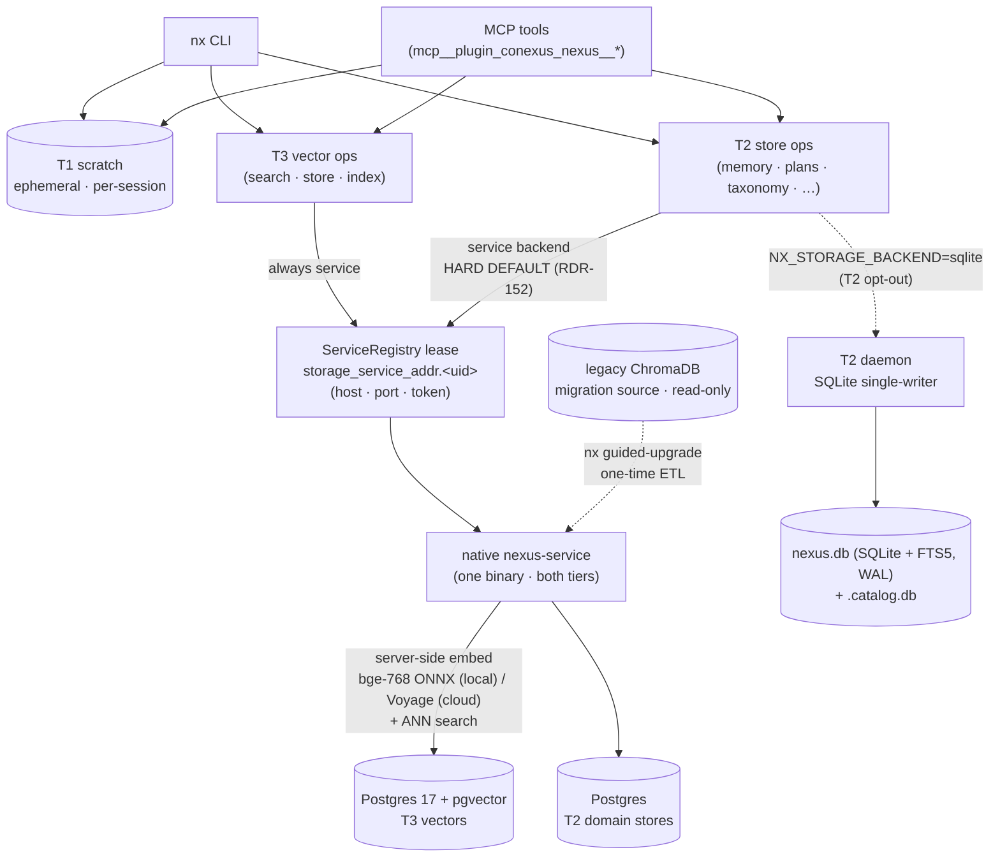

# Storage Tiers

Nexus organizes data across three tiers with increasing durability. Data flows upward (T1 → T2 → T3).

**Two access paths**: Humans use the `nx` CLI. Agents use MCP tools (`mcp__plugin_conexus_nexus__*`) which call the same Python APIs directly — no Bash dependency. MCP tools that return lists (`search`, `store_list`, `memory_search`) are paged — pass `offset=N` for subsequent pages. See [conexus/README.md](../conexus/README.md#mcp-servers) for MCP tool details.

**One arbitrator per tier**: Since conexus 4.34.0 (RDR-120), T2 is wrapped in a dedicated daemon process; since RDR-155, T3 serving routes through the native nexus-service (Postgres 17 + pgvector). Every consumer — host CLI, the MCP server, multiple Claude Code sessions, Claude Cowork agents (via SDK transport), dev containers — routes through the same arbitrator, so the underlying SQLite instance has exactly one writer and all vector traffic goes through one service. Start the T2 daemon once via `nx daemon t2 install --autostart`, and the storage service via `nx daemon service start`; the Claude Code plugin's SessionStart hook also auto-spawns the T2 daemon on each session start.

| Tier | Storage | Arbitrator | Transport | Durability | Use |
|------|---------|------------|-----------|------------|-----|
| T1 -- scratch | ChromaDB EphemeralClient / per-session HTTP server | none | Process-local | Session only | Working notes, hypotheses |
| T2 -- memory | SQLite + FTS5 (WAL) | T2 daemon (`nx daemon t2`) | UDS + 127.0.0.1 loopback | Survives restarts | Per-project notes, session context |
| T3 -- knowledge | Postgres 17 + pgvector behind the native nexus-service (both modes); embedding server-side (bge-768 local / Voyage managed-cloud) | storage-service supervisor (`nx daemon service`) | nexus-service HTTP `/v1/vectors` (`NX_SERVICE_URL` + `NX_SERVICE_TOKEN`) | Permanent | Semantic search, indexed code/docs |
| Catalog | T2-store-backed (ninth domain store, separate `.catalog.db`; RDR-120 P5.A) + events.jsonl (canonical) | shared with T2 daemon | UDS + 127.0.0.1 loopback | Permanent | Document registry, typed link graph, provenance |

The catalog sits alongside T3 as a metadata layer. While T3 stores document *content* as embeddings, the catalog stores document *metadata* and *relationships*. See [Document Catalog](catalog.md).

### Storage / service-stack architecture

How the access paths reach each substrate today (post-RDR-155). Both T3 and (by hard default) T2 serve through the one native `nexus-service`; SQLite is the T2 opt-out; ChromaDB survives only as the read-only migration source.



(The [reference architecture diagram](architecture-diagram.svg) covers the *retrieval / planning* layer — query decomposition, the operator DAG, taxonomy, the knowledge graph — which is substrate-agnostic; the diagram above is its storage-plane complement.)

## Progressive Formalization (RDR-057)

Nexus treats the three tiers as stages in a progression, not independent
silos. An idea enters at T1 as a working hypothesis, is promoted to T2
when it outlives the session, and is promoted to T3 when it becomes
institutional knowledge. Several RDR-057 features work together to make
this progression observable and to reward information that proves useful
over time:

- **Access tracking** on T1 and T2 — every successful read bumps
  `access_count` and `last_accessed`, so the system can see which entries
  actually get used.
- **Heat-weighted TTL** on T2 — frequently-accessed notes survive longer
  than their nominal TTL. The formula is
  `effective_ttl = base_ttl * (1 + log(access_count + 1))`. See
  [Configuration § Heat-Weighted T2 Expiry](configuration.md#heat-weighted-t2-expiry).
- **`PromotionReport`** on `nx scratch promote` and `T1.promote()` — the
  promotion result reports `action=new` when the T2 destination is clean
  or `action=overlap_detected` when an FTS5 scan finds a similar entry
  under a different title. The promoted row is still written; the report
  only signals that a manual merge may be warranted.
- **Contradiction flagging** during T3 search — `search_cross_corpus`
  adds `[CONTRADICTS ANOTHER RESULT]` to any result pair where two
  high-similarity chunks come from different `source_agent` provenance,
  surfacing inconsistencies for human review. Default-on; opt out via
  `search.contradiction_check: false`. See
  [Querying Guide § Contradiction detection](querying-guide.md#contradiction-detection-rdr-057-phase-3a).
- **`formalizes` catalog link type** — when a higher-abstraction
  representation (extracted entities, RDF triples, structured notes) is
  derived from a raw text chunk, link the two with type `formalizes` so
  the multi-representation relationship is explicit in the graph. See
  [Document Catalog § Link Types](catalog.md#link-types).

Together these features let Nexus reward useful information without
rigidly deleting the rest: frequently-read entries stick around, the
promotion path from scratch to memory to knowledge is auditable, and
contradictory claims bubble up during retrieval instead of silently
coexisting.

## T1 -- Session Scratch

Backed by a per-session `chromadb.HttpClient` connecting to a ChromaDB server process started by the `SessionStart` hook. Uses `DefaultEmbeddingFunction` (MiniLM-L6-v2, local ONNX). No API keys required.

When a parent Claude Code session starts, the MCP server's chroma lifespan launches a ChromaDB server on a free localhost port and publishes a **leased registry record** at `~/.config/nexus/t1_addr.<session_id>` (RDR-149 P4, via `daemon/t1_lease.py`). The record is keyed on the Claude session-id; both the publisher and any sibling resolve the same session-id from `~/.config/nexus/current_session`, so child agents and Bash-tool siblings discover and connect to the same server — they share scratch space and see each other's entries. Liveness is lease freshness (TTL), not pid, giving pid-reuse immunity. Concurrent independent Claude Code windows stay isolated because each has its own session-id (the scope key is intentionally N-per-user).

Falls back to a local `EphemeralClient` only under an explicit `NX_T1_ISOLATED=1` opt-in; otherwise a process that resolves no session-id (or finds no live lease) raises `T1ServerNotFoundError`. MCP-dispatched subprocesses inherit the endpoint via `NX_T1_HOST`/`NX_T1_PORT` (env passdown).

Everything is wiped at session end: the `SessionEnd` hook stops the ChromaDB server and deletes the backing tmpdir. Use `nx scratch flag` to mark items for auto-promotion to T2 when the session closes.

**Access tracking (RDR-057)**: Every `T1.get()` and `T1.search()` hit increments `access_count` and updates `last_accessed` on the returned entries (stored as ChromaDB metadata — schemaless, no migration). The counts feed the progressive formalization tier model but do not drive expiry at T1 (T1 is wiped at session end regardless).

**Use for**: working hypotheses, temporary notes, in-flight analysis shared across spawned agents.

## T2 -- Memory Bank

A local SQLite database. Every entry has a project, a title, and content — like a flat filesystem where project is the directory and title is the filename. Entries can have tags and an optional TTL. FTS5 provides keyword search with no API call. Stored at `~/.config/nexus/memory.db`.

T2 is the persistent local layer that bridges sessions. Notes, project state, and agent relay context survive restarts here. Different usage patterns share the same simple model:

- **Developer notes** — hypotheses, findings, decisions-in-progress via `nx memory put`
- **Project memory** — design notes, working state, active decisions. Store with `nx memory put`, retrieve with `nx memory get`. 
- **RDR metadata** — status, type, priority, dates for each RDR document. See [RDR: Nexus Integration](rdr.md#nexus-integration).
- **Plan library** — saved query execution plans with project scoping, FTS5 search, dimensional identity (`verb`, `scope`, `strategy` + optional axes), and optional TTL. Fourteen builtin templates are seeded at `nx catalog setup` (5 legacy + 9 RDR-078 scenario plans for `verb: research` / `review` / `analyze` / `debug` / `document` + 4 meta-seeds). Access via `plan_save` / `plan_search` MCP tools, or indirectly via `nx_answer` (the retrieval trunk — see [Plan-Centric Retrieval](plan-centric-retrieval.md)). Note: auto-growth of the library from successful ad-hoc plans is filed as RDR-084 (draft, not yet implemented) — today the library stays at the 14 seed templates plus any manually-authored YAMLs.
- **Agent relay** — context passed between agent invocations
- **Promoted scratch** — T1 entries flagged during a session are auto-flushed to T2 at session end

Data is organized by project via the `--project` flag. TTL values: `30d`, `4w`, or permanent. Default is `30d` for developer notes.

**Heat-weighted expiry (RDR-057 Phase 2a)**: T2 `access_count` and `last_accessed` columns track usage. Effective TTL becomes `base_ttl * (1 + log(access_count + 1))` — frequently-accessed entries survive longer. See [Configuration — Heat-Weighted T2 Expiry](configuration.md#heat-weighted-t2-expiry).

> **Note (RDR-063 interaction)**: Under sustained concurrent cross-domain write load (e.g. a large `nx index repo` run generating dense telemetry writes while an agent is actively using memory), the access-count increment inside `memory.search` and `memory.get` is a best-effort side-effect. If the write leg cannot acquire the SQLite write lock immediately, the counter update is skipped and logged at warning as `memory.access_tracking.skipped`. In practice this drops roughly 5–10% of increments during heavy indexing. Heat-weighted TTL is therefore approximate: heavily-accessed entries may accumulate slightly lower `access_count` values than their true read frequency would suggest, which modestly compresses their effective TTL. The trade-off is an intentional Phase 2 choice — keeping search/get latency stable under load is worth the loss of a fraction of statistical signal.

**Consolidation (RDR-061 E6)**: `memory_consolidate` MCP tool provides three hygiene operations to manage T2 growth over time:

```python
# Find overlapping pairs (Jaccard > 0.7)
memory_consolidate(action="find-overlaps", project="myrepo")

# Flag entries not accessed in 30+ days
memory_consolidate(action="flag-stale", project="myrepo", idle_days=30)

# Preview a merge (dry run)
memory_consolidate(action="merge", project="myrepo",
    keep_id=42, delete_ids="43", merged_content="...", dry_run=True)

# Execute single-entry merge (no confirm required)
memory_consolidate(action="merge", project="myrepo",
    keep_id=42, delete_ids="43", merged_content="...")

# Multi-entry merge (confirm required)
memory_consolidate(action="merge", project="myrepo",
    keep_id=42, delete_ids="43,44,45", merged_content="...",
    confirm_destructive=True)
```

Merges use SQLite's write lock via `with self.conn:` to ensure UPDATE and DELETE are atomic. If `keep_id` was deleted by a concurrent `expire()` call, the merge raises `KeyError` and `delete_ids` survive, preventing silent data loss when the consolidation scan races with TTL expiry. `nx_tidy` and `nx_answer` both invoke these operations during periodic hygiene.

**Taxonomy cascade on delete**: When a memory entry is deleted, the T2 facade also calls `CatalogTaxonomy.purge_assignments_for_doc(project, title)`, removing any topic assignments that reference the deleted entry and dropping any topics left empty by the deletion.

**Relevance log (RDR-061 E2)**: T2 also holds a `relevance_log` table that records `(query, chunk_id, action)` triples when an agent acts on search results (`store_put`, `catalog_link`). This is internal telemetry — not exposed as an MCP tool. Purged by `T2Database.expire(relevance_log_days=90)` alongside memory TTL expiry.

**Domain split (RDR-063)**: T2 is implemented as **eight** domain stores under `src/nexus/db/t2/`, all sharing the one `nexus.db` — `MemoryStore` (memory), `PlanLibrary` (plans), `CatalogTaxonomy` (topics + topic_assignments + taxonomy_meta + topic_links), `Telemetry` (relevance_log), `ChashIndex` (RDR-086), `DocumentAspects` (RDR-089), `AspectExtractionQueue`, and `DocumentHighlights` (RDR-139 Layer E) — plus `CatalogStore`, a ninth store that uniquely opens its own separate `.catalog.db`. Each store opens its own `sqlite3.Connection` in WAL mode with `busy_timeout=30000` (raised from 5000 in RDR-129 B1), so reads in one domain are never blocked by writes in another. **Backend routing (RDR-152):** each store hard-defaults to the **service backend** (the `nexus-service` over Postgres); `NX_STORAGE_BACKEND[_<store>]=sqlite` is the opt-out. `T2Database` is a composing facade: existing `db.put(...)`, `db.search(...)`, `db.save_plan(...)` calls work via delegation, and new code reaches the stores directly as `db.memory`, `db.plans`, `db.taxonomy`, `db.telemetry`, `db.chash_index`, `db.document_aspects`, `db.aspect_queue`, `db.document_highlights`, `db.catalog`. See [Architecture — T2 Domain Stores](architecture.md#t2-domain-stores) for the full map and concurrency model.

**Topic taxonomy**: `CatalogTaxonomy` discovers topics from T3 collection embeddings using HDBSCAN, labels them automatically with Claude Haiku, and uses them for search grouping and relevance boosting. Topics are discovered automatically after `nx index repo`. Operator-curated labels are preserved across re-discovery runs. See [CLI Reference — nx taxonomy](cli-reference.md#nx-taxonomy) for the full command set and [Architecture — Taxonomy](architecture.md#taxonomy) for architecture details.

The taxonomy spans two storage tiers:

*T2 schema* — four tables in the shared `memory.db`:

| Table | Purpose |
|-------|---------|
| `topics` | One row per discovered or manually-created topic, including label, parent, collection, curation state, and top keywords |
| `topic_assignments` | Maps documents to topics. Columns: `doc_id`, `topic_id`, `assigned_by` (`hdbscan` / `manual` / `centroid` / `projection` / `auto-matched` / `split`). Projection rows (RDR-077) additionally carry `similarity` (raw cosine — ICF is applied at query time, never stored), `assigned_at` (ISO-8601), and `source_collection` (origin of the projected chunk; required for ICF aggregation). Projection rows use a prefer-higher UPSERT; other provenance keeps `INSERT OR IGNORE` idempotency. See [taxonomy-projection-tuning.md](exploration/taxonomy-projection-tuning.md). |
| `taxonomy_meta` | Per-collection watermark used to decide whether re-discovery is needed |
| `topic_links` | Aggregated link counts between topics, derived from the catalog link graph |

*T3 centroids* — `taxonomy_centroids_{384,768,1024}` (one table per embedding dimension) hold one vector per live topic (cosine space), the cluster centroid computed during `discover_topics`. **Served through pgvector via `nexus-service` (`HttpCentroidStore`) since RDR-155 P4a.2.** Note the transition asymmetry until RDR-155 P4b: centroid **reads** (ANN assignment) go through pgvector, but the discover/rebuild centroid-**write** helpers still use a raw-Chroma client for injected-client / legacy-ETL paths. `discover_topics` populates the centroids, `rebuild_taxonomy` clears and rebuilds wholesale, `split_topic` replaces one with two.

*Tier interaction*: Discovery reads embeddings from T3, clusters in memory, then writes topics to T2 and centroids to T3 (pgvector). Incremental assignment (for new documents) queries centroids via ANN and writes a `topic_assignments` row to T2, without re-running the full clustering algorithm.

## T3 -- Permanent Knowledge

Since RDR-155, T3 serving routes through the **native nexus-service** (Postgres
16 + pgvector) in BOTH modes. The Python client is `HttpVectorClient`
(`make_t3()` in `db/__init__.py` returns it by default); it talks to the
service over HTTP `/v1/vectors`, reading `NX_SERVICE_URL` + `NX_SERVICE_TOKEN`
with supervisor-lease discovery (`~/.config/nexus/storage_service_addr.<uid>`).
Embedding happens **server-side**, so the choice of model is a property of the
service, not of the client. The two modes differ only in which embedder the
service runs:

| | Local mode (default) | Managed-cloud mode |
|---|---|---|
| Embedder (server-side) | bge-768 (ONNX, RDR-160) | Voyage (`voyage-code-3` / `voyage-context-3`) |
| Dimensions | 768 | 1024 |
| Credentials | none required | Voyage API key on the service |
| Reranking | unavailable | available |

bge-768 is the standard local-mode service embedder (RDR-160 replaced the
earlier MiniLM-384), not an opt-in extra. Run `nx daemon service start` to
bring the stack up and `nx daemon service status` to verify health (lease, PG
cluster, `/version` handshake with `embedding_mode`).

> **The legacy ChromaDB serving path is retired.** Pre-RDR-155, T3 was backed by
> `chromadb.PersistentClient` (local) or `chromadb.CloudClient` + Voyage
> (cloud). That path (`db/t3.py`, `nx daemon t3`) still registers but serves
> nothing — it survives only as the immutable migration *source* until RDR-155
> P4b deletes it. Existing Chroma data migrates onto the service via
> `nx guided-upgrade` (see [Migration Runbook](migration-runbook.md)).

### Collections

Collections are namespaced by corpus type using `__` (double underscore) as separator. Each collection's embedding model is fixed; the service routes by collection name:

| Pattern | Contents | Managed-cloud model | Local model |
|---------|----------|---------------------|-------------|
| `code__<repo>-<hash>` | Indexed source code | voyage-code-3 | bge-768 |
| `docs__<repo>-<hash>` | Indexed prose files | voyage-context-3 (CCE) | bge-768 |
| `rdr__<repo>-<hash>` | Indexed RDR documents | voyage-context-3 (CCE) | bge-768 |
| `docs__<corpus>` | Indexed PDFs and markdown | voyage-context-3 (CCE) | bge-768 |
| `knowledge__<topic>` | Stored agent outputs and notes | voyage-context-3 (CCE) | bge-768 |

A collection is indexed and queried under the same embedding model — mixing models across one vector space produces near-random similarity scores. The voyage-capability gate (`nx guided-upgrade`) refuses to migrate voyage-model collections onto a bge-only service for exactly this reason.

**TTL and expiry**: `nx store expire` removes expired entries from `knowledge__*` collections only. Code, docs, and RDR collections are never expired — they are refreshed via re-indexing.

**Use for**: semantic search across sessions, institutional knowledge.

## T3 Backup and Migration (Export/Import)

> **Scope: legacy ChromaDB only.** `nx store export` / `import` operate on the
> **ChromaDB migration source** (pre-6.0 data), not the live pgvector T3 store.
> On a migrated 6.0 install they will read/write the Chroma source (which may be
> empty or stale after migration), **not** your live knowledge. To back up live
> 6.0 T3 data, use a Postgres `pg_dump` of the `nexus` database; the `.nxexp`
> format is not compatible with the pgvector serving path.

Collections can be exported to portable `.nxexp` files that preserve all documents, metadata, and embeddings. Importing restores the collection without re-embedding — saving Voyage AI API costs and time.

```bash
# Export a single collection
nx store export code__myrepo -o myrepo-backup.nxexp

# Export with filters
nx store export code__myrepo --include "*.py" --exclude "*/test_*" -o python-only.nxexp

# Export all collections
nx store export --all -o /path/to/backup-dir/

# Import (restores to original collection name)
nx store import myrepo-backup.nxexp

# Import with path remapping (e.g., after moving a repo)
nx store import myrepo-backup.nxexp --remap "/old/path:/new/path"

# Import into a different collection
nx store import myrepo-backup.nxexp --collection code__newname
```

**Format**: `.nxexp` files contain a JSON header line (format version, collection name, embedding model) followed by a gzip-compressed msgpack stream of records. Embeddings are stored as raw float32 bytes.

**Safety**: Embedding model validation is enforced on import — importing a `code__` export (voyage-code-3) into a `docs__` collection (voyage-context-3) is rejected to prevent vector space corruption.

## Data Flow

```
T1 (scratch)
  | scratch promote / flag-flush
  v
T2 (memory)
  | memory promote
  v
T3 (knowledge)
```

### Promotion methods

- **T1 -> T2**: `nx scratch promote ID --project NAME --title NAME`, or auto-flush of flagged items at session end.
- **T2 -> T3**: `nx memory promote ID --collection NAME` (by numeric row ID from `nx memory list`).

### TTL translation on promote

| T2 TTL | T3 `ttl_days` | T3 `expires_at` |
|--------|---------------|-----------------|
| NULL (permanent) | 0 | `""` (empty string) |
| N days | N | Computed ISO 8601 timestamp |

## When to Use Each Tier

| Scenario | Tier | Why |
|----------|------|-----|
| Quick note during debugging | T1 | Ephemeral, no setup |
| Project decisions that survive restarts | T2 | Local, fast, searchable |
| Research findings for future sessions | T3 | Semantic search across time |
| Indexed code/docs | T3 | Vector similarity + reranking |

See [cli-reference.md](cli-reference.md) for command details.
