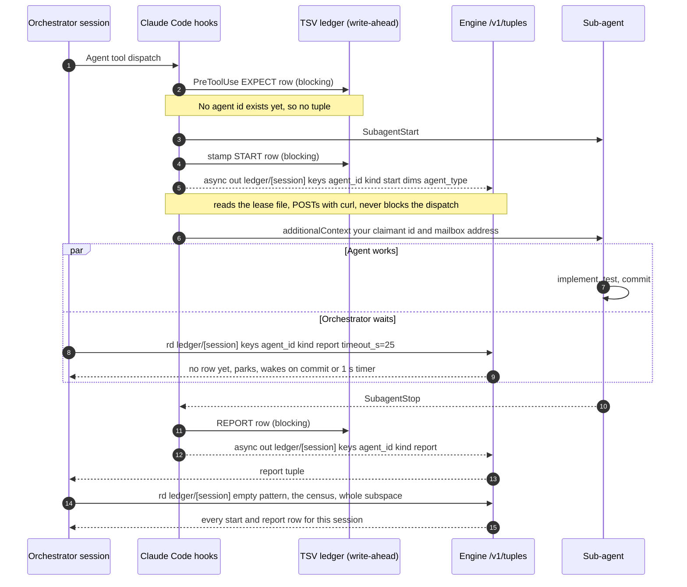
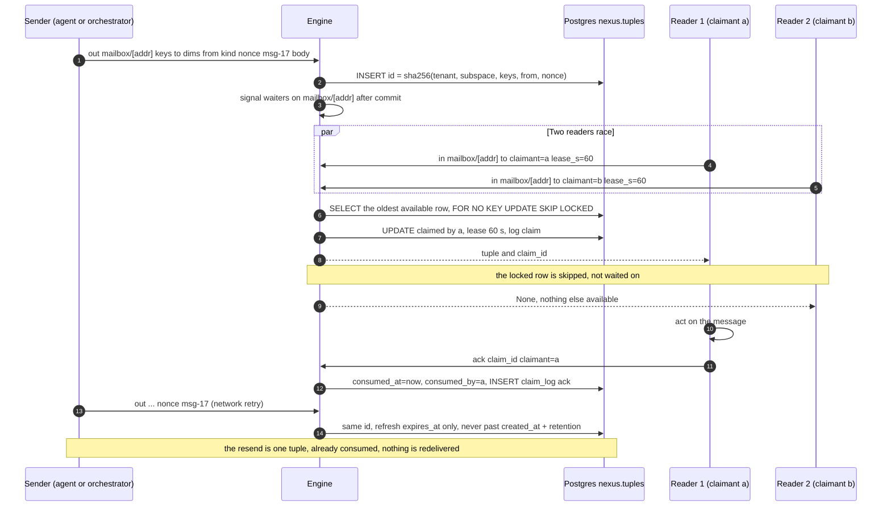
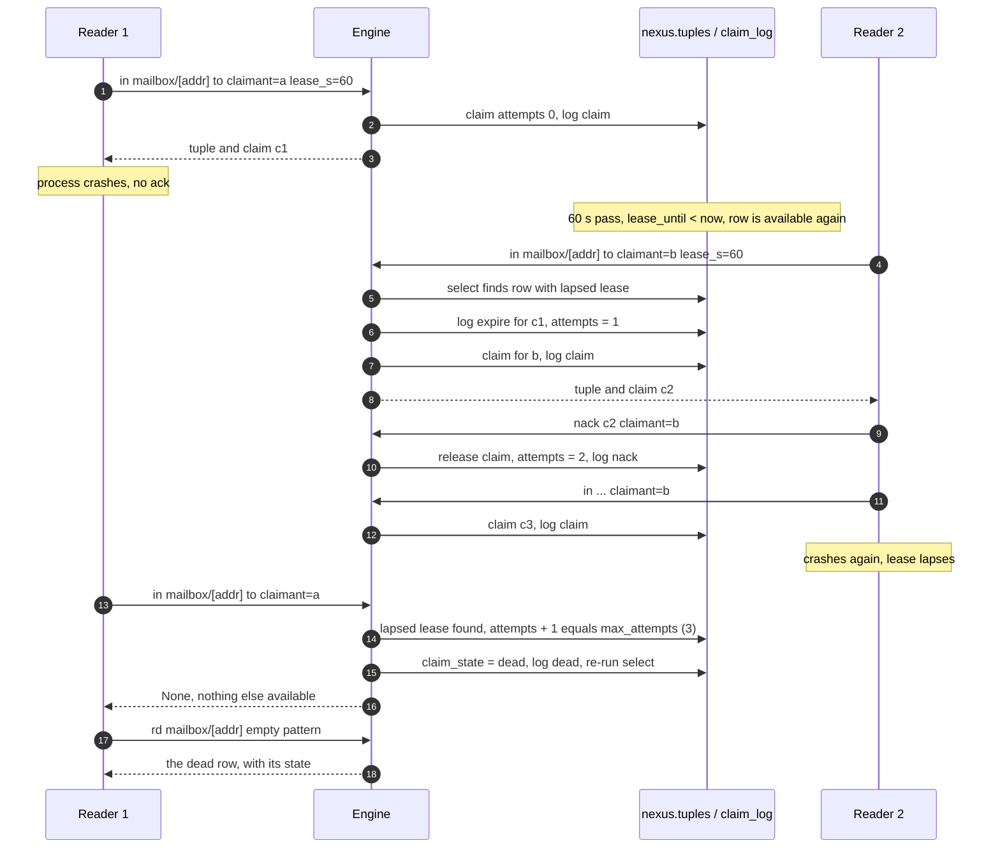
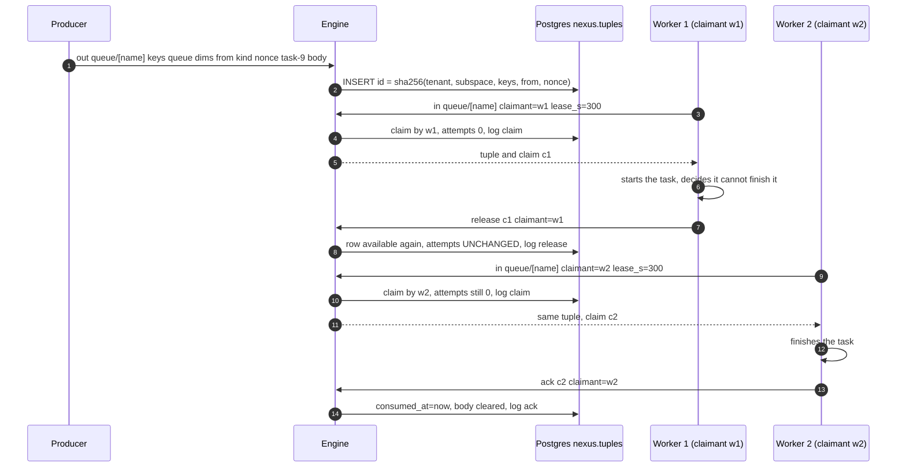
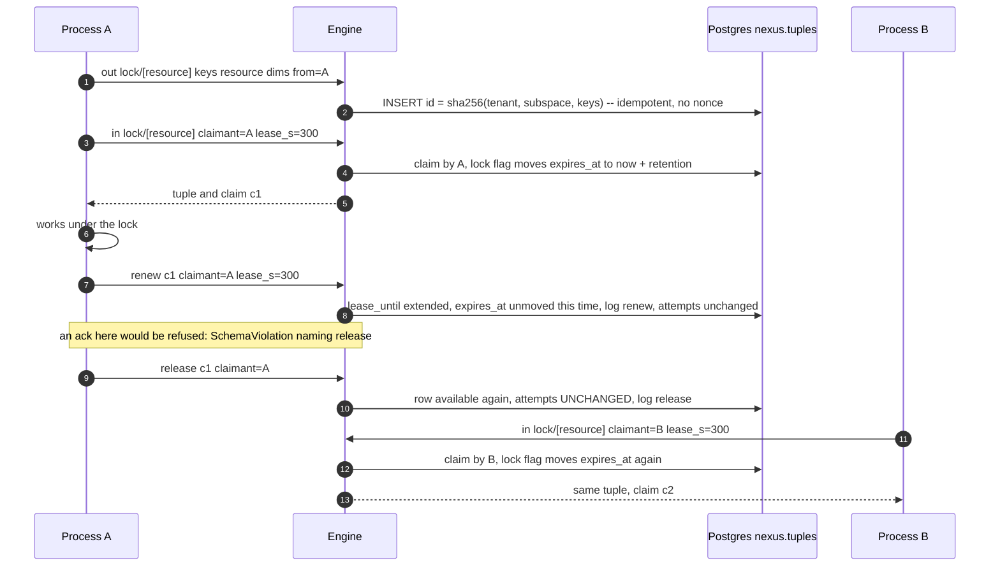
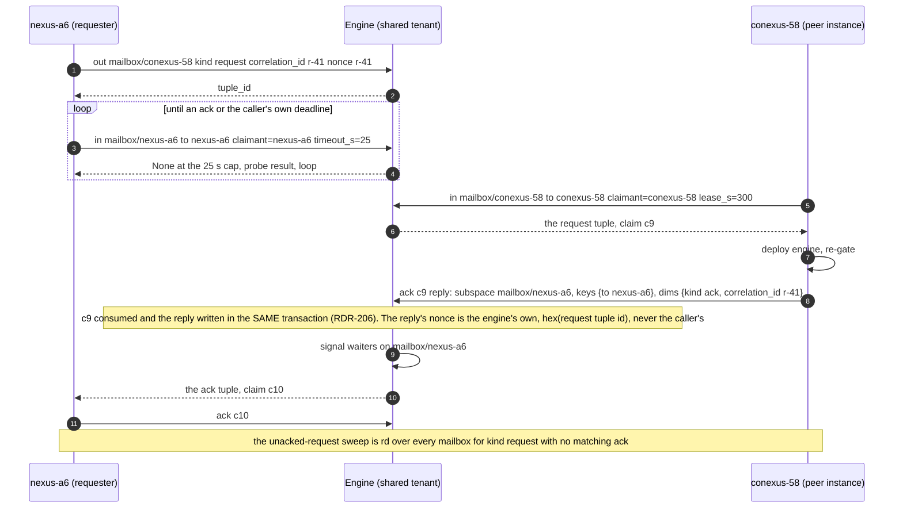
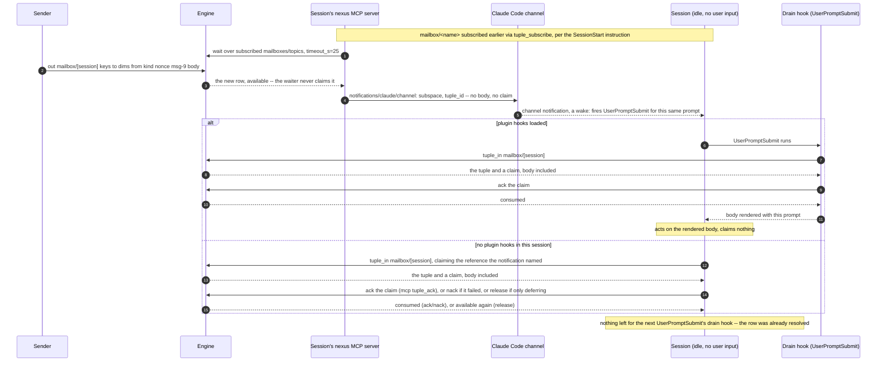
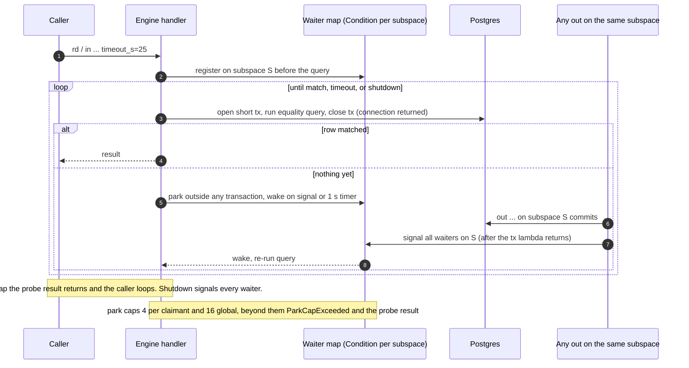
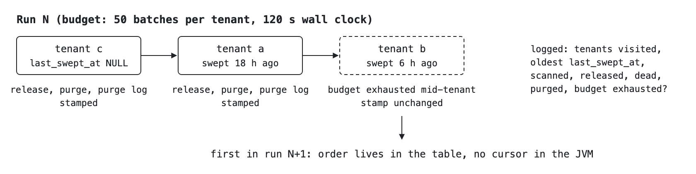
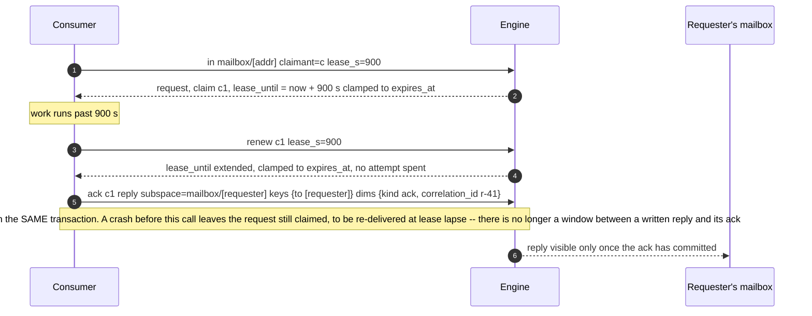

# Tuple Space Walkthroughs

> Status: design of record from RDR-205 (accepted), RDR-206 (accepted, adds `renew` and reply-in-ack), and RDR-211 (accepted, adds `release`, the board, queue and lock templates, and push delivery over the Claude Code channel). RDR-205's engine and client surface (`nx tuple`, the `tuple_*` MCP tools, the doctor rows) have both shipped: `/v1/tuples` on `engine-service-v0.1.114` (Phase 3, deployed to the managed cloud since 2026-09-11), and the client in conexus 7.41.0, which also bumps the pinned local-mode engine floor to the same tag. RDR-206's `renew` and reply-in-ack shipped on `engine-service-v0.1.117` and in conexus 7.44.0. RDR-211 is implemented on both halves as of this writing but not yet in a tagged engine release or a client release; see `docs/wire-contract-pending.md`'s `## Unshipped` entry. An install below a given piece's floor stays pinned there and a local-mode call for it 404s until it upgrades.

Scenario walkthroughs for the [Tuple Space reference](tuple-space.md). Each section follows one use of the space from the caller's side, drawn as a sequence between the processes involved.

## Ledger: dispatch start and report

Consumer one. Today the RDR-184 dispatch ledger is a tab-separated (TSV) file that three blocking hooks append to. The space does not replace that file; two new asynchronous hook entries project the same payload into `ledger/<session_id>`, and the orchestrator can wait on a report instead of hand-counting. The agent itself never touches the space. See [Operations](tuple-space.md#operations) and [Blocking reads](tuple-space.md#blocking-reads).

Waiting for a report is a parked read on the ledger. The report tuple needs no cooperation from the agent: the stop hook writes it from the harness payload. `expectations_census`'s space-backed read (`conexus/hooks/scripts/expectations.sh`, RDR-205 Phase 4.1) compares the space against the TSV only inside the 90-day retention window: `SPACE_PRESENT`/`SPACE_AGE` when the subspace exists, `SPACE_NEVER_RAN` when it is absent and the session is younger than the retention window, `SPACE_OUTSIDE_WINDOW` when absent and older, `SPACE_BLINDSPOT` when the walk examined no ledger subspace at all (never read as every session being outside the window), and `SPACE_FALLBACK` with a named reason when the engine cannot be consulted (no `nx` on PATH, unreachable, unparseable output). These lines never change the census function's own exit code — they are additional report lines on top of the TSV verdict, not a new one.

## Mailbox: send, contend, drain

Consumer two. A message is `out` to the recipient's address; the recipient drains with `in` before composing any hand-back. Because `in` is a destructive read under a lease, a message is delivered to exactly one reader even when two are draining the same box. See [Templates and subspaces](tuple-space.md#templates-and-subspaces) and [A row's life](tuple-space.md#a-rows-life).

Exactly-once delivery comes from the claim statement, not from the client. `SKIP LOCKED` means a contended row is skipped rather than waited on, and the transaction holds the claim and nothing else. A same-claimant retry of `in` after a lost response returns the existing claim id without a new update or log row.

## Crash, lease lapse, dead letter

A reader that takes a message and dies never acks. The lease bounds the damage: when it lapses the row is available again, the next claimant records the previous claim's `expire` and increments `attempts`. A reader that `nack`s counts the same way. At the template's `max_attempts` (3 for the mailbox) the row is dead-lettered: out of every claimant's view, still readable. See [Claims, leases, nack and dead letter](tuple-space.md#claims-leases-nack-and-dead-letter).

Every claim reaches a terminal transition: ack, nack, expire or dead. `lease_until` is clamped to the row's `expires_at`, so a claim cannot outlive its tuple. The re-run after a dead-letter is bounded by `NX_TUPLE_READ_MAX` passes; each pass either claims or dead-letters one row. The sweep does the same expire-and-count for lapsed claims nobody re-took.

## Queue: producer, worker, hand-back

RDR-211's third consumer type. A producer posts one tuple per task with `out`; any free worker claims the oldest available one with `in`. A worker that cannot finish calls `release` (this RDR's Gap 4 operation) instead of `nack`, so the hand-back costs no attempt against the template's `max_attempts` of 3 — the task goes to the next worker exactly as fresh as it arrived. See [RDR-211 § Approach, item 2](rdr/rdr-211-board-queue-and-lock-tuple-templates.md#approach) and [`release`](tuple-space.md#operations).

`release` and `nack` both return a claimed row to available; only `nack` counts toward `max_attempts`. A task handed back three times by `nack` dead-letters; the same task can be `release`d any number of times, because a hand-back that is not a failure never approaches that ceiling. `MaxLiveRowsExceeded` (429) refuses a producer's `out` once a queue already holds its `max_live_rows` ceiling of live tasks (10,000, Scale and Limits item 2); the ceiling clears as tasks are consumed or expire.

## Lock: idempotent creation, hold, renew, release

RDR-211's fourth consumer type. `out` on a lock is idempotent by the template's `id_from: keys` — every caller's `out` for the same resource lands on the same tuple, so any process may safely ensure a lock exists without knowing whether another process already created it. Holding the lock is an ordinary `in`; giving it up is `release`, never `ack` — an acked lock row would be unobtainable until the sweep purged it, so the lock flag ([RDR-211 § Technical Design, "The lock flag"](rdr/rdr-211-board-queue-and-lock-tuple-templates.md#technical-design)) refuses `ack` on a lock claim outright. See [RDR-211 § Approach, items 3 and 5](rdr/rdr-211-board-queue-and-lock-tuple-templates.md#approach) for the expiry-refresh rule this walkthrough relies on.

An idle lock still expires at its `out` time plus the template's 7-day retention; a second `out` after that point resets it to available rather than leaving it dead until the sweep purges it (Scale and Limits item 5). A held lock never hits that ceiling, because both `in` and `renew` move `expires_at` forward before the lease clamp applies — retention bounds only how long an unused lock can sit idle, never a lock actually in use.

## Cross-instance request and ack

A request from one instance to another is the same mailbox with an instance name as the address. Both instances on the box mint against one tenant, so `mailbox/conexus-58` is reachable from the nexus session and vice versa. The requester parks an `in` on its own mailbox for the ack. The peer answers with `ack(reply=...)` (RDR-206): the reply lands in the requester's mailbox and the request is consumed, in one transaction, so there is no longer a separate `out` call that a crash could land between. See [What it is not for](tuple-space.md#what-it-is-not-for) for the scope this stays inside.

A wait of minutes is a loop of parked calls, never one long park. Each call parks for at most 25 s because the public edge times out a response that has not started within 30 s; at the cap the engine returns the probe result and the client loops. The `correlation_id` dim is what pairs an ack with its request. Before RDR-206 the peer's ack was `out` followed by a separate `ack c9`; a crash between the two left the reply delivered and the request unconsumed, so it was redelivered and the requester could see a second reply carrying the same `correlation_id`. Writing the reply inside `ack`'s own transaction closes that window: both commit or neither does.

`scripts/check_inbound_relay_acks.py`'s mailbox arm is that unacked-request sweep, addressed by `--mailbox-prefix`/`--tuple-read-max`: it scans every `mailbox/*` subspace for `kind=request` rows with no matching `kind=ack` row at `mailbox/<from>`, distinguished in its findings by a `MAILBOX-UNACKED-REQUEST:` tag, and reports into the same finding list as the older T2-memory ack check (the pre-tuple-space relay convention between the nexus and conexus repos). An empty mailbox tuple space is a legitimate clean state for this arm, not a blindspot; a request younger than `--max-age-days` is a legitimate in-flight handshake and is not reported even unacked.

## Push delivery: the channel

The session's own nexus MCP server (the delivery endpoint, RDR-211 nexus-rplay.14) and the drain hook (`conexus/hooks/scripts/mailbox_drain.py`) are two renderers of one row that never wait on each other. This follows one message arriving at an idle session that has subscribed its instance-name mailbox per the SessionStart instruction. See [Push delivery](tuple-space.md#push-delivery-rdr-211-the-channel).

The notification itself carries no content, only the reference (Sam, T2 `nexus_rdr/211-decision-push-reference-2026-09-17`; RDR-213): the subspace and the tuple id. The waiter holds no claim. The notification is also the wake for the same `UserPromptSubmit` hook that fires on every prompt: with the plugin's hooks loaded, the drain hook claims, acks and renders the body in that same prompt, and the session acts on it, claiming nothing. Only a session without those hooks calls `tuple_in` itself, the same deliberate step a pull-based read always required, so a peer's or a board poster's content never lands inside a session unclaimed. A row the session itself claims and only means to defer, not fail, goes back with `tuple_release`, never `tuple_nack`: each announcement is a fresh claim decision, and the mailbox template dead-letters a message after three nacks.

When the channel is unreached at all (the session was not launched with the development-channel flag, or it subscribed too late) the row is still delivered: the next prompt fires `mailbox_drain.py`, which probes independently, claims, acks and renders the same row inline in that prompt's context. The drain hook is the unconditional floor and never depends on whether the channel delivered anything first.

A `/clear` or `/resume` puts the conversation on a new session id; the new session's own MCP server loads a fresh subscription set for that id (T1-scoped) and re-subscribes its instance mailbox once the model calls `tuple_subscribe` per the new SessionStart instruction. See [Push delivery](tuple-space.md#push-delivery-rdr-211-the-channel) for that handoff.

## How a blocking read parks

The wake path is what makes `rd` and `in` with a timeout cheap. There is one engine JVM and every `out` passes through it, so a per-subspace condition variable is enough; `LISTEN`/`NOTIFY` is deferred until a second JVM exists. See [Blocking reads](tuple-space.md#blocking-reads).

A parked call never holds a pooled connection. Waking every waiter on a subspace is intended: each re-runs its own equality query and `SKIP LOCKED` keeps the fan-out cheap. Waiters on subspace B do not wake for commits on subspace A. The one-second timer is defence against a missed signal, not the primary wake.

## The sweep

Every six hours the existing sweep scheduler runs a second task. It enumerates tenants from `nexus.tuple_tenants`, least-recently-swept first, and per tenant releases lapsed claims nobody re-took, purges expired and consumed-past-retention rows, then purges claim-log rows past the log's own longer TTL, a few hundred rows per committed batch. Two bounds keep it from starving the T1 sweep that shares the scheduler: a statement timeout on every arm and a per-run budget of batches per tenant and wall clock. See [The sweep](tuple-space.md#the-sweep).

<picture>
  <source media="(prefers-color-scheme: dark)" srcset="tuple-sweep-order-dark.png">
  
</picture>

A run that finds nothing expired is the healthy state. The failure the counts detect is a run that scanned nothing or a run that did not happen; the doctor row on last-sweep age reports the second.

## Where JavaSpaces differs

JavaSpaces, the Jini-era Linda, is the leased and transactional form of this design, and a post-gate research pass compared the two. All six points of contact are now met: the pinned key set on take (JavaSpaces places no floor on a template's generality), Postgres as the fixed substrate (the spec permits transient spaces), one engine over HTTP (no multicast lookup, no RMI), the in-process park where JavaSpaces had leased remote listeners that leaked, a holder-renewable lease (`renew`, RDR-206), and take-and-reply in one transaction (`ack`'s optional `reply`, RDR-206). The comparison table lives in [Prior art](tuple-space.md#prior-art).

What each operation buys, now that both are closed: `renew` lets a consumer keep every v1 lease short and still finish long work, holder-renewable exactly as Jini's leases are, without the renewal *traffic* Jini's own retrospective named as a failure cause — a holder renews only when it is still working, never on a fixed schedule. `ack`'s optional `reply` removes the second call the JavaSpaces comparison flagged: the reply and the request's consumption commit together or not at all, so the crash-between-two-calls window this design used to accept is gone. The window between `in` and the work that follows it is still inherent to any leased take, JavaSpaces included; `renew` narrows how much of that window a lapse can silently swallow, but neither operation removes the window itself.
