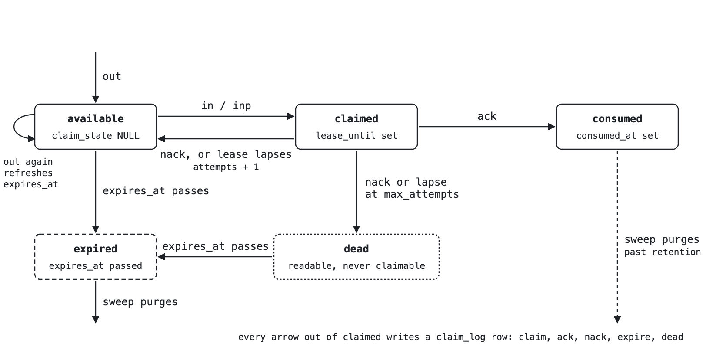

# Tuple Space

> Status: design of record from RDR-205 (accepted), RDR-206 (accepted, adds `renew` and an optional reply on `ack`), and RDR-211 (accepted, adds `release`, the board, queue and lock templates, the park-slot and queue-depth doctor rows, and push delivery over the Claude Code channel). RDR-205's Phase 1 (engine) and Phase 2 (client — `nx tuple`, the nine `tuple_*` MCP tools, the doctor rows) have both shipped: `/v1/tuples` shipped on `engine-service-v0.1.114` (Phase 3), deployed to the managed cloud since 2026-09-11. The client shipped in conexus 7.41.0, which also bumps the pinned local-mode engine floor (`REQUIRED_ENGINE_VERSION`, `src/nexus/engine_version.py`) to `v0.1.114` — a local install on 7.41.0 or later has the route live. An install on an older release stays pinned below the floor and a local-mode call 404s (the doctor rows below report this as informational, not a defect, below that floor). RDR-206's `renew` and ack-with-reply shipped on `engine-service-v0.1.117` (deployed before the client tag) and in conexus 7.44.0, which bumped the floor to that tag; see the wire ledger's `## Shipped` entry (`docs/wire-contract-pending.md`) for the exact commits. RDR-211's engine half shipped on `engine-service-v0.1.127` (deployed before the client tag, the additive branch of the paired-release choreography) and its client half in conexus 7.51.0, which bumps the floor to that tag; see the wire ledger's `## Shipped` entry (`docs/wire-contract-pending.md`) for the exact commits.

## What it is

A tuple space is a shared bag of typed records that any process can add to, read from, or take out of, where taking is atomic: when two processes try to take the same record, exactly one gets it. Linda (Gelernter, 1985) named four operations, `out` (add), `read`, `in` (take) and `eval`; this design ships the non-blocking probe forms as well. A work queue, a mailbox, a lock and a request-reply channel are the same three operations over different record shapes. The [walkthroughs](tuple-space-walkthroughs.md) draw each of this design's uses as a sequence.

Three consumers ship with this design and no others: the RDR-184 dispatch ledger (start and report tuples keyed on the harness's per-instance agent id; today a tab-separated file, the TSV, that the hooks keep), a mailbox addressed to an agent id, an instance name or a session id, which also carries the cross-instance request-and-ack between the nexus and conexus sessions on one box, and, since RDR-211, three generic coordination primitives — a broadcast board, a shared work queue, and a mutual-exclusion lock — that name no one fixed use the way the ledger and the mailbox do. Nothing else: not the build lease, not the T1 identity files, not the push vouching, not any wrapping of scratch, memory or plans, not surfaces. A consumer not named here needs its own RDR, exactly as RDR-211 needed one to add the third.

## Operations

Fourteen HTTP routes under `/v1/tuples`. Signatures are the contract; the handler is the implementation.

```text
out(subspace, keys, dims, body, *, nonce=None, ttl_seconds=None) -> tuple_id
                                                            # nonce required where id_from is keys+nonce;
                                                            # ttl_seconds defaults to the template's retention
rd (subspace, keys_pattern=None, *, n=1, since=None, timeout_s=0) -> [Tuple]   # non-destructive; blocks up to timeout_s
rdp(subspace, keys_pattern=None, *, n=1, since=None) -> [Tuple]                # probe
wait(subspaces: [{subspace, keys_pattern?, n?, since?, announce?}], *, timeout_s=0)
                                                    -> [{subspace, tuples: [Tuple], subscriber?}]
                                                            # announce (bead nexus-vsipz, RDR-213 engine half):
                                                            # {interval_s, max, subscriber?} -- additive,
                                                            # since/announce together refused (SchemaViolation).
                                                            # subscriber (bead nexus-q82tk) keys the stamp per
                                                            # reader in nexus.tuple_deliveries (boards). See below.
                                                            # RDR-211 Phase 1 Step 1: a multi-subspace rd --
                                                            # parks ONE call across several subspaces, each
                                                            # with its own pattern and cursor, and returns as
                                                            # soon as ANY of them has a matching tuple past its
                                                            # cursor. Parks with NO claimant, like rd -- one
                                                            # global slot, nothing against the per-claimant
                                                            # cap, regardless of subspace count. At most 34
                                                            # subspaces per call (32 board topics + 2 mailboxes,
                                                            # the RDR's own subscription bound); a subspace with
                                                            # no match is absent from the result, never present
                                                            # with an empty tuples list. No MCP tool and no CLI
                                                            # verb (Sam's decision) -- the client half is Step 3.
in (subspace, keys_pattern, *, claimant, lease_s=None, timeout_s=0) -> (Tuple, claim_id) | None
                                                            # lease_s omitted (nexus-xapt8, additive) falls
                                                            # through to the template's own
                                                            # take.default_lease_seconds; if the template has
                                                            # none, refused with the SAME plain 400
                                                            # {"error":"lease_s required"} an omitted lease_s
                                                            # always produced, byte-identical to before
inp(subspace, keys_pattern, *, claimant, lease_s=None) -> (Tuple, claim_id) | None
ack(claim_id, claimant, *, reply=None) -> reply_id | None  # ownership checked; reply is {subspace, keys, dims,
                                                            # body, ttl_seconds}, written and the request
                                                            # consumed in one transaction (RDR-206)
nack(claim_id, claimant)                                   # ownership checked; counts an attempt
renew(claim_id, claimant, lease_s) -> lease_until          # ownership checked; extends a live claim, clamped
                                                            # to expires_at, refused above the template's
                                                            # max_lease_seconds; never counts an attempt (RDR-206)
release(claim_id, claimant) -> {"released": true}          # ownership checked; ends a live claim WITHOUT
                                                            # counting an attempt -- a hand-back that is not
                                                            # a failure (RDR-211)
subspace_list(prefix, limit=None, after=None) -> {subspaces: [{subspace, total, available, claimed, dead,
                           consumed, expired_unpurged, oldest_created_at, newest_created_at}], next_cursor?}
                                                                     # concrete subspaces that exist, ordered
                                                                     # by subspace name; the two timestamps
                                                                     # span all rows, expired included (the
                                                                     # census needs the newest write, not the
                                                                     # newest live row); total counts live
                                                                     # rows only. limit/after (nexus-xapt8,
                                                                     # additive): omitted, every matching
                                                                     # subspace, no next_cursor key at all --
                                                                     # the pre-paging response shape,
                                                                     # unchanged; with limit, next_cursor
                                                                     # carries the cursor for the next page
                                                                     # when the page was truncated
registry() -> {digest, sources, templates: [TemplateSchema]}
subspace_stats(subspace) -> {total, available, claimed, dead, consumed, expired_unpurged}
                                                            # the exact-name form of subspace_list, kept
                                                            # for the CLI verb; total counts live rows only
park_stats() -> {max_global, max_per_claimant, global_in_use, refused_global,
                 refused_claimant, per_claimant: {claimant: slots}}
                                                            # RDR-211 Phase 1 Step 1: the blocking rd/in park
                                                            # cap's own bookkeeping (RDR-205's cap has existed
                                                            # since Phase 1, but nothing reported it before this).
                                                            # Counters are per JVM PROCESS, never per-tenant or
                                                            # cluster-aggregated. per_claimant carries only
                                                            # claimants currently parked; a null-claimant park
                                                            # (rd, wait) counts toward global_in_use only.
```

| Operation | Parks | Idempotent | Probe form |
| --- | --- | --- | --- |
| `out` | no | yes: the id is derived from caller-supplied fields only, so a retry is the same tuple | none |
| `rd` | yes, up to `timeout_s` | yes: a read takes nothing | `rdp` |
| `rdp` | no | yes | is the probe form of `rd` |
| `wait` | yes, up to `timeout_s` | yes: a read takes nothing | `timeout_s=0` is the probe form |
| `in` | yes, up to `timeout_s` | a same-claimant retake within its lease returns the existing claim id, no new update or log row | `inp` |
| `inp` | no | same same-claimant rule as `in` | is the probe form of `in` |
| `ack` | no | no: a second `ack` on the same claim is `ClaimNotFound`; a reply written with it shares that rule, since the reply and the consumption commit in one transaction | none |
| `nack` | no | no: every call counts an attempt against `max_attempts` | none |
| `renew` | no | no: a repeat renews again from the new `now`, extending the lease further; a lapsed claim is `ClaimNotFound`, not resurrected | none |
| `release` | no | no: a second `release` on the same claim is `ClaimNotFound` | none |
| `registry` | no | yes | none |
| `subspace_list` | no | yes | none |
| `subspace_stats` | no | yes | none |
| `park_stats` | no | yes | none |

Matching differs by read. `in` and `inp` require every pinned key and match by equality, because exclusion needs an exact target. `rd` and `rdp` match by equality on every key the pattern supplies and place no condition on keys it omits; a pattern of `None` or `{}` reads the whole subspace, which is what a census does and what a claimant never may. `rd` and `rdp` return up to `n` live tuples, live meaning `expires_at > now()` and not acked, whatever the claim state: a row under a live claim and a dead-lettered row are both returned, with their state — but never their `claim_id`: that field is rendered only by `in`/`inp`'s own top-level response, the ack/nack credential, so reading a claimed row without having won the claim never leaks the means to ack or nack it. `n` is capped by the engine setting `NX_TUPLE_READ_MAX` (default 300, the client's paging convention); an `n` above the cap is clamped, not refused. Results are ordered by `(created_at, id)`, resuming strictly after `since`, a `(created_at, id)` cursor the caller keeps. Acked rows are never returned by any read.

**`wait`'s `announce` field (bead nexus-vsipz, RDR-213 engine half).** A `WaitSpec` entry may carry `announce: {interval_s, max}` instead of `since`; the two together are refused with `SchemaViolation` before anything registers or parks. With `announce` set, the spec's own read narrows to CLAIMABLE rows — `claim_state IS DISTINCT FROM 'dead' AND (claim_state IS NULL OR lease_until < now())`, `in`/`inp`'s own predicate — that are also DUE: `announced_at IS NULL` (never announced) or (`announced_at` older than `interval_s` AND `announce_count < max`). The matching row is stamped — `announced_at = now()`, `announce_count += 1` — in the SAME statement that selects it, so the client-visible `TupleRow` already carries the post-stamp values; every read (`rd`/`rdp`/a plain `wait` spec, still) renders `announced_at`/`announce_count` too, `None`/`0` for a row nothing has ever announced. Because the match always re-scans the full claimable-and-due set ordered oldest first, with no client-supplied cursor to have advanced past anything, a row whose transaction commits LATE than a sibling's — the exact race a `since`-cursor cannot see past — is still picked up the next time anyone asks. The session MCP server's channel waiter (`nexus.mcp.channel.ChannelWaiter`) is the one caller: every tick's spec, mailbox or board, carries `announce`; nothing sends `since` any more.

**`announce.subscriber` (bead nexus-q82tk, RDR-213 boards half).** A board post is read by many sessions and never claimed, so a stamp on the row would let the first subscriber's announcement silence the post for every other. With `subscriber` set, the stamp lives in `nexus.tuple_deliveries` keyed by `(tenant, subspace, subscriber, tuple_id)` (`tuples-007-deliveries.xml`; `tuple_id` cascades from `nexus.tuples`, so the sweep's purge bounds the table): a row is due for that subscriber when it has no delivery row, or its delivery row is older than `interval_s` with `announce_count < max`, and the upsert of the delivery row commits in the same transaction as the select. The returned `TupleRow` carries the per-subscriber post-stamp values; the row's own `announced_at`/`announce_count` are neither read nor written. The claimable narrowing applies unchanged (trivially true for a board, whose take is disabled). The waiter sends its session id as `subscriber` with `max=1` for every board spec (`DEFAULT_BOARD_MAX_ANNOUNCES`): a post is announced once to each subscriber and never again, since a post is never claimed and "unanswered" is not observable for it. `subscriber` is capped at the claimant ceiling (128 bytes) and refused blank. The result echoes the `subscriber` the engine honoured (`WaitResult.subscriber`, additive, absent when the spec carried none): the waiter stops with `stopped_reason=no_subscriber_support` on a board result without its own session id, since an engine that accepted `announce` but never read `subscriber` (v0.1.128) would have stamped the board row, and a local install converges to the engine floor rather than refusing it at spawn. Two waiters of the SAME subscriber overlapping on one post stamp it once (the tuple row lock, `SKIP LOCKED`); two DIFFERENT subscribers overlapping on one post see it one call apart, since the second skips the locked row and finds it due again on its next call.

`subspace_list`'s `limit` is capped the same way, against `NX_TUPLE_READ_MAX`. It runs a request-path statement, bounded by its own `statement_timeout` (`NX_TUPLE_SUBSPACE_LIST_TIMEOUT_SECONDS`, default 10s, `SweepBounds`' `is_local=true` pattern — reverts at transaction end, never leaks onto the pooled connection) since, unlike the scheduled sweep's own bounded batch arms, it runs on demand against whatever cardinality a tenant has accumulated (bead nexus-xapt8, a scalability research pass over this design).

`in`/`inp`'s `lease_s` is optional (nexus-xapt8, additive): omitted, it falls through to the matched template's own `take.default_lease_seconds`; a template with none configured still refuses, byte-identical to the pre-existing shape an omitted `lease_s` always produced — HTTP 400 `{"error":"lease_s required"}`, not the typed `SchemaViolation` envelope (that shape is reserved for an explicit, out-of-range value: non-positive, or above `max_lease_seconds`). The max-lease-seconds refusal and the expires-at clamp apply to a defaulted lease exactly as they do to an explicit one.

## Templates and subspaces

A *subspace* is a named partition of the space with a registered schema (`mailbox/<agent_id>`, `ledger/<session_id>`). A *template* is the schema's name with its parameter; a concrete subspace is an instance of it. The engine is the only holder of the registry: no client carries a copy, every write is validated by the engine against its own templates, and a client learns what exists by asking. `registry()` returns a digest of the loaded templates beside them, so a client or a hook script that expects a shape can detect skew and report it rather than guess.

Six templates (three from RDR-205/208, plus board, queue, and lock from RDR-211 Phase 1 Step 2, bead nexus-rplay.8):

| Template | Keys (take matches all) | Dims | Id from | Take | Retention |
| --- | --- | --- | --- | --- | --- |
| `ledger/<session_id>` | `agent_id`, `kind` ∈ {start, report} | `agent_type`; optional `commit`, `t2_ref`, `verify` ∈ {present, absent} (nexus-d9k5h) | `keys` | disabled: rows are read, never claimed | 90 days |
| `mailbox/<address>` | `to` | `from` (required), `kind`, `correlation_id`, `address_kind` ∈ {agent, instance, session} (RDR-208 Phase 1 Step 2, bead nexus-galkv.2; `instance` retired after RDR-208 Phase 3) | `keys+nonce`, with `from` in `id_dims` | enabled: `max_attempts` 3, `max_lease_seconds` 900 | 7 days |
| `directory/<name>` (RDR-208 Phase 1 Step 1, bead nexus-galkv.1) | `name` | `session_id` (required) | `keys+nonce`, with `session_id` in `id_dims` | disabled: rows are read, never claimed | 7 days |
| `board/<topic>` (RDR-211 Phase 1 Step 2, bead nexus-rplay.8) | `topic` | `from` (required), `kind` | `keys+nonce`, with `from` in `id_dims` | disabled: an append-only, many-reader log | 7 days (a post's own `ttl_seconds` may set less) |
| `queue/<name>` (RDR-211 Phase 1 Step 2, bead nexus-rplay.8) | `queue` | `from` (required), `kind`, `correlation_id` | `keys+nonce`, with `from` in `id_dims` | enabled: `max_attempts` 3, `max_lease_seconds` 900 | 2 days |
| `lock/<resource>` (RDR-211 Phase 1 Step 2, bead nexus-rplay.8) | `resource` | `from` (optional) | `keys`, one tuple per resource | enabled: `max_attempts` omitted (never dead-letters), `max_lease_seconds` 900; the lock flag | 7 days (idle only — a held lock's expiry moves forward on claim/renew) |

The id is derived from caller-supplied fields only, so `out` is idempotent by construction and a retry across a deploy gap is the same tuple. Which fields is the template's `id_from`: `keys` (the ledger: `agent_id` and `kind` identify a dispatch, so a second start for the same agent is the same tuple, which is what the census wants); `keys+nonce` (the mailbox: the sender mints a message id, unique among its own messages, and passes it as the nonce; the template's `id_dims` name the dims that also enter the id, `from` for the mailbox, so a nonce need only be unique per sender and two senders' messages never collide; two messages to one address are two tuples and a resent message is one — the directory template follows the same shape with `session_id` in `id_dims`, so two sessions arming the same name never collide even on an equal nonce); or `keys+body` (content-addressed, no v1 template). The insert time is never part of an id. A refire with the same id refreshes `expires_at` only, never the body, the claim state or the consumed state, and never past `created_at` plus the template's `retention_seconds`; within that ceiling, a refire's `expires_at` follows whatever `ttl_seconds` the resend passes, so a resend with a shorter explicit `ttl_seconds` than the row's current remaining time moves `expires_at` backward, not just forward — the directory template's own re-arm convention (`ttl_seconds=300`, re-sent every 60s) relies on exactly this to let a holder's entry shrink toward expiry if it stops re-sending partway through a cycle. A re-send cannot move expiry past the entry's `created_at` plus the 7-day retention, so a session that runs that long writes a fresh entry with a new nonce before then. The nonce is REQUIRED on any `keys+nonce` template, the mailbox and directory templates included: an `out` that omits it is refused as `SchemaViolation`, the same way a missing required dim is. It is an id ingredient only, not a stored field — a read (`rd`/`rdp`/`in`/`inp`) never echoes it back, the same way it never echoes a claim_id the reader has not won.

Templates ship as YAML in engine resources, loaded and validated at boot; a breach fails boot with the file and field named. Templates change with an engine release, not with a data changeset; removing a template that has live rows needs a data changeset with a migration note. One test-only path exists beside the resource files: the engine also loads templates from the directory named by `NX_TUPLE_TEMPLATE_DIR` when it is set, logs that it did at boot, and lists both sources in `registry()`; a directory set in production is a red gate, not a silent second registry.

## A row's life

Every state a row in `nexus.tuples` can be in, and what moves it. The claim log records each transition as its own append-only row.

<picture>
  <source media="(prefers-color-scheme: dark)" srcset="tuple-row-life-dark.png">
  
</picture>

The availability predicate is the row's whole story:

```text
consumed_at IS NULL AND expires_at > now() AND claim_state IS DISTINCT FROM 'dead' AND (claim_state IS NULL OR lease_until < now())
```

A lapsed lease is claimable the moment it lapses; an expired row is invisible the moment it expires; a dead-lettered row is never a candidate whatever its `lease_until` holds.

The claim statement, in one tenant-scoped transaction, nothing else in it:

```text
row = select(...).from(TUPLES)
        .where(TENANT.eq(t), SUBSPACE.eq(s), KEYS.eq(pattern),
               CONSUMED_AT.isNull(), EXPIRES_AT.gt(now()),
               CLAIM_STATE.isDistinctFrom("dead"),
               CLAIM_STATE.isNull().or(LEASE_UNTIL.lt(now())))
        .orderBy(CREATED_AT).limit(1)
        .forNoKeyUpdate().skipLocked().fetchOne();
// if row.leaseLapsed and row.attempts + 1 == maxAttempts: mark dead, log, re-run select
// (bounded re-run: NX_TUPLE_CLAIM_PASSES, default 8)
update(TUPLES).set(CLAIM_STATE, "claimed").set(CLAIMANT, c)
        .set(CLAIM_ID, id).set(LEASE_UNTIL, now + lease)
        .where(ID.eq(row.id)).execute();
insert claim_log(tuple_id, claim_id, c, 'claim', now)
```

`FOR NO KEY UPDATE` because the update touches no key column; `SKIP LOCKED` because a contended row is skipped, not waited on. The transaction holds the claim and nothing else.

## Claims, leases, nack and dead letter

A claim is the state between `in` and `ack`/`nack`, held under a lease, a deadline after which the claim is released by a sweep. `lease_until` is clamped to the row's `expires_at` at claim time, so a claim can never outlive its tuple. `attempts` counts nacks and lapsed leases alike; at the template's `max_attempts` the row is dead-lettered (`claim_state = 'dead'`, a `dead` log row), whether the cap was reached by nacks or by lapsed leases nobody re-took. A dead-lettered row leaves every claimant's view but stays readable by `rd`, and `subspace_stats` counts it under `dead`.

A same-claimant retake is idempotent: before the claim statement, `in` reads for a live claim already held by this claimant on a matching tuple — `claim_state = 'claimed'`, this claimant, unconsumed, unexpired, and `lease_until` still in the future — and, if one exists, returns its claim id with no new update and no log row. Without that read a retry after a lost response could never recover its claim. The `lease_until` check is load-bearing: a lapsed claim is not retaken by this shortcut even for its own former holder — once the lease passes, the same claimant falls through to the ordinary claim loop below like anyone else, and either reclaims the same row (if nobody else won it first) or a different one; only a claim whose lease has not yet lapsed is ever handed back as-is.

Every claim reaches a terminal transition: `ack`, `nack`, `expire` or `dead`. `ack` sets `consumed_at`, clears `body` to NULL in the same statement (bead nexus-8zoyp: a consumed row is already unreachable through `rd`/`in`, both of which filter `consumed_at IS NULL`, so there is no reason to keep its body for the rest of the row's retention — a reply written by `ack`'s own optional `reply` is a separate row and keeps its body), and logs `ack`; `nack` releases the claim (`claim_state`, `claimant`, `claim_id` and `lease_until` to NULL) and increments `attempts`, leaving the body untouched. A nacked, claimed-and-lapsed, or dead-lettered row all keep their body — only a consume clears it. When a claim finds a row whose previous lease has lapsed, the same transaction writes the `expire` row for the previous claim and increments `attempts`; if that brings `attempts` to `max_attempts` the row is dead-lettered there and then and the claim re-runs its select. The re-run is bounded: each pass either claims or dead-letters one row, and the call gives up after `NX_TUPLE_CLAIM_PASSES` passes (default 8, an engine setting distinct from `NX_TUPLE_READ_MAX`) and returns the probe result. `ack` and `nack` are checked against ownership: `ClaimOwnership` if a live claim is held by someone else, `ClaimNotFound` if no live claim matches the id (including a second `ack` on an already-acked claim, or a claim_id whose lease has already lapsed but nobody has re-claimed or swept it yet). The check is enforced on the update itself, as a compare-and-swap on the claim's identity (`id`, `claim_state = 'claimed'`, `claim_id`, `consumed_at IS NULL`), so an `ack` or `nack` that loses the race with the sweep's release between its read and its write fails `ClaimNotFound` and writes no log row, instead of consuming or releasing a row it no longer holds.

`renew(claim_id, claimant, lease_s)` extends a live claim without consuming it and without spending an attempt (RDR-206). The new `lease_until` is `now + lease_s`, clamped to the row's `expires_at` at UPDATE time in SQL — never against a value read earlier, which closes a window a same-tuple refire could otherwise open — so a duration inside the template's cap can still come back shorter than asked, silently. A `lease_s` above the template's `max_lease_seconds` is refused outright with `LeaseTooLong` rather than clamped: renewal changes who decides when work is long, not the cap. `renew` reads through the same `liveClaimRow` predicate as `ack` and `nack`, so a claim whose lease has already lapsed is `ClaimNotFound`, not resurrected — a holder that missed its window learns it lost the claim, exactly as a late `ack` would tell it — and it is checked against ownership the same way, and enforced by the same compare-and-swap, so a renew that loses the race with the sweep's release also fails `ClaimNotFound` and writes no log row. A successful renew writes one `renew` claim-log row and never touches `attempts`: a renew is the holder keeping the message, not a delivery given back, so unlike a nack or a lapsed lease it never counts toward `max_attempts`.

## Blocking reads

There is one engine JVM and every `out` passes through it, so a per-subspace `Condition` (one lock and condition per subspace key in a concurrent map) is the wake mechanism. The `out` handler signals all waiters on that subspace after the tenant-scoped transaction has committed, never from a transaction listener. A parked call is a loop: open a short transaction, run the equality query, return the connection, then park outside any transaction until the signal or a one-second timer, then repeat. A parked call never holds one of the pooled connections while parked. The waiter is registered before the query, not after, so a commit between query and park is not lost.

`timeout_s` is capped at 25 seconds by default, settable on the engine; a call at the cap returns the probe result and the caller loops, so a wait of minutes is a loop of parked calls, not one long park. The client's own HTTP timeout is set above `timeout_s` so the server's cap fires first. Per-claimant and global park caps are engine settings (defaults four and sixteen) refused with `ParkCapExceeded`, which returns the probe result. On shutdown every waiter is signalled so parked calls return the probe result instead of riding out their budget, which is what makes a deploy gap a retry rather than a stall on top of it. Parked callers on one subspace do not wake on commits in another. `LISTEN`/`NOTIFY` is available on the direct connection and deferred until a second JVM exists.

## Retry across a deploy

An engine deploy opens a gap of about 25 seconds. The operations are shaped so a client can retry through it without a coordination protocol of its own.

| Operation | On a 502 or 504 | Why it is safe |
| --- | --- | --- |
| `rd`, `rdp` | retry freely | a read takes nothing |
| `out` | retry freely | the id is derived from caller fields only; the resend is the same row and only refreshes `expires_at` |
| `in` | retry with the same claimant | a live claim held by this claimant on a matching tuple is returned with its claim id, no new update; otherwise the lease and sweep cover it exactly as a crash after `in` |
| `ack` with a reply | retry only while the first call's response is genuinely lost, never after a `ClaimNotFound` | the ack and the reply write commit together in one transaction, so a retry after a lost response finds the claim already consumed and answers `ClaimNotFound` rather than writing a second reply; re-send the reply with `out` if it still matters |
| `renew` | retry freely while the claim is still live | each call renews again from the new `now`; a retry after the claim has lapsed answers `ClaimNotFound` instead of resurrecting it |
| parked `rd` / `in` | returns the probe result at shutdown | every waiter is signalled on shutdown, so the gap is one retry, not a stall on top of it |

Two more guards live in the client: the request it is about to send is measured against the edge's 8 KB body limit before sending, and its own HTTP timeout sits above `timeout_s` so the engine's cap always fires first.

## The sweep

Every `SWEEP_INTERVAL_HOURS` (six hours today), a second scheduled task on the same scheduler that runs the existing sweep enumerates tenants from `nexus.tuple_tenants`, a small table with no row-level security, one row per tenant that has ever written a tuple, upserted by `out`, visited least-recently-swept first (`last_swept_at` ascending, nulls first, `tenant_id` as the tie-break). Per tenant it runs three arms, each committing one batch of up to `NX_TUPLE_SWEEP_BATCH_SIZE` rows (default 300) at a time until drained or its own share of the per-tenant cap runs out: (1) release lapsed claims nobody re-took, with an `expire` log row and an `attempts` increment, dead-lettering at `max_attempts`; (2) purge expired and consumed-past-retention tuple rows (setting the claim log's `tuple_id` to null); (3) purge log rows past the log's own longer TTL (`NX_TUPLE_CLAIM_LOG_TTL_DAYS`, default 180 days). Two budgets keep the sweep from starving the T1 crash-safety sweep sharing the same single-thread scheduler and from letting one tenant starve the rest: `NX_TUPLE_SWEEP_MAX_BATCHES_PER_TENANT` (default 50) caps the batches one tenant spends in one visit, split into three roughly-equal per-arm shares — so a large release-arm backlog can no longer exhaust the whole cap on arm one and leave the two purge arms unrun that visit, each arm's loop runs unconditionally regardless of the others' outcome; `NX_TUPLE_SWEEP_WALL_CLOCK_BUDGET_SECONDS` (default 120) caps the whole run and is checked only at a tenant boundary, before starting the next tenant, never mid-tenant — a tenant already underway always finishes cleanly or hits its own per-arm share first. Every statement the sweep issues, including the tenant enumeration itself, also carries the engine's ordinary per-statement timeout. A tenant is stamped only when all three arms finish cleanly within its share this visit; a tenant cut short by either budget keeps its old stamp and is therefore first next run, so the order lives in the table and survives a restart with no cursor held in the JVM.

Every run logs one structured `event=tuple_sweep_run` line: `tenants_visited`, `oldest_last_swept_at` (after the run), `scanned`, `released`, `dead_lettered`, `purged`, `purge_examined`, `log_rows_purged`, `log_purge_examined`, and `incomplete_cause` — `NONE`, `TENANT_CAP` (a tenant hit its own per-arm share), `TENANT_ERROR` (a tenant's arms threw), or `WALL_CLOCK` (the run's wall-clock budget was exhausted at a tenant boundary), reported as the worst cause seen across every tenant the run touched (the enum's own ordinal order is the severity order). A run that finds nothing expired is the normal state of a healthy table; the failure the counts detect is a run that scanned nothing at all, or a run that did not happen, which the doctor row on last-sweep age reports. This line is a log record only, never a persisted row — `nx doctor`'s sweep-freshness check reads `nexus.tuple_tenants.last_swept_at` alone and cannot see `incomplete_cause`.

Three `nx doctor` rows: oldest unclaimed age per subspace over claimable rows only (live, unclaimed, not dead-lettered); dead-tuple ratio and last autovacuum on the table; age of the LEAST-recently-swept tenant (the laggard, `MIN(nexus.tuple_tenants.last_swept_at)`), not the most-recently-swept one -- a per-tenant MAX would let one freshly-swept tenant mask every stale one behind it. The third row cannot see a run's `incomplete_cause` — that value is a structured log line only (`event=tuple_sweep_run ...`), never a persisted row a client can read back — so it reports staleness, not cause: any of "scanned nothing", "did not run" or "hit its budget every visit" looks the same to it, a `last_swept_at` older than expected. `autovacuum_vacuum_scale_factor = 0.01` on `nexus.tuples` and `nexus.tuple_claim_log`, the first per-table storage parameter in the changelog, reclaims during sustained churn; the default already self-heals once churn stops.

## Size limits

The tuple space is a coordination and metadata store, not a value store (Sam, 2026-09-13). Content that needs more room than these limits goes to T2 (`memory_put`) or T3 (`store_put`), and the tuple carries a reference — a project/title or a document id — not the content itself.

| Field | Limit | Where enforced |
| --- | --- | --- |
| `body` | 4096 bytes UTF-8, globally — a template may declare a LOWER `max_body_bytes` (the ledger's is 0: null or empty only) | engine (`TupleRepository`, DB `CHECK` backstop), client, both hooks |
| `keys`/`dims`/`keys_pattern` value | 256 bytes UTF-8, each | engine, client, both hooks |
| `subspace` | 256 bytes UTF-8 | engine, client |
| `nonce` | 128 bytes UTF-8 | engine, client |
| `claimant` | 128 bytes UTF-8 | engine, client |
| `claim_id` | 128 bytes UTF-8 | engine, client |
| whole request body, every `/v1/tuples` route | 8192 bytes, refused before JSON parsing (a `Content-Length` header above the cap is refused without reading the stream) | engine |
| whole serialised request (client-side) | 8192 bytes — the edge WAF's cap, mirrored client-side so a refusal happens locally instead of at the edge | client |

Every limit is byte-counted, not character-counted: a multibyte UTF-8 character costs its own byte count, not one "length" unit. A breach of any per-field limit is refused with `TooLarge` (413); the field name and the actual/limit byte counts are in the message, never the oversized value itself. Validation order on `out` and on a reply written by `ack`: size checks first (subspace, keys, dims, nonce, body against the global cap and the template's own cap), then the existing schema checks — so an over-limit value is refused before a `SchemaViolation` message that would otherwise echo it.

A template's `max_body_bytes` can only LOWER the global cap, never raise it; the registry refuses to load a template declaring one above 4096 or negative. `registry()` reports it per template when one is declared.

The 4096-byte `body` cap was added by the engine-service-v0.1.118 migration, alongside two one-shot cleanups: `tuples-003-2` deletes every existing `nexus.tuples` row whose body already exceeded 4096 UTF-8 bytes (legal before that release), so the new `CHECK` constraint can be validated against a clean table rather than left unproven; `tuples-004-1` clears (sets to NULL) the `body` of every row already consumed at migration time, backfilling the same NULL-on-consume behavior `ack` now applies going forward (see § Claims above). Both are cleanup migrations in the project's warn-and-delete convention — neither is reversible, and neither is expected to matter on an install that never accumulated legacy rows.

## Errors

Twelve typed errors, one base class (`TupleException`) carrying a `code` and the HTTP status `TupleHandler` sends for it, so a new subtype cannot be added without also declaring how it renders. Every error is rendered `{"error": "<code>", "detail": "<message>"}` at its own status; `TupleHandler` catches this base type ahead of the generic 500 ladder.

- `UnknownSubspace` (404): the subspace does not match a registered template, or its address segment is not of the form `[A-Za-z0-9][A-Za-z0-9._-]*` (one segment, no spaces, no empty address; a session id, an agent id, or an instance name such as `nexus-70` all qualify). `subspace_stats` on such a name is this error, never a zero census (engines after v0.1.114). A reply's target subspace on `ack` is checked the same way, before the ack's transaction opens.
- `SchemaViolation` (400): a field and reason, checked before any write; covers a missing pinned key, a missing required dim, an `out` without a nonce on a `keys+nonce` template, a `ttl_seconds` or `lease_s` at or below zero or a negative `timeout_s`, a reply object on `ack` that carries a `nonce` key (the engine sets a reply's nonce itself, to the request's own tuple id, so a caller-supplied one is refused rather than silently dropped), and a reply whose target template is not `keys+nonce` (a keys-only target, such as the RDR-184 ledger, would collapse two replies onto one id).
- `TakeDisabled` (422): the template's `take.enabled` is false.
- `TimeoutTooLong` (400): `timeout_s` above the engine's cap.
- `ClaimNotFound` (404): no live claim with that id — including a `renew` on one whose lease has already lapsed, which is not resurrected.
- `ClaimOwnership` (403): a live claim held by someone else — checked on `renew` the same way as on `ack` and `nack`.
- `ParkCapExceeded` (429): the per-claimant or global park cap is reached; the caller gets the probe result and backs off.
- `MaxLiveRowsExceeded` (429): an `out` would add a row to a subspace that already holds its template's `max_live_rows` ceiling of live rows (`consumed_at IS NULL AND expires_at > now()`, the same predicate `rd` reads by); nothing is written. Only templates that set `max_live_rows` raise it, and an idempotent re-`out` of an existing identity never does. The ceiling clears as rows are consumed or expire, so back off and retry (RDR-211).
- `TtlTooLong` (400): a `ttl_seconds` above the template's `retention_seconds`, on `out` or on a reply written by `ack`.
- `LeaseTooLong` (400): a `lease_s` above the template's `max_lease_seconds`, on `in`/`inp` or on `renew`; on `in`/`inp` a lease longer than the row's remaining TTL is clamped, not refused, and `renew` clamps the same way against the row's `expires_at` at update time — but a `lease_s` over the template's cap itself is refused on both, never clamped.
- `TooLarge` (413): a field, or the whole request body, exceeds its size limit (see § Size limits above) — never echoes the oversized value.
- `CensusTimeout` (503): `subspace_list`'s own request-path `statement_timeout` (`NX_TUPLE_SUBSPACE_LIST_TIMEOUT_SECONDS`) fired — the census query genuinely ran too long against the tenant's current row count, not a connectivity or availability problem. Retryable: a narrower `prefix`/`limit`, or a retry once load subsides, can succeed where an unbounded scan timed out. The client and `nx doctor`'s `tuples.oldest_unclaimed` row (the one caller that always issues the unbounded call) both recognise this specifically, rather than folding it into a generic "engine unreachable" diagnosis — the engine is fully up; one statement ran past its own budget.

Three refusals outside the twelve, all in `TupleHandler` itself: a request against a route with the wrong HTTP method refuses 405 (every write route is POST-only, `registry`/`subspace_list`/`subspace_stats`/`park_stats` are GET-only); a malformed or missing required field in the request body refuses 400 (`IllegalArgumentException`, the same mapping every other handler in this package uses); a request with no tenant resolved refuses 500 (`internal: tenant not set` — never reachable through the auth filter on a correctly configured route).

## Client surface

`nexus.db.t2.http_tuple_store.HttpTupleStore` is a ninth T2 domain store (`db.tuples`), an HTTP client over `/v1/tuples` built the same way every other `Http*Store` is (constructor injection, credential/endpoint self-heal, `RefreshableHttpStoreMixin`'s default idempotent gateway retry on 502/503/504 — no operation here opts out: `rd`/`rdp` are freely retryable, a retried `out` lands on the same tuple by its id formula, and a retried `in`/`inp` shares the identical crash-after-claim ambiguity the lease and sweep already cover). Two things it carries that no other T2 store needs:

- **8 KB pre-send guard.** The edge WAF rejects request bodies over 8 KB. The client measures the exact serialised request `json.dumps` would put on the wire and refuses before sending (`RequestTooLargeError`), rather than letting a request die at the edge with no local signal. A reply attached to `ack` can push it over the cap that a bare ack could never reach.
- **Per-field size pre-checks (bead nexus-r7xao).** `subspace`, every `keys`/`dims`/`keys_pattern` value, `nonce`, `claimant`, `claim_id` and `body` are each measured against the same limits the engine enforces (see § Size limits) and refused with `TooLargeError` before sending — one class either way: the engine's own `TooLarge` typed error maps back to this SAME class, so a caller need not distinguish a local refusal from an engine one.
- **Typed-error mapping.** The engine renders each of the twelve errors below as `{"error": "<code>", "detail": "<message>"}` at the error's own HTTP status. Some codes share a status (`UnknownSubspace` and `ClaimNotFound` are both 404), so the client classifies by the `error` field, never the bare status code, and re-raises the matching `TupleError` subclass (`UnknownSubspaceError`, `SchemaViolationError`, `TakeDisabledError`, `TimeoutTooLongError`, `ClaimNotFoundError`, `ClaimOwnershipError`, `ParkCapExceededError`, `TtlTooLongError`, `LeaseTooLongError`, `TooLargeError`, `CensusTimeoutError`) — a code the engine did not name this way passes through as an ordinary `httpx.HTTPStatusError`.
- **Reply-loss guard (RDR-206).** `ack(claim_id, claimant, reply=...)` raises `ReplyNotWrittenError` — deliberately outside the `TupleError` hierarchy, so it survives a broad `except TupleError` rather than being swallowed by it — when the response carries no `reply_id` after a reply was sent. The request is already consumed at that point, whether the engine predates `renew`/ack-with-reply (no `reply_id` key at all) or a new engine simply wrote nothing (a null `reply_id`); either way a retried ack answers `ClaimNotFound`, not a second attempt to write the reply, so the caller must re-send the reply with `out()` if it still matters.

**HTTP timeout ordering.** A blocking `rd`/`in_` call (`timeout_s > 0`) passes a per-call HTTP timeout of `timeout_s` plus a five-second margin — strictly above the caller's park budget, so the engine's own cap (25 s by default) always returns its probe result before the client's own transport timeout could fire first.

Two access paths sit on top of `HttpTupleStore`:

- **`nx tuple`** — `out`, `rd`, `in`, `ack`, `nack`, `renew`, `release`, `templates`, `list`, `stats`, `directory`. `ack` takes `--reply-subspace`/`--reply-key`/`--reply-dim`/`--reply-body`/`--reply-ttl-seconds` (RDR-206); there is no `--reply-nonce` flag, since the engine sets it. `release` (RDR-211) ends a live claim without counting an attempt — a hand-back that is not a failure, unlike `nack`. See [CLI Reference — nx tuple](cli-reference.md#nx-tuple) for every flag.
- **Thirteen `tuple_*` MCP tools** — `tuple_out`, `tuple_rd`, `tuple_in`, `tuple_ack`, `tuple_nack`, `tuple_renew`, `tuple_release`, `tuple_registry`, `tuple_list`, `tuple_stats`, `tuple_subscribe`, `tuple_unsubscribe`, `tuple_subscriptions` (`rd`/`in`'s own `timeout_s=0` default covers the probe case; there are no separate `tuple_rdp`/`tuple_inp` tools). `tuple_ack` takes an optional `reply` object (RDR-206) with the same fields as `tuple_out` minus the nonce. `tuple_release` (RDR-211) is `tuple_nack`'s non-failure counterpart. `tuple_subscribe`/`tuple_unsubscribe`/`tuple_subscriptions` (RDR-211 Phase 1 Step 3) manage the session's own MCP server subscription list -- board topics and, once, the session's own instance-name mailbox -- persisted in T1 so a `/resume` restores it and a `/clear` starts clean. Subscribing the instance mailbox writes the per-session registration file and starts the RDR-208 directory lease. The session's own MCP server is the delivery endpoint: it parks a `wait` over the subscription list and pushes a reference for whatever arrives through the Claude Code channel (RDR-211 nexus-rplay.14; RDR-213: the waiter holds no claim). See [MCP Servers — Tuple space](mcp-servers.md#tuple-space-t2-adjacent-rdr-205) for signatures and the routing rule of thumb.

`wait` is an internal `HttpTupleStore` method only — for the session's own MCP server lifespan waiter — with deliberately no MCP tool or CLI verb (Sam's decision, RDR-211 Open Question 6): nothing outside that future consumer calls it directly. The park-slot report (RDR-211 Phase 1 Step 1) has the same internal-transport status, but its `nx doctor` consumer (`tuples.park_slots`, below) now exists.

**Six `nx doctor` rows**, most gated the same way against the engine floor that first serves the route they read — an install below that floor reports the check as informational, not a defect, and an install at or above the floor that still 404s reports UNKNOWN and asks you to investigate the engine install:

| Label | What it reports |
| --- | --- |
| `tuples.oldest_unclaimed` | Oldest unclaimed tuple's age, per subspace, over claimable rows only (live, unclaimed, not dead-lettered); subspaces whose template disables `take` are skipped |
| `tuples.dead_tuple_ratio` | Dead-tuple ratio and last autovacuum on `nexus.tuples` / `nexus.tuple_claim_log` (local-only admin-psql path, same as the migration-state and RLS checks) |
| `tuples.sweep_freshness` | Age of the LEAST-recently-swept tenant (`MIN(last_swept_at)`, the laggard -- not "last" in the sense of most recent) plus a count of tenants past the staleness threshold; the sweep's own incomplete-cause classification is a structured log line, never a persisted row, so this row reports staleness, not cause |
| `tuples.park_slots` (RDR-211 Phase 1 Step 3, bead nexus-rplay.12) | Global park-slot usage from `HttpTupleStore.park_stats()`: `global_in_use`/`max_global` (the engine's own reported cap, never a hard-coded 16) plus `refused_global`/`refused_claimant`. WARN at or above 75% of `max_global`, OK below. Gated against `GET /v1/tuples/park_stats`'s own first-serving-engine floor (a route separate from `subspace_list`/`rd`, so its own anchor); reports "engine predates the park report" (informational, never OK-with-zeros) below that floor |
| `tuples.queue_depth` (RDR-211 Phase 1 Step 3, bead nexus-rplay.12) | Census `available`/`dead` counts, via `subspace_list`/`registry`, for subspaces resolving to the take-enabled `queue/<name>` template only — board, mailbox, lock, ledger, and directory subspaces never count here. WARN above 1,000 available on any queue, or at any dead-lettered task on any queue. Not applicable (informational, not a plain OK) when the tenant has no queue subspace at all |
| `tuples.channel_delivery` (RDR-211 Phase 1 Step 3, bead nexus-rplay.13; rewritten under RDR-213) | The `claude/channel` push-delivery waiter's own status for THIS session, read cross-process from a per-session on-disk record the waiter publishes at every wake (`nx doctor` runs in the CLI process, the waiter in the session's `nx-mcp` process — no shared memory, no engine call). No record for the resolved session (no active session, or no `nx-mcp` has run the waiter here) is informational, never a warning: there is no proof gate (RDR-213), so there is no "declared but unproven" state to report; the waiter starts parking at lifespan start unconditionally. The waiter alive with a `last_wake` within 75s (3x the engine's 25s park cap) is OK, naming wake age, `announced` (the cumulative count of distinct rows ever pushed), `pending` (0 or 1 -- a row announced and not yet gone) and `oldest_pending_age_s` when `pending` is nonzero. The waiter not alive, or a `last_wake` older than 75s, is a WARN naming the fix (`/mcp` to restart) — the drain hook still delivers at the next prompt either way |

## Push delivery (RDR-211, the channel)

RDR-211 nexus-rplay.14 deleted the RDR-205 Phase 1 CLI mailbox-watch loop, its SessionStart arm instruction, and its 30-minute re-arm rule outright, not as a fallback: two mechanisms for one delivery was the seam that closed. Push delivery is now the nexus MCP server itself, the session's own subscriber and delivery endpoint (Sam's decision of 2026-09-16, T2 `nexus_rdr/211-decision-channel-delivery-2026-09-16`): it parks one internal `wait` call per session over the subscription list `tuple_subscribe`/`tuple_unsubscribe`/`tuple_subscriptions` manage, and pushes what arrives through the Claude Code channel (`notifications/claude/channel`, capability `experimental claude/channel`). Each mailbox stays in the wait spec on every tick; a board topic tracks its own position with a `since` cursor, kept client-side, but a mailbox instead asks the ENGINE to gate cadence and cap (bead nexus-vsipz, RDR-213 engine half): the spec carries an `announce: {interval_s, max}` field, and the engine returns a claimable-and-due row -- stamping `announced_at`/`announce_count` on it in the same statement -- so the client holds no cursor for a mailbox at all. `conexus/hooks/scripts/mailbox_drain.py`'s `UserPromptSubmit` claim-ack-render pass remains the unconditional floor beneath it: mail still arrives at the next prompt whether or not a session ever reached the channel.

Three facts worth stating plainly about the announce-stamp design (bead nexus-vsipz review round). First, TWO waiters parked on the SAME mailbox -- two MCP server processes of one session briefly overlapping, a restart race -- split its announcements between them: the engine's row lock lets exactly one waiter win each due check, so the OTHER waiter's session can hear nothing from this row at all, not a duplicate the way the old cursor design's independent client-side positions would have produced. The drain hook still delivers regardless; only the push notification can be lost this way, never the mail. Second, the stamp lives in Postgres, not in the waiter process: a restarted MCP server does NOT re-announce a row that already has one -- it stays silent until its own `interval_s`/`max` schedule says it is due again, exactly as if the restart had never happened. Third, a board post rode the `since` cursor described above until bead nexus-q82tk (engine-service-v0.1.128 still delivers boards by cursor) and could be skipped by the identical `created_at`-at-transaction-start-vs-commit-order race; from the next engine cut the waiter sends `announce.subscriber` for boards and the per-subscriber stamp closes it, with no drain-hook floor needed (a missed board post was never recovered by the drain hook, which drains mailboxes only).

**A notification carries a reference, never the body (Sam, 2026-09-17, T2 `nexus_rdr/211-decision-push-reference-2026-09-17`; RDR-213).** The notification's content is a fixed template built only from identifiers the server itself controls: the subspace and the tuple id, plus one line telling the session how to get the body. No body, `from`, `kind`, correlation id, or claim id ever reaches `content`; those stay where the design already put them, in `meta`, or (the claim id) do not exist at all, since the waiter holds no claim to name. A board post is the same shape without a claim: subspace, tuple id, and the cursor to read from. The notification is also the wake for the same `UserPromptSubmit` hook that fires on every prompt: with the plugin's hooks loaded, the drain hook usually claims, acks and renders the body in that same prompt, before the model's turn, and the session acts on the rendered body and claims nothing. Only a session without those hooks calls `tuple_in` itself, which restores the "the model chose to act on this" step a pull-based read always had: peer or board content never lands inside a session unclaimed. A notification carries no body, so the body cap does not apply to it.

**The channel is a Claude Code research preview.** No flag-free path exists: Claude Code's own docs say no channel runs until the session opts in with `--channels`, per launch. Channels are not available on Amazon Bedrock, Google Cloud Agent Platform or Microsoft Foundry.

### Setup: turning on push delivery

1. **Launch with a channel flag, every time.** Two forms exist. `--channels plugin:conexus@nexus-plugins` shows no dialog once the plugin is on the effective channel allowlist: Anthropic's own list, or `allowedChannelPlugins` in Claude Code's managed settings. `--dangerously-load-development-channels server:nexus` works everywhere the preview does and is confirmed at a one-keystroke dialog every launch, not remembered between them (Sam's decision of 2026-09-17, T2 `nexus_rdr/211-decision-dev-channel-dialog-2026-09-17`).
2. **For the dialog-free form, put the plugin on the allowlist.** On macOS, write `/Library/Application Support/ClaudeCode/managed-settings.json` (admin-written, e.g. `sudo tee`) with `{"channelsEnabled": true, "allowedChannelPlugins": [{"marketplace": "nexus-plugins", "plugin": "conexus"}]}`. Measured 2026-09-17 on a Max account with that file: no dialog, no startup warning, delivery over the channel (bead nexus-tk2cz).
3. **Make it stick.** `alias claude='claude --channels plugin:conexus@nexus-plugins'` in `~/.zshrc`, or the equivalent for your shell or launcher, so every later `claude` invocation carries the flag without retyping it.
4. **Check it worked.** The startup screen shows a line reading "Channels (experimental) messages from plugin:conexus@nexus-plugins inject directly in this session · restart without --channels to stop"; a warning line under it names any allowlist problem. `nx doctor`'s `tuples.channel_delivery` row reports the waiter's own status once it has run here (`alive`, `last_wake`, `announced`, `pending`, and -- bead nexus-vsipz -- `stopped_reason` naming WHY when a dead waiter knows), or an informational "no record" line for a session whose waiter has not completed its first wake yet.

`nx hook session-start` (`nexus.mailbox_arm`) emits one line asking the session to call `tuple_subscribe("mailbox/<name>")`, with `<name>` taken from a fresh `ListAgents` call, so this session's own instance-name mailbox is delivered over the channel once the channel is live; the session's own `mailbox/<session id>` is already subscribed from MCP-server startup and needs no call. Without either launch flag, mail still arrives at the next prompt through the drain hook — degraded, not broken.

**Across `/compact`, `/clear` and `/resume`.** `/compact` keeps the same session id, so the same MCP server process's subscription set (persisted in T1, keyed by session id) and its parked `wait` keep watching the right mailboxes. `/clear`, and `/resume` into a different session, give the conversation a new session id; `nx hook session-start` writes a marker naming the current session id for its Claude process on every SessionStart (every source, so a marker left by a dead process that owned the same pid is overwritten). The new session's own MCP server loads a fresh, empty-but-for-its-own-mailbox subscription set for the new session id and re-subscribes its instance mailbox once the model calls `tuple_subscribe` per the SessionStart instruction.

**The floor underneath it.** `mailbox_drain.py` runs on every `UserPromptSubmit`, claims, acks and renders whatever is waiting, whether or not the session was launched with the channel, ever subscribed, or was ever pushed a notification for a given row. A row the channel already referenced and the session did not claim in time is rendered in full here anyway: the same message, never a second one, just a repeated pointer followed by its body. The channel is a launch flag a session can lack; this hook is not. A dead-lettered row is the one case neither half fully owns: it is unclaimable by construction, so the drain hook cannot consume it, but it still gets surfaced once, from each side's own local seen-file, because the alternative is a session that never learns the message existed at all.

## Session-id mail addressing (RDR-208)

**The address is a session id.** `address_kind` gains `session` beside `agent` (`instance` stays valid through the RDR-208 Phase 3 transition, see § Templates and subspaces). A sender rarely types a session id by hand: the `mailbox_send(to, body, kind, correlation_id, from_address)` MCP tool resolves `to` at send time: a session-id shape or an agent-id shape is used as is; anything else is a NAME, looked up in `directory/<name>`. The sender's own address (`from`) defaults to the tuple-watch session marker for this MCP server's claude ancestor, then `NX_T1_SESSION_ID`; with neither set, the call is refused before anything is written. `from_address` overrides it with a session-id or agent-id shape: a subagent, which shares its parent's MCP server and would otherwise stamp the parent's session id, passes its own agent id. `mailbox_send` mints a fresh nonce on every call, so unlike raw `tuple_out` a resend is always a new tuple, never a dedup onto an earlier one; raw `tuple_out` to `mailbox/` stays documented as the low-level path for a caller that needs nonce-controlled resend-dedup, or `address_kind: agent`/`instance` sent with no directory lookup. See [MCP Servers: Tuple space](mcp-servers.md#tuple-space-t2-adjacent-rdr-205) and [CLI Reference: `nx tuple directory`](cli-reference.md#nx-tuple-directory).

**The directory lease.** `tuple_subscribe("mailbox/<name>")` (RDR-211 nexus-rplay.14) arms a `directory/<name>` entry alongside its existing per-session instance registration, written at subscribe time with `ttl_seconds=300` and re-sent every 60 seconds by a background thread on the session's own MCP server; a fresh nonce is minted before the entry's `created_at` plus the template's 7-day retention would otherwise stop a re-send from moving its expiry further (§ Templates and subspaces above). The lease is purely in-process: a fresh MCP server (a `/resume`, or the same session's next server restart) re-arms from scratch rather than resuming a prior process's nonce, and a plain exit releases nothing -- the entry rides out its normal TTL, matching a `/resume` inside that window still finding the name resolving.

**The refusal rule.** `rd` on `directory/<name>` returns only live rows: the engine's own `expires_at > now()` filter excludes a lapsed entry automatically, so `mailbox_send` never has to distinguish "lapsed" from "never armed." Zero live rows is an error naming the name; more than one distinct `session_id` among the live rows is an error naming every holder, and `mailbox_send` writes nothing either way. Several live rows for the SAME session (a session's fresh lease entry with a new nonce beside its old row, mid-rotation) are one holder, not a conflict. `nx tuple directory NAME` shows the same live rows from the CLI (each holder's `session_id`, `created_at`, `expires_at`) before a send, or to find the session id to resend to directly after a refusal.

**`/clear` and the drain.** On `source=clear`, SessionStart reads the previous session id from `tuple-watch/session.<claude pid>` before overwriting it with the new one, and writes `<config>/tuple-watch/cleared.<new session id>` naming the id the session just left behind. `conexus/hooks/scripts/mailbox_drain.py` reads its own session's `cleared.*` record on every `UserPromptSubmit`, inside the same budget as its own mailbox, and drains every mailbox the record names. It deletes the record only once every named mailbox's claim loop ended empty, a read paged to the end shows no row except dead-lettered ones, and that mailbox's pending file is empty; any other outcome (the budget running out, a refused ack, a row still under lease) keeps the record for the next prompt. A record older than 7 days is pruned regardless, matching the mailbox template's own retention. A second `/clear` before the first record's drain finishes carries every earlier id forward into the new record.

**Fork.** `/branch` and `--fork-session` mint a new session id while the parent session still exists and can be resumed, so the parent's mailbox stays with the parent: a fork writes no cleared record. The forked session starts with an empty mailbox of its own and becomes reachable by name once its own MCP server registers a `directory/<name>` entry through `tuple_subscribe`.

**The stopped-lease trade-off (gate Significant a).** A session whose MCP server stops re-sending its lease (killed, crashed, or never subscribed) leaves its `directory/<name>` entry to lapse on its own, within at most 300 seconds (one TTL) of its last re-send. During that window `mailbox_send` still resolves the name; past it, `mailbox_send` refuses the name outright rather than silently misdelivering to a session nobody is draining for. The session itself is never unreachable during or after this window: mail sent directly to its session id always arrives, lease or no lease. Only NAME-based addressing depends on the lease being current.

**Two processes on one session id (gate Significant b).** Two terminals resuming the same session both drain its mailbox, and each message is still claimed by exactly one of them: the engine's atomic `in` guarantees that regardless of how many readers probe. When one process runs `/clear`, only its OWN SessionStart fires, so only it writes a cleared record and only its own tuple-watch session marker moves to the new session id; the other process's marker is untouched, so it keeps draining the OLD session's mailbox as its own, exactly as before the `/clear`.

## What it is not for

The build lease (it guards building the engine and must work with the engine down), the T1 identity files (a reader needs a credential before it can read a tuple), the push vouching, any wrapping of scratch, memory or plans, and surfaces. A consumer not named in RDR-205 needs its own RDR.

## Prior art

JavaSpaces, the Jini-era Linda, is the leased and transactional form of this design. All six points of contact are now met.

| Point of contact | JavaSpaces | This design | Status |
| --- | --- | --- | --- |
| Take template | null-as-wildcard, no floor on generality | every pinned key required by equality | covered, stricter |
| Durability | spec permits transient spaces | Postgres only; claims re-earned by lease lapse after restore | covered, stronger |
| Discovery and transport | multicast lookup, RMI | one engine, HTTP and JSON | covered by construction |
| `notify` | leased remote listener registration | in-process park, caps four and sixteen, `ParkCapExceeded` | covered, different failure mode |
| Lease renewal | renew and cancel by the holder | `renew(claim_id, claimant, lease_s)`: relative duration, clamped to the tuple's `expires_at`, refused above the template's `max_lease_seconds`, refused rather than resurrected on a lapsed claim | closed by RDR-206; no cancel operation — a holder that wants to give up a claim early calls `nack` |
| Take and reply | one transaction under 2PC | `ack`'s optional `reply`: written and the request consumed in one transaction, no 2PC | closed by RDR-206 |

Both gaps RDR-205 left open for its first version are closed by RDR-206. The first was an assumption the record did not argue: that no v1 consumer holds a mailbox claim across work longer than the template's `max_lease_seconds` of 900 seconds. `renew` ends that dependency: a consumer still working extends its own claim before the lease lapses, so the cap can stay short without a long task losing its claim silently. The second was that `in` and the `out` that answers it are two calls rather than one transaction, so a consumer that crashed between them left the reply either lost or, worse, duplicated once the request was redelivered. `ack`'s optional `reply` closes that window by writing the reply and consuming the request in the same transaction: both commit or neither does, so a crash between the old two calls can no longer happen because there is no longer a gap between them. See [RDR-206](rdr/rdr-206-tuple-claim-renew-and-reply-in-ack.md) for the design, its research, and its gate history.

## Where the decisions live

The design, its research, its alternatives and its gate history are recorded in [RDR-205](rdr/rdr-205-linda-tuple-space-over-postgres.md) and, for `renew` and ack-with-reply, [RDR-206](rdr/rdr-206-tuple-claim-renew-and-reply-in-ack.md). Session-id mail addressing (the `directory/<name>` template, `mailbox_send`, and the `/clear` cleared-record handoff) is [RDR-208](rdr/rdr-208-session-id-mail-addressing.md).
