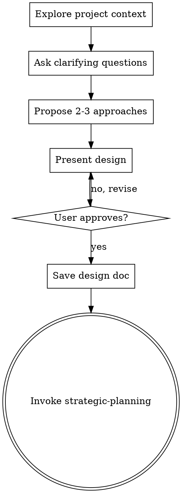

# Brainstorming Gate

## Overview

Turn ideas into designs through collaborative dialogue before writing code.

**Core principle:** No implementation without an approved design. Every project, regardless of perceived simplicity.

<HARD-GATE>
Do NOT invoke any implementation skill, write any code, scaffold any project, or take any implementation action until you have presented a design and the user has approved it. This applies to EVERY project regardless of perceived simplicity.
</HARD-GATE>

## Anti-Pattern: "This Is Too Simple To Need A Design"

Every project goes through this process. A utility function, a config change, a single-file script — all of them. "Simple" projects are where unexamined assumptions cause the most wasted work. The design can be short (a few sentences for truly simple projects), but you MUST present it and get approval.

## Process Flow



**Terminal state: invoke strategic-planning.** Do NOT invoke java-development, java-architecture, or any other implementation skill. The ONLY next step is strategic-planning (to create the implementation plan).

## Checklist

1. **Explore project context** — check files, docs, recent commits, nx search for prior art
2. **Ask clarifying questions** — one at a time, understand purpose/constraints/success criteria
3. **Propose 2-3 approaches** — with trade-offs and your recommendation
4. **Present design** — scaled to complexity, get user approval after each section
5. **Write design doc** — save to `docs/plans/YYYY-MM-DD-<topic>-design.md`
6. **Transition** — invoke strategic-planning skill to create implementation plan

## Key Principles

- **One question at a time** — do not overwhelm with multiple questions
- **YAGNI ruthlessly** — remove unnecessary features from all designs
- **Explore alternatives** — always propose 2-3 approaches before settling
- **Incremental validation** — present design sections, get approval before moving on

## Red Flags — STOP and Restart

- About to write code without a design
- "This is too simple for a design"
- "I already know what to build"
- Skipping questions because the answer seems obvious
- Jumping to implementation after one question

**All of these mean: Stop. Follow the process.**

## Relay Template (Use This Format)

When invoking the strategic-planning skill after design approval, use this structure:

```markdown
## Relay: strategic-planner

**Task**: Create phased implementation plan from approved design.
**Bead**: [ID] (status: [status]) or 'none'

### Input Artifacts
- nx store: [prior art or related decisions from T3, or "none"]
- nx memory: [session state, e.g. "{repo}_active/design.md", or "none"]
- Files: docs/plans/YYYY-MM-DD-<topic>-design.md

### Deliverable
Phased implementation plan saved to `docs/plans/YYYY-MM-DD-<topic>-impl-plan.md`

### Quality Criteria
- [ ] Every task has exact file paths and test commands
- [ ] TDD: failing test before implementation in each task
- [ ] Dependencies between tasks are explicit
```

**REQUIRED SUB-SKILL:** Use nx:strategic-planning after design approval to create the implementation plan.
