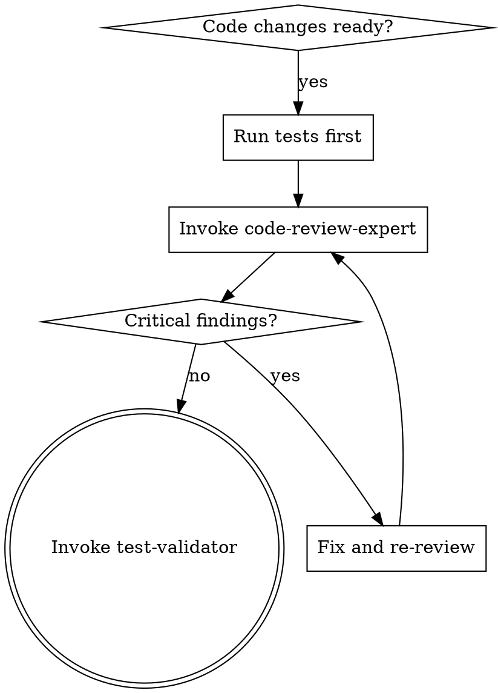

# Code Review Skill

Delegates to the **code-review-expert** agent (model: sonnet).

## When This Skill Activates

- After writing or modifying significant code (10+ lines)
- When completing a feature or bug fix
- After refactoring existing code
- Before creating a pull request
- When code quality, security, or best practices review is needed



## Agent Invocation

Use the Task tool to invoke **code-review-expert**:

```markdown
## Relay: code-review-expert

**Task**: [what needs to be done]
**Bead**: [ID] or 'none'

### Input Artifacts
- Files: [relevant files]

### Deliverable
Structured code review with severity-rated findings

### Quality Criteria
- [ ] All changed files analyzed
- [ ] Security vulnerabilities flagged
- [ ] Specific remediation guidance provided
```

For full relay structure and optional fields, see [RELAY_TEMPLATE.md](../../agents/_shared/RELAY_TEMPLATE.md).

## Review Methodology

The code-review-expert agent uses hypothesis-driven review:
1. Form hypothesis about code quality patterns
2. Gather evidence from code structure, naming, patterns
3. Validate against best practices and security requirements
4. Document findings with file:line references

**REQUIRED BACKGROUND:** Understand superpowers:receiving-code-review for how to handle the review output.

## Agent-Specific PRODUCE

- **Session Scratch (T1)**: scratch tool: action="put", content="<notes>", tags="review" — working review notes during session; flagged items auto-promote to T2 at session end
- **nx memory**: memory_put tool: content="...", project="{project}", title="review-findings.md" — persistent review findings across sessions
- **nx store** (optional): store_put tool: content="...", collection="knowledge", title="pattern-code-{topic}", tags="pattern,code-review" — recurring violation patterns worth long-term storage
- **Beads**: creates bug beads (`bd create "..." -t bug`) for critical findings that require follow-up work

## Success Criteria

- [ ] All changed files analyzed
- [ ] Security vulnerabilities flagged
- [ ] Best practices validated
- [ ] Specific remediation guidance provided
- [ ] At least one positive feedback item included
- [ ] T2 memory updated with session findings (if multi-session work)

**Session Scratch (T1)**: Agent uses scratch tool for ephemeral working notes during the session. Flagged items auto-promote to T2 at session end.
