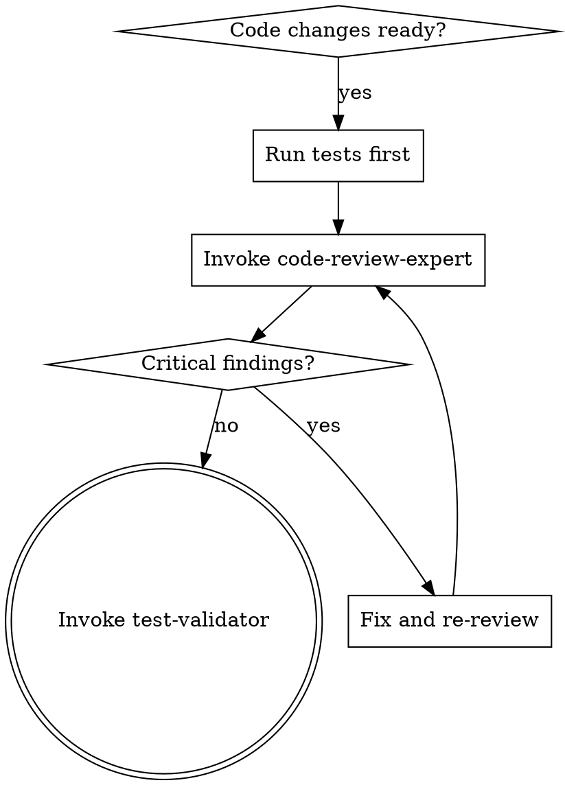

# Code Review Skill

Delegates to the **code-review-expert** agent.

## Model Selection

The agent's frontmatter sets `model: sonnet`. Omit the `model` parameter on the Agent tool and you get sonnet. Override only when a faster model is acceptable for a routine glance (`model="haiku"` for a < 50 LOC docs-only diff, etc.) — never override upward; the agent is already at the workhorse tier.

A previous version of this skill claimed `Default: haiku`; that was wrong and is the kind of doc drift that lets silent regressions through. The agent has been sonnet-default since nx 4.x.

## Prompt rigour (the actual variance lever)

Within the sonnet-class tier, **prompt depth, not model selection, drives review depth**. A friendly "review the diff" relay returns a friendly review; the agent does not invent suspect categories the prompt did not name.

Concrete lesson, RDR-112 Phase 1.5 (2026-05-17): two sonnet-class reviews of the same five commits. The first relayed a routine "review for Critical/Significant/Minor" framing and returned PASS-WITH-FOLLOWUPS (3 Significant + 2 Minor). The second relayed an explicit harder-critique framing that named concrete suspect categories (security boundary, process-group safety, race conditions beyond the named M1, API ergonomics, supervisor lifecycle) and returned BLOCKED on a Critical the first pass missed: the launchd / systemd templates pointed at a CLI command that did not block, so `KeepAlive.Crashed` / `Restart=on-failure` would never fire — a fully broken supervisor model that lived at the boundary between CLI and OS-supervisor config and was invisible to a line-by-line read.

When you relay this agent, include explicit suspect categories appropriate to the diff:

- **Subprocess / OS supervisor**: launchd plist / systemd unit interaction, process-group SIGTERM propagation, `start_new_session=True` consequences, exit-code semantics versus crash recovery
- **Concurrency**: race windows beyond the named ones, TOCTOU between filesystem checks and writes, signal delivery timing, PID recycling
- **Security boundary**: symlink races on parent directories not just direct targets, path-injection via CLI args, env-var content reaching network constructors (CRLF, request smuggling), discovery-file world-readable windows
- **API ergonomics**: typed exceptions vs single string-discriminated type, missing constructor-injection points for testability, surface parity (real class vs shim)
- **Integration boundary**: defects that live *between* two files and are invisible to either alone — CLI + plist, env-var resolver + factory consumer, daemon writer + client racing the same file
- **Lifecycle**: singleton cache survival across upstream restarts, supervisor crash-recovery semantics, idempotent re-init paths

The agent's prompt template (below in `Agent Invocation`) is the friendly default. For boundary-spanning changes, append a "What to scrutinise" section listing the suspect categories you want this specific diff probed against. The relay is the lever; the model is already set.

## Second-pass discipline

If a gate first-pass returns PASS or PASS-WITH-FOLLOWUPS on a boundary-spanning change (CLI ↔ daemon, daemon ↔ supervisor, anything spanning process boundaries) and the relay used the routine template, dispatch a second pass before treating the gate as cleared. The second pass costs ~3 minutes; the silent-defect cost discovered later is days.

## When This Skill Activates

- After writing or modifying significant code (10+ lines)
- When completing a feature or bug fix
- After refactoring existing code
- Before creating a pull request
- When code quality, security, or best practices review is needed



## Pre-Dispatch: Seed Link Context (optional)

If the review references an RDR or bead, seed link-context so any patterns the agent stores to T3 auto-link. See `/nx:catalog` for details. Skip if the review is purely ad-hoc.

## Agent Invocation

Use the Agent tool to invoke **code-review-expert**:

```markdown
## Relay: code-review-expert

**Task**: [what needs to be done]
**Bead**: [ID] or 'none'

### Input Artifacts
- Files: [relevant files]

### Deliverable
Structured code review with severity-rated findings

### Quality Criteria
- [ ] All changed files analyzed
- [ ] Security vulnerabilities flagged
- [ ] Specific remediation guidance provided
```

For full relay structure and optional fields, see [RELAY_TEMPLATE.md](../../agents/_shared/RELAY_TEMPLATE.md).

## Review Methodology

The code-review-expert agent uses hypothesis-driven review:
1. Form hypothesis about code quality patterns
2. Gather evidence from code structure, naming, patterns
3. Validate against best practices and security requirements
4. Document findings with file:line references

**REQUIRED BACKGROUND:** Use `/nx:receiving-review` when acting on review output.

## Agent-Specific PRODUCE

- **Session Scratch (T1)**: scratch tool: action="put", content="<notes>", tags="review" — working review notes during session; flagged items auto-promote to T2 at session end
- **nx memory**: memory_put tool: content="...", project="{project}", title="review-findings.md" — persistent review findings across sessions
- **nx store** (optional): store_put tool: content="...", collection="knowledge", title="pattern-code-{topic}", tags="pattern,code-review" — recurring violation patterns worth long-term storage
- **Beads**: creates bug beads (`/beads:create "..." -t bug`) for critical findings that require follow-up work

## Success Criteria

- [ ] All changed files analyzed
- [ ] Security vulnerabilities flagged
- [ ] Best practices validated
- [ ] Specific remediation guidance provided
- [ ] At least one positive feedback item included
- [ ] T2 memory updated with session findings (if multi-session work)

**Session Scratch (T1)**: Agent uses scratch tool for ephemeral working notes during the session. Flagged items auto-promote to T2 at session end.

## On Completion (Mandatory)

On successful review completion, write a T1 scratch marker so the PreToolUse verification hook can confirm review happened this session:

```bash
nx scratch put "review-completed bead={bead-id} at={ISO-timestamp}" --tags "review,{bead-id}"
```

Replace `{bead-id}` with the bead ID from the relay (e.g., `nexus-4yit`). Replace `{ISO-timestamp}` with the current UTC time in ISO 8601 format (e.g., `2026-04-01T16:00:00Z`).

**No bead context**: If invoked without a bead ID (ad-hoc review), write the marker with `bead=none`:
```bash
nx scratch put "review-completed bead=none at={ISO-timestamp}" --tags "review"
```

The `--tags` flag format is a comma-separated string: `--tags "review,{bead-id}"` (not `--tags review --tags {bead-id}`).
