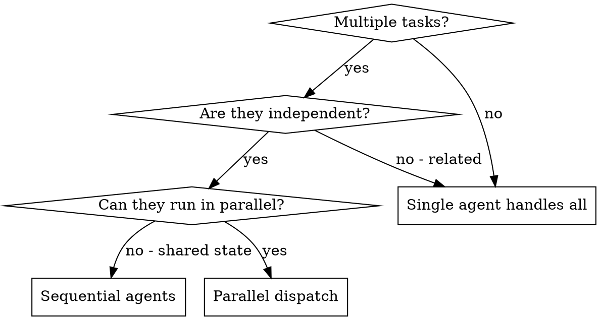

# Dispatching Parallel Agents

## Overview

When you have multiple independent problems (different test files, different subsystems, different bugs), investigating them sequentially wastes time. Each investigation is independent and can happen in parallel.

**Core principle:** Dispatch one agent per independent problem domain. Let them work concurrently.

## When to Use



**Use when:**
- 2+ independent tasks with different root causes
- Multiple subsystems broken independently
- Each problem can be understood without context from others
- No shared state between investigations

**Do not use when:**
- Tasks are related (fix one might fix others)
- Need to understand full system state first
- Agents would edit the same files

## The Pattern

### 1. Identify Independent Domains

Group work by what is independent:
- Different test files with different failures
- Different modules with separate concerns
- Independent research questions

### 2. Compose Focused Agent Tasks

Each agent gets:
- **Specific scope:** One problem domain
- **Clear goal:** What success looks like
- **Constraints:** What NOT to change
- **Expected output:** Summary format

Use the relay format from [RELAY_TEMPLATE.md](../../agents/_shared/RELAY_TEMPLATE.md) for each agent.

### 3. Dispatch in Parallel

```python
# Use Task tool with multiple concurrent calls
Task("Fix auth module tests — scope: tests/auth/")
Task("Fix search module tests — scope: tests/search/")
Task("Fix indexing module tests — scope: tests/indexing/")
# All three run concurrently
```

### 4. Review and Integrate

When agents return:
1. Read each summary
2. Verify fixes do not conflict
3. Run full test suite
4. Integrate all changes

## Common Mistakes

| Mistake | Fix |
|---------|-----|
| Scope too broad ("fix all tests") | One domain per agent |
| No context in prompt | Include error messages, file paths |
| No constraints | Specify what NOT to change |
| Vague output expectations | Ask for summary of root cause and changes |
| Trusting agent reports blindly | Always verify — see nx:verification-before-completion |

## When NOT to Use

- **Related failures:** Fix one might fix others — investigate together first
- **Exploratory debugging:** You do not know what is broken yet
- **Shared state:** Agents would interfere (editing same files, using same resources)
