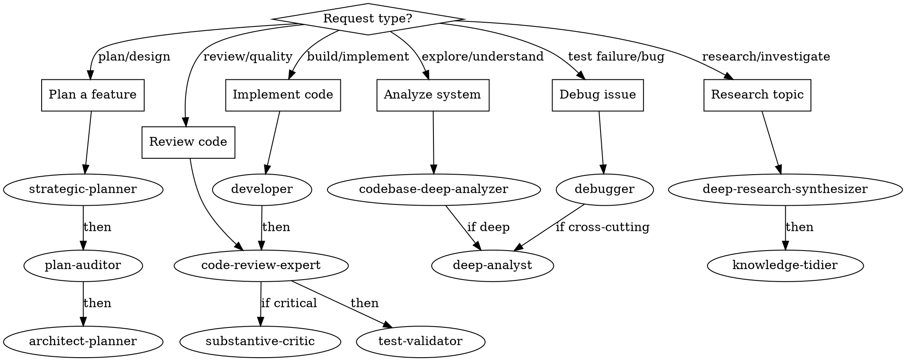

# Orchestration Skill

Delegates to the **orchestrator** agent (haiku). See [registry.yaml](../../registry.yaml).

## When This Skill Activates

- When the task is ambiguous about which agent to use
- When coordinating work across multiple agents
- When user needs help choosing the right approach
- When setting up multi-agent pipelines
- When workflow routing decisions are needed



## Agent Invocation

Use the Task tool to invoke **orchestrator**:

```markdown
## Relay: orchestrator

**Task**: [what needs to be done]
**Bead**: [ID] or 'none'

### Input Artifacts
- Files: [relevant files]

### Deliverable
Routing decision with recommended agent

### Quality Criteria
- [ ] User goal clearly understood
- [ ] Appropriate agent(s) identified
- [ ] Clear rationale provided
```

For full relay structure and optional fields, see [RELAY_TEMPLATE.md](../../agents/_shared/RELAY_TEMPLATE.md).

## Routing Quick Reference

| Request Type | Primary Agent | Pipeline |
|-------------|---------------|----------|
| Plan a feature | strategic-planner | -> plan-auditor -> architect-planner |
| Implement code | developer | -> code-review-expert -> test-validator |
| Debug issue | debugger | -> (if cross-cutting) deep-analyst |
| Review code | code-review-expert | -> (if critical) substantive-critic |
| Research topic | deep-research-synthesizer | -> knowledge-tidier |
| Analyze system | codebase-deep-analyzer | -> (if deep) deep-analyst |


## Success Criteria

- [ ] User goal clearly understood
- [ ] Appropriate agent(s) identified
- [ ] Workflow makes sense for the task
- [ ] Clear rationale provided
- [ ] User can proceed with confidence

## Agent-Specific PRODUCE

- **Routing Decisions**: Document in response; for significant routing patterns store in nx T3:
  store_put tool: content="# Routing Pattern: {pattern}\n{rationale}", collection="knowledge", title="pattern-orchestrator-{scenario}", tags="routing,orchestration"
- **Pipeline Plans**: Relay to first agent in pipeline using standard relay format
- **Escalation Notes**: Create blocker beads when routing is blocked
- **Routing Notes**: Use T1 scratch during complex pipeline analysis:
  scratch tool: action="put", content="Routing hypothesis: {agent} because {reason}", tags="routing,pipeline"
