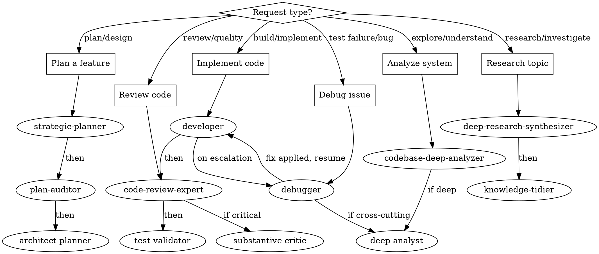

# Orchestration Reference

Routing tables, pipeline templates, and decision framework for multi-agent workflows. This is a reference document — no agent is dispatched.

## Routing Graph

## Routing Quick Reference

| Request Type | Primary Agent | Pipeline |
|-------------|---------------|----------|
| Plan a feature | strategic-planner | -> plan-auditor -> architect-planner |
| Implement code | developer | -> code-review-expert -> test-validator |
| Implement code (circuit breaker fired) | debugger | [after developer stops] -> debugger -> developer resumes |
| Debug issue | debugger | -> (if cross-cutting) deep-analyst |
| Review code | code-review-expert | -> (if critical) substantive-critic |
| Research topic | deep-research-synthesizer | -> knowledge-tidier |
| Analyze system | codebase-deep-analyzer | -> (if deep) deep-analyst |

## Decision Framework

### Step 1: Classify the Request
- **Implementation**: Code needs to be written -> developer
- **Architecture/Design**: System design needed -> architect-planner or strategic-planner
- **Bug/Issue**: Something is broken -> debugger
- **Review**: Work needs validation -> code-review-expert, plan-auditor, or substantive-critic
- **Catalog Query**: Question about specific authors, papers, citations, provenance, references, corpus -> `/nx:query` skill (catalog-aware retrieval)
- **Research**: General information gathering -> deep-research-synthesizer
- **Analysis**: Understanding needed -> deep-analyst or codebase-deep-analyzer

### Step 2: Check for Pipeline Needs
If the task requires multiple stages:
1. Identify all required agents
2. Determine the correct sequence
3. Define relay points and context requirements
4. Consider parallelization opportunities

### Step 3: Route or Dispatch
- **Single Agent**: Dispatch directly with context via relay
- **Pipeline**: Dispatch sequentially — the caller orchestrates each stage

## Standard Pipelines

### Feature Development Pipeline
1. strategic-planner: Create plan with beads
2. plan-auditor: Validate plan
3. architect-planner: Design architecture
4. developer: Implement with TDD
5. code-review-expert: Review implementation
6. test-validator: Verify test coverage

### Bug Fix Pipeline
1. debugger: Investigate and identify root cause
2. developer: Implement fix
3. code-review-expert: Review fix
4. test-validator: Verify fix and regression tests

### Catalog Query Pipeline
Use `/nx:query` skill directly (it orchestrates query-planner + analytical-operator internally).
Route here when the question involves: specific authors, paper citations, "what cites X",
"what research informed Y", corpus-scoped retrieval, or document provenance chains.

### Research Pipeline
1. deep-research-synthesizer: Gather information
2. knowledge-tidier: Consolidate findings
3. (optional) architect-planner: Apply findings to design

### Plan Validation Pipeline
1. strategic-planner or architect-planner: Create plan
2. plan-auditor: Validate technical accuracy
3. substantive-critic: Critique for gaps and assumptions

## Pipeline Pattern Catalog

These patterns are stored in the T2 plan library and are returned by `plan_search` when matching queries are detected. The `using-nx-skills` skill checks for matching templates before dispatching multi-agent pipelines.

| Pattern | Agents | When to Use | Prerequisites |
|---------|--------|-------------|---------------|
| RDR Chain | deep-research-synthesizer → `/nx:rdr-gate` → `/nx:rdr-accept` → strategic-planner → plan-auditor → plan-enricher → developer → code-review-expert → test-validator | Non-trivial features needing design documentation before coding | RDR created and populated with research findings |
| Plan-Audit-Implement | strategic-planner → plan-auditor → developer → code-review-expert → test-validator | Standard feature development with clear requirements | Requirements defined, no RDR needed |
| Research-Synthesize | deep-research-synthesizer → knowledge-tidier | Gathering information on unfamiliar topics or comparing approaches | Topic identified |
| Code Review | code-review-expert → test-validator | Post-implementation quality gate before merge or PR | Code changes committed |
| Debug | debugger → developer → test-validator | Test failures or non-deterministic behavior, especially after 2+ failed manual fix attempts | Reproducible failure or clear symptom |

## Agent Ecosystem

### Development Agents
| Agent | When to Use |
|-------|-------------|
| developer | Execute implementation plans, write code with TDD |
| architect-planner | Design architecture, create execution plans |
| debugger | Complex bugs, non-deterministic failures, performance issues |
| analytical-operator | Execute analytical operations (extract, summarize, rank, compare, generate) on retrieved content |

### Review Agents
| Agent | When to Use |
|-------|-------------|
| code-review-expert | Review implemented code for quality and best practices |
| plan-auditor | Validate plans before implementation |
| substantive-critic | Deep critique of any content (code, docs, designs) |

### Analysis Agents
| Agent | When to Use |
|-------|-------------|
| deep-analyst | Investigate complex problems, system behavior analysis |
| codebase-deep-analyzer | Understand codebase structure, onboarding, pre-refactoring |

### Research Agents
| Agent | When to Use |
|-------|-------------|
| deep-research-synthesizer | Multi-source research across all knowledge bases |
| query (skill: `/nx:query`) | Author, citation, corpus, or provenance questions — catalog-aware multi-step retrieval |

### Infrastructure Agents
| Agent | When to Use |
|-------|-------------|
| strategic-planner | Project planning, bead management, infrastructure setup |
| knowledge-tidier | Clean and consolidate knowledge bases |
| pdf-chromadb-processor | Process PDFs for semantic search via nx index pdf |
| test-validator | Verify test coverage, run test suites |
