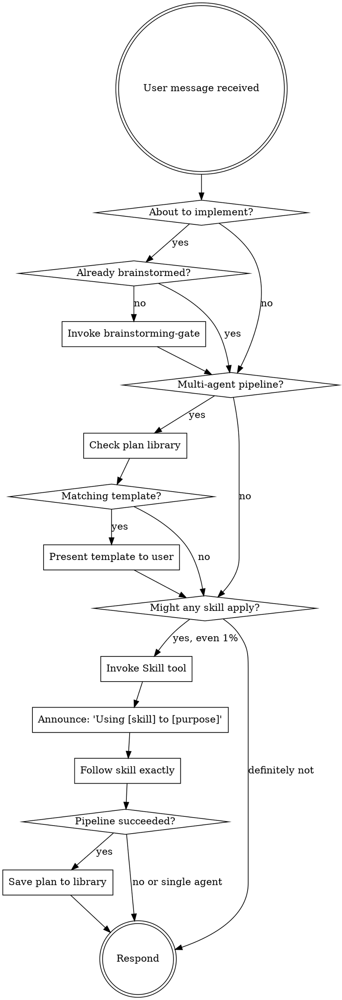

<EXTREMELY-IMPORTANT>
If you think there is even a 1% chance a skill might apply to what you are doing, you MUST invoke the skill.

IF A SKILL APPLIES TO YOUR TASK, YOU DO NOT HAVE A CHOICE. YOU MUST USE IT.

This is not negotiable. This is not optional. You cannot rationalize your way out of this.
</EXTREMELY-IMPORTANT>

# Using nx Skills

## The Rule

**Invoke relevant skills BEFORE any response or action.** Even a 1% chance a skill might apply means you should invoke the skill to check. If an invoked skill turns out to be wrong for the situation, you do not need to use it.

## Process Flow

## Plan Reuse

Before dispatching any multi-agent pipeline:
1. Call `mcp__plugin_nx_nexus__plan_search(query="<task description>", limit=3)`
2. If a matching template is returned, present it to the user and offer to use it as the starting structure
3. If no match ("No matching plans."), proceed with standard routing

After a multi-agent pipeline completes successfully:
1. Call `mcp__plugin_nx_nexus__plan_save(query="<task description>", plan_json=<relay chain as JSON>, tags="<agent names>")`
2. The `plan_json` should capture: `{"steps": [...], "tools_used": [...], "outcome_notes": "..."}`

Plan reuse is opportunistic — the skill functions normally when the plan library is empty.

## Routing: What Skill Do I Use?

**Before writing any code:**
- About to implement? → `/nx:brainstorming-gate` FIRST (mandatory, no exceptions)
- Multi-step work? → `/nx:create-plan` before touching code
- Feature needs design (APIs, data models, component boundaries, integration)? → `/nx:architecture`

**Something is broken:**
- Test failure, exception, unexpected behavior → `/nx:debug` IMMEDIATELY (do not guess-and-retry)
- After 2 failed fix attempts without `/nx:debug` → you are wasting time, invoke it NOW

**Analyzing code:**
- Need to understand structure, patterns, dependencies → `/nx:analyze-code`
- Need to investigate WHY something behaves a certain way → `/nx:deep-analysis`
- Rule: if `analyze-code` didn't answer the question, escalate to `deep-analysis`

**Executing work:**
- Plan approved, ready to build? → `/nx:implement`
- Beads need enrichment after audit? → `/nx:enrich-plan`

**Quality gates:**
- Code changes ready? → `/nx:review-code`
- Plan exists? → `/nx:plan-audit` (validates against codebase reality)
- Want logic/structure critique? → `/nx:substantive-critique` (reasoning soundness)
- Tests written? → `/nx:test-validate`

**Research and knowledge:**
- Unfamiliar topic or technology comparison → `/nx:research`
- 3+ validated findings worth keeping → `/nx:knowledge-tidy`
- PDF to index → `/nx:pdf-process`

**RDR lifecycle:** `/nx:rdr-create` → `/nx:rdr-research` → `/nx:rdr-gate` → `/nx:rdr-accept` → `/nx:rdr-close`
- List: `/nx:rdr-list` | Show: `/nx:rdr-show NNN`

**Git workflow:**
- Need workspace isolation? → `/nx:git-worktrees`
- Implementation done, ready to merge/PR? → `/nx:finishing-branch`
- Receiving review feedback? → `/nx:receiving-review` (verify before implementing)

**Reference skills (invoke when relevant, no agent dispatch):**
- Symbol navigation (definitions, callers, renames) → `/nx:serena-code-nav`
- nx CLI usage → `/nx:nexus`
- Interactive CLI/REPL control → `/nx:cli-controller`
- Creating/editing nx skills → `/nx:writing-nx-skills`

## Skill Directory

Use this table to match tasks to skills. When in doubt, check the skill.

### Discipline (apply before any implementation)

| Skill | Command | Invoke when... |
|-------|---------|----------------|
| brainstorming-gate | `/nx:brainstorming-gate` | About to implement any feature, build any component, or change any behavior |

### Process (guide workflow and quality)

| Skill | Command | Invoke when... |
|-------|---------|----------------|
| code-review | `/nx:review-code` | Code changes ready for quality, security, or best practices review |
| strategic-planning | `/nx:create-plan` | Multi-step work needs decomposition into tasks before any code |
| plan-validation | `/nx:plan-audit` | A plan exists and needs validation before implementation begins |
| enrich-plan | `/nx:enrich-plan` | Beads need enrichment with audit findings and execution context after plan-audit |
| test-validation | `/nx:test-validate` | Implementation complete; test coverage needs verification |
| substantive-critique | `/nx:substantive-critique` | Architectural decisions, multi-phase plans, or major docs need deep constructive critique |

### Implementation (execute domain-specific work)

| Skill | Command | Invoke when... |
|-------|---------|----------------|
| codebase-analysis | `/nx:analyze-code` | Exploring unfamiliar codebase or understanding module structure before changes |
| deep-analysis | `/nx:deep-analysis` | Surface-level analysis is insufficient; hypothesis-driven investigation needed |
| research-synthesis | `/nx:research` | Researching unfamiliar topics or comparing technology approaches |
| architecture | `/nx:architecture` | Complex features need architectural design before implementation |
| development | `/nx:implement` | Plan approved; implementation work ready to begin |
| debugging | `/nx:debug` | Tests fail or behavior is non-deterministic, especially after 2+ failed attempts |

### RDR Lifecycle (research-design-review documents)

| Skill | Command | Invoke when... |
|-------|---------|----------------|
| rdr-create | `/nx:rdr-create` | Starting a new technical decision document |
| rdr-research | `/nx:rdr-research` | Adding or tracking structured research findings for an active RDR |
| rdr-list | `/nx:rdr-list` | Listing all RDRs with status, type, and priority |
| rdr-show | `/nx:rdr-show` | Viewing full details and research findings for a specific RDR |
| rdr-gate | `/nx:rdr-gate` | RDR appears complete; needs structural + assumption + AI critique check |
| rdr-accept | `/nx:rdr-accept` | Gate returned PASSED; ready to officially accept the RDR |
| rdr-close | `/nx:rdr-close` | RDR implemented; close with optional post-mortem and bead status advisory |

### Git Workflow

| Skill | Command | Invoke when... |
|-------|---------|----------------|
| git-worktrees | `/nx:git-worktrees` | Need workspace isolation for feature work |
| finishing-branch | `/nx:finishing-branch` | Implementation done, ready to merge/PR |
| receiving-review | `/nx:receiving-review` | Receiving code review feedback — verify before implementing |

### Standalone Reference

| Skill | Command | Invoke when... |
|-------|---------|----------------|
| knowledge-tidying | `/nx:knowledge-tidy` | 3+ validated findings or decisions need persisting to T3 for cross-session reuse |
| orchestration | `/nx:orchestrate` | Unsure which agent fits — consult [routing reference](../orchestration/reference.md) |
| pdf-processing | `/nx:pdf-process` | PDF documents need indexing into nx store for semantic search |
| nexus | `/nx:nexus` | Running nx commands or unsure which nx subcommand to use |
| serena-code-nav | `/nx:serena-code-nav` | Navigating code by symbol — finding definitions, callers, type hierarchies, or safe renames |
| cli-controller | `/nx:cli-controller` | Controlling interactive CLI apps, REPLs, pdb, gdb, or spawning Claude Code instances |
| writing-nx-skills | `/nx:writing-nx-skills` | Creating new nx plugin skills or editing existing ones |

## Essential MCP Tools

**Use these directly — they are always available, no skill invocation needed.**

**Sequential Thinking** (`mcp__plugin_nx_sequential-thinking__sequentialthinking`):
Use for any non-trivial decision: debugging hypotheses, design choices, plan evaluation, risk assessment. State hypothesis → gather evidence → evaluate → branch or proceed. Set `needsMoreThoughts: true` to continue, `isRevision: true` to correct.

**nx Storage Tiers** (read widest → narrowest before any work):
- **T3** `nx search`: Permanent knowledge across all sessions and projects — check before researching
- **T2** `nx memory`: Project decisions, findings, session context — check before project work
- **T1** `nx scratch`: This session's discoveries, shared across all agents — check before duplicating sibling work

**Write path:** T1 (immediate, shared) → `--persist` flag to T2 (survives session end) → `/nx:knowledge-tidy` to T3 (permanent, cross-project).

## Skill Priority

When multiple skills could apply:

1. **Discipline skills first** (brainstorming-gate) — these determine HOW to approach
2. **Process skills second** (strategic-planning, code-review) — these guide workflow
3. **Implementation skills third** (development, debugging) — these execute work

## Common Mistakes

| Mistake | Correct Action |
|---------|---------------|
| Test fails → try a different fix | Test fails → `/nx:debug` |
| "Simple" feature → start coding | Any feature → `brainstorming-gate` first |
| Complex feature → `/nx:create-plan` | Complex feature → `/nx:architecture` THEN `/nx:create-plan` |
| Plan looks good → start implementing | Plan exists → `/nx:plan-audit` first |
| grep for symbol callers | Symbol navigation → `/nx:serena-code-nav` |
| Read whole file to find a method | Symbol lookup → `/nx:serena-code-nav` |
| Skip review, it's a small change | Any change → `/nx:review-code` before commit |
| Implement review feedback blindly | Receiving feedback → `/nx:receiving-review` first |
| Merge without verifying tests | Branch done → `/nx:finishing-branch` |
| Manual worktree setup | Need isolation → `/nx:git-worktrees` or `isolation: "worktree"` on Agent tool |

## Red Flags

These thoughts mean STOP — you are rationalizing:

| Thought | Reality |
|---------|---------|
| "This is just a simple question" | Questions are tasks. Check for skills. |
| "I need more context first" | Skill check comes BEFORE gathering context. |
| "Let me explore the codebase first" | Skills tell you HOW to explore. Check first. |
| "I can check git/files quickly" | Files lack conversation context. Check for skills. |
| "Let me gather information first" | Skills tell you HOW to gather information. |
| "This doesn't need a formal skill" | If a skill exists, use it. |
| "I remember this skill" | Skills evolve. Read current version. |
| "This doesn't count as a task" | Action = task. Check for skills. |
| "The skill is overkill" | Simple things become complex. Use it. |
| "I'll just do this one thing first" | Check BEFORE doing anything. |
| "This feels productive" | Undisciplined action wastes time. Skills prevent this. |
| "I know what that means" | Knowing the concept ≠ using the skill. Invoke it. |

## Skill Types

**Rigid** (brainstorming-gate): Follow exactly. Do not adapt away discipline.

**Flexible** (patterns, reference): Adapt principles to context.

The skill itself tells you which type it is.

## User Instructions

Instructions say WHAT, not HOW. "Add X" or "Fix Y" does not mean skip workflows. Always check skills first.
