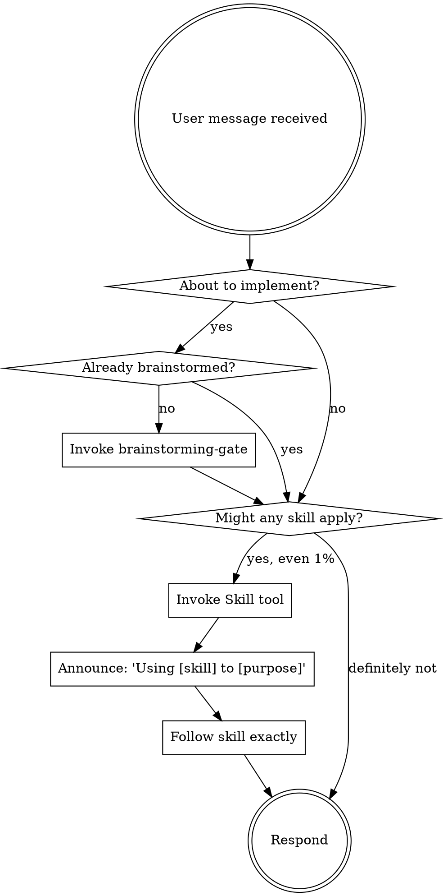

<EXTREMELY-IMPORTANT>
If you think there is even a 1% chance a skill might apply to what you are doing, you MUST invoke the skill.

IF A SKILL APPLIES TO YOUR TASK, YOU DO NOT HAVE A CHOICE. YOU MUST USE IT.

This is not negotiable. This is not optional. You cannot rationalize your way out of this.
</EXTREMELY-IMPORTANT>

# Using nx Skills

## The Rule

**Invoke relevant skills BEFORE any response or action.** Even a 1% chance a skill might apply means you should invoke the skill to check. If an invoked skill turns out to be wrong for the situation, you do not need to use it.

## Process Flow

## Skill Directory

Use this table to match tasks to skills. When in doubt, check the skill.

### Discipline (apply before any implementation)

| Skill | Command | Invoke when... |
|-------|---------|----------------|
| brainstorming-gate | `/nx:brainstorming-gate` | About to implement any feature, build any component, or change any behavior |

### Process (guide workflow and quality)

| Skill | Command | Invoke when... |
|-------|---------|----------------|
| code-review | `/nx:review-code` | Code changes ready for quality, security, or best practices review |
| strategic-planning | `/nx:create-plan` | Multi-step work needs decomposition into tasks before any code |
| plan-validation | `/nx:plan-audit` | A plan exists and needs validation before implementation begins |
| enrich-plan | `/nx:enrich-plan` | Beads need enrichment with audit findings and execution context after plan-audit |
| test-validation | `/nx:test-validate` | Implementation complete; test coverage needs verification |
| substantive-critique | `/nx:substantive-critique` | Architectural decisions, multi-phase plans, or major docs need deep constructive critique |

### Implementation (execute domain-specific work)

| Skill | Command | Invoke when... |
|-------|---------|----------------|
| codebase-analysis | `/nx:analyze-code` | Exploring unfamiliar codebase or understanding module structure before changes |
| deep-analysis | `/nx:deep-analysis` | Surface-level analysis is insufficient; hypothesis-driven investigation needed |
| research-synthesis | `/nx:research` | Researching unfamiliar topics or comparing technology approaches |
| architecture | `/nx:architecture` | Complex features need architectural design before implementation |
| development | `/nx:implement` | Plan approved; implementation work ready to begin |
| debugging | `/nx:debug` | Tests fail or behavior is non-deterministic, especially after 2+ failed attempts |

### RDR Lifecycle (research-design-review documents)

| Skill | Command | Invoke when... |
|-------|---------|----------------|
| rdr-create | `/nx:rdr-create` | Starting a new technical decision document |
| rdr-research | `/nx:rdr-research` | Adding or tracking structured research findings for an active RDR |
| rdr-list | `/nx:rdr-list` | Listing all RDRs with status, type, and priority |
| rdr-show | `/nx:rdr-show` | Viewing full details and research findings for a specific RDR |
| rdr-gate | `/nx:rdr-gate` | RDR appears complete; needs structural + assumption + AI critique check |
| rdr-accept | `/nx:rdr-accept` | Gate returned PASSED; ready to officially accept the RDR |
| rdr-close | `/nx:rdr-close` | RDR implemented; close with optional post-mortem and bead status advisory |

### Standalone Reference

| Skill | Command | Invoke when... |
|-------|---------|----------------|
| knowledge-tidying | `/nx:knowledge-tidy` | 3+ validated findings or decisions need persisting to T3 for cross-session reuse |
| orchestration | `/nx:orchestrate` | After reading this directory, still unsure which agent fits the task |
| pdf-processing | `/nx:pdf-process` | PDF documents need indexing into nx store for semantic search |
| nexus | `/nx:nexus` | Running nx commands or unsure which nx subcommand to use |
| serena-code-nav | `/nx:serena-code-nav` | Navigating code by symbol — finding definitions, callers, type hierarchies, or safe renames |
| cli-controller | `/nx:cli-controller` | Controlling interactive CLI apps, REPLs, pdb, gdb, or spawning Claude Code instances |
| writing-nx-skills | `/nx:writing-nx-skills` | Creating new nx plugin skills or editing existing ones |

## Storage Tier Protocol

**Read widest → narrowest before starting any research or implementation.**

| Tier | Tool | What's there | Read when... |
|------|------|--------------|--------------|
| T3 | Use search tool: query="..." | Permanent knowledge across all sessions and projects | Before any research — if it's been learned, it's here |
| T2 | Use memory_search tool: query="..." | Project decisions, findings, session context | Before project work — past context and past decisions live here |
| T1 | Use scratch tool: action="search", query="..." | This session's discoveries, shared across all agents | Before doing work a sibling or parent agent may have already done |

**Write path:** T1 (immediate, shared) → `--persist` flag to T2 (survives session end) → `/nx:knowledge-tidy` to T3 (permanent, cross-project).

## Red Flags

These thoughts mean STOP — you are rationalizing:

| Thought | Reality |
|---------|---------|
| "This is just a simple question" | Questions are tasks. Check for skills. |
| "I need more context first" | Skill check comes BEFORE gathering context. |
| "Let me explore the codebase first" | Skills tell you HOW to explore. Check first. |
| "I can check git/files quickly" | Files lack conversation context. Check for skills. |
| "Let me gather information first" | Skills tell you HOW to gather information. |
| "This doesn't need a formal skill" | If a skill exists, use it. |
| "I remember this skill" | Skills evolve. Read current version. |
| "This doesn't count as a task" | Action = task. Check for skills. |
| "The skill is overkill" | Simple things become complex. Use it. |
| "I'll just do this one thing first" | Check BEFORE doing anything. |
| "This feels productive" | Undisciplined action wastes time. Skills prevent this. |
| "I know what that means" | Knowing the concept ≠ using the skill. Invoke it. |

## Skill Priority

When multiple skills could apply:

1. **Discipline skills first** (brainstorming-gate) — these determine HOW to approach
2. **Process skills second** (strategic-planning, code-review) — these guide workflow
3. **Implementation skills third** (development, debugging) — these execute work

## Skill Types

**Rigid** (brainstorming-gate): Follow exactly. Do not adapt away discipline.

**Flexible** (patterns, reference): Adapt principles to context.

The skill itself tells you which type it is.

## User Instructions

Instructions say WHAT, not HOW. "Add X" or "Fix Y" does not mean skip workflows. Always check skills first.
